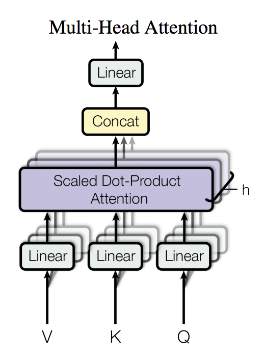

## Transformer 概述

### 背景简介

Transformer 是论文 [Attention Is All You Need](https://arxiv.org/abs/1706.03762) 中提出的用以完成机器翻译（machine translation, MT）等序列到序列（sequence to sequence, Seq2Seq）学习任务的一种全新网络结构，其完全使用注意力（Attention）机制来实现序列到序列的建模。

相较于此前 Seq2Seq 模型中广泛使用的循环神经网络（Recurrent Neural Network, RNN），使用（Self）Attention 进行输入序列到输出序列的变换主要具有以下优势：

- 计算复杂度低
  - 特征维度为 d 、长度为 n 的序列，在 RNN 中计算复杂度为 `O(n * d * d)` （n 个时间步，每个时间步计算 d 维的矩阵向量乘法），在 Self-Attention 中计算复杂度为 `O(n * n * d)` （n 个时间步两两计算 d 维的向量点积或其他相关度函数），n 通常要小于 d 。
- 计算并行度高
  - RNN 中当前时间步的计算要依赖前一个时间步的计算结果；Self-Attention 中各时间步的计算只依赖输入不依赖之前时间步输出，各时间步可以完全并行。
- 容易学习长程依赖（long-range dependencies）
  - RNN 中相距为 n 的两个位置间的关联需要 n 步才能建立；Self-Attention 中任何两个位置都直接相连；路径越短信号传播越容易。

Transformer 模型在训练时间大幅减少的同时取得了 WMT'14 英德翻译任务 BLEU 值的新高。此外，Transformer 或其部件在其他模型和任务中也取得了良好的效果。

### Transformer 模型概览

Transformer 使用了 Seq2Seq 模型中典型的编码器-解码器（Encoder-Decoder）的框架结构，整体网络结构如图1所示。

<p align="center">
 <br />
图 1. Transformer 网络结构图
</p>

Encoder 由若干相同的 layer 堆叠组成，每个 layer 主要由 Multi-Head Attention 和 Position-wise Feed-Forward Network 这两个 sub-layer 构成。
- Multi-Head Attention 在这里用于实现 Self-Attention，相比于简单的 Attention 机制，其将输入进行多路线性变换后分别计算 Attention 的结果，并将所有结果拼接后再次进行线性变换作为输出。其中 Attention 使用的是 Dot-Product，并在点积后进行了 scale 的处理以避免因点积结果过大进入 softmax 的饱和区域。
- Position-wise Feed-Forward Network采用的是两次线性变换中间加以 ReLU 激活的结构。

此外，每个 sub-layer 后还施以 Residual Connection 和 Layer Normalization 来促进梯度传播和模型收敛。

Decoder 具有和 Encoder 类似的结构，只是相比于组成 Encoder 的 layer ，在组成 Decoder 的 layer 中还多了一个 Multi-Head Attention 的 sub-layer 来实现对 Encoder 输出的 Attention，这个 Encoder-Decoder Attention 在其他 Seq2Seq 模型中也是存在的。


## Fluid Transformer 实现

代码： https://github.com/PaddlePaddle/models/tree/develop/fluid/PaddleNLP/neural_machine_translation/transformer

```text
.
├── config.py            # 训练、预测以及模型参数配置
├── infer.py             # 预测脚本
├── model.py             # 模型定义
├── optim.py             # learning rate scheduling 计算程序
├── reader.py            # 数据读取接口
├── train.py             # 训练脚本
└── gen_data.sh          # BPE 数据生成脚本
```

### Fluid Transformer 训练网络
模型定义代码 `model.py`

```text
.
├── transformer  
    ├── make_all_inputs  
    ├── wrap_encoder  
            ├── prepare_encoder  
                    └── word_embedding + position_encoding  
            └── encoder  
                    ├── stack of encoder_layer
                            ├── multi_head_attention
                            └── positionwise_feed_forward
                    └── pre_process_layer
    ├── wrap_decoder  
            ├── prepare_decoder
                    └── word_embedding + position_encoding  
            └── decoder
                    ├── stack of decoder_layer
                            ├── multi_head_attention
                            ├── multi_head_attention
                            └── positionwise_feed_forward
                    └── pre_process_layer
    └── loss  
```

- `make_all_inputs` 数据输入的定义

  APIs：fluid.layers.data

  相关 Q&A：<a href="#var_data">如何处理变长数据</a>

    ```python
    def make_all_inputs(input_fields):
        """
        Define the input data layers for the transformer model.
        """
        inputs = []
        for input_field in input_fields:
            input_var = layers.data(
                name=input_field,
                shape=input_descs[input_field][0],
                dtype=input_descs[input_field][1],
                lod_level=input_descs[input_field][2]
                if len(input_descs[input_field]) == 3 else 0,
                append_batch_size=False)
            inputs.append(input_var)
        return inputs
    ```

    ```python
    # The shapes and sizes are placeholders in compile-time(when building network).
    batch_size = -1
    seq_len = ModelHyperParams.max_length
    input_descs = {
        "src_word": [(batch_size, seq_len, 1), "int64"],
        "src_pos": [(batch_size, seq_len, 1), "int64"],
        "src_slf_attn_bias": [(batch_size, ModelHyperParams.n_head, seq_len,
                            seq_len), "float32"],
        "trg_word": [(batch_size, seq_len, 1), "int64", 2],
        "trg_pos": [(batch_size, seq_len, 1), "int64"],
        "trg_slf_attn_bias": [(batch_size, ModelHyperParams.n_head, seq_len,
                            seq_len), "float32"],
        "trg_src_attn_bias": [(batch_size, ModelHyperParams.n_head, seq_len,
                            seq_len), "float32"],
        "lbl_word": [(batch_size * seq_len, 1), "int64"],
        "lbl_weight": [(batch_size * seq_len, 1), "float32"],
        "init_score": [(batch_size, 1), "float32", 2]
    }
    ```

- `warp_encoder`/`warp_decoder` encoder/decoder 的 wraper

  - prepare_encoder/prepare_decoder 产生 encoder/decoder 的输入

    APIs：fluid.layers.embedding、fluid.layers.scale、fluid.layers.elementwise_add、fluid.layers.dropout

    相关 Q&A：<a href="#weight_sharing">如何进行权值共享</a>、<a href="#set_param">如何导入外部计算的参数值</a>

    ```python
    def prepare_encoder_decoder():
        """Add word embeddings and position encodings"""
        src_word_emb = layers.embedding(
            src_word,
            size=[src_vocab_size, src_emb_dim],
            padding_idx=ModelHyperParams.bos_idx,
            param_attr=fluid.ParamAttr(
                name=word_emb_param_name,
                initializer=fluid.initializer.Normal(0., src_emb_dim**-0.5)))

        src_word_emb = layers.scale(x=src_word_emb, scale=src_emb_dim**0.5)
        src_pos_enc = layers.embedding(
            src_pos,
            size=[src_max_len, src_emb_dim],
            param_attr=fluid.ParamAttr(
                name=pos_enc_param_name, trainable=False))
        src_pos_enc.stop_gradient = True
        enc_input = src_word_emb + src_pos_enc
        return layers.dropout(
            enc_input,
            dropout_prob=dropout_rate,
            seed=ModelHyperParams.dropout_seed,
            is_test=False) if dropout_rate else enc_input
    ```
  - encoder/decoder
    - encoder/decoder layer
      - multi_head_attention

        <p align="center">
         <br />
        图 2. Multi-Head Attention
        </p>

        <p align="center">
         <br />
        </p>

        APIs：fluid.layers.fc、fluid.layers.reshape、fluid.layers.transpose、fluid.layers.matmul、fluid.layers.elementwise_add、fluid.layers.softmax、fluid.layers.dropout

        ```python
        def __compute_qkv(queries, keys, values, n_head, d_key, d_value):
            """
            Add linear projection to queries, keys, and values.
            """
            q = layers.fc(input=queries,
                        size=d_key * n_head,
                        bias_attr=False,
                        num_flatten_dims=2)
            k = layers.fc(input=keys,
                        size=d_key * n_head,
                        bias_attr=False,
                        num_flatten_dims=2)
            v = layers.fc(input=values,
                        size=d_value * n_head,
                        bias_attr=False,
                        num_flatten_dims=2)
            return q, k, v

        def __split_heads(x, n_head):
            """
            Input a tensor with shape [bs, max_sequence_length, n_head * hidden_dim],
            then output a tensor with shape [bs, n_head, max_sequence_length, hidden_dim].
            """
            hidden_size = x.shape[-1]
            reshaped = layers.reshape(
                x=x, shape=[0, 0, n_head, hidden_size // n_head], inplace=True)
            return layers.transpose(x=reshaped, perm=[0, 2, 1, 3])

        def scaled_dot_product_attention(q, k, v, attn_bias, d_key, dropout_rate):
            """
            Scaled Dot-Product Attention
            """
            scaled_q = layers.scale(x=q, scale=d_key**-0.5)
            product = layers.matmul(x=scaled_q, y=k, transpose_y=True)
            if attn_bias:
                product += attn_bias
            weights = layers.softmax(product)
            if dropout_rate:
                weights = layers.dropout(
                    weights,
                    dropout_prob=dropout_rate,
                    seed=ModelHyperParams.dropout_seed,
                    is_test=False)
            out = layers.matmul(weights, v)
            return out

        def __combine_heads(x):
            """
            reverse to __split_heads.
            """
            trans_x = layers.transpose(x, perm=[0, 2, 1, 3])
            return layers.reshape(
                x=trans_x,
                shape=[0, 0, trans_x.shape[2] * trans_x.shape[3]],
                inplace=True)

        def multi_head_attention():
            """Multi-head Attention"""  
            q, k, v = __compute_qkv(queries, keys, values, n_head, d_key, d_value)

            q = __split_heads(q, n_head)
            k = __split_heads(k, n_head)
            v = __split_heads(v, n_head)

            ctx_multiheads = scaled_dot_product_attention(q, k, v, attn_bias, d_model,
                                                        dropout_rate)

            out = __combine_heads(ctx_multiheads)

            # Project back to the model size.
            proj_out = layers.fc(input=out,
                                size=d_model,
                                bias_attr=False,
                                num_flatten_dims=2)
        ```

      - positionwise_feed_forward

        APIs：fluid.layers.fc

        ```python
        def positionwise_feed_forward(x, d_inner_hid, d_hid, dropout_rate):
            """
            Position-wise Feed-Forward Networks.
            """
            hidden = layers.fc(input=x,
                            size=d_inner_hid,
                            num_flatten_dims=2,
                            act="relu")
            if dropout_rate:
                hidden = layers.dropout(
                    hidden,
                    dropout_prob=dropout_rate,
                    seed=ModelHyperParams.dropout_seed,
                    is_test=False)
            out = layers.fc(input=hidden, size=d_hid, num_flatten_dims=2)
            return out
        ```

    - pre_post_process_layer 对 sub-layer 的输入/输出进行预/后处理

      APIs：fluid.layers.layer_norm、fluid.layers.dropout、fluid.layers.elementwise_add

        ```python
        def pre_post_process_layer(prev_out, out, process_cmd, dropout_rate=0.):
            """
            Add residual connection, layer normalization and droput to the out tensor
            optionally according to the value of process_cmd.
            This will be used before or after multi-head attention and position-wise
            feed-forward networks.
            """
            for cmd in process_cmd:
                if cmd == "a":  # add residual connection
                    out = out + prev_out if prev_out else out
                elif cmd == "n":  # add layer normalization
                    out = layers.layer_norm(
                        out,
                        begin_norm_axis=len(out.shape) - 1,
                        param_attr=fluid.initializer.Constant(1.),
                        bias_attr=fluid.initializer.Constant(0.))
                elif cmd == "d":  # add dropout
                    if dropout_rate:
                        out = layers.dropout(
                            out,
                            dropout_prob=dropout_rate,
                            seed=ModelHyperParams.dropout_seed,
                            is_test=False)
            return out
        ```

- loss 计算

  APIs：fluid.layers.label_smooth、fluid.layers.one_hot、fluid.layers.softmax_with_cross_entropy、fluid.layers.elementwise_mul、fluid.layers.reduce_sum、fluid.layers.elementwise_div

    ```python
    if label_smooth_eps:
        label = layers.label_smooth(
            label=layers.one_hot(
                input=label, depth=trg_vocab_size),
            epsilon=label_smooth_eps)

    cost = layers.softmax_with_cross_entropy(
        logits=predict,
        label=label,
        soft_label=True if label_smooth_eps else False)
    weighted_cost = cost * weights  # to mask out the loss from paddings
    sum_cost = layers.reduce_sum(weighted_cost)
    token_num = layers.reduce_sum(weights)
    token_num.stop_gradient = True
    avg_cost = sum_cost / token_num
    return sum_cost, avg_cost
    ```

### Fluid Transformer 解码

#### Preliminaries

- while_op 如何工作
    - 使用一个 scalar 的 tensor variable 的输入用以判别循环结束；一个 BlockDesc 的 attribute 作为循环体
      ```python
        while_op = layers.While(cond)
        with while_op.block():
            pass

        parent_block.append_op(
            type='while',
            inputs={
                'X': [
                    parent_block._var_recursive(x_name)
                    for x_name in x_name_list
                ],
                'Condition': [self.cond_var]
            },
            outputs={'Out': out_vars,
                     'StepScopes': [step_scope]},
            attrs={'sub_block': while_block,
                   "is_test": self.is_test})
      ```
    - 执行 block 内的 program 直到作为判别条件的 variable 值变为 false。
      ```c++
        auto *block = Attr<framework::BlockDesc *>(kStepBlock);
        auto *program = block->Program();
        bool is_test = Attr<bool>("is_test");
        auto ctx = executor.Prepare(*program, block->ID());
        while (cond.data<bool>()[0]) {
            auto &current_scope = scope.NewScope();
            step_scopes->push_back(&current_scope);
            executor.RunPreparedContext(ctx.get(), &current_scope, false, true, true);
            if (is_test) {
                scope.DeleteScope(&current_scope);
            }
        }
      ```
      每次运行循环体都在当前 scope 内创建一个新的子 scope，循环体内的使用这个子 scope，保证不同时间步（子 scope）内的 variable 具有相同的 name 但相互隔离正确运行，子 scope 中的 variable 在上层 scope 中不可见，不同时间步的交互需要借助于上一级 scope 内的 variable。

- LoDTensorArray

  ```c++
  using LoDTensorArray = std::vector<LoDTensor>;
  ```

  通常用于将 while_op 内每一步中的 tensor variable 保存下来以供在外部的 scope 访问，相关 Operator：

  - fluid.layers.array_read 从 LoDTensorArray 读出一个 LoDTensor
  - fluid.layers.array_write 往 LoDTensorArray 写入一个 LoDTensor


#### Transformer 解码

- APIs：
  - fluid.layers.beam_search
    接受上一时间步 shape 为 `(batch_size * beam_size, 1)` 的 pre_ids、pre_scores 以及当前时间步 shape 为 `(batch_size * beam_size, topK)` 的 ids、scores 作为输入，在 beam 间取 topK，包含了对 end beam 和 end sentence 的处理，将 end beam（eos）下一词预测的概率密度全分配到 eos token 上，对 end sentence（达到 beam width 个 end beam 的 sentence） 进行 prune（batch reduction），输出的 selected_id 的 lod 中保存了 pre_ids 中每一个在 select 后对应 selected_id 中的哪些。更详细的说明可以参考[这里](https://github.com/guoshengCS/models/blob/beam_search_op_review/fluid/neural_machine_translation/transformer/beam_search_op.md)。
  - fluid.layers.beam_search_decode
    接受分别保存了每一步 beam_search 返回的 selcted_ids 和 selcted_scores 的两个 LoDTensorArray 作为输入，根据其中 lod 回溯路径进行解码，使用 LoDTensor 保存结果。更详细的说明可以参考[这里](https://github.com/guoshengCS/models/blob/beam_search_op_review/fluid/neural_machine_translation/transformer/beam_search_op.md)。
  - fluid.layers.sequence_expand 使用 lod 对输入的 Tensor 进行 expand；由于 beam_search_op 输出的 selected_id 的 lod 中保存了 pre_ids 中每一个在 select 后对应 selected_id 中的哪些（expand 了多少次），因而可以将 sequence_expand 作为 gather 使用，从上一时间步状态更新当前时间步的状态。

- BeamSearchDecoder 构建：

    ```python
    def fast_decode():
        ###########################################################
        #  all inputs required by beam search decoder
        ###########################################################
        enc_output = wrap_encoder()
        start_tokens, init_scores, trg_src_attn_bias = make_all_inputs(
            fast_decoder_data_input_fields)
        ###########################################################

        def beam_search():
            ###########################################################
            #  definition of while_op
            ###########################################################
            max_len = layers.fill_constant(
                shape=[1], dtype=start_tokens.dtype, value=max_out_len)
            step_idx = layers.fill_constant(
                shape=[1], dtype=start_tokens.dtype, value=0)
            cond = layers.less_than(x=step_idx, y=max_len)
            while_op = layers.While(cond)
            ###########################################################

            ###########################################################
            #  definition of beam search states and cell states
            ###########################################################
            ids = layers.array_write(
                layers.reshape(start_tokens, (-1, 1)), step_idx)
            scores = layers.array_write(init_scores, step_idx)

            caches = [{
                "k": layers.fill_constant_batch_size_like(
                    input=start_tokens,
                    shape=[-1, 0, d_model],
                    dtype=enc_output.dtype,
                    value=0),
                "v": layers.fill_constant_batch_size_like(
                    input=start_tokens,
                    shape=[-1, 0, d_model],
                    dtype=enc_output.dtype,
                    value=0)
            } for i in range(n_layer)]
            ###########################################################

            with while_op.block():
                ###########################################################
                #  update inputs and states required for the current step
                ###########################################################
                pre_ids = layers.array_read(array=ids, i=step_idx)
                pre_ids = layers.reshape(pre_ids, (-1, 1, 1))
                pre_scores = layers.array_read(array=scores, i=step_idx)
                pre_src_attn_bias = layers.sequence_expand(
                    x=trg_src_attn_bias, y=pre_scores)
                pre_enc_output = layers.sequence_expand(x=enc_output, y=pre_scores)
                pre_caches = [{
                    "k": layers.sequence_expand(
                        x=cache["k"], y=pre_scores),
                    "v": layers.sequence_expand(
                        x=cache["v"], y=pre_scores),
                } for cache in caches]
                pre_pos = layers.elementwise_mul(
                    x=layers.fill_constant_batch_size_like(
                        input=pre_enc_output,
                        value=1,
                        shape=[-1, 1, 1],
                        dtype=pre_ids.dtype),
                    y=step_idx,
                    axis=0)
                ###########################################################

                ###########################################################
                #  cell calculations
                ###########################################################
                logits = wrap_decoder(
                    dec_inputs=(pre_ids, pre_pos, None, pre_src_attn_bias),
                    enc_output=pre_enc_output,
                    caches=pre_caches)
                ###########################################################

                ###########################################################
                #  compute accumulated scores and search
                ###########################################################
                topk_scores, topk_indices = layers.topk(
                    input=layers.softmax(logits), k=beam_size)
                accu_scores = layers.elementwise_add(
                    x=layers.log(topk_scores),
                    y=layers.reshape(
                        pre_scores, shape=[-1]),
                    axis=0)
                topk_indices = layers.lod_reset(topk_indices, pre_ids)
                selected_ids, selected_scores = layers.beam_search(
                    pre_ids=pre_ids,
                    pre_scores=pre_scores,
                    ids=topk_indices,
                    scores=accu_scores,
                    beam_size=beam_size,
                    end_id=eos_idx)
                ###########################################################

                ###########################################################
                #  save states
                ###########################################################
                layers.increment(x=step_idx, value=1.0, in_place=True)
                layers.array_write(selected_ids, i=step_idx, array=ids)
                layers.array_write(selected_scores, i=step_idx, array=scores)
                layers.assign(pre_src_attn_bias, trg_src_attn_bias)
                layers.assign(pre_enc_output, enc_output)
                for i in range(n_layer):
                    layers.assign(pre_caches[i]["k"], caches[i]["k"])
                    layers.assign(pre_caches[i]["v"], caches[i]["v"])
                ###########################################################

                ###########################################################
                #  update condition variable
                ###########################################################
                length_cond = layers.less_than(x=step_idx, y=max_len)
                finish_cond = layers.logical_not(layers.is_empty(x=selected_ids))
                layers.logical_and(x=length_cond, y=finish_cond, out=cond)
                ###########################################################

            ###########################################################
            #  decode according to selected ids and scores
            ###########################################################
            finished_ids, finished_scores = layers.beam_search_decode(
                ids, scores, beam_size=beam_size, end_id=eos_idx)
            ###########################################################
            return finished_ids, finished_scores

        finished_ids, finished_scores = beam_search()
        return finished_ids, finished_scores
    ```

- 在 cell 内使用 cache

  - self-attention 进行 cache

    ```python
    def multi_head_attention():
        """Add word embeddings and position encodings"""  
        q, k, v = __compute_qkv(queries, keys, values, n_head, d_key, d_value)

        ###########################################################
        # use cache and concat time steps
        ###########################################################
        if cache is not None:
            k = cache["k"] = layers.concat(
                [layers.reshape(
                    cache["k"], shape=[0, 0, d_key * n_head]), k],
                axis=1)
            v = cache["v"] = layers.concat(
                [layers.reshape(
                    cache["v"], shape=[0, 0, d_value * n_head]), v],
                axis=1)
        ###########################################################

        q = __split_heads(q, n_head)
        k = __split_heads(k, n_head)
        v = __split_heads(v, n_head)

        ctx_multiheads = scaled_dot_product_attention(q, k, v, attn_bias, d_model,
                                                    dropout_rate)

        out = __combine_heads(ctx_multiheads)

        # Project back to the model size.
        proj_out = layers.fc(input=out,
                            size=d_model,
                            bias_attr=False,
                            num_flatten_dims=2)
    ```

  - 同时支持 encoder-decoder attention 进行 cache

    https://github.com/PaddlePaddle/models/pull/1476

    encoder output 在每一个时间步都相同，对以 encoder output 作为输入的运算结果做 cache 需要将这些运算定义在上层 block 而非在 while block 内每一个时间步都执行，需要能够在指定的 block 中添加 OP 而现有的 API 只能在当前的 block 内添加，因而需要在上层 block 和 while block 之间进行切换。

    ```python
    def wrap_layer_with_block(layer, block_idx):
    """
    Make layer define support indicating block, by which we can add layers
    to other blocks within current block. This will make it easy to define
    cache among while loop.
    """

        class BlockGuard(object):
            """
            BlockGuard class.

            BlockGuard class is used to switch to the given block in a program by
            using the Python `with` keyword.
            """

            def __init__(self, block_idx=None, main_program=None):
                self.main_program = fluid.default_main_program(
                ) if main_program is None else main_program
                self.old_block_idx = self.main_program.current_block().idx
                self.new_block_idx = block_idx

            def __enter__(self):
                self.main_program.current_block_idx = self.new_block_idx

            def __exit__(self, exc_type, exc_val, exc_tb):
                self.main_program.current_block_idx = self.old_block_idx
                if exc_type is not None:
                    return False  # re-raise exception
                return True

        def layer_wrapper(*args, **kwargs):
            with BlockGuard(block_idx):
                return layer(*args, **kwargs)

    return layer_wrapper
    ```

    ```python
    def __split_heads_qkv(queries, keys, values, n_head, d_key, d_value):
        reshaped_q = layers.reshape(
            x=queries, shape=[0, 0, n_head, d_key], inplace=True)
        q = layers.transpose(x=reshaped_q, perm=[0, 2, 1, 3])
        # For encoder-decoder attention in inference, insert the ops and vars
        # into global block to use as cache among beam search.
        reshape_layer = wrap_layer_with_block(
            layers.reshape,
            fluid.default_main_program().current_block()
            .parent_idx) if cache is not None and static_kv else layers.reshape
        transpose_layer = wrap_layer_with_block(
            layers.transpose,
            fluid.default_main_program().current_block().
            parent_idx) if cache is not None and static_kv else layers.transpose
        reshaped_k = reshape_layer(
            x=keys, shape=[0, 0, n_head, d_key], inplace=True)
        k = transpose_layer(x=reshaped_k, perm=[0, 2, 1, 3])
        reshaped_v = reshape_layer(
            x=values, shape=[0, 0, n_head, d_value], inplace=True)
        v = transpose_layer(x=reshaped_v, perm=[0, 2, 1, 3])

        if cache is not None:  # only for faster inference
            if static_kv:  # For encoder-decoder attention in inference
                cache_k, cache_v = cache["static_k"], cache["static_v"]
                # To init the static_k and static_v in cache.
                # Maybe we can use condition_op(if_else) to do these at the first
                # step in while loop to replace these, however it might be less
                # efficient.
                static_cache_init = wrap_layer_with_block(
                    layers.assign,
                    fluid.default_main_program().current_block().parent_idx)
                static_cache_init(k, cache_k)
                static_cache_init(v, cache_v)
            else:  # For decoder self-attention in inference
                cache_k, cache_v = cache["k"], cache["v"]
            # gather cell states corresponding to selected parent
            select_k = layers.gather(cache_k, index=gather_idx)
            select_v = layers.gather(cache_v, index=gather_idx)
            if not static_kv:
                # For self attention in inference, use cache and concat time steps.
                select_k = layers.concat([select_k, k], axis=2)
                select_v = layers.concat([select_v, v], axis=2)
            # update cell states(caches) cached in global block
            layers.assign(select_k, cache_k)
            layers.assign(select_v, cache_v)
            return q, select_k, select_v
        return q, k, v
    ```

- 从输出的 LoDTensor 解析获取翻译结果

    ```python
    seq_ids, seq_scores = exe.run(infer_program,
                              feed=data_input,
                              fetch_list=[out_ids, out_scores],
                              return_numpy=False)
    ########################################################################
    # How to parse the results:
    #   Suppose the lod of seq_ids is:
    #     [[0, 3, 6], [0, 12, 24, 40, 54, 67, 82]]
    #   then from lod[0]:
    #     there are 2 source sentences, beam width is 3.
    #   from lod[1]:
    #     the first source sentence has 3 hyps; the lengths are 12, 12, 16
    #     the second source sentence has 3 hyps; the lengths are 14, 13, 15
    ########################################################################
    hyps = [[] for i in range(len(data))]
    scores = [[] for i in range(len(data))]
    for i in range(len(seq_ids.lod()[0]) - 1):  # for each source sentence
        start = seq_ids.lod()[0][i]
        end = seq_ids.lod()[0][i + 1]
        for j in range(end - start):  # for each candidate
            sub_start = seq_ids.lod()[1][start + j]
            sub_end = seq_ids.lod()[1][start + j + 1]
            hyps[i].append(" ".join([
                trg_idx2word[idx]
                for idx in post_process_seq(
                    np.array(seq_ids)[sub_start:sub_end])
            ]))
            scores[i].append(np.array(seq_scores)[sub_end - 1])
    ```

## Fluid Transformer 中的 Q&A

### <a name="var_data"> 如何处理变长数据 </a>

Transformer 等 NLP 模型的数据输入中多存在 batch size 和 sequence length 两个大小可变的维度，这种变长数据如何定义和处理

- Paddle Fluid 中在网络定义时（compile-time）设置和传递的数据大小都可以看作 placeholder，可以进行任意设置，保证能够通过 compile-time 的检查即可；在执行时 runtime 用到的数据大小会从实际输入数据重新获取。Transformer 定义网络时使用了类似如下的输入数据定义， 实际运行时可以接受任何 batch size 和 sequence length 的输入数据。

    ```python
    batch_size = -1
    max_length = 256
    src_word = layers.data(
        name="src_word",
        shape=[batch_size, max_length, 1],
        dtype="int64",
        append_batch_size=False)
    ```

- 这种具有多个大小可变的维度的数据需要 reshape 时，由于 reshape_op 中 shape 这个参数会作为写入网络配置被运行时使用，为保证运行时使用的是实际大小，可以使用类似 Transformer 中如下方式进行 reshape，能够保证 batch size 和 sequence length 的正确大小。

    ```python
    reshaped_k = layers.reshape(
        x=keys, shape=[0, 0, n_head, d_key])
    ```

### <a name="weight_sharing"> 如何进行权值共享 </a>

Transformer 中源语言和目标语言共享词表和 embedding，权值共享也是一种常见的使用场景，如何实现权值共享

- 通过设置 ParamAttr 中的 name 来实现权值共享，相同的 name 指定使用相同的权重参数，在 Transformer 中使用类似下面的代码实现 source 和 target 共享 embedding。

    ```python
    src_word_emb = layers.embedding(
        src_word,
        size=[vocab_size, emb_dim],
        padding_idx=pad_idx,
        param_attr=fluid.ParamAttr(
            name=word_emb_param_name,
            initializer=fluid.initializer.Normal(0., emb_dim**-0.5)))
    trg_word_emb = layers.embedding(
        trg_word,
        size=[vocab_size, emb_dim],
        padding_idx=pad_idx,
        param_attr=fluid.ParamAttr(
            name=word_emb_param_name,
            initializer=fluid.initializer.Normal(0., emb_dim**-0.5)))
    ```
- 如果在权值共享的同时对权重参数有一些额外的操作，如 Transformer 中还对输出层 fc 的权重与 embedding 进行了权值共享，这时需要对 embedding 进行额外的转置，可以使用参数名获取参数对应的 variable 带入额外的操作，对应代码实现如下：

    ```python
    predict = layers.matmul(
        x=dec_output,
        y=fluid.default_main_program().global_block().var(
            word_emb_param_name),
        transpose_y=True)
    ```

### <a name="set_param"> 如何导入外部计算的参数值 </a>

Transformer 中的 Position Encoding 可以在外部使用 python 代码方便的计算出来，对参数进行特殊的初始化也是一种常见的使用场景，如何实现导入外部计算的参数值的功能

- 可以将参数看作一般的 variable（只是在多个 iteration 之间不会被清空），和数据输入同等对待，在运行第一个 iteration 时和其他输入数据一起 feed 进去即可。
注意在使用 ParallelExecutor 多卡运行时由于每张卡对应有自己的 scope（存放各自用到的 variable），输入数据需要为每张卡准备一份；对于单卡运行的程序还有另外一种设置的方法（多卡时由于有多个 scope 和 place，这些没有在 python 端暴露，无法使用），Transformer 单卡 Position Encoding 可以使用如下的代码导入，这也方便实现预测使用比训练更大的长度。

    ```python
    for pos_enc_param_name in pos_enc_param_names:

        pos_enc_param = fluid.global_scope().find_var(

            pos_enc_param_name).get_tensor()

        pos_enc_param.set(

            position_encoding_init(ModelHyperParams.max_length + 1,

                                   ModelHyperParams.d_model), place)
    ```

- 一些时候不希望对这种从外部设置的参数值进行训练和更新，如 Transformer 中的 Position Encoding，这可以通过设置 ParamAttr 中的 trainable 属性或者 variable 的 stop_gradient 属性来实现

    ```python
    src_pos_enc = layers.embedding(
        src_pos,
        size=[src_max_len, src_emb_dim],
        param_attr=fluid.ParamAttr(
            name=pos_enc_param_name, trainable=False))

    src_pos_enc.stop_gradient = True
    ```

- 除参数值以外，其他一些方便在外部计算的值也可以使用类似的方法作为数据输入 feed 进去，如根据特殊的 learning rate scheduling 产生的每一步的学习率。
