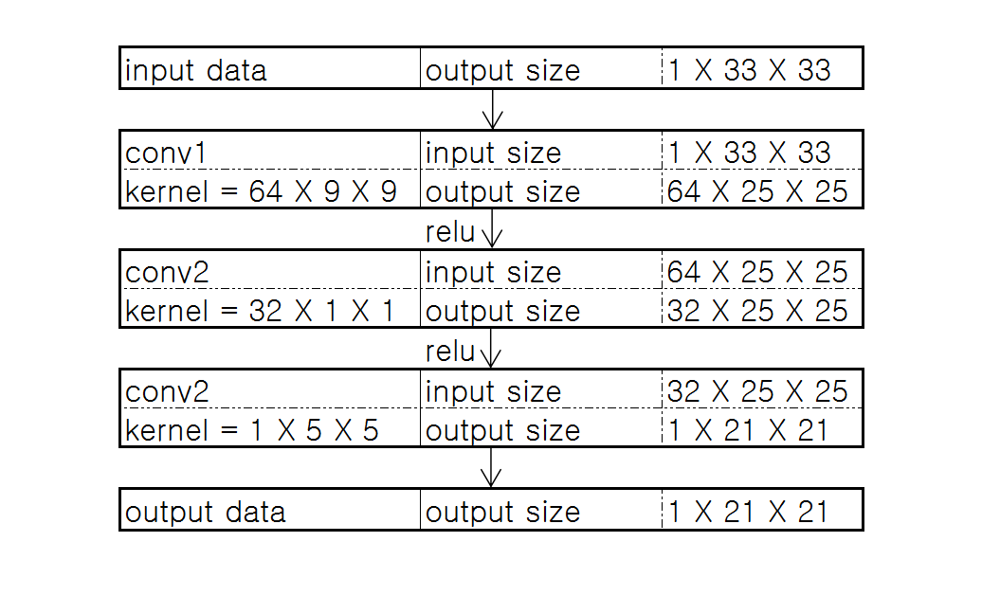
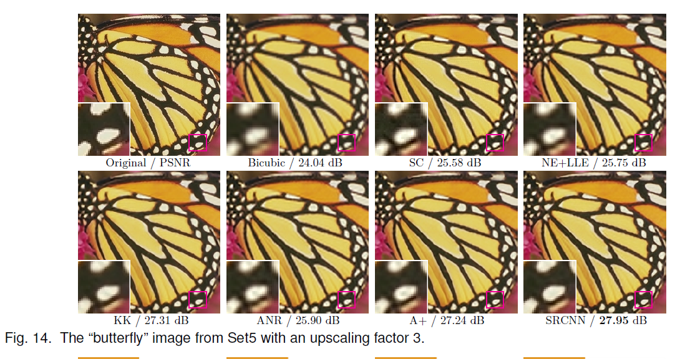
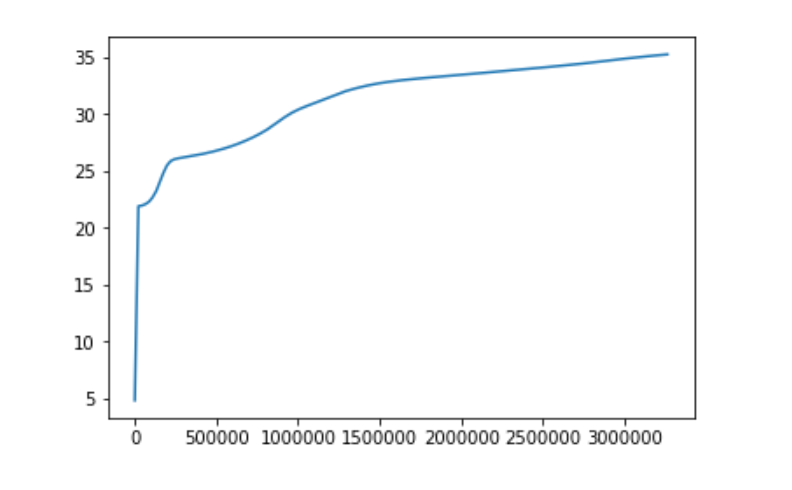
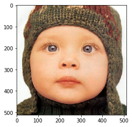
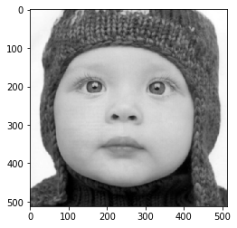

运行本目录下的程序示例需要使用PaddlePaddle develop最新版本。如果您的PaddlePaddle安装版本低于此要求，请按照[安装文档](http://staging.paddlepaddle.org/documentation/docs/en/0.15.0/getstarted/quickstart_en.html)中的说明更新PaddlePaddle安装版本。


## 代码结构
```
├── train.py   # 训练任务脚本
├── infer.py   # 预测脚本
└── utils.py    # 定义通用的函数
```

## 简介

这篇论文是汤晓鸥小组 Chao Dong 的作品，也是深度学习应用在超分辨率重构上的开山之作。论文下载地址为：http://mmlab.ie.cuhk.edu.hk/projects/SRCNN.html

单图像超分辨率重构（SR）可以从一张较小的图像生成一张高分辨率的图像。SRCNN网络证明了卷积神经网络应用在超分辨率重建领域的强大的潜力，将稀疏编码方法中的低维词典编码、高维特征重建等步骤等价为一个由卷积神经网络构成的end-to-end模型。

模型结构如下图所示：



模型输出示例如下图所示：



## 数据准备
模型使用timofte作为训练任务的数据，使用set5或set14作为验证任务的数据。数据集获取难度较大，可以通过下面的下载地址下载：

链接：https://pan.baidu.com/s/1rynLdqzsbyPamJnKOIwNiA 
提取码：v3hl 

数据存放结构如下：

```
data/
|-- timofte/
|   |-- t1.bmp
|   |-- t2.bmp
|   `-- ...
|-- val_dataset/
|   |-- set5
|	|	|--baby_GT.bmp
|	|	|--bird_GT.bmp
|	|	|--...
|   |-- set14
|	|	|--baboon.bmp
|	|	|--barbara.bmp
|	|	|--...
```
亦可自行决定数据的存放地址，在训练时指定训练路径。

## 模型训练与预测

### 训练
执行以下命令进行训练，同时指定checkpoint保存路径:
```
python train.py --batch_size=16 --use_gpu=True --checkpoint_path="./chkpnt/"
```
使用以下命令获得更多使用说明：

```
python train.py --help
```
提供其它可选参数如下：

```
epoch_num: 指定训练的epoch数。
train_data： 训练集数据存放路径。
val_data：验证集数据存放路径。
img_ext： 数据集图片拓展名。
mode： 指定模型结构。如果为“base”，使用论文baseline模型结构。如果为“custom”，在train.py中给出模型结构。
```

训练过程中会输出当前的loss和在验证集上的psnr结果。 示例如下：
```
4200    Epoch: 3        Cur Cost : 24.652655     Val Cost: 44.860584     PSNR :31.612154
```
### 预测
执行以下命令得到模型的预测结果。
```
python infer.py --checkpoint_path="./chkpnt/" --image_path="data/val_dataset/set5/baby_GT.bmp"
```
需要通过选项`--checkpoint_path`指定模型文件。并使用`--image_path`指定要进行预测的图片。

提供其它可选参数如下：

```
show_img: 是否显示图像。
only_reconstruct： 是否直接进行超分辨重建。若为False，先对输入图像进行subsample，再进行超分辨重建。
scale_factor： 进行超分辨重建的缩放比例。
```


## 实验结果
下图为在`timofte`训练集上的训练的PSNR曲线：




在训练集上训练，在set5数据集上验证的结果为：psnr=35.82(论文32.39)

下图是使用`infer.py`脚本预测产生的结果示例，其中，第一行是输入的原始图片，第二行是输入图片经过subsample的结果，第三行是超分辨率重构的结果。






## 参考

- [http://mmlab.ie.cuhk.edu.hk/projects/SRCNN.html](https://arxiv.org/abs/1704.08545)
