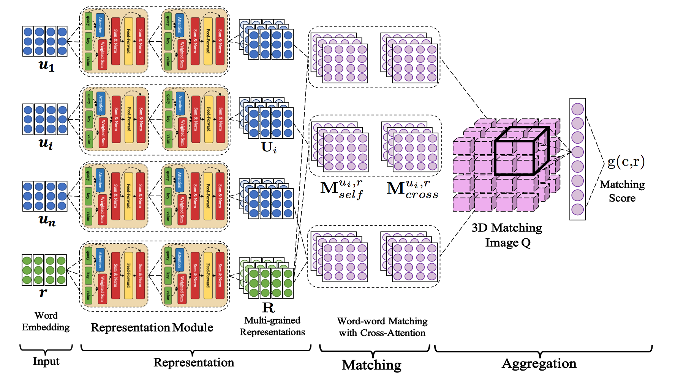
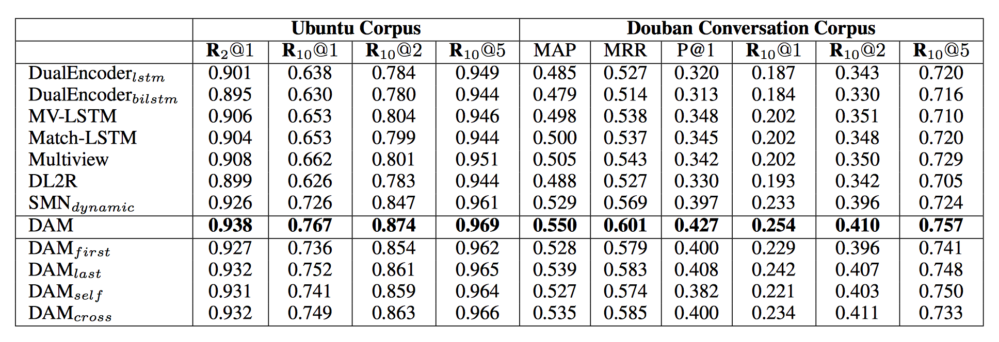

# __Deep Attention Matching Network__

This is the source code of Deep Attention Matching network (DAM), that is proposed for multi-turn response selection in the retrieval-based chatbot.

DAM is a neural matching network that entirely based on attention mechanism. The motivation of DAM is to capture those semantic dependencies, among dialogue elements at different level of granularities, in multi-turn conversation as matching evidences, in order to better match response candidate with its multi-turn context. DAM will appear on ACL-2018, please find our paper at: http://acl2018.org/conference/accepted-papers/.

## __TensorFlow Version__

DAM is originally implemented with Tensorflow, which can be found at: https://github.com/baidu/Dialogue/DAM . We highly recommend using the PaddlePaddle Fluid version here as it supports parallely training with very large corpus.


## __Network__

DAM is inspired by Transformer in Machine Translation (Vaswani et al., 2017), and we extend the key attention mechanism of Transformer in two perspectives and introduce those two kinds of attention in one uniform neural network.

- **self-attention** To gradually capture semantic representations in different granularities by stacking attention from word-level embeddings. Those multi-grained semantic representations would facilitate exploring segmental dependencies between context and response.

- **cross-attention** Attention across context and response can generally capture the relevance in dependency between segment pairs, which could provide complementary information to textual relevance for matching response with multi-turn context.

<p align="center">
 <br />
Overview of Deep Attention Matching Network
</p>

## __Results__

We test DAM on two large-scale multi-turn response selection tasks, i.e., the Ubuntu Corpus v1 and Douban Conversation Corpus, experimental results are bellow:

<p align="center">
 <br />
</p>

## __Usage__

First, please download [data](https://pan.baidu.com/s/1hakfuuwdS8xl7NyxlWzRiQ "data") and unzip it:
```
cd data
unzip data.zip
```

If you want use well trained models directly, please download [models](https://pan.baidu.com/s/1pl4d63MBxihgrEWWfdAz0w "models") and unzip it:
```
cd output
unzip output.zip
```

Train and test the model by:
```
sh run.sh
```

## __Dependencies__

- Python >= 2.7.3
- PaddlePaddle latest develop

## __Citation__

The following article describe the DAM in detail. We recommend citing this article as default.

```
@inproceedings{ ,
  title={Multi-Turn Response Selection for Chatbots with Deep Attention Matching Network},
  author={Xiangyang Zhou, Lu Li, Daxiang Dong, Yi Liu, Ying Chen, Wayne Xin Zhao, Dianhai Yu and Hua Wu},
  booktitle={Proceedings of the 56th Annual Meeting of the Association for Computational Linguistics (Volume 1: Long Papers)},
  volume={1},
  pages={  --  },
  year={2018}
}
```
