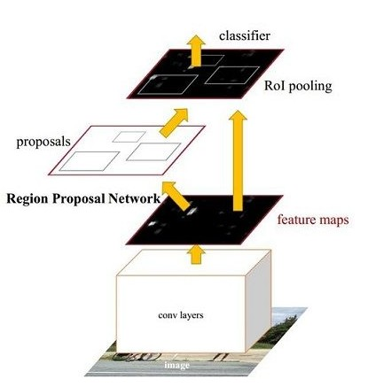
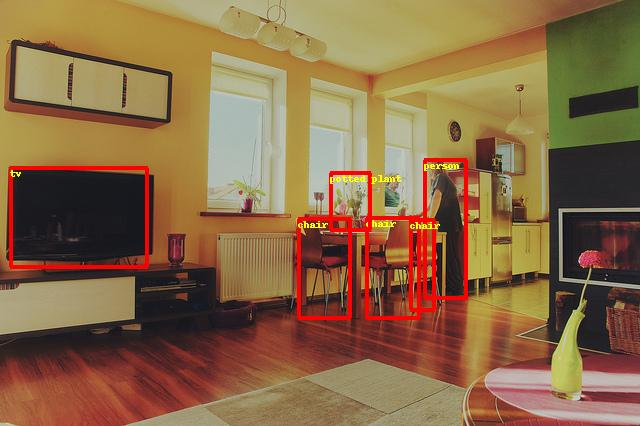

# Faster RCNN Objective Detection

---
## Table of Contents

- [Installation](#installation)
- [Introduction](#introduction)
- [Data preparation](#data-preparation)
- [Training](#training)
- [Finetuning](#finetuning)
- [Evaluation](#evaluation)
- [Inference and Visualization](#inference-and-visualization)
- [Appendix](#appendix)

## Installation

Running sample code in this directory requires PaddelPaddle Fluid v.1.0.0 and later. If the PaddlePaddle on your device is lower than this version, please follow the instructions in [installation document](http://www.paddlepaddle.org/documentation/docs/zh/0.15.0/beginners_guide/install/install_doc.html#paddlepaddle) and make an update.

## Introduction

[Faster Rcnn](https://arxiv.org/abs/1506.01497) is a typical two stage detector. The total framework of network can be divided into four parts, as shown below:
<p align="center">
 <br />
Faster RCNN model
</p>

1. Base conv layer。As a CNN objective dection, Faster RCNN extract feature maps using a basic convolutional network. The feature maps then can be shared by RPN and fc layers. This sampel uses [ResNet-50](https://arxiv.org/abs/1512.03385) as base conv layer.
2. Region Proposal Network (RPN)。RPN generates proposals for detection。This block generates anchors by a set of size and ratio and classifies anchors into fore-ground and back-ground by softmax. Then refine anchors to obtain more precise proposals using box regression.
3. RoI pooling。This layer takes feature maps and proposals as input. The proposals are mapped to feature maps and pooled to the same size. The output are sent to fc layers for classification and regression.
4. Detection layer。Using the output of roi pooling to compute the class and locatoin of each proposal in two fc layers.

## Data preparation

Train the model on [MS-COCO dataset](http://cocodataset.org/#download), download dataset as below:

    cd dataset/coco
    ./download.sh


## Training

After data preparation, one can start the training step by:

    python train.py \
       --max_size=1333 \
       --scales=800 \
       --batch_size=8 \
       --model_save_dir=output/

- Set ```export CUDA_VISIBLE_DEVICES=0,1,2,3,4,5,6,7``` to specifiy 8 GPU to train.
- For more help on arguments:

    python train.py --help

**download the pre-trained model:** This sample provides Resnet-50 pre-trained model which is converted from Caffe. The model fuses the parameters in batch normalization layer. One can download pre-trained model as:

    sh ./pretrained/download.sh

Set `pretrained_model` to load pre-trained model. In addition, this parameter is used to load trained model when finetuning as well.

**data reader introduction:**

* Data reader is defined in `reader.py`.
* Scaling the short side of all images to `scales`. If the long side is larger than `max_size`, then scaling the long side to `max_size`.
* In training stage, images are horizontally flipped.
* Images in the same batch can be padding to the same size.

**model configuration:**

* Use RoIPooling.
* NMS threshold=0.7. During training, pre\_nms=12000, post\_nms=2000; during test, pre\_nms=6000, post\_nms=1000.
* In generating proposal lables, fg\_fraction=0.25, fg\_thresh=0.5, bg\_thresh_hi=0.5, bg\_thresh\_lo=0.0.
* In rpn target assignment, rpn\_fg\_fraction=0.5, rpn\_positive\_overlap=0.7, rpn\_negative\_overlap=0.3.

**training strategy:**

*  Use momentum optimizer with momentum=0.9.
*  Weight decay is 0.0001.
*  In first 500 iteration, the learning rate increases linearly from 0.00333 to 0.01. Then lr is decayed at 120000, 160000 iteration with multiplier 0.1, 0.01. The maximum iteration is 180000.
*  Set the learning rate of bias to two times as global lr in non basic convolutional layers.
*  In basic convolutional layers, parameters of affine layers and res body do not update.
*  Use Nvidia Tesla V100 8GPU, total time for training is about 40 hours.

Training result is shown as below：
<p align="center">
 <br />
Faster RCNN train loss
</p>
* Fluid all padding: Each image padding to 1333\*1333.
* Fluid minibatch padding: Images in one batch padding to the same size. This method is same as detectron.
* Fluid no padding: Images without padding.

## Finetuning

Finetuning is to finetune model weights in a specific task by loading pretrained weights. After initializing ```pretrained_model```, one can finetune a model as:

    python train.py
        --max_size=1333 \
        --scales=800 \
        --pretrained_model=${path_to_pretrain_model} \
        --batch_size= 8\
        --model_save_dir=output/

## Evaluation

Evaluation is to evaluate the performance of a trained model. This sample provides `eval_coco_map.py` which uses a COCO-specific mAP metric defined by [COCO committee](http://cocodataset.org/#detections-eval). To use `eval_coco_map.py` , [cocoapi](https://github.com/cocodataset/cocoapi) is needed. Install the cocoapi:

    # COCOAPI=/path/to/clone/cocoapi
    git clone https://github.com/cocodataset/cocoapi.git $COCOAPI
    cd $COCOAPI/PythonAPI
    # if cython is not installed
    pip install Cython
    # Install into global site-packages
    make install
    # Alternatively, if you do not have permissions or prefer
    # not to install the COCO API into global site-packages
    python2 setup.py install --user

`eval_coco_map.py` is the main executor for evalution, one can start evalution step by:

    python eval_coco_map.py \
        --dataset=coco2017 \
        --pretrained_mode=${path_to_pretrain_model} \
        --batch_size=1 \
        --nms_threshold=0.5 \
        --score_threshold=0.05

Evalutaion result is shown as below:
<p align="center">
 <br />
Faster RCNN mAP
</p>

| Model                    | Batch size     | Max iteration    | mAP  |
| :------------------------------ | :------------:    | :-------------------:|------: |
| Detectron                 | 8            |    180000        | 0.315 |
| Fluid minibatch padding | 8            |    180000        | 0.314 |
| Fluid all padding         | 8            |    180000        | 0.308 |
| Fluid no padding         |6            |    240000        | 0.317 |

* Fluid all padding: Each image padding to 1333\*1333.
* Fluid minibatch padding: Images in one batch padding to the same size. This method is same as detectron.
* Fluid no padding: Images without padding.

## Inference and Visualization

Inference is used to get prediction score or image features based on trained models. `infer.py`  is the main executor for inference, one can start infer step by:

    python infer.py \
       --dataset=coco2017 \
        --pretrained_model=${path_to_pretrain_model}  \
        --image_path=data/COCO17/val2017/  \
        --image_name=000000000139.jpg \
        --draw_threshold=0.6

Visualization of infer result is shown as below:
<p align="center">



 <br />
Faster RCNN Visualization Examples
</p>
