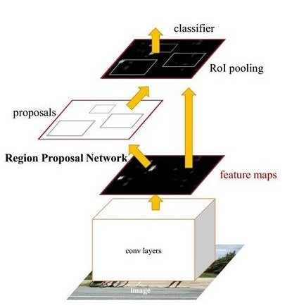
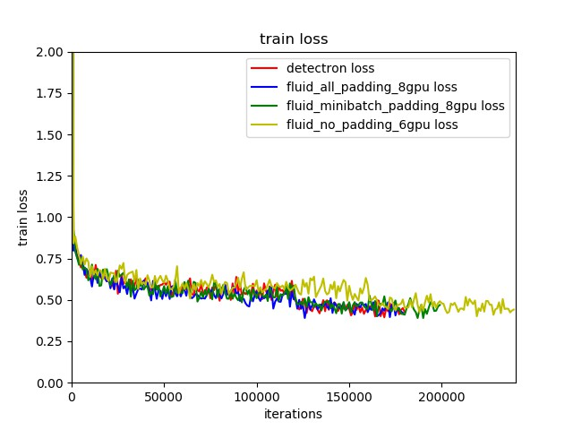
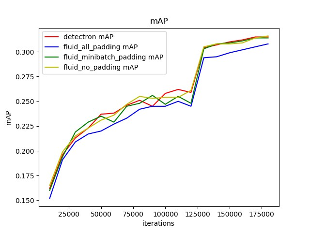
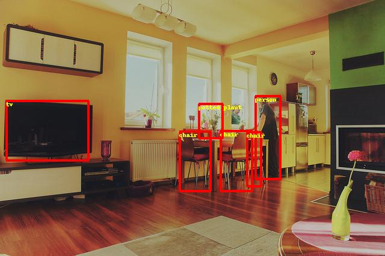
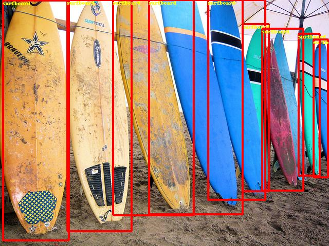
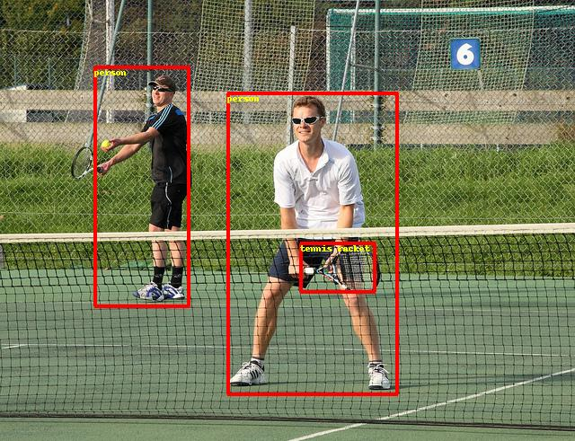
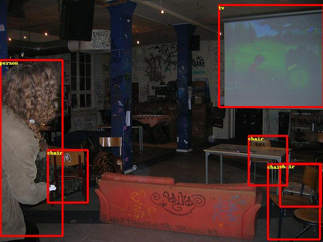

# Faster RCNN 目标检测

---
## 内容

- [安装](#安装)
- [简介](#简介)
- [数据准备](#数据准备)
- [模型训练](#模型训练)
- [参数微调](#参数微调)
- [模型评估](#模型评估)
- [模型推断及可视化](#模型推断及可视化)
- [附录](#附录)

## 安装

在当前目录下运行样例代码需要PadddlePaddle Fluid的v.1.0.0或以上的版本。如果你的运行环境中的PaddlePaddle低于此版本，请根据[安装文档](http://www.paddlepaddle.org/documentation/docs/zh/0.15.0/beginners_guide/install/install_doc.html#paddlepaddle)中的说明来更新PaddlePaddle。

## 简介

[Faster Rcnn](https://arxiv.org/abs/1506.01497) 是典型的两阶段目标检测器。如下图所示，整体网络可以分为4个主要内容：

  
Faster RCNN 目标检测模型

1. 基础卷积层。作为一种卷积神经网络目标检测方法，Faster RCNN首先使用一组基础的卷积网络提取图像的特征图。特征图被后续RPN层和全连接层共享。本示例采用[ResNet-50](https://arxiv.org/abs/1512.03385)作为基础卷积层。
2. 区域生成网络(RPN)。RPN网络用于生成候选区域(proposals)。该层通过一组固定的尺寸和比例得到一组锚点(anchors), 通过softmax判断锚点属于前景或者背景，再利用区域回归修正锚点从而获得精确的候选区域。
3. RoI池化。该层收集输入的特征图和候选区域，将候选区域映射到特征图中并池化为统一大小的区域特征图，送入全连接层判定目标类别。
4. 检测层。利用区域特征图计算候选区域的类别，同时再次通过区域回归获得检测框最终的精确位置。

## 数据准备

在[MS-COCO数据集](http://cocodataset.org/#download)上进行训练，通过如下方式下载数据集。

    cd dataset/coco
    ./download.sh

## 模型训练

数据准备完毕后，可以通过如下的方式启动训练：

    python train.py \
       --max_size=1333 \
       --scales=[800] \
       --batch_size=8 \
       --model_save_dir=output/ \
       --pretrained_model=${path_to_pretrain_model}

- 通过设置export CUDA\_VISIBLE\_DEVICES=0,1,2,3,4,5,6,7指定8卡GPU训练。
- 可选参数见：

    python train.py --help

**下载预训练模型：** 本示例提供Resnet-50预训练模型，该模性转换自Caffe，并对批标准化层(Batch Normalization Layer)进行参数融合。采用如下命令下载预训练模型：

    sh ./pretrained/download.sh

通过初始化`pretrained_model` 加载预训练模型。同时在参数微调时也采用该设置加载已训练模型。

**安装[cocoapi](https://github.com/cocodataset/cocoapi)：**

训练前需要首先下载[cocoapi](https://github.com/cocodataset/cocoapi)：

    # COCOAPI=/path/to/clone/cocoapi
    git clone https://github.com/cocodataset/cocoapi.git $COCOAPI
    cd $COCOAPI/PythonAPI
    # if cython is not installed
    pip install Cython
    # Install into global site-packages
    make install
    # Alternatively, if you do not have permissions or prefer
    # not to install the COCO API into global site-packages
    python2 setup.py install --user

**数据读取器说明：** 数据读取器定义在reader.py中。所有图像将短边等比例缩放至`scales`，若长边大于`max_size`, 则再次将长边等比例缩放至`max_iter`。在训练阶段，对图像采用水平翻转。支持将同一个batch内的图像padding为相同尺寸。

**模型设置：**

* 使用RoIPooling。
* 训练过程pre\_nms=12000, post\_nms=2000，测试过程pre\_nms=6000, post\_nms=1000。nms阈值为0.7。
* RPN网络得到labels的过程中，fg\_fraction=0.25，fg\_thresh=0.5，bg\_thresh_hi=0.5，bg\_thresh\_lo=0.0
* RPN选择anchor时，rpn\_fg\_fraction=0.5，rpn\_positive\_overlap=0.7，rpn\_negative\_overlap=0.3

下图为模型训练结果：

  
Faster RCNN 训练loss

* Fluid all padding: 每张图像填充为1333\*1333大小。
* Fluid minibatch padding: 同一个batch内的图像填充为相同尺寸。该方法与detectron处理相同。
* Fluid no padding: 不对图像做填充处理。

**训练策略：**

*  采用momentum优化算法训练Faster RCNN，momentum=0.9。
*  权重衰减系数为0.0001，前500轮学习率从0.00333线性增加至0.01。在120000，160000轮时使用0.1,0.01乘子进行学习率衰减，最大训练180000轮。
*  非基础卷积层卷积bias学习率为整体学习率2倍。
*  基础卷积层中，affine_layers参数不更新，res2层参数不更新。
*  使用Nvidia Tesla V100 8卡并行，总共训练时长大约40小时。

## 模型评估

模型评估是指对训练完毕的模型评估各类性能指标。本示例采用[COCO官方评估](http://cocodataset.org/#detections-eval)

`eval_coco_map.py`是评估模块的主要执行程序，调用示例如下：

    python eval_coco_map.py \
        --dataset=coco2017 \
        --pretrained_mode=${path_to_pretrain_model} \
        --batch_size=1 \
        --nms_threshold=0.5 \
        --score_threshold=0.05

下图为模型评估结果：

  
Faster RCNN mAP

| 模型                    | 批量大小     | 迭代次数        | mAP  |
| :------------------------------ | :------------:    | :------------------:    |------: |
| Detectron                 | 8            |    180000        | 0.315 |
| Fluid minibatch padding | 8            |    180000        | 0.314 |
| Fluid all padding         | 8            |    180000        | 0.308 |
| Fluid no padding            |8            |    180000        | 0.316 |

* Fluid all padding: 每张图像填充为1333\*1333大小。
* Fluid minibatch padding: 同一个batch内的图像填充为相同尺寸。该方法与detectron处理相同。
* Fluid no padding: 不对图像做填充处理。

## 模型推断及可视化

模型推断可以获取图像中的物体及其对应的类别，`infer.py`是主要执行程序，调用示例如下：

    python infer.py \
       --dataset=coco2017 \
        --pretrained_model=${path_to_pretrain_model}  \
        --image_path=data/COCO17/val2017/  \
        --image_name=000000000139.jpg \
        --draw_threshold=0.6

下图为模型可视化预测结果：

  
Faster RCNN 预测可视化

