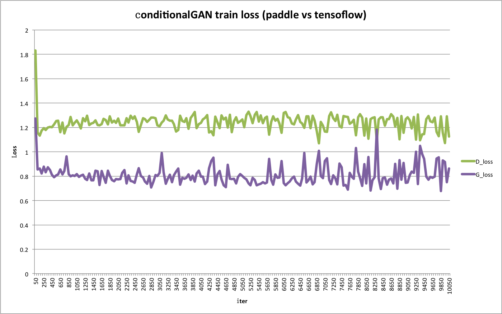
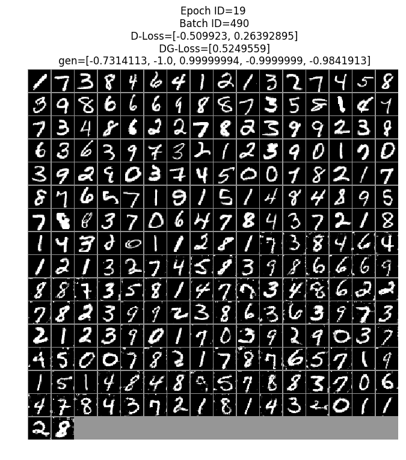
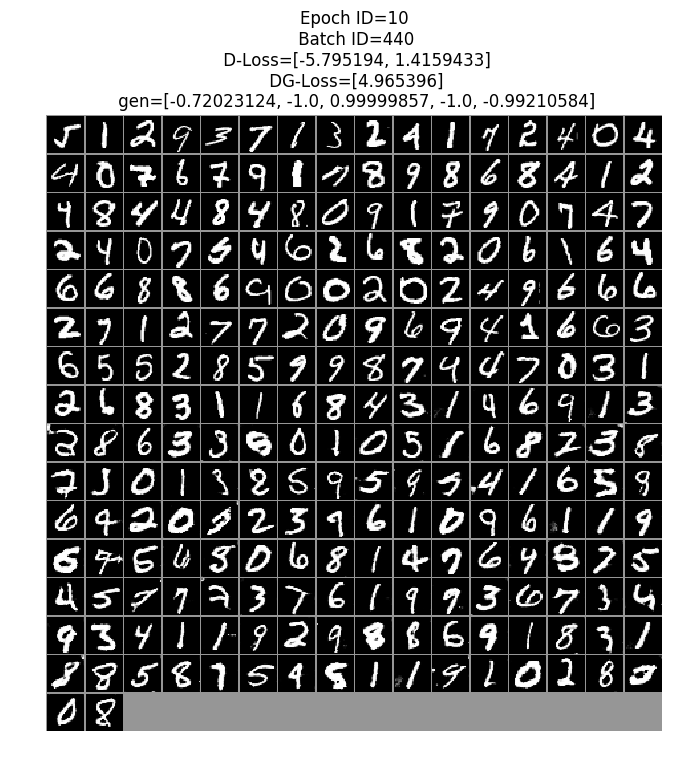



运行本目录下的程序示例需要使用PaddlePaddle develop最新版本。如果您的PaddlePaddle安装版本低于此要求，请按照[安装文档](http://www.paddlepaddle.org/docs/develop/documentation/zh/build_and_install/pip_install_cn.html)中的说明更新PaddlePaddle安装版本。

## 代码结构
```
├── network.py   # 定义基础生成网络和判别网络。
├── utility.py   # 定义通用工具方法。
├── dc_gan.py    # DCGAN训练脚本。
└── c_gan.py     # conditionalGAN训练脚本。
```

## 简介
TODO

## 数据准备

本教程使用 mnist 数据集来进行模型的训练测试工作，该数据集通过`paddle.dataset`模块自动下载到本地。

## 训练测试conditianalGAN

在GPU单卡上训练conditionalGAN:

```
env CUDA_VISIBLE_DEVICES=0 python c_gan.py --output="./result"
```

训练过程中，每隔固定的训练轮数，会取一个batch的数据进行测试，测试结果以图片的形式保存至`--output`选项指定的路径。

执行`python c_gan.py --help`可查看更多使用方式和参数详细说明。

图1为conditionalGAN训练损失示意图，其中横坐标轴为训练轮数，纵轴为在训练集上的损失。其中，'G_loss'和'D_loss'分别为生成网络和判别器网络的训练损失。conditionalGAN训练19轮的模型预测效果如图2所示.

<p style="background-color: #fff; align: center">
<table>
<tbody>
<tr>
    <td>
        
    </td>
    <td>
        
    </td>
</tr>
<tr>
    <td>
        <strong align="center">图 1</strong>
    </td>
    <td>
        <strong align="center">图 2</strong>
    </td>
</tr>
</tbody>
</table>
</p>


## 训练测试DCGAN

在GPU单卡上训练DCGAN:

```
env CUDA_VISIBLE_DEVICES=0 python dc_gan.py --output="./result"
```

训练过程中，每隔固定的训练轮数，会取一个batch的数据进行测试，测试结果以图片的形式保存至`--output`选项指定的路径。

执行`python dc_gan.py --help`可查看更多使用方式和参数详细说明。


DCGAN训练10轮的模型预测效果如图3所示：

<p align="center">
 <br/>
<strong>图 3</strong>
</p>
