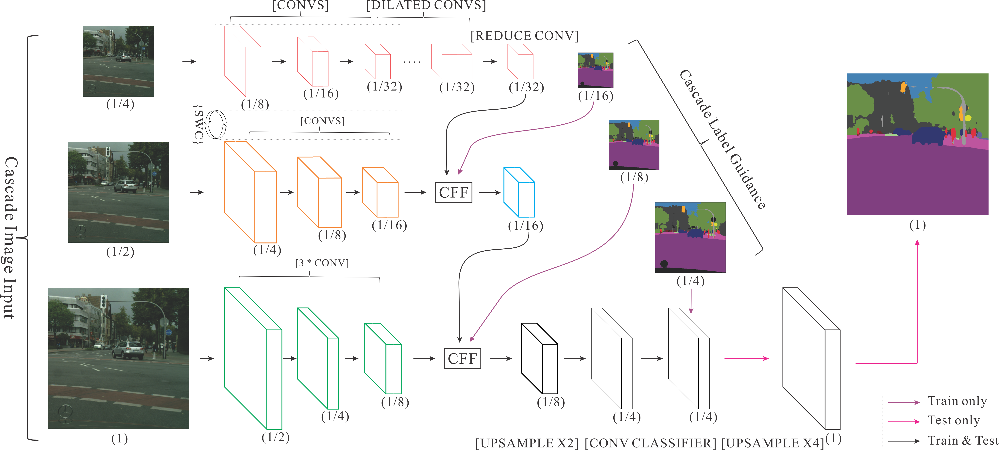

运行本目录下的程序示例需要使用PaddlePaddle develop最新版本。如果您的PaddlePaddle安装版本低于此要求，请按照[安装文档](http://www.paddlepaddle.org/docs/develop/documentation/zh/build_and_install/pip_install_cn.html)中的说明更新PaddlePaddle安装版本。


## 代码结构
```
├── network.py # 网络结构定义脚本
├── train.py   # 训练任务脚本
├── eval.py    # 评估脚本
├── infer.py   # 预测脚本
├── cityscape.py    # 数据预处理脚本
└── utils.py    # 定义通用的函数
```

## 简介

Image Cascade Network（ICNet），在兼顾实时性的同时，比原来的Fast Semantic Segmentation,比如SQ, SegNet, ENet等大大地提高了准确率，足以与Deeplab v2媲美，给语义分割的落地提供了可能。
ICNet利用了低分辨率图片的高效处理和高分辨率图片的高推断质量两种优点。主要思想是：让低分辨率图像经过整个语义网络输出一个粗糙的预测，然后利用文中提出的级联融合单元来引入中分辨率和高分辨率图像的特征，从而逐渐提高精度。整个网络结构如下：

<p align="center">
 <br/>
<strong>图 1</strong>
</p>


## 数据准备


本文采用Cityscape数据集，请前往[Cityscape官网]()注册下载。下载数据之后，按照[这里](https://github.com/mcordts/cityscapesScripts)的说明和工具处理数据。
处理之后的数据
```
data/cityscape/
|-- gtFine
|   |-- test
|   |-- train
|   `-- val
|-- leftImg8bit
|   |-- test
|   |-- train
|   `-- val
|-- train.list
`-- val.list
```
其中，train.list和val.list分别是用于训练和测试的列表文件，第一列为输入图像数据，第二列为标注数据，两列用空格分开。示例如下：
```
leftImg8bit/train/stuttgart/stuttgart_000021_000019_leftImg8bit.png gtFine/train/stuttgart/stuttgart_000021_000019_gtFine_labelTrainIds.png
leftImg8bit/train/stuttgart/stuttgart_000072_000019_leftImg8bit.png gtFine/train/stuttgart/stuttgart_000072_000019_gtFine_labelTrainIds.png
```
完成数据下载和准备后，需要修改`cityscape.py`脚本中对应的数据地址。

## 模型训练与预测

### 训练
执行以下命令进行训练:
```
python train.py --batch_size=16 --use_gpu=True 
```
使用以下命令获得更多使用说明：
```
python train.py --help
```
训练过程中会根据用户的设置，输出训练集上每个网络分支的`loss`， 示例如下：
```
Iter[0]; train loss: 2.338; sub4_loss: 3.367; sub24_loss: 4.120; sub124_loss: 0.151
```
### 测试
执行以下命令在`Cityscape`测试数据集上进行测试：
```
python eval.py --model_path="./model/" --use_gpu=True
```
需要通过选项`--model_path`指定模型文件。
测试脚本的输出的评估指标为[mean IoU]()。

### 预测
执行以下命令对指定的数据进行预测：
```
python infer.py \
--model_path="./model" \
--images_path="./data/cityscape/" \
--images_list="./data/cityscape/infer.list"
```
通过选项`--images_list`指定列表文件，列表文件中每一行为一个要预测的图片的路径。
预测结果默认保存到当前路径下的`output`文件夹下。

## 实验结果
图2为在`CityScape`训练集上的训练的Loss曲线：

<p align="center">
 <br/>
<strong>图 2</strong>
</p>

图3是使用`infer.py`脚本预测产生的结果示例，其中，第一行为输入的原始图片，第二行为人工的标注，第三行为我们模型计算的结果。
<p align="center">
 <br/>
<strong>图 3</strong>
</p>

## 其他信息
|数据集 | pretrained model | 
|---|---|
|CityScape | [Model]()[md: ] | 

## 参考

- [ICNet for Real-Time Semantic Segmentation on High-Resolution Images](https://arxiv.org/abs/1704.08545)
- https://github.com/hszhao/ICNet
- https://github.com/hellochick/ICNet-tensorflow
- https://github.com/mcordts/cityscapesScripts
- https://zhuanlan.zhihu.com/p/26653218