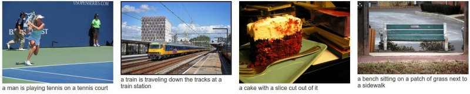

运行本目录下的程序示例需要使用PaddlePaddle v0.11.0及其以上 版本。如果您的PaddlePaddle安装版本低于此要求，请按照[安装文档](http://www.paddlepaddle.org/docs/develop/documentation/zh/build_and_install/pip_install_cn.html)中的说明更新PaddlePaddle安装版本。

---

# 文本标注

以下是本例目录包含的文件以及对应说明:

```text
.
├── images              # 文档中的图片
│   ├── img2lstm_net.png
│   └── Show_and_tell.jpg
├── infer.py            # 预测脚本
├── network_conf.py     # 本例中涉及的各种网络结构均定义在此文件中，若进一步修改模型结构，请查看此文件
├── reader.py           # 读取数据接口，若使用自定义格式的数据，请查看此文件
├── README.md           # 英文文档
├── README.cn.md        # 中文文档
├── run.sh              # 训练任务运行脚本，直接运行此脚本，将以默认参数开始训练任务
├── train.py            # 训练脚本
├── utils.py            # 定义通用的函数，例如：打印日志、解析命令行参数、构建字典、加载字典等
└── vgg_infer.py        # 预先预测脚本，用于事先将图片转换为特征表示
```

## 简介
基于神经网络的图片自动描述，流程如下：

1. 下载caffe版本的vgg模型，并将其转换为paddlepaddle版本模型，并建立图片特征提取接口。
2. 下载待训练图片，本例子默认图片库为flickr30k-images。
3. 模型训练与测试。
4. 模型预测。

本例是基于Oriol Vinyals等人的研究成果[Show and Tell: A Neural Image Caption Generator](https://arxiv.org/abs/1411.4555)，他们提出了一种基于图片特征提取与lstm结合的方式用于自动描述图片的方法。

## 模型详解

模型包含两部分：

1. 第一部分为图片特征提取部分，该部分可以使用网络共享的已经训练好的图片特征提取模型以简化训练迭代时间，本例使用的是[vgg16模型](http://www.robots.ox.ac.uk/%7Evgg/research/very_deep/)。
2. 第二部分为一个基础的序列模型，使用lstm结构,预测一个词序列。

详细内容可参考[Show and Tell: A Neural Image Caption Generator](https://arxiv.org/abs/1411.4555)


### 1. 任务

**任务如下图所示：**

<p align="center">
<br/>
图1. 用简短语句描述图片中内容
</p>

本项目任务为使用简短的语句描述图片中的内容


### 2. 模型结构

**Sentence approach network 模型结构如下图所示：**

<p align="center">
<br/>
图2. 本例中的模型结构
</p>
该结构包含两部分，一部分为图片特征提取部分，第二部分为lstm预测文本序列部分
其中图片特征提取部分可迁移经典的网络模型，本例使用vgg16模型进行图片特征提取。
其中文本预测部分，即lstm结构部分，通过 PaddlePaddle 实现,该结构的代码见 `network_conf.py`

## 使用 PaddlePaddle 内置数据运行

### 如何准备vgg16模型
首先进入目录caffe2fluid，将已经训练好的vgg16 caffe模型文件下载至目录caffe2fluid/model_caffe下，一共包含两个文件，分别为模型文件[VGG_ILSVRC_16_layers.caffemodel](http://www.robots.ox.ac.uk/~vgg/software/very_deep/caffe/VGG_ILSVRC_16_layers.caffemodel),结构文件[VGG_ILSVRC_16_layers.prototxt](https://gist.githubusercontent.com/ksimonyan/211839e770f7b538e2d8/raw/0067c9b32f60362c74f4c445a080beed06b07eb3/VGG_ILSVRC_16_layers_deploy.prototxt)
也可以从[其他渠道](http://www.robots.ox.ac.uk/%7Evgg/research/very_deep/)获得

### 如何将caffe 模型转换为paddlepaddle模型
在目录即可将caffe2fluid下运行"sh run.sh"，即可将caffe2fluid/model_caffe下的caffe模型转换为paddlepaddle模型并保存在caffe2fluid/fluid目录下，包含两个文件，模型结构文件"model"和模型参数文件"params"
详情可参看caffe2fluid下readme文件

### 如何下载图片并提取图片特征
本例使用的是flickr30k-images图片特征，其数据分为两部分，一部分为[图片部分](http://shannon.cs.illinois.edu/DenotationGraph/data/flickr30k-images.tar)，一部分为[描述部分](http://shannon.cs.illinois.edu/DenotationGraph/data/flickr30k.tar.gz)
在根目录下，终端中执行`python vgg_infer.py`
该部分包含下载图片以及图片特征提取，可能耗时比较久，最终将生成图片特征集合文件

### 如何训练

在终端中执行 `sh run.sh` 以下命令， 将以经典序列标注数据集：`flickr30k-images` 直接运行本例，会看到如下输出：

```text
pass_id: 0, batch 6, avg_acc: 0.000000, avg_cost: 5.928759
pass_id: 0, batch 16, avg_acc: 0.113269, avg_cost: 4.496562
pass_id: 0, batch 26, avg_acc: 0.360691, avg_cost: 3.131640
pass_id: 0, batch 36, avg_acc: 0.469320, avg_cost: 2.632482
pass_id: 0, batch 46, avg_acc: 0.573333, avg_cost: 2.150640
pass_id: 0, batch 56, avg_acc: 0.650273, avg_cost: 1.762822
pass_id: 0, batch 66, avg_acc: 0.676226, avg_cost: 1.600152
pass_id: 0, batch 76, avg_acc: 0.723975, avg_cost: 1.365101
pass_id: 0, batch 86, avg_acc: 0.756098, avg_cost: 1.206334
pass_id: 0, batch 96, avg_acc: 0.771930, avg_cost: 1.127686
pass_id: 0, batch 106, avg_acc: 0.782906, avg_cost: 1.076173
...
```
日志每隔 10 个 batch 输出一次，输出信息包括：（1）Pass 序号；（2）Batch 序号；（3）依次输出当前 Batch 上评估指标的评估结果。评估指标在配置网络拓扑结构时指定，在上面的输出中，输出了训练样本集之的 精度以及cost指标。

### 如何预测

训练结束后模型默认存储在当前工作目录下，在终端中执行 `python infer.py` ，预测脚本会加载训练好的模型进行预测。

- 默认加载使用 `flickr30k-images`train数据训练一个 Pass 产出的模型对 `flickr30k-images`test 进行测试


## 使用自定义数据训练和预测

### 如何训练

1. 数据组织

    假设有如下格式的训练数据：每一行为一条样本，以"\t"分隔图片与文字描述两部分，图片部分为图片名称及其使用"#"连接的序列号。文字部分是以空格分隔的字符。以下是两条示例数据：

    ```
     10002456.jpg#0  Several men in hard hats are operating a giant pulley system .
     10002456.jpg#1  Workers look down from up above on a piece of equipment .
    ```

2. 编写数据读取接口

    自定义数据读取接口只需编写一个 Python 生成器实现**从原始输入文本中解析一条训练样本**的逻辑。

    - 详见本例目录下的 `reader.py` 脚本，`reader.py` 提供了读取测试数据的全部代码。

    接下来，只需要将数据读取函数 `train_reader` 作为参数传递给 `train.py` 脚本中的 `paddle.batch` 接口即可使用自定义数据接口读取数据，调用方式如下：

    ```python
    train_reader = paddle.reader.shuffle(
                reader.train_reader(train_data_dir, word_dict, lbl_dict),
                buf_size=1000)
    ```

3. 修改命令行参数

    - 如果将数据组织成示例数据的同样的格式，只需在 `run.sh` 脚本中修改 `train.py` 启动参数，指定 `nn_type` 参数，可以直接运行本例，无需修改数据读取接口 `reader.py`。
    - 执行 `python train.py --help` 可以获取`train.py` 脚本各项启动参数的详细说明，主要参数如下：
        - `train_features_path`：指定训练数据所在的文件夹，使用自定义数据训练，必须指定此参数，否则使用网络中`Brown corpus`训练，同时默认`test_data_dir`，`word_dict`，和 `label_dict` 参数。
        - `test_features_path`：指定测试数据所在的文件夹，若不指定将不进行测试，除非使用默认语料。
        - `word_dict`：字典文件所在的路径，若不指定，将从训练数据根据词频统计，自动建立字典。
        - `img2sent_dict_path`：文本描述标签字典，用于将图片文件名查找文本描述序列。
        - `num_passes`：指定训练多少个轮次。

### 如何预测

1. 修改 `infer.py` 中以下变量，指定使用的模型、指定测试数据。

    ```python
    model_dir = "./models/img2sentence_epoch0"  # 指定infer模型所在的目录
    img2sent_dict_path = "./data/flickr30k-images/default_img2sentence.dict"      # 指定图片名与句子的映射字典文件路径
    word_dict_path = "./data/flickr30k-images/default_word.dict"     # 指定字典所在的路径
    test_features_path = "./data/img_vgg_feats_test.dict"    # 指定测试文件的特征文件路径
    ```
2. 在终端中执行 `python infer.py`。
