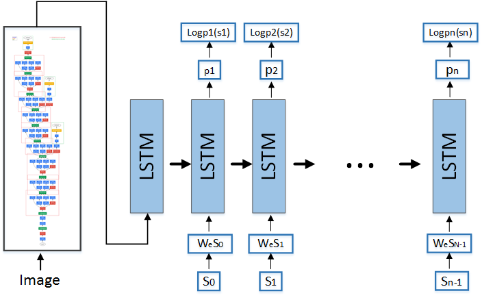

Please use PaddlePaddle v0.11.0 or a higher version for operation of the program under the category. If your PaddlePaddle is of a lower version, please refer to instructions in the [installation file](http://www.paddlepaddle.org/docs/develop/documentation/zh/build_and_install/pip_install_cn.html)  for update of your PaddlePaddle. 

---

# Text annotations 

Below are files and instructions under the directory: 

```text
├── images              # Images in the file
│   ├── img2lstm_net.png
│   └── Show_and_tell.jpg
├── infer.py            # Forecast script
├── network_conf.py     # Definitions of various network structures involved in this example are in this file. If further modification of the model structure is required, please check this file.
├── reader.py           # Read the data interface. If the data of the self-defined format are used, please refer to this file.
├── README.md           # English file
├── README.cn.md        # Chinese file 
├── run.sh              # Directly run this script as the training task operation script. The training task can be started using the default parameters. 
├── train.py            # Train the script. 
├── utils.py            # Define the universal function, such as printing of journals, analysis of command line parameters, construction of dictionaries, loading of dictionaries, etc. 
└── vgg_infer.py        # Forecast of scripts to transform images into characteristic representation in advance. 

```

## Brief introduction 
Based on automatic description of the neural network, the procedures are as below: 

1.	Download the vgg model of the caffe version. Transform it into the PaddlePaddle version model. Build the image characteristic extraction interface. 
2.	Download the images for training. In this example, the default image gallery is "flickr30k-images;"
3.	Conduct model training and test;
4.	Conduct model prediction.

This example is based on the research finding [Show and Tell: A Neural Image Caption Generator](https://arxiv.org/abs/1411.4555) of Oriol Vinyals and so on. They proposed a method for automatic depiction of images by combining image characteristic extraction with Istm. 


## Model interpretation 
This model is made up of two parts: 
1.	Part 1 is about image characteristic extraction. This part can use the well-trained image characteristic extraction model shared on the network for simplification of the training iterative time. The image characteristic extraction model used in this example is [vgg16 model](http://www.robots.ox.ac.uk/%7Evgg/research/very_deep/). 
2.	Part 2 is about a basic sequence model, which uses the Istm structure for prediction of the word sequence. 

Please refer to [Show and Tell: A Neural Image Caption Generator](https://arxiv.org/abs/1411.4555) for details. 


### 1. Tasks 
**Tasks are shown as below: **

<p align="center">
<br/>
Fig. 1. Use simple and short sentences to describe the directory in images. 
</p>

The task of this project is to describe the directory of images in short and concise sentences. 


### 2. Model structure 

**The model structure is shown as below:**

<p align="center">
<br/>
Fig. 2. The network 
</p>
The structure consists of two parts. Part 1 is the image characteristic extraction. Part 2 is prediction of the textual sequence using Istm. 
The image characteristic extraction part can migrate classical network models. In this example, vgg16 model is used for image characteristic extraction. 
The textual prediction part is actually the Istm structure part. Through realization of PaddlePaddle, please refer to 'network_conf.py' for the structure codes. 

## Use PaddlePaddle built-in data for operation 

### How to prepare vgg16 model
Enter the directory, caffe2fluid, and download the well-trained vgg16 caffe model file under the directory of caffe2fluid/model_caffe. There are two files in total. They are the model file, [VGG_ILSVRC_16_layers.caffemodel](http://www.robots.ox.ac.uk/~vgg/software/very_deep/caffe/VGG_ILSVRC_16_layers.caffemodel), and the structural file, [VGG_ILSVRC_16_layers.prototxt](https://gist.githubuserdirectory.com/ksimonyan/211839e770f7b538e2d8/raw/0067c9b32f60362c74f4c445a080beed06b07eb3/VGG_ILSVRC_16_layers_deploy.prototxt).
It can also be obtained through [other channels](http://www.robots.ox.ac.uk/%7Evgg/research/very_deep/). 


### How to transform the caffe model into the PaddlePaddle model
Run `sh run.sh` under the directory of caffe2fluid, and transform the caffe model under caffe2fluid/model_caffe into PaddlePaddle model， and save it under the directory of caffe2fluid/fluid. There are two files, including the model structure file, "model", and the model parameter file, "params."
Please refer to the file, readme, under caffe2fluid. 


### How to download images and extract image characteristics 
In this example, the image characteristics of flickr30k-images are adopted. The data are divided into two parts. The first part [images](http://shannon.cs.illinois.edu/DenotationGraph/data/flickr30k-images.tar), and the second part [description](http://shannon.cs.illinois.edu/DenotationGraph/data/flickr30k.tar.gz). 
Under the root directory, implement `python vgg_infer.py` at the terminal. 
This part includes image downloading and image characteristic extraction, which might be time-consuming. Finally, the image characteristic collection file will be generated. 


### How to train 
Implement the commands under `sh run.sh` at the terminal. Mark the data set in the classical sequence: 'flickr30k-images' directly run this example, and the following output can be obtained: 


```text
pass_id: 0, batch 6, avg_acc: 0.000000, avg_cost: 5.928759
pass_id: 0, batch 16, avg_acc: 0.113269, avg_cost: 4.496562
pass_id: 0, batch 26, avg_acc: 0.360691, avg_cost: 3.131640
pass_id: 0, batch 36, avg_acc: 0.469320, avg_cost: 2.632482
pass_id: 0, batch 46, avg_acc: 0.573333, avg_cost: 2.150640
pass_id: 0, batch 56, avg_acc: 0.650273, avg_cost: 1.762822
pass_id: 0, batch 66, avg_acc: 0.676226, avg_cost: 1.600152
pass_id: 0, batch 76, avg_acc: 0.723975, avg_cost: 1.365101
pass_id: 0, batch 86, avg_acc: 0.756098, avg_cost: 1.206334
pass_id: 0, batch 96, avg_acc: 0.771930, avg_cost: 1.127686
pass_id: 0, batch 106, avg_acc: 0.782906, avg_cost: 1.076173
...
```
The journal is output once every 10 batches. The output information includes: (1) Pass sequence number; (2) Batch sequence number; (3) Output the evaluation results of the evaluation indexes on the current Batch. The evaluation indexes are designated upon configuration of the network topographical structure. In the above output, the precision and cost indexes of the training sample set are output. 


### How to predict 
After the end of training, the model is stored under the current work directory in default. Implement `python infer.py` at the terminal. The forecast script will load the well-trained model for forecast. 
-Load and use 'flickr30k-images' train data to train the model output by Pass and to conduct 'flickr30k-images'test. 


## Use the self-defined data for training and forecast. 

### How to train 

1. Data organization 

Assume the training data are in the following format: Every line is a sample. Use "\t" to divide it into the image part and the textual description. The image part is the image name and the sequence number connected by using "#". The textual part consists of characters separated by spacing. Below are two pieces of sample data: 

    ```
     10002456.jpg#0  Several men in hard hats are operating a giant pulley system .
     10002456.jpg#1  Workers look down from up above on a piece of equipment .
	```
2. Compilation of the data reading interface 


Only one Python generator should be compiled for the self-defined data reading interface to realize the logic of ** interpreting a training sample ** from the original input text. 
-Refer to the script of `reader.py` under the directory of this example. `reader.py` provides all codes for reading of test data. 
In the following part, the self-defined data interface can be used to read data just by adopting the data reading function 'train_reader' as the parameter and conveying it to the 'paddle.batch' interface in the 'train.py' script. Below is the way of invoking:  

    ```python
    train_reader = paddle.reader.shuffle(
                reader.train_reader(train_data_dir, word_dict, lbl_dict),
                buf_size=1000)
    ```

3. Modification of the command line parameters
-To organize the data in the same format of the sample data, one just needs to modify the `train.py` launch parameter in the `run.sh` script and designate the `nn_type` parameter. Then, the operation example can be directly run. There is no need to modify the data reading interface, `reader.py`
-Implementation of `python train.py -- help` can acquire detailed instructions of various launch parameters under the script of `train.py`. Below are introduction of main parameters: 
       
        - `train_features_path`: Designate the folder in which the training data are in. Use the self-defined data for training. The parameter must be designated. Otherwise, `Brown corpus` in the Internet is used for training. Meanwhile, `test_data_dir`，`word_dict`，and  `label_dict`  parameters are used in default. 
        - `test_features_path`: Designate the folder which the test data are in. Without designation, the test cannot be conducted, unless the default corpus is used. 
        - `word_dict`: If the path in the dictionary document is not designated, the dictionary can be automatically built in the trained data according to the word frequency statistics. 
        - `img2sent_dict_path`: Conduct textual description of the tag dictionary, and check the textual description sequence based on the image file name. 
        - `num_passes`: Designate the rounds of training.  


### How to predict 

1. Modify the following variables, designated models, and designated test data under `infer.py`


```python
    model_dir = "./models/img2sentence_epoch0"  # Designate the direction which the infer model is in.
    img2sent_dict_path = "./data/flickr30k-images/default_img2sentence.dict"      # Designate the dictionary file path for the mapping between the image name and the sentence.  
    word_dict_path = "./data/flickr30k-images/default_word.dict"     # Designate the path of the dictionary. 
test_features_path = "./data/img_vgg_feats_test.dict"    # Designate the characteristic file path of the designated test file. 
```
2. Implement `python infer.py` at the terminal. 
