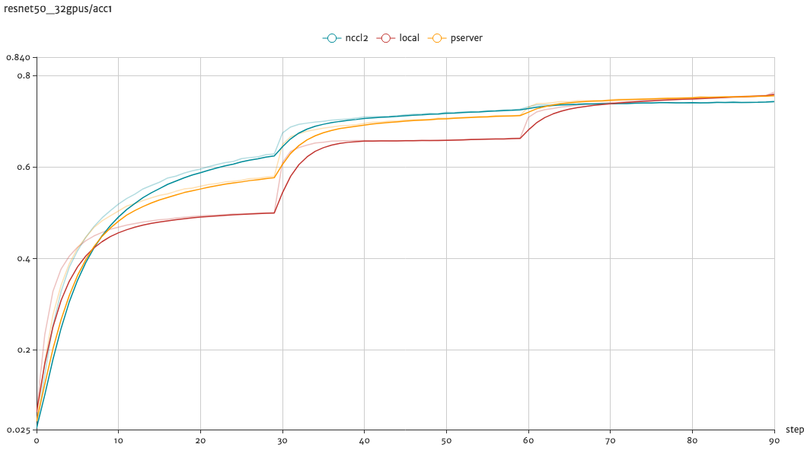

# Distributed Image Classification Models Training

This folder contains implementations of **Image Classification Models**, they are designed to support
large-scaled distributed training with two distributed mode: parameter server mode and NCCL2(Nvidia NCCL2 communication library) collective mode.

## Getting Started

Before getting started, please make sure you have go throught the imagenet [Data Preparation](../README.md#data-preparation).

1. The entrypoint file is `dist_train.py`, some important flags are as follows:

    - `model`, the model to run with, such as `ResNet50`, `ResNet101` and etc..
    - `batch_size`, the batch_size per device.
    - `update_method`, specify the update method, can choose from local, pserver or nccl2.
    - `device`, use CPU or GPU device.
    - `gpus`, the GPU device count that the process used.

    you can check out more details of the flags by `python dist_train.py --help`.

1. Runtime configurations

    We use the environment variable to distinguish the different training role of a distributed training job.

    - `PADDLE_TRAINING_ROLE`, the current training role, should be in [PSERVER, TRAINER].
    - `PADDLE_TRAINERS`, the trainer count of a job.
    - `PADDLE_CURRENT_IP`, the current instance IP.
    - `PADDLE_PSERVER_IPS`, the parameter server IP list, separated by ","  only be used with update_method is pserver.
    - `PADDLE_TRAINER_ID`, the unique trainer ID of a job, the ranging is [0, PADDLE_TRAINERS).
    - `PADDLE_PSERVER_PORT`, the port of the parameter pserver listened on.
    - `PADDLE_TRAINER_IPS`, the trainer IP list, separated by ",", only be used with upadte_method is nccl2.

### Parameter Server Mode

In this example, we launched 4 parameter server instances and 4 trainer instances in the cluster:

1. launch parameter server process

    ``` python
    PADDLE_TRAINING_ROLE=PSERVER \
    PADDLE_TRAINERS=4 \
    PADDLE_PSERVER_IPS=192.168.0.100,192.168.0.101,192.168.0.102,192.168.0.103 \
    PADDLE_CURRENT_IP=192.168.0.100 \
    PADDLE_PSERVER_PORT=7164 \
    python dist_train.py \
        --model=ResNet50 \
        --batch_size=32 \
        --update_method=pserver \
        --device=CPU \
        --data_dir=../data/ILSVRC2012
    ```

1. launch trainer process

    ``` python
    PADDLE_TRAINING_ROLE=TRAINER \
    PADDLE_TRAINERS=4 \
    PADDLE_PSERVER_IPS=192.168.0.100,192.168.0.101,192.168.0.102,192.168.0.103 \
    PADDLE_TRAINER_ID=0 \
    PADDLE_PSERVER_PORT=7164 \
    python dist_train.py \
        --model=ResNet50 \
        --batch_size=32 \
        --update_method=pserver \
        --device=GPU \
        --data_dir=../data/ILSVRC2012

    ```

### NCCL2 Collective Mode

1. launch trainer process

    ``` python
    PADDLE_TRAINING_ROLE=TRAINER \
    PADDLE_TRAINERS=4 \
    PADDLE_TRAINER_IPS=192.168.0.100,192.168.0.101,192.168.0.102,192.168.0.103 \
    PADDLE_TRAINER_ID=0 \
    python dist_train.py \
        --model=ResNet50 \
        --batch_size=32 \
        --update_method=pserver \
        --device=GPU \
        --data_dir=../data/ILSVRC2012
    ```

### Visualize the Training Process

It's easy to draw the learning curve accroding to the training logs, for example,
the logs of ResNet50 is as follows:

``` text
Pass 0, batch 0, loss 7.0336914, accucacys: [0.0, 0.00390625]
Pass 0, batch 1, loss 7.094781, accucacys: [0.0, 0.0]
Pass 0, batch 2, loss 7.007068, accucacys: [0.0, 0.0078125]
Pass 0, batch 3, loss 7.1056547, accucacys: [0.00390625, 0.00390625]
Pass 0, batch 4, loss 7.133543, accucacys: [0.0, 0.0078125]
Pass 0, batch 5, loss 7.3055463, accucacys: [0.0078125, 0.01171875]
Pass 0, batch 6, loss 7.341838, accucacys: [0.0078125, 0.01171875]
Pass 0, batch 7, loss 7.290557, accucacys: [0.0, 0.0]
Pass 0, batch 8, loss 7.264951, accucacys: [0.0, 0.00390625]
Pass 0, batch 9, loss 7.43522, accucacys: [0.00390625, 0.00390625]
```

The training accucacys top1 of local training, distributed training with NCCL2 and parameter server architecture on the ResNet50 model are shown in the below figure:

<p align="center">
 <br/>
Training acc1 curves
</p>

### Performance

TBD
