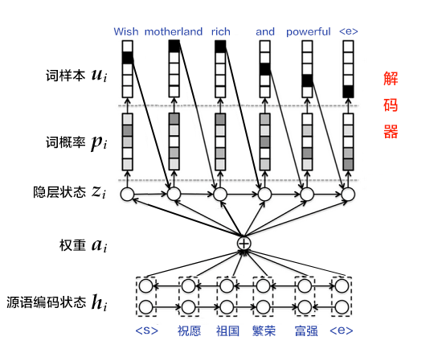

运行本目录下的范例模型需要安装PaddlePaddle Fluid 1.0版。如果您的 PaddlePaddle 安装版本低于此要求，请按照[安装文档](http://www.paddlepaddle.org/docs/develop/documentation/zh/build_and_install/pip_install_cn.html)中的说明更新 PaddlePaddle 安装版本。

# 机器翻译：RNN Search

以下是本范例模型的简要目录结构及说明：(除下列外，其他文件为CE相关脚本，请无视。)

```text
.
├── README.md              # 文档，本文件
├── args.py                # 训练、预测以及模型参数配置
├── train.py               # 训练主程序
├── infer.py               # 预测主程序
├── attention_model.py     # 带注意力机制的翻译模型配置
└── no_attention_model.py  # 无注意力机制的翻译模型配置
```

## 简介
机器翻译（machine translation, MT）是用计算机来实现不同语言之间翻译的技术。被翻译的语言通常称为源语言（source language），翻译成的结果语言称为目标语言（target language）。机器翻译即实现从源语言到目标语言转换的过程，是自然语言处理的重要研究领域之一。

近年来，深度学习技术的发展不断为机器翻译任务带来新的突破。直接用神经网络将源语言映射到目标语言，即端到端的神经网络机器翻译（End-to-End Neural Machine Translation, End-to-End NMT）模型逐渐成为主流，此类模型一般简称为，简称为NMT模型。

本目录包含机器翻译模型[RNN Search](https://arxiv.org/pdf/1409.0473.pdf)的Paddle Fluid实现。RNN search是一个较为传统的NMT模型，尽管在现阶段，其表现已被很多新模型超越（如[Transformer](https://arxiv.org/abs/1706.03762)），但由于该模型是许多序列到序列（sequence to sequence, Seq2Seq）类模型的基础，在NLP领域仍具有重要意义，并被广泛用作Baseline. 

本目录下的该范例模型的实现，旨在展示如何用Paddle Fluid实现一个带有注意力机制（Attention）的RNN模型来解决Seq2Seq类问题，以及如何使用带有Beam Search算法的解码器。如果您需要在机器翻译方面追求较好的翻译效果，则建议您参考[Transformer的Paddle Fluid实现](https://github.com/PaddlePaddle/models/tree/develop/fluid/neural_machine_translation/transformer)。

## 模型概览
RNN Search模型使用了经典的编码器-解码器（Encoder-Decoder）的框架结构来解决Seq2Seq类问题。这种方法模拟了人类在进行翻译类任务时的行为：先解析源语言，理解其含义；再根据其含义来写出目标语言的语句。而编码器-解码器架构则先用编码器将源序列编码成tensor，再用解码器将该tensor解码为目标序列。

本模型中，在编码器方面，我们的实现使用了双向循环神经网络（Bi-directional Recurrent Neural Network）；在解码器方面，我们使用了带注意力（Attention）机制的RNN解码器，并同时提供了一个不带注意力机制的解码器实现作为对比；而在预测方面我们使用柱搜索（beam search）算法来生成翻译好的句子。模型结构，可见下图：

<p align="center">
<br/>
图1. 按时间步展开的双向循环神经网络
</p>

<p align="center">
<br/>
图2. 使用双向LSTM的编码器
</p>

<p align="center">
<br/>
图3. 基于注意力机制的解码器
</p>

