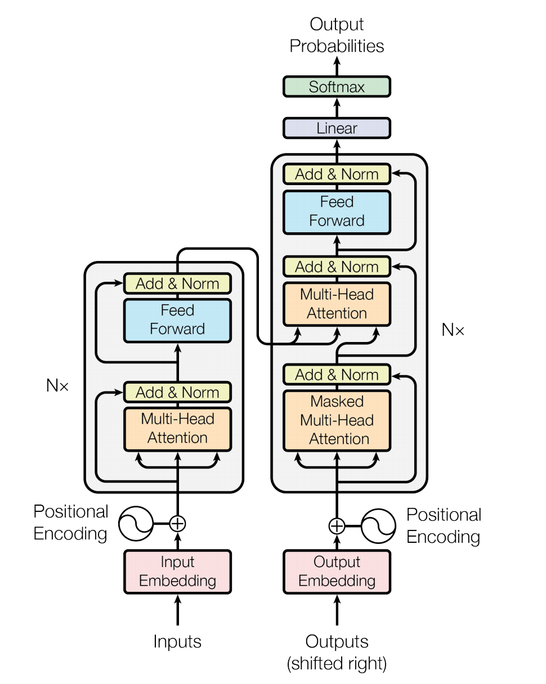

运行本目录下的程序示例需要使用 PaddlePaddle 最新的 develop branch 版本。如果您的 PaddlePaddle 安装版本低于此要求，请按照[安装文档](http://www.paddlepaddle.org/docs/develop/documentation/zh/build_and_install/pip_install_cn.html)中的说明更新 PaddlePaddle 安装版本。

---

## Transformer

以下是本例的简要目录结构及说明：

```text
.
├── images               # README 文档中的图片
├── optim.py             # learning rate scheduling 计算程序
├── infer.py             # 预测脚本
├── model.py             # 模型定义
├── reader.py            # 数据读取接口
├── README.md            # 文档
├── train.py             # 训练脚本
└── config.py            # 训练、预测以及模型参数配置
```

### 简介

Transformer 是论文 [Attention Is All You Need](https://arxiv.org/abs/1706.03762) 中提出的用以完成机器翻译（machine translation, MT）等序列到序列（sequence to sequence, Seq2Seq）学习任务的一种全新网络结构，其完全使用注意力（Attention）机制来实现序列到序列的建模[1]。

相较于此前 Seq2Seq 模型中广泛使用的循环神经网络（Recurrent Neural Network, RNN），使用（Self）Attention 进行输入序列到输出序列的变换主要具有以下优势：

- 计算复杂度小
  - 特征维度为 d 、长度为 n 的序列，在 RNN 中计算复杂度为 `O(n * d * d)` （n 个时间步，每个时间步计算 d 维的矩阵向量乘法），在 Self-Attention 中计算复杂度为 `O(n * n * d)` （n 个时间步两两计算 d 维的向量点积或其他相关度函数），n 通常要小于 d 。
- 计算并行度高
  - RNN 中当前时间步的计算要依赖前一个时间步的计算结果；Self-Attention 中各时间步的计算只依赖输入不依赖之前时间步输出，各时间步可以完全并行。
- 容易学习长程依赖（long-range dependencies）
  - RNN 中相距为 n 的两个位置间的关联需要 n 步才能建立；Self-Attention 中任何两个位置都直接相连；路径越短信号传播越容易。

这些也在机器翻译任务中得到了印证，Transformer 模型在训练时间大幅减少的同时取得了 WMT'14 英德翻译任务 BLEU 值的新高。此外，Transformer 在应用于成分句法分析（Constituency Parsing）任务时也有着不俗的表现，这也说明其具有较高的通用性，容易迁移到其他应用场景中。这些都表明 Transformer 有着广阔的前景。

### 模型概览

Transformer 同样使用了 Seq2Seq 模型中典型的编码器-解码器（Encoder-Decoder）的框架结构，整体网络结构如图1所示。

<p align="center">
 <br />
图 1. Transformer 网络结构图
</p>

Encoder 由若干相同的 layer 堆叠组成，每个 layer 主要由多头注意力（Multi-Head Attention）和全连接的前馈（Feed-Forward）网络这两个 sub-layer 构成。
- Multi-Head Attention 在这里用于实现 Self-Attention，相比于简单的 Attention 机制，其将输入进行多路线性变换后分别计算 Attention 的结果，并将所有结果拼接后再次进行线性变换作为输出。参见图2，其中 Attention 使用的是点积（Dot-Product），并在点积后进行了 scale 的处理以避免因点积结果过大进入 softmax 的饱和区域。
- Feed-Forward 网络会对序列中的每个位置进行相同的计算（Position-wise），其采用的是两次线性变换中间加以 ReLU 激活的结构。

此外，每个 sub-layer 后还施以 Residual Connection [2]和 Layer Normalization [3]来促进梯度传播和模型收敛。

<p align="center">
 <br />
图 2. Multi-Head Attention
</p>

Decoder 具有和 Encoder 类似的结构，只是相比于组成 Encoder 的 layer ，在组成 Decoder 的 layer 中还多了一个 Multi-Head Attention 的 sub-layer 来实现对 Encoder 输出的 Attention，这个 Encoder-Decoder Attention 在其他 Seq2Seq 模型中也是存在的。


### 数据准备

我们以 [WMT'16 EN-DE 数据集](http://www.statmt.org/wmt16/translation-task.html)作为示例，同时参照论文中的设置使用 BPE（byte-pair encoding）[4]编码的数据，使用这种方式表示的数据能够更好的解决未登录词（out-of-vocabulary，OOV）的问题。用到的 BPE 数据可以参照[这里](https://github.com/google/seq2seq/blob/master/docs/data.md)进行下载，下载后解压，其中 `train.tok.clean.bpe.32000.en` 和 `train.tok.clean.bpe.32000.de` 为使用 BPE 的训练数据（平行语料，分别对应了英语和德语，经过了 tokenize 和 BPE 的处理），`newstest2013.tok.bpe.32000.en` 和 `newstest2013.tok.bpe.32000.de` 等为测试数据（`newstest2013.tok.en` 和 `newstest2013.tok.de` 等则为对应的未使用 BPE 的测试数据），`vocab.bpe.32000` 为相应的词典文件（源语言和目标语言共享该词典文件）。

由于本示例中的数据读取脚本 `reader.py` 使用的样本数据的格式为 `\t` 分隔的的源语言和目标语言句子对（句子中的词之间使用空格分隔）， 因此需要将源语言到目标语言的平行语料库文件合并为一个文件，可以执行以下命令进行合并：
```sh
paste -d '\t' train.tok.clean.bpe.32000.en train.tok.clean.bpe.32000.de > train.tok.clean.bpe.32000.en-de
```
此外，下载的词典文件 `vocab.bpe.32000` 中未包含表示序列开始、序列结束和未登录词的特殊符号，可以使用如下命令在词典中加入 `<s>` 、`<e>` 和 `<unk>` 作为这三个特殊符号。
```sh
sed -i '1i\<s>\n<e>\n<unk>' vocab.bpe.32000
```

对于其他自定义数据，遵循或转换为上述的数据格式即可。如果希望在自定义数据中使用 BPE 编码，可以参照[这里](https://github.com/rsennrich/subword-nmt)进行预处理。

### 模型训练

`train.py` 是模型训练脚本，可以执行以下命令进行模型训练：
```sh
python -u train.py \
  --src_vocab_fpath data/vocab.bpe.32000 \
  --trg_vocab_fpath data/vocab.bpe.32000 \
  --special_token '<s>' '<e>' '<unk>' \
  --train_file_pattern data/train.tok.clean.bpe.32000.en-de \
  --use_token_batch True \
  --batch_size 3200 \
  --sort_type pool \
  --pool_size 200000 \
```
上述命令中设置了源语言词典文件路径（`src_vocab_fpath`）、目标语言词典文件路径（`trg_vocab_fpath`）、训练数据文件（`train_file_pattern`，支持通配符）等数据相关的参数和构造 batch 方式（`use_token_batch` 指出数据按照 token 数目或者 sequence 数目组成 batch）等 reader 相关的参数。有关这些参数更详细的信息可以通过执行以下命令查看：
```sh
python train.py --help
```

更多模型训练相关的参数则在 `config.py` 中的 `ModelHyperParams` 和 `TrainTaskConfig` 内定义；`ModelHyperParams` 定义了 embedding 维度等模型超参数，`TrainTaskConfig` 定义了 warmup 步数等训练需要的参数。这些参数默认使用了 Transformer 论文中 base model 的配置，如需调整可以在该脚本中进行修改。另外这些参数同样可在执行训练脚本的命令行中设置，传入的配置会合并并覆盖 `config.py` 中的配置，如可以通过以下命令来训练 Transformer 论文中的 big model ：

```sh
python -u train.py \
  --src_vocab_fpath data/vocab.bpe.32000 \
  --trg_vocab_fpath data/vocab.bpe.32000 \
  --special_token '<s>' '<e>' '<unk>' \
  --train_file_pattern data/train.tok.clean.bpe.32000.en-de \
  --use_token_batch True \
  --batch_size 3200 \
  --sort_type pool \
  --pool_size 200000 \
  n_layer 8 \
  n_head 16 \
  d_model 1024 \
  d_inner_hid 4096 \
  dropout 0.3
```
有关这些参数更详细信息的还请参考 `config.py` 中的注释说明。

训练时默认使用所有 GPU，可以通过 `CUDA_VISIBLE_DEVICES` 环境变量来设置使用的 GPU 数目。在训练过程中，每个 epoch 结束后将保存模型到参数 `model_dir` 指定的目录，每个 iteration 将打印如下的日志到标准输出：
```txt
epoch: 0, batch: 0, sum loss: 258793.343750, avg loss: 11.069005, ppl: 64151.644531
epoch: 0, batch: 1, sum loss: 256140.718750, avg loss: 11.059616, ppl: 63552.148438
epoch: 0, batch: 2, sum loss: 258931.093750, avg loss: 11.064013, ppl: 63832.167969
epoch: 0, batch: 3, sum loss: 256837.875000, avg loss: 11.058206, ppl: 63462.574219
epoch: 0, batch: 4, sum loss: 256461.000000, avg loss: 11.053401, ppl: 63158.390625
epoch: 0, batch: 5, sum loss: 257064.562500, avg loss: 11.019099, ppl: 61028.683594
epoch: 0, batch: 6, sum loss: 256180.125000, avg loss: 11.008556, ppl: 60388.644531
epoch: 0, batch: 7, sum loss: 256619.671875, avg loss: 11.007106, ppl: 60301.113281
epoch: 0, batch: 8, sum loss: 255716.734375, avg loss: 10.966025, ppl: 57874.105469
epoch: 0, batch: 9, sum loss: 245157.500000, avg loss: 10.966562, ppl: 57905.187500
```

### 模型预测

`infer.py` 是模型预测脚本，模型训练完成后可以执行以下命令对指定文件中的文本进行翻译：
```sh
python -u infer.py \
  --src_vocab_fpath data/vocab.bpe.32000 \
  --trg_vocab_fpath data/vocab.bpe.32000 \
  --special_token '<s>' '<e>' '<unk>' \
  --test_file_pattern data/newstest2013.tok.bpe.32000.en-de \
  --batch_size 4 \
  model_path trained_models/pass_20.infer.model \
  beam_size 5
  max_out_len 256
```
和模型训练时类似，预测时也需要设置数据和 reader 相关的参数，并可以执行 `python infer.py --help` 查看这些参数的说明（部分参数意义和训练时略有不同）；同样可以在预测命令中设置模型超参数，但应与模型训练时的设置一致；此外相比于模型训练，预测时还有一些额外的参数，如需要设置 `model_path` 来给出模型所在目录，可以设置 `beam_size` 和 `max_out_len` 来指定 Beam Search 算法的搜索宽度和最大深度（翻译长度），这些参数也可以在 `config.py` 中的 `InferTaskConfig` 内查阅注释说明并进行更改设置。

执行以上预测命令会打印翻译结果到标准输出，每行输出是对应行输入的得分最高的翻译。需要注意，对于使用 BPE 的数据，预测出的翻译结果也将是 BPE 表示的数据，要恢复成原始的数据（这里指 tokenize 后的数据）才能进行正确的评估，可以使用以下命令来恢复 `predict.txt` 内的翻译结果到 `predict.tok.txt` 中。

```sh
sed 's/@@ //g' predict.txt > predict.tok.txt
```

接下来就可以使用参考翻译（这里使用的是 `newstest2013.tok.de`）对翻译结果进行 BLEU 指标的评估了。计算 BLEU 值的一个较为广泛使用的脚本可以从[这里](https://raw.githubusercontent.com/moses-smt/mosesdecoder/master/scripts/generic/multi-bleu.perl)获取，获取后执行如下命令：
```sh
perl multi-bleu.perl data/newstest2013.tok.de < predict.tok.txt
```
可以看到类似如下的结果。
```
BLEU = 25.08, 58.3/31.5/19.6/12.6 (BP=0.966, ratio=0.967, hyp_len=61321, ref_len=63412)
```

### 参考文献

1. Vaswani A, Shazeer N, Parmar N, et al. [Attention is all you need](http://papers.nips.cc/paper/7181-attention-is-all-you-need.pdf)[C]//Advances in Neural Information Processing Systems. 2017: 6000-6010.
2. He K, Zhang X, Ren S, et al. [Deep residual learning for image recognition](http://openaccess.thecvf.com/content_cvpr_2016/papers/He_Deep_Residual_Learning_CVPR_2016_paper.pdf)[C]//Proceedings of the IEEE conference on computer vision and pattern recognition. 2016: 770-778.
3. Ba J L, Kiros J R, Hinton G E. [Layer normalization](https://arxiv.org/pdf/1607.06450.pdf)[J]. arXiv preprint arXiv:1607.06450, 2016.
4. Sennrich R, Haddow B, Birch A. [Neural machine translation of rare words with subword units](https://arxiv.org/pdf/1508.07909)[J]. arXiv preprint arXiv:1508.07909, 2015.
