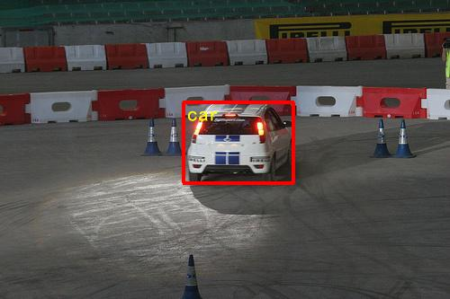
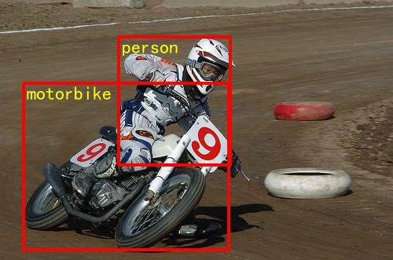
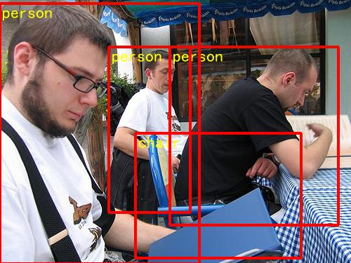

The minimum PaddlePaddle version needed for the code sample in this directory is the lastest develop branch. If you are on a version of PaddlePaddle earlier than this, [please update your installation](http://www.paddlepaddle.org/docs/develop/documentation/en/build_and_install/pip_install_en.html).

---

## SSD Object Detection

### Introduction

[Single Shot MultiBox Detector (SSD)](https://arxiv.org/abs/1512.02325) framework for object detection can be categorized as a single stage detector. A single stage detector simplifies object detection as a regression problem, which directly predicts the bounding boxes and class probabilities without region proposal. SSD further makes improves by producing these predictions of different scales from different layers, as shown below. SSD can be applied to a wide variant standard convolutional network for image classification, such as VGG, ResNet, or MobileNet, which is also called base network or backbone. In this tutorial we used [MobileNet](https://arxiv.org/abs/1704.04861).
<p align="center">
 <br />
The Single Shot MultiBox Detector (SSD)
</p>
### Data Preparation

You can use [PASCAL VOC dataset](http://host.robots.ox.ac.uk/pascal/VOC/) or [MS-COCO dataset](http://cocodataset.org/#download).

#### PASCAL VOC Dataset

If you want to train model on PASCAL VOC dataset, please download datset at first, skip this step if you already have one.

```bash
cd data/pascalvoc
./download.sh
```

The command `download.sh` also will create training and testing file lists.

#### MS-COCO Dataset

If you want to train model on MS-COCO dataset, please download datset at first, skip this step if you already have one.

```
cd data/coco
./download.sh
```

### Train

#### Download the Pre-trained Model.

We provide two pre-trained models. The one is MobileNet-v1 SSD trained on COCO dataset, but removed the convolutional predictors for COCO dataset. This model can be used to initialize the models when training other dataset, like PASCAL VOC. Then other pre-trained model is MobileNet v1 trained on ImageNet 2012 dataset, but removed the last weights and bias in Fully-Connected layer.

Declaration: the MobileNet-v1 SSD model is converted by [TensorFlow model](https://github.com/tensorflow/models/blob/f87a58cd96d45de73c9a8330a06b2ab56749a7fa/research/object_detection/g3doc/detection_model_zoo.md). The MobileNet v1 model is converted [Caffe](https://github.com/shicai/MobileNet-Caffe).

  - Download MobileNet-v1 SSD:
    ```
    ./pretrained/download_coco.sh
    ```
  - Download MobileNet-v1:
    ```
    ./pretrained/download_imagenet.sh
    ```

#### Train on PASCAL VOC
train.py is the main caller of the training module. Examples of usage are shown below.
  ```python
  python -u train.py --batch_size=64 --dataset='pascalvoc' --pretrained_model='pretrained/ssd_mobilenet_v1_coco/'
  ```
   - Set ```env CUDA_VISIBLE_DEVICES=0,1``` to specifiy the number of GPU you want to use.
   - Set ```--dataset='coco2014'``` or ```--dataset='coco2017'``` to train model on MS COCO dataset.
   - For more configurations, see the arguments list in train.py.

### Evaluate

You can evaluate your trained model in different metric like 11point, integral on both PASCAL VOC and COCO dataset.  Note we set the defualt test list to the dataset's test/val list, you can use your own test list by setting ```--test_list``` args.

eval.py is the main caller of the evaluating module. Examples of usage are shown below.
```python
python eval.py --dataset='pascalvoc' --model_dir='train_pascal_model/best_model' --data_dir='data/pascalvoc' --test_list='test.txt' --ap_version='11point' --nms_threshold=0.45
```

You can set ```--dataset``` to ```coco2014``` or ```coco2017``` to evaluate cococ dataset. Moreover, we provide eval_coco_map.py which uses a COCO-specific mAP metric defined by [COCO committee](http://cocodataset.org/#detections-eval). To use this eval_coco_map.py, [cocoapi](https://github.com/cocodataset/cocoapi) is needed.
Install the cocoapi:
```
# COCOAPI=/path/to/clone/cocoapi
git clone https://github.com/cocodataset/cocoapi.git $COCOAPI
cd $COCOAPI/PythonAPI
# Install into global site-packages
make install
# Alternatively, if you do not have permissions or prefer
# not to install the COCO API into global site-packages
python2 setup.py install --user
```

### Infer and Visualize
infer.py is the main caller of the infering module. Examples of usage are shown below.
```python
python infer.py --dataset='pascalvoc' --nms_threshold=0.45 --model_dir='train_pascal_model/best_model' --image_path='./data/pascalvoc/VOCdevkit/VOC2007/JPEGImages/009963.jpg'
```
Below is the examples after running python infer.py to inference and visualize the model result.
<p align="center">



 <br />
MobileNet-SSD300x300 Visualization Examples
</p>


### Released Model


| Model                    | Pre-trained Model  | Training data    | Test data    | mAP |
|:------------------------:|:------------------:|:----------------:|:------------:|:----:|
|MobileNet-v1-SSD 300x300  | COCO MobileNet SSD | VOC07+12 trainval| VOC07 test   | xx%  |
|MobileNet-v1-SSD 300x300  | ImageNet MobileNet | VOC07+12 trainval| VOC07 test   | xx%  |
|MobileNet-v1-SSD 300x300  | ImageNet MobileNet | MS-COCO trainval | MS-COCO test | xx%  |

