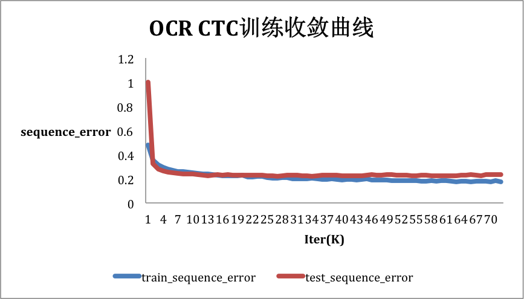

运行本目录下的程序示例需要使用PaddlePaddle develop最新版本。如果您的PaddlePaddle安装版本低于此要求，请按照安装文档中的说明更新PaddlePaddle安装版本。

# Optical Character Recognition

这里将介绍如何在PaddlePaddle Fluid下使用CRNN-CTC 和 CRNN-Attention模型对图片中的文字内容进行识别。

## 1. CRNN-CTC

本章的任务是识别含有单行汉语字符图片，首先采用卷积将图片转为特征图, 然后使用`im2sequence op`将特征图转为序列，通过`双向GRU`学习到序列特征。训练过程选用的损失函数为CTC(Connectionist Temporal Classification) loss，最终的评估指标为样本级别的错误率。

本路径下各个文件的作用如下：

- **ctc_reader.py :** 下载、读取、处理数据。提供方法`train()` 和 `test()` 分别产生训练集和测试集的数据迭代器。
- **crnn_ctc_model.py :** 在该脚本中定义了训练网络、预测网络和evaluate网络。
- **ctc_train.py :** 用于模型的训练，可通过命令`python train.py --help` 获得使用方法。
- **infer.py :** 加载训练好的模型文件，对新数据进行预测。可通过命令`python infer.py --help` 获得使用方法。
- **eval.py :** 评估模型在指定数据集上的效果。可通过命令`python infer.py --help` 获得使用方法。
- **utility.py :** 实现的一些通用方法，包括参数配置、tensor的构造等。


### 1.1 数据

数据的下载和简单预处理都在`ctc_reader.py`中实现。

#### 1.1.1 数据格式

我们使用的训练和测试数据如`图1`所示，每张图片包含单行不定长的中文字符串，这些图片都是经过检测算法进行预框选处理的。

<p align="center">
 <br/>
<strong>图 1</strong>
</p>

在训练集中，每张图片对应的label是汉字在词典中的索引。 `图1` 对应的label如下所示：
```
3835,8371,7191,2369,6876,4162,1938,168,1517,4590,3793
```
在上边这个label中，`3835` 表示字符‘两’的索引，`4590` 表示中文字符逗号的索引。


#### 1.1.2 数据准备

**A. 训练集**

我们需要把所有参与训练的图片放入同一个文件夹，暂且记为`train_images`。然后用一个list文件存放每张图片的信息，包括图片大小、图片名称和对应的label，这里暂记该list文件为`train_list`，其格式如下所示：

```
185 48 00508_0215.jpg 7740,5332,2369,3201,4162
48 48 00197_1893.jpg 6569
338 48 00007_0219.jpg 4590,4788,3015,1994,3402,999,4553
150 48 00107_4517.jpg 5936,3382,1437,3382
...
157 48 00387_0622.jpg 2397,1707,5919,1278
```

<center>文件train_list</center>

上述文件中的每一行表示一张图片，每行被空格分为四列，前两列分别表示图片的宽和高，第三列表示图片的名称，第四列表示该图片对应的sequence label。
最终我们应有以下类似文件结构：

```
|-train_data
    |- train_list
    |- train_imags
        |- 00508_0215.jpg
        |- 00197_1893.jpg
        |- 00007_0219.jpg
        | ...
```

在训练时，我们通过选项`--train_images` 和 `--train_list` 分别设置准备好的`train_images` 和`train_list`。


>**注：** 如果`--train_images` 和 `--train_list`都未设置或设置为None， ctc_reader.py会自动下载使用[示例数据](http://paddle-ocr-data.bj.bcebos.com/data.tar.gz)，并将其缓存到`$HOME/.cache/paddle/dataset/ctc_data/data/` 路径下。


**B. 测试集和评估集**

测试集、评估集的准备方式与训练集相同。
在训练阶段，测试集的路径通过train.py的选项`--test_images` 和 `--test_list` 来设置。
在评估时，评估集的路径通过eval.py的选项`--input_images_dir` 和`--input_images_list` 来设置。

**C. 待预测数据集**

预测支持三种形式的输入：

第一种：设置`--input_images_dir`和`--input_images_list`, 与训练集类似, 只不过list文件中的最后一列可以放任意占位字符或字符串，如下所示：

```
185 48 00508_0215.jpg s
48 48 00197_1893.jpg s
338 48 00007_0219.jpg s
...
```

第二种：仅设置`--input_images_list`, 其中list文件中只需放图片的完整路径，如下所示：

```
data/test_images/00000.jpg
data/test_images/00001.jpg
data/test_images/00003.jpg
```

第三种：从stdin读入一张图片的path，然后进行一次inference.

#### 1.2 训练

使用默认数据在GPU单卡上训练:

```
env CUDA_VISIABLE_DEVICES=0 python ctc_train.py
```

使用默认数据在GPU多卡上训练:

```
env CUDA_VISIABLE_DEVICES=0,1,2,3 python ctc_train.py --parallel=True
```

执行`python ctc_train.py --help`可查看更多使用方式和参数详细说明。

图2为使用默认参数和默认数据集训练的收敛曲线，其中横坐标轴为训练迭代次数，纵轴为样本级错误率。其中，蓝线为训练集上的样本错误率，红线为测试集上的样本错误率。在45轮迭代训练中，测试集上最低错误率为第60轮的21.11%.

<p align="center">
 <br/>
<strong>图 2</strong>
</p>


### 1.3 评估

通过以下命令调用评估脚本用指定数据集对模型进行评估：

```
env CUDA_VISIBLE_DEVICE=0 python eval.py \
    --model_path="./models/model_0" \
    --input_images_dir="./eval_data/images/" \
    --input_images_list="./eval_data/eval_list\" \
```

执行`python ctc_train.py --help`可查看参数详细说明。


### 1.4 预测

从标准输入读取一张图片的路径，并对齐进行预测：

```
env CUDA_VISIBLE_DEVICE=0 python infer.py \
    --model_path="models/model_00044_15000"
```

执行上述命令进行预测的效果如下：

```
-----------  Configuration Arguments -----------
use_gpu: True
input_images_dir: None
input_images_list: None
model_path: /home/work/models/fluid/ocr_recognition/models/model_00052_15000
------------------------------------------------
Init model from: ./models/model_00052_15000.
Please input the path of image: ./test_images/00001_0060.jpg
result: [3298 2371 4233 6514 2378 3298 2363]
Please input the path of image: ./test_images/00001_0429.jpg
result: [2067 2067 8187 8477 5027 7191 2431 1462]
```

从文件中批量读取图片路径，并对其进行预测：

```
env CUDA_VISIBLE_DEVICE=0 python infer.py \
    --model_path="models/model_00044_15000" \
    --input_images_list="data/test.list"
```

>注意：因为版权原因，我们暂时停止提供中文数据集的下载和使用服务，你通过`ctc_reader.py`自动下载的数据将是含有30W图片的英文数据集。在英文数据集上的训练结果会稍后发布。
