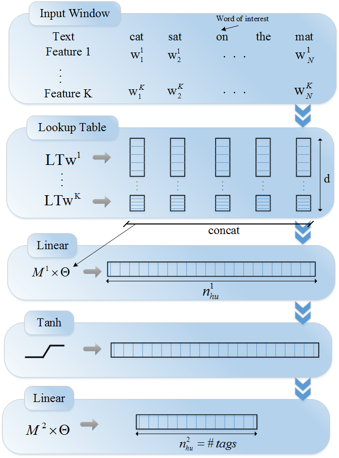
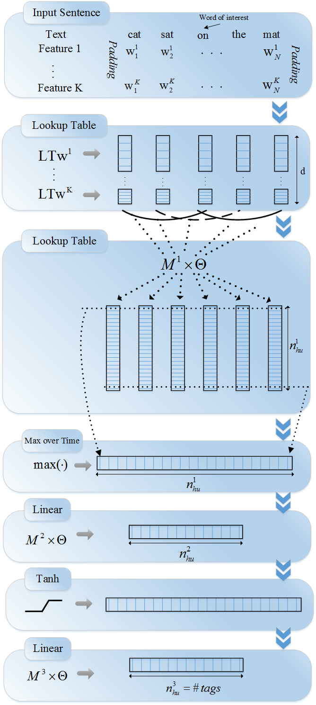

PaddlePaddle v0.11.0 and above version should be used to run the program sample under this directory. If your PaddlePaddle installation version is lower than this requirement, please update PaddlePaddle installation version according to descriptions in [installation file](http://www.paddlepaddle.org/docs/develop/documentation/zh/build_and_install/pip_install_cn.html)

---

# Text labeling

The followings are the files included in this directory and corresponding descriptions:

```text
.
├── images              # Images in the document
│   ├── window_net.png
│   └── sentence_net.png
├── infer.py            # Inferred script
├── network_conf.py     # All kinds of network structures involved in this sample are defined in this file. To further modify model structure, please view this file
├── reader.py           # Read data interface. If data of user-defined format are used, please view this file
├── README.cn.md        # Chinese Document
├── README.md           # English Document
├── run.sh              # Training task running script, directly run this scrip, and training task will be started with default parameters
├── train.py            # Training script
└── utils.py            # Define util functions, such as print logs, analyze command line parameter, construct a dictionary, load a dictionary, etc.
```

## Introduction
Text part-of-speech (POS) labeling, named entity recognition (NER) and semantic role labeling (SRL) tasks constitute one category of basic labeling tasks of a natural language.
According to one given text sequence, judging attributes of parts in this text sequence is an important basic task in the field natural language processing.
Default task of this model is text POS labeling, traditional Brown Corpus is used, and the process is as below:
1. Download corpus
2. Cleaning and labeling
3. Model design
4. Evaluation of model learning effect

Well trained classifier can **automatically judge** POS of parts in the emerging text sequence. The above process is also a conventional process which should be abode by in order to complete a new text POS labeling task. It can be seen that enormous advantage of deep learning method lies in: **eliminating complicated feature design, only needing basic cleaning and labeling of the original text. **

“No Free Lunch (NFL)” is one of basic principles of machine learning task: no single model is superior to other models by nature. Model design and selection are based on an understanding of different model characteristics, but it is also a multiple experimental evaluation process.

This sample is based on research results of Ronan Collobert et al. [Natural Language Processing (almost) from Scratch](https://arxiv.org/abs/1103.0398) who proposed two model structures for text sequence analysis.

## Detailed model descriptions

The following models are contained in`network_conf.py` :
1. `window_net`：Window approach network model is a global linear model. Basic full-connected structure.
2. `sentence_net`：Sentence approach network model is a basic sequence model. CNN structure is used and features between local regions are considered.
Some features of the two models are summarized as follows, and for detailed contents, please refer to [Natural Language Processing (almost) from Scratch](https://arxiv.org/abs/1103.0398):


### 1. Window approach network model

**Window approach network model structure is shown in the following figure: **
<p align="center">
<br/>
Fig. 1 Window approach network
</p>

The code used to realize this Window approach network structure in PaddlePaddle is seen in  `window_net` function in `network_conf.py` , and the model is mainly divided into the following parts:
- **Word vector layer**: for the sake of better expression of the semantic relation between different words, words are firstly transformed into vectors of fixed dimensions. After training is completed, semantic similarity between words can be expressed by distance between their word vectors. The greater the semantic similarity, the closer the distance. For more information about word vectors, please refer to the [word vectors](https://github.com/PaddlePaddle/book/tree/develop/04.word2vec) section in PaddleBook.
- **Intermediate linear hidden connection layer**：word vector layer of fixed size is put under linear transformation, the hidden layer is full-connected structure and activation function is used.
- **Full-connected layer and output layer**：quantity of nerve cells at output layer is consistent with quantity of sample categories, for sample, in dichotomy problem, there will be 2 nerve cells at output layer. Through the Softmax activation function, output results present normalized probability distribution and their sum is 1, so output of the $i$(th) nerve cell can be considered as the predicting probability for the sample to belong to the $i$ category.

The Window approach network model conducts multi-classification of input corpus by default (`class_dim=N`, number of POSs), default embedding (word vector) dimension is 32 (`emd_dim=32`), and all hidden layers use tanh activation function. It’s noteworthy that input data of this model are integer sequences of fixed window sizes but not original word sequences. In fact, for processing convenience, id(s) will be given to words in advance in order of word frequencies, namely transforming words into serial numbers in a dictionary.

### 2. Sentence approach network model

**Sentence approach network model structure is shown in the following figure:**

<p align="center">
<br/>
Fig. 2 Sentence approach network
</p>

The code used to realize this Sentence approach network structure through PaddlePaddle is seen in `sentence_net` function in  `network_conf.py` , and the model is mainly divided into the following parts:

- **Word vector layer**：similar to effect of word vector layer in Window approach network, words are transformed into vectors of fixed dimensions, distance between vectors is used to express semantic correlation between words. As shown in Fig. 2, the obtained word vectors are defined as row vectors, and row vectors generated by all words in the corpus are spliced together to form a matrix. It’s assumed that dimension of word vector is 5, window width is set as 7, it can be obtained that the sentence “The cat sat on the read mat” contains 7 words, and then obtained matrix dimension is 7*5. For more information about word vectors, please refer to the section [word vector](https://github.com/PaddlePaddle/book/tree/develop/04.word2vec) in PaddleBook.

- **Convolutional layer**：convolution is implemented on time sequence in text classification, namely matrixes output by width of convolutional kernel and word vector layer are consistent, and convolution is implemented along height direction of the matrix. The convolutional result is called feature map. It’s assumed that height of convolutional kernel is $h$, matrix height is $N$, convolutional step length is 1, and then obtained feature map is a vector with height being $N+1-h$. Convolutional kernels of different heights can be simultaneously used to obtain multiple feature maps.

- **Maximum pooling layer**: maximum pooling operation is carried out for feature maps obtained through convolution respectively. As feature maps themselves are vectors, maximum pooling here refers to selecting maximum elements in vectors simply. Maximum elements are spliced together to form a new vector. Obviously, dimension of this vector is equivalent to quantity of feature maps namely quantity of convolutional kernels. For sample, it’s assumed that four different convolutional kernels are used, feature maps generated through convolution are:  `[2,3,5]`, `[8,2,1]`, `[5,7,7,6]`  and `[4,5,1,8]` respectively. Due to height difference of convolutional kernels, sizes of generated feature maps are somewhat different. Maximum pooling is implemented on the four feature maps respectively and results are `[5]`, `[8]`, `[7]` and `[8]` respectively, and pooling results are spliced together to obtain `[5,8,7,8]`.
- **Intermediate linear hidden connection layer**：Linear transformation of maximum pooling result through the full-connected layer and activation function is used.
- **Full-connected layer and output layer**：maximum pooling result is output through full-connected layer. Similar to DNN model, number of nerve cells at output layer is consistent with quantity of sample categories, and output sum is 1.
Input data type of Sentence approach network is consistent with Window approach network. Encapsulated convolutional module containing pooling text sequence in PaddlePaddle: `paddle.fluid.nets.sequence_conv_pool`, which can be directly called.  `filter_size` parameter of this module is used to designate text length covered by convolutional kernel at the same time, namely width of convolutional kernels in Fig. 2. `num_filters` is used to designate quantity of convolutional kernels of this type. 64 convolutional kernels with sizes being 3 are used by the code in this sample by default, convolutional results generate a 64-dimensional vector after maximum pooling, and the vector outputs final prediction result through a full-connected layer.
## Running with built-in data in PaddlePaddle
### How to train

The following `sh run.sh` commands are executed at terminal, this sample is run directly through classical sequence labeling data set `Brown Corpus` , and the following outputs can be observed:
```text
pass_id: 0, batch 1000, avg_acc: 0.383523, avg_cost: 2.697843
pass_id: 0, batch 2000, avg_acc: 0.562102, avg_cost: 1.937032
pass_id: 0, batch 3000, avg_acc: 0.658544, avg_cost: 1.514453
pass_id: 0, batch 4000, avg_acc: 0.716570, avg_cost: 1.254184
pass_id: 0, batch 5000, avg_acc: 0.754566, avg_cost: 1.081084
pass_id: 0, batch 6000, avg_acc: 0.781755, avg_cost: 0.955819
pass_id: 0, batch 7000, avg_acc: 0.802003, avg_cost: 0.863187
...
```
Logs are output once every other 1,000 batches, and output information includes: (1) Pass number; (2) Batch number; (3) evaluation results of evaluation indexs on current Batch are output in succession. Evaluation indexes are designated in configuration of network topology. In the above output, accuracy of training sample set and cost index are output.
### How to predict

The model is saved under the current working directory by default after training,  `python infer.py` is executed at terminal, and it’s predicted that the scrip will load trained model for prediction.
- `Brown Corpus`train data are used in loading process by default to train a model output by Pass so as to test `Brown Corpus`test

The following outputs will be seen:
```text
s_POS = from/in Kansas/np-tl City/nn-tl Before/in his/pp$ departure/nn ,/, a/at group/nn of/in his/pp$ friends/nns ,/, the/at Reverend/np <UNK>/np among/in them/ppo ,/, had/hvd given/vbn him/ppo a/at luncheon/nn ,/, and/cc <UNK>/np had/hvd seen/vbn advance/nn sheets/nns of/in
p_POS = from/in Kansas/np City/nn-tl Before/in his/pp$ departure/nn ,/, a/at group/nn of/in his/pp$ friends/nns ,/, the/at Reverend/np <UNK>/np among/in them/ppo ,/, had/hvd given/vbn him/ppo a/at luncheon/nn ,/, and/cc <UNK>/np had/hvd seen/vbn advance/nn sheets/nns of/in

```

Each two row in the output log is prediction result of a sample. There are 2 rows isolated by `--`, respectively being: (1) input text,s_POS(source POS); (2) output text,p_POS(prediction POS).
## Training and prediction with self-defining data
### How to train
1. Data organization
    It’s assumed that training data of the following format exist: each row is a sample, isolated by spacing, and each item after isolation is isolated into two parts by "/", the first part is word and the second part is tag. The following are two sample data:
    ```
    The/at old-time/jj bridges/nns over/in the/at Merrimac/np-tl River/nn-tl in/in Massachusetts/np are/ber of/in unusual/jj interest/nn in/in many/ap respects/nns ./.
    For/in their/pp$ length/nn ,/, their/pp$ types/nns of/in construction/nn ,/, their/pp$ picturesque/jj settings/nns ,/, and/cc their/pp$ literary/jj associations/nns ,/, they/ppss should/md be/be known/vbn and/cc remembered/vbn ./.
    ```

2. Interface of reading data
Read interface for self-defining data only needs to compile a Python generator to implement the logic of “analyze a training sample in original input text”.

- For details, please view `reader.py` script under the directory in this sample, and `reader.py` provides all codes to read test data.

    Next, data reader function  `train_reader` is transmitted to `paddle.batch` interface in  `train.py` script as a parameter, and then self-defining data interface can be used to read data, and calling way is as following:
    ```python
    train_reader = paddle.batch(
            paddle.reader.shuffle(
                reader.train_reader(train_data_dir, word_dict, lbl_dict),
                buf_size=1000),
            batch_size=batch_size)
    ```

3. Modify command line arguments

    - If data are organized into the same format of sample data, it’s only necessary to modify `train.py` starting arguments in `run.sh` script and designate `nn_type` arguments, then this sample can be directly run, and it’s unnecessary to modify data reader interface  `reader.py`.
    - Detailed descriptions of starting parameters in `train.py` script can be acquired by executing `python train.py --help` , and main parameters are as follows:
        - `nn_type`：select the model to be used, “window” or “sentence” is now supported.
        - `train_data_dir`：designate the folder where training data are located, self-defining data are used for training, and this arguments must be designated, or otherwise `Brown corpus` in the network should be used for training, and `test_data_dir`, `word_dict` and `label_dict` are default arguments.
        - `test_data_dir`：designate the fold where test data are located, if not, test will not be implemented unless default corpus is used.
        - `word_dict`：the path where dictionary file is located, if not designated, statistics will be made from training data according to word frequencies to automatically establish the dictionary.
        - `label_dict`：category label dictionary used to label categories of character strings and mapped into serial numbers of integer categories.
        - `batch_size`：forward running and reverse updating of the neural network are implemented after multiple samples are designated.
        - `num_passes`：designate number of training passes.

### How to predict

1. Modify the following variables in `infer.py`, designate the used model and test data.
    ```python
    model_dir = "./models/sentence_epoch0"  # Designate the directory where infer model is located
    test_data_dir = "./data/brown/test"      # Designate the directory where the test file is located
    word_dict_path = "./data/brown/default_word.dict"     # Designate the path where the dictionary is located
    label_dict_path = "./data/brown/default_label.dict"    # Designate the path where category label dictionary is located
    ```
3. Execute `python infer.py` at terminal.

# Reference
[1] Collobert R, Weston J, Karlen M, et al. Natural Language Processing (Almost) from Scratch[J]. Journal of Machine Learning Research, 2011, 12(1):2493-2537.
