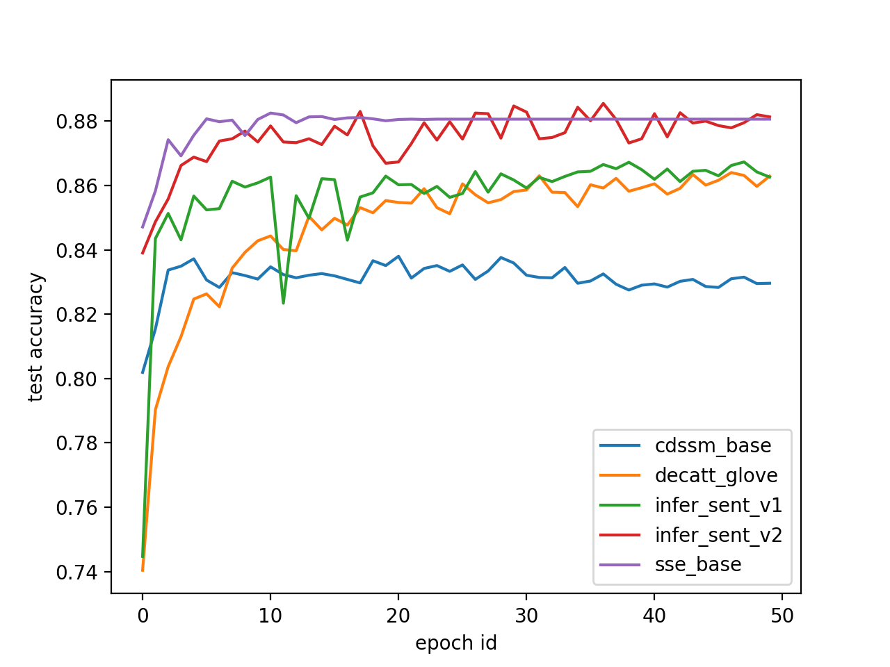

# Text matching on Quora qestion-answer pair dataset

## contents

* [Introduction](#introduction)
  * [a brief review of the Quora Question Pair (QQP) Task](#a-brief-review-of-the-quora-question-pair-qqp-task)
  * [Our Work](#our-work)
* [Environment Preparation](#environment-preparation)
  * [Install Fluid release 1.0](#install-fluid-release-10)
    * [cpu version](#cpu-version)
    * [gpu version](#gpu-version)
    * [Have I installed Fluid successfully?](#have-i-installed-fluid-successfully)
* [Prepare Data](#prepare-data)
* [Train and evaluate](#train-and-evaluate)
* [Models](#models)
* [Results](#results)


## Introduction

### a brief review of the Quora Question Pair (QQP) Task

[Quora Pair Dataset](https://data.quora.com/First-Quora-Dataset-Release-Question-Pairs) is a dataset of 400,000 question pairs from the [Quora forum](https://www.quora.com/), where people raise questions for the others to answer. Each sample in the dataset consists of two English questions and a label represent whether the two questions are duplicate. The dataset is well annotated by human. 

Below are two samples of the dataset. The last clolmn indicates whether the two questions are duplicate (1) or not(0).

|id | qid1 | qid2| question1| question2| is_duplicate
|:---:|:---:|:---:|:---:|:---:|:---:|
|0 |1 |2 |What is the step by step guide to invest in share market in india? |What is the step by step guide to invest in share market? |0|
|1 |3 |4 |What is the story of Kohinoor (Koh-i-Noor) Diamond? | What would happen if the Indian government stole the Kohinoor (Koh-i-Noor) diamond back? |0|

 A [kaggle competition](https://www.kaggle.com/c/quora-question-pairs#description) is held base on this dataset in 2017. The kaggler is able to reach the train_data(with label) and the test_data(without label), and is requested to make predictions on the test_data. The predictions are evaluated by the log-likelihood loss on the test_data.

The kaggle competition has inspired lots of effective work. However, most of the models are rule-based, thus are hard to transfer to new tasks. Researchers keep seeking for more general models that works well on this task and the other NLP(Natual Language Processing) tasks.

[Wang et al.](https://arxiv.org/abs/1702.03814) proposed the BIMPM(Bilateral Multi-Perspective Matching) model based on the Quora Question Pair dataset. They splited the original dataset to [3 part](https://drive.google.com/file/d/0B0PlTAo--BnaQWlsZl9FZ3l1c28/view?usp=sharing): train.tsv(384,348 samples), dev.tsv(10,000 samples) and test.tsv(10,000 samples). The class distribution in train.tsv is unbalanced(37% positive, 63% negative). But the class distribution in dev.tsv and test.tsv is balanced(50% positive and 50% negetive). We follow this split in our experiments. 

### Our Work

Based on the Quora Question Pair Dataset, we will implement some classic models in the area of the NLU(Neraul Lanuage Understanding). The prediction results will be evaluated by accuracy on the test.tsv, like [Wang et al.](https://arxiv.org/abs/1702.03814).

## Environment Preparation

### Install Fluid release 1.0

You can follow the fluid's [official document](http://www.paddlepaddle.org/documentation/docs/en/1.0/build_and_install/pip_install_en.html) to install the fluid. 

[Attention] You are supposed to install python and pip before installing fluid

#### cpu version

```
pip install paddlepaddle==1.0.1
```

#### gpu version

Assume you have downloaded cuda(cuda9.0) and cudnn(cudnn7) lib, here is an expample:

```shell

pip install paddlepaddle-gpu==1.0.1.post97

```

### Have I installed Fluid successfully?

You can run the following script in your command line:

```shell
python -c "import paddle"
```

Fluid is installed successfully if no error message is prompted. If you get any error, feel free to open issues under the [PaddlePaddle repository](https://github.com/PaddlePaddle/Paddle/issues). 

## Prepare Data

Please download the Quora dataset firstly from [google drive](https://drive.google.com/file/d/0B0PlTAo--BnaQWlsZl9FZ3l1c28/view?usp=sharing)
 to $HOME/.cache/paddle/dataset and unzip it.

Then run the data/prepare_quora_data.sh to download the pretrained word2vec embedding file: glove.840B.300d.zip:

```shell
sh data/prepare_quora_data.sh   
```

Finally, The dataset dir($HOME/.cache/paddle/dataset) should be like

```shell

$HOME/.cache/paddle/dataset
    |- Quora_question_pair_partition
        |- train.tsv
        |- test.tsv
        |- dev.tsv
        |- readme.txt
        |- wordvec.txt
    |- glove.840B.300d.txt
```

## Train and evaluate

We provide multiple models and configs, details are shown in `models` and `configs` directory. For quick start, you can run the cdssmNet with cdssm_base config:

```shell
python train_and_evaluate.py  \
    --model_name=cdssmNet  \
    --config=cdssm_base
```

You are supposed to get log like cdssm_base.log

All configs used in our experiments:

|Model|Config|command
|:----:|:----:|:----:|
|cdssmNet|cdssm_base|python train_and_evaluate.py  --model_name=cdssmNet  --config=cdssm_base
|DecAttNet|decatt_glove|python train_and_evaluate.py --model_name=DecAttNet  --config=decatt_glove
|InferSentNet|infer_sent_v1|python train_and_evaluate.py --model_name=InferSentNet --config=infer_sent_v1
|InferSentNet|infer_sent_v2|python train_and_evaluate.py --model_name=InferSentNet --config=infer_sent_v1
|SSENet|sse_base|python train_and_evaluate.py  --model_name=SSENet  --config=sse_base

## Models

We have implemeted 4 models for now, CDSSM(Convolutional Deep Structured Semantic Models) is a convolution-based model, Infer Sent Model and SSE(Shortcut-Stacked Encoders) are RNN-based models， and DecAtt(Decompose Attention) model is an attention-based model. 

|Model|features|Context Encoder|Match Layer|Classification Layer
|:----:|:----:|:----:|:----:|:----:|
|CDSSM|word|1 layer conv1d|concatenation|MLP
|DecAtt|word|Attention|concatenation|MLP
|InferSent|word|1 layer Bi-LSTM|concatenation/element-wise product/<br>absolute element-wise difference|MLP
|SSE|word|3 layer Bi-LSTM|concatenation/element-wise product/<br>absolute element-wise difference|MLP

### CDSSM

```
@inproceedings{shen2014learning,
  title={Learning semantic representations using convolutional neural networks for web search},
  author={Shen, Yelong and He, Xiaodong and Gao, Jianfeng and Deng, Li and Mesnil, Gr{\'e}goire},
  booktitle={Proceedings of the 23rd International Conference on World Wide Web},
  pages={373--374},
  year={2014},
  organization={ACM}
}
```

### InferSent

```
@article{conneau2017supervised,
  title={Supervised learning of universal sentence representations from natural language inference data},
  author={Conneau, Alexis and Kiela, Douwe and Schwenk, Holger and Barrault, Loic and Bordes, Antoine},
  journal={arXiv preprint arXiv:1705.02364},
  year={2017}
}
```

### SSE

```
@article{nie2017shortcut,
  title={Shortcut-stacked sentence encoders for multi-domain inference},
  author={Nie, Yixin and Bansal, Mohit},
  journal={arXiv preprint arXiv:1708.02312},
  year={2017}
}
```

### DecAtt

```
@article{tomar2017neural,
  title={Neural paraphrase identification of questions with noisy pretraining},
  author={Tomar, Gaurav Singh and Duque, Thyago and T{\"a}ckstr{\"o}m, Oscar and Uszkoreit, Jakob and Das, Dipanjan},
  journal={arXiv preprint arXiv:1704.04565},
  year={2017}
}
```

## Results

In our experiment, we found that LSTM-based models outperform convolution-based model in test set accuracy. DecAtt model has fewer parameters than LSTM-based models, but it is very sensitive to the hyper-parameters when training.

|Model|Config|dev accuracy| test accuracy
|:----:|:----:|:----:|:----:|
|cdssmNet|cdssm_base|83.56%|82.83%|
|DecAttNet|decatt_glove|86.31%|86.22%|
|InferSentNet|infer_sent_v1|87.15%|86.62%|
|InferSentNet|infer_sent_v2|88.55%|88.43%|
|SSENet|sse_base|88.35%|88.25%|
 
 
<p align="center"> 

  

</p>
