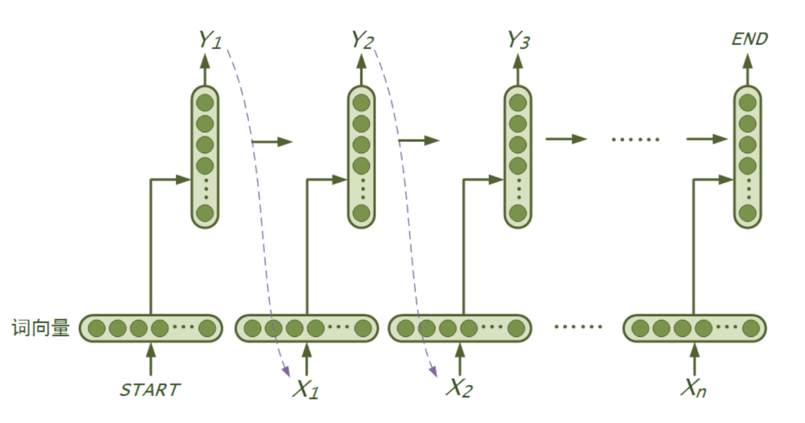

运行本目录下的程序示例需要使用PaddlePaddle v0.10.0 版本。如果您的PaddlePaddle安装版本低于此要求，请按照[安装文档](http://www.paddlepaddle.org/docs/develop/documentation/zh/build_and_install/pip_install_cn.html)中的说明更新PaddlePaddle安装版本。

---

# 使用循环神经网语言模型生成文本

语言模型(Language Model)是一个概率分布模型，简单来说，就是用来计算一个句子的概率的模型。利用它可以确定哪个词序列的可能性更大，或者给定若干个词，可以预测下一个最可能出现的词。语言模型是自然语言处理领域里一个重要的基础模型。

## 应用场景
**语言模型被应用在很多领域**，如：

* **自动写作**：语言模型可以根据上文生成下一个词，递归下去可以生成整个句子、段落、篇章。
* **QA**：语言模型可以根据Question生成Answer。
* **机器翻译**：当前主流的机器翻译模型大多基于Encoder-Decoder模式，其中Decoder就是一个待条件的语言模型，用来生成目标语言。
* **拼写检查**：语言模型可以计算出词序列的概率，一般在拼写错误处序列的概率会骤减，可以用来识别拼写错误并提供改正候选集。
* **词性标注、句法分析、语音识别......**

## 关于本例
本例实现基于RNN的语言模型，以及利用语言模型生成文本，本例的目录结构如下：

```text
.
├── data
│   └── train_data_examples.txt        # 示例数据，可参考示例数据的格式，提供自己的数据
├── config.py    # 配置文件，包括data、train、infer相关配置
├── generate.py  # 预测任务脚本，即生成文本
├── beam_search.py    # beam search 算法实现
├── network_conf.py   # 本例中涉及的各种网络结构均定义在此文件中，希望进一步修改模型结构，请修改此文件
├── reader.py    # 读取数据接口
├── README.md
├── train.py    # 训练任务脚本
└── utils.py    # 定义通用的函数，例如：构建字典、加载字典等
```

## RNN 语言模型
### 简介

RNN是一个序列模型，基本思路是：在时刻$t$，将前一时刻$t-1$的隐藏层输出和$t$时刻的词向量一起输入到隐藏层从而得到时刻$t$的特征表示，然后用这个特征表示得到$t$时刻的预测输出，如此在时间维上递归下去。可以看出RNN善于使用上文信息、历史知识，具有“记忆”功能。理论上RNN能实现“长依赖”（即利用很久之前的知识），但在实际应用中发现效果并不理想，研究提出了LSTM和GRU等变种，通过引入门机制对传统RNN的记忆单元进行了改进，弥补了传统RNN在学习长序列时遇到的难题。本例模型使用了LSTM或GRU，可通过配置进行修改。下图是RNN（广义上包含了LSTM、GRU等）语言模型“循环”思想的示意图：

<p align=center></p>

### 模型实现

本例中RNN语言模型的实现简介如下：

- **定义模型参数**：`config.py`中定义了模型的参数变量。
- **定义模型结构**：`network_conf.py`中的`rnn_lm`**函数**中定义了模型的**结构**，如下：
    - 输入层：将输入的词（或字）序列映射成向量，即词向量层： `embedding`。
    - 中间层：根据配置实现RNN层，将上一步得到的`embedding`向量序列作为输入。
    - 输出层：使用`softmax`归一化计算单词的概率。
    - loss：定义多类交叉熵作为模型的损失函数。
- **训练模型**：`train.py`中的`main`方法实现了模型的训练，实现流程如下：
    - 准备输入数据：建立并保存词典、构建train和test数据的reader。
    - 初始化模型：包括模型的结构、参数。
    - 构建训练器：demo中使用的是Adam优化算法。
    - 定义回调函数：构建`event_handler`来跟踪训练过程中loss的变化，并在每轮训练结束时保存模型的参数。
    - 训练：使用trainer训练模型。

- **生成文本**：`generate.py` 实现了文本的生成，实现流程如下：
    - 加载训练好的模型和词典文件。
    - 读取`gen_file`文件，每行是一个句子的前缀，用[柱搜索算法(Beam Search)](https://github.com/PaddlePaddle/book/blob/develop/08.machine_translation/README.cn.md#柱搜索算法)根据前缀生成文本。
    - 将生成的文本及其前缀保存到文件`gen_result`。

## 使用说明

运行本例的方法如下：

* 1，运行`python train.py`命令，开始train模型（默认使用LSTM），待训练结束。
* 2，运行`python generate.py`运行文本生成。（输入的文本默认为`data/train_data_examples.txt`，生成的文本默认保存到`data/gen_result.txt`中。）


**如果需要使用自己的语料、定制模型，需要修改`config.py`中的配置，细节和适配工作详情如下：**


### 语料适配

* 清洗语料：去除原文中空格、tab、乱码，按需去除数字、标点符号、特殊符号等。
* 内容格式：每个句子占一行；每行中的各词之间使用一个空格符分开。
* 按需要配置`config.py`中的如下参数：

    ```python  
     train_file = "data/train_data_examples.txt"
     test_file = ""

     vocab_file = "data/word_vocab.txt"
     model_save_dir = "models"
    ```
    1. `train_file`：指定训练数据的路径，**需要预先分词**。
    2. `test_file`：指定测试数据的路径，如果训练数据不为空，将在每个 `pass` 训练结束对指定的测试数据进行测试。
    3. `vocab_file`：指定字典的路径，如果字典文件不存在，将会对训练语料进行词频统计，构建字典。
    4. `model_save_dir`：指定模型保存的路径，如果指定的文件夹不存在，将会自动创建。

### 构建字典的策略
- 当指定的字典文件不存在时，将对训练数据进行词频统计，自动构建字典`config.py` 中有如下两个参数与构建字典有关：

    ```python
    max_word_num = 51200 - 2
    cutoff_word_fre = 0
    ```
    1. `max_word_num`：指定字典中含有多少个词。
    2. `cutoff_word_fre`：字典中词语在训练语料中出现的最低频率。
- 假如指定了 `max_word_num = 5000`，并且 `cutoff_word_fre = 10`，词频统计发现训练语料中出现频率高于10次的词语仅有3000个，那么最终会取3000个词构成词典。
- 构建词典时，会自动加入两个特殊符号：
    1. `<unk>`：不出现在字典中的词
    2. `<e>`：句子的结束符

    *注：需要注意的是，词典越大生成的内容越丰富，但训练耗时越久。一般中文分词之后，语料中不同的词能有几万乃至几十万，如果`max_word_num`取值过小则导致`<unk>`占比过高，如果`max_word_num`取值较大，则严重影响训练速度（对精度也有影响）。所以，也有“按字”训练模型的方式，即：把每个汉字当做一个词，常用汉字也就几千个，使得字典的大小不会太大、不会丢失太多信息，但汉语中同一个字在不同词中语义相差很大，有时导致模型效果不理想。建议多试试、根据实际情况选择是“按词训练”还是“按字训练”。*

### 模型适配、训练

* 按需调整`config.py`中如下配置，来修改 rnn 语言模型的网络结果：

    ```python
    rnn_type = "lstm"  # "gru" or "lstm"
    emb_dim = 256
    hidden_size = 256
    stacked_rnn_num = 2
    ```
    1. `rnn_type`：支持 ”gru“ 或者 ”lstm“ 两种参数，选择使用何种 RNN 单元。
    2. `emb_dim`：设置词向量的维度。
    3. `hidden_size`：设置 RNN 单元隐层大小。
    4. `stacked_rnn_num`：设置堆叠 RNN 单元的个数，构成一个更深的模型。

* 运行`python train.py`命令训练模型，模型将被保存到`model_save_dir`指定的目录。

### 按需生成文本

* 按需调整`config.py`中以下变量，详解如下：

    ```python
    gen_file = "data/train_data_examples.txt"
    gen_result = "data/gen_result.txt"
    max_gen_len = 25  # the max number of words to generate
    beam_size = 5
    model_path = "models/rnn_lm_pass_00000.tar.gz"
    ```
    1. `gen_file`：指定输入数据文件，每行是一个句子的前缀，**需要预先分词**。
    2. `gen_result`：指定输出文件路径，生成结果将写入此文件。
    3. `max_gen_len`：指定每一句生成的话最长长度，如果模型无法生成出`<e>`，当生成 `max_gen_len` 个词语后，生成过程会自动终止。
    4. `beam_size`：Beam Search 算法每一步的展开宽度。
    5. `model_path`：指定训练好的模型的路径。

    其中，`gen_file` 中保存的是待生成的文本前缀，每个前缀占一行，形如：

    ```text
    若隐若现 地像 幽灵 , 像 死神
    ```
    将需要生成的文本前缀按此格式存入文件即可；

* 运行`python generate.py`命令运行beam search 算法为输入前缀生成文本，下面是模型生成的结果：

    ```text
    81    若隐若现 地像 幽灵 , 像 死神
    -12.2542    一样 。 他 是 个 怪物 <e>
    -12.6889    一样 。 他 是 个 英雄 <e>
    -13.9877    一样 。 他 是 我 的 敌人 <e>
    -14.2741    一样 。 他 是 我 的 <e>
    -14.6250    一样 。 他 是 我 的 朋友 <e>
    ```
    其中：
    1. 第一行 `81    若隐若现 地像 幽灵 , 像 死神`以`\t`为分隔，共有两列：
        - 第一列是输入前缀在训练样本集中的序号。
        - 第二列是输入的前缀。
    2. 第二 ~ `beam_size + 1` 行是生成结果，同样以 `\t` 分隔为两列：
        - 第一列是该生成序列的对数概率（log probability）。
        - 第二列是生成的文本序列，正常的生成结果会以符号`<e>`结尾，如果没有以`<e>`结尾，意味着超过了最大序列长度，生成强制终止。
