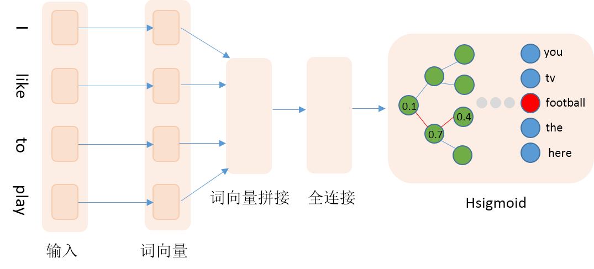

运行本目录下的程序示例需要使用PaddlePaddle v0.10.0 版本。如果您的PaddlePaddle安装版本低于此要求，请按照[安装文档](http://www.paddlepaddle.org/docs/develop/documentation/zh/build_and_install/pip_install_cn.html)中的说明更新PaddlePaddle安装版本。

---

# Hsigmoid加速词向量训练
## 背景介绍
在自然语言处理领域中，传统做法通常使用one-hot向量来表示词，比如词典为['我', '你', '喜欢']，可以用[1,0,0]、[0,1,0]和[0,0,1]这三个向量分别表示'我'、'你'和'喜欢'。这种表示方式比较简洁，但是当词表很大时，容易产生维度爆炸问题；而且任意两个词的向量是正交的，向量包含的信息有限。为了避免或减轻one-hot表示的缺点，目前通常使用词向量来取代one-hot表示，词向量也就是word embedding，即使用一个低维稠密的实向量取代高维稀疏的one-hot向量。训练词向量的方法有很多种，神经网络模型是其中之一，包括CBOW、Skip-gram等，这些模型本质上都是一个分类模型，当词表较大即类别较多时，传统的softmax将非常消耗时间。PaddlePaddle提供了Hsigmoid Layer、NCE Layer，来加速模型的训练过程。本文主要介绍如何使用Hsigmoid Layer来加速训练，词向量相关内容请查阅PaddlePaddle Book中的[词向量章节](https://github.com/PaddlePaddle/book/tree/develop/04.word2vec)。

## Hsigmoid Layer
Hsigmoid Layer引用自论文\[[1](#参考文献)\]，Hsigmoid指Hierarchical-sigmoid，原理是通过构建一个分类二叉树来降低计算复杂度，二叉树中每个叶子节点代表一个类别，每个非叶子节点代表一个二类别分类器。例如我们一共有4个类别分别是0、1、2、3，softmax会分别计算4个类别的得分，然后归一化得到概率。当类别数很多时，计算每个类别的概率非常耗时，Hsigmoid Layer会根据类别数构建一个平衡二叉树，如下：

<p align="center">
  <br/>
图1. （a）为平衡二叉树，（b）为根节点到类别1的路径
</p>

二叉树中每个非叶子节点是一个二类别分类器（sigmoid），如果类别是0，则取左子节点继续分类判断，反之取右子节点，直至达到叶节点。按照这种方式，每个类别均对应一条路径，例如从root到类别1的路径编码为0、1。训练阶段我们按照真实类别对应的路径，依次计算对应分类器的损失，然后综合所有损失得到最终损失。预测阶段，模型会输出各个非叶节点分类器的概率，我们可以根据概率获取路径编码，然后遍历路径编码就可以得到最终预测类别。传统softmax的计算复杂度为N（N为词典大小），Hsigmoid可以将复杂度降至log(N)，详细理论细节可参照论文\[[1](#参考文献)\]。

## 数据准备
### PTB数据
本文采用Penn Treebank (PTB)数据集（[Tomas Mikolov预处理版本](http://www.fit.vutbr.cz/~imikolov/rnnlm/simple-examples.tgz)），共包含train、valid和test三个文件。其中使用train作为训练数据，valid作为测试数据。本文训练的是5-gram模型，即用每条数据的前4个词来预测第5个词。PaddlePaddle提供了对应PTB数据集的python包[paddle.dataset.imikolov](https://github.com/PaddlePaddle/Paddle/blob/develop/python/paddle/v2/dataset/imikolov.py)    ，自动做数据的下载与预处理。预处理会把数据集中的每一句话前后加上开始符号\<s>以及结束符号\<e>，然后依据窗口大小（本文为5），从头到尾每次向右滑动窗口并生成一条数据。如"I have a dream that one day"可以生成\<s> I have a dream、I have a dream that、have a dream that one、a dream that one day、dream that one day \<e>，PaddlePaddle会把词转换成id数据作为预处理的输出。

### 自定义数据
用户可以使用自己的数据集训练模型，自定义数据集最关键的地方是实现reader接口做数据处理，reader需要产生一个迭代器，迭代器负责解析文件中的每一行数据，返回一个python list，例如[1, 2, 3, 4, 5]，分别是第一个到第四个词在字典中的id，PaddlePaddle会进一步将该list转化成`paddle.data_type.inter_value`类型作为data layer的输入，一个封装样例如下：

```python
def reader_creator(filename, word_dict, n):
    def reader():
        with open(filename) as f:
            UNK = word_dict['<unk>']
            for l in f:
                l = ['<s>'] + l.strip().split() + ['<e>']
                if len(l) >= n:
                    l = [word_dict.get(w, UNK) for w in l]
                    for i in range(n, len(l) + 1):
                        yield tuple(l[i - n:i])
    return reader


def train_data(filename, word_dict, n):
    """
    Reader interface for training data.

    It returns a reader creator, each sample in the reader is a word ID tuple.

    :param filename: path of data file
    :type filename: str
    :param word_dict: word dictionary
    :type word_dict: dict
    :param n: sliding window size
    :type n: int
    """
    return reader_creator(filename, word_dict, n)
```

## 网络结构
本文通过训练N-gram语言模型来获得词向量，具体地使用前4个词来预测当前词。网络输入为词在字典中的id，然后查询词向量词表获取词向量，接着拼接4个词的词向量，然后接入一个全连接隐层，最后是`Hsigmoid`层。详细网络结构见图2：

<p align="center">
<br/>
图2. 网络配置结构
</p>

代码如下：

```python
def ngram_lm(hidden_size, embed_size, dict_size, gram_num=4, is_train=True):
    emb_layers = []
    embed_param_attr = paddle.attr.Param(
        name="_proj", initial_std=0.001, learning_rate=1, l2_rate=0)
    for i in range(gram_num):
        word = paddle.layer.data(
            name="__word%02d__" % (i),
            type=paddle.data_type.integer_value(dict_size))
        emb_layers.append(
            paddle.layer.embedding(
                input=word, size=embed_size, param_attr=embed_param_attr))

    target_word = paddle.layer.data(
        name="__target_word__", type=paddle.data_type.integer_value(dict_size))

    embed_context = paddle.layer.concat(input=emb_layers)

    hidden_layer = paddle.layer.fc(
        input=embed_context,
        size=hidden_size,
        act=paddle.activation.Sigmoid(),
        layer_attr=paddle.attr.Extra(drop_rate=0.5),
        bias_attr=paddle.attr.Param(learning_rate=2),
        param_attr=paddle.attr.Param(
            initial_std=1. / math.sqrt(embed_size * 8), learning_rate=1))

    return paddle.layer.hsigmoid(
                input=hidden_layer,
                label=target_word,
                param_attr=paddle.attr.Param(name="sigmoid_w"),
                bias_attr=paddle.attr.Param(name="sigmoid_b"))
```

需要注意在 PaddlePaddle 中，hsigmoid 层将可学习参数存储为一个 `[类别数目 - 1 × 隐层向量宽度]` 大小的矩阵。预测时，需要将 hsigmoid 层替换为全连接运算**并固定以 `sigmoid` 为激活**。预测时输出一个宽度为`[batch_size x 类别数目 - 1]` 维度的矩阵（`batch_size = 1`时退化为一个向量）。矩阵行向量的每一维计算了一个输入向量属于一个内部结点的右孩子的概率。**全连接运算在加载 hsigmoid 层学习到的参数矩阵时，需要对参数矩阵进行一次转置**。代码片段如下：

```python
return paddle.layer.mixed(
    size=dict_size - 1,
    input=paddle.layer.trans_full_matrix_projection(
        hidden_layer, param_attr=paddle.attr.Param(name="sigmoid_w")),
    act=paddle.activation.Sigmoid(),
    bias_attr=paddle.attr.Param(name="sigmoid_b"))
```
上述代码片段中的 `paddle.layer.mixed` 必须以 PaddlePaddle 中 `paddle.layer.×_projection` 为输入。`paddle.layer.mixed` 将多个 `projection` （输入可以是多个）计算结果求和作为输出。`paddle.layer.trans_full_matrix_projection` 在计算矩阵乘法时会对参数$W$进行转置。

## 训练阶段
训练比较简单，直接运行``` python train.py ```。程序第一次运行会检测用户缓存文件夹中是否包含imikolov数据集，如果未包含，则自动下载。运行过程中，每100个iteration会打印模型训练信息，主要包含训练损失和测试损失，每个pass会保存一次模型。

## 预测阶段
在命令行运行 :
```bash
python infer.py \
  --model_path "models/XX" \
  --batch_size 1 \
  --use_gpu false \
  --trainer_count 1
```
参数含义如下：
- `model_path`：指定训练好的模型所在的路径。必选。
- `batch_size`：一次预测并行的样本数目。可选，默认值为 `1`。
- `use_gpu`：是否使用 GPU 进行预测。可选，默认值为 `False`。
- `trainer_count` : 预测使用的线程数目。可选，默认为 `1`。**注意：预测使用的线程数目必选大于一次预测并行的样本数目**。

预测阶段根据多个二分类概率得到编码路径，遍历路径获取最终的预测类别，逻辑如下：

```python
def decode_res(infer_res, dict_size):
    """
    Inferring probabilities are orginized as a complete binary tree.
    The actual labels are leaves (indices are counted from class number).
    This function travels paths decoded from inferring results.
    If the probability >0.5 then go to right child, otherwise go to left child.

    param infer_res: inferring result
    param dict_size: class number
    return predict_lbls: actual class
    """
    predict_lbls = []
    infer_res = infer_res > 0.5
    for i, probs in enumerate(infer_res):
        idx = 0
        result = 1
        while idx < len(probs):
            result <<= 1
            if probs[idx]:
                result |= 1
            if probs[idx]:
                idx = idx * 2 + 2  # right child
            else:
                idx = idx * 2 + 1  # left child

        predict_lbl = result - dict_size
        predict_lbls.append(predict_lbl)
    return predict_lbls
```

预测程序的输入数据格式与训练阶段相同，如`have a dream that one`，程序会根据`have a dream that`生成一组概率，通过对概率解码生成预测词，`one`作为真实词，方便评估。解码函数的输入是一个batch样本的预测概率以及词表的大小，里面的循环是对每条样本的输出概率进行解码，解码方式就是按照左0右1的准则，不断遍历路径，直至到达叶子节点。

## 参考文献
1. Morin, F., & Bengio, Y. (2005, January). [Hierarchical Probabilistic Neural Network Language Model](http://www.iro.umontreal.ca/~lisa/pointeurs/hierarchical-nnlm-aistats05.pdf). In Aistats (Vol. 5, pp. 246-252).
