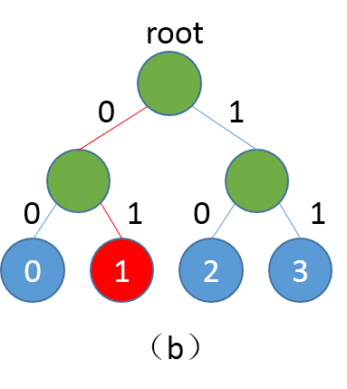

PaddlePaddle v0.10.0 is a must to run example scripts in this directory. If your paddle version is older, please refer[Installment doc](http://www.paddlepaddle.org/docs/develop/documentation/zh/build_and_install/pip_install_cn.html) to upgrade paddle
---

# Hsigmoid accelerated training of word vector
## Background Introduction
In natural language processing field, usually, using one-hot vector to present word as traditional method, like word dict ['I', 'you', 'like'], [1,0,0],[0,1,0],[0,0,1] three vectors can be used to present 'I','you' and 'like'. Thought this usage is concise, it's easy to produce dimension explosion; And any vectors of two word is orthogonal, so information in vector is limited. To avoid or alleviate weakness of one-hot presentation, now usually we take word vector instead of one-hot presentation, word vector namely word embedding, that is using low-dimension dense vector to replace high-dimension sparse one-hot vector. There are many methos to training word vector, one of them is neural network model, including CBOW,Skip-gram etc. Esentially, these are classification model, when vocabulary, class is large, traditional softmax is much time-consuming. PaddlePaddle applys Hsigmoid Layer, NCE Layer, to accelerate training.Here we mainly introduce how to use Hsigmoid Layer to accelerate training, issues related to word vector please go to PaddlePaddle Book [Chapter word vector](https://github.com/PaddlePaddle/book/tree/develop/04.word2vec)


##Hsigmoid Layer
Hsigmoid Layer refered to paper\[[1](#Reference)\], Hsigmoid is Hierarchical-sigmoid, theory of it is to reduce computing complexity by contructing classification binary tree, every leaf node of binary tree is a class,every non-leaf node is a binary classifier. Supposing we get four classes 0,1,2,3, softmax will calculate four classes score seperately, then normalizate it to propability. When classes are large, it's time-consuming to calculate each class propability, Hsigmoid Layer will construct a balanced binary tree based on quantity of classes, as following:

<p align="center">
  <br/>
Figure 1. （a）is balanced binary tree，（b）is path from root node to class 1
</p>
each non-leaf node is a two-class classifier(sigmoid) in binary tree, if class is 0, then continue judging classes with left child node, if not with right child node, until reach at leaf node. In this mode, each class is a path, like path code if 0, 1 from root to class 1. In training stage, we calculate loss of classifier respectively  by path in order of real class, then summate all loss to final loss. In predicting stage, model will output propability of each non-leaf classifier, we can get path code by propability, then iterate path code to get final predicting class. Computation cost of traditional softmax is N(N is size of vocabulary dict), Hsigmoid can reduce complexity to log(N), detailed theory refers paper \[[1](#Reference)\]。

## data preparing
### PTB data
Here we use Penn Treebank (PTB) dataset（[Tomas Mikolovpreprocessing version](http://www.fit.vutbr.cz/~imikolov/rnnlm/simple-examples.tgz)), including train、valid and test three files. Train is used as training data, valid as testing data. Here training is 5-gram model, that is four previous words in each item predicting fifth word. PaddlePaddle supplys python package for PTB dataset[paddle.dataset.imikolov](https://github.com/PaddlePaddle/Paddle/blob/develop/python/paddle/v2/dataset/imikolov.py), automatically download and preprocess data. Preproessing will add begining sign \<s> and ending sign \<e> to each sentence of dataset, then depending on window size(here is 5), each time slide window right from head to tail and generate a data item. Like "I have a dream that one day" can produce \<s> I have a dream、I have a dream that、have a dream that one、a dream that one day、dream that one day \<e>, PaddlePaddle will convert word into id data as output of preprocessing.


### Self-defined data
User can train model with your own dataset, key point for self-defined dataset is to supply reader interface for data processing, reader need to generate a iterator, iterator is for parsing each item in file, return a python list, for example [1, 2, 3, 4, 5], respectively id of first to fourth word in dict, PaddlePaddle will transform this list `paddle.data_type.inter_value` type as input of data layer, a package example as following:


```python
def reader_creator(filename, word_dict, n):
    def reader():
        with open(filename) as f:
            UNK = word_dict['<unk>']
            for l in f:
                l = ['<s>'] + l.strip().split() + ['<e>']
                if len(l) >= n:
                    l = [word_dict.get(w, UNK) for w in l]
                    for i in range(n, len(l) + 1):
                        yield tuple(l[i - n:i])
    return reader


def train_data(filename, word_dict, n):
    """
    Reader interface for training data.

    It returns a reader creator, each sample in the reader is a word ID tuple.

    :param filename: path of data file
    :type filename: str
    :param word_dict: word dictionary
    :type word_dict: dict
    :param n: sliding window size
    :type n: int
    """
    return reader_creator(filename, word_dict, n)
```

## Network Structure
Here we get word vector by training N-gram language model, specifically using four words to predict current word. Input of network is id of word in dict, then lookup word vector table to get word vector, concate word vector of four words, then is linked to full-connected hidden layer, the last is `Hsigmoid` layer. Detailed network structure see figure 2:


<p align="center">
<br/>
Figure2. Network Configration Structure
</p>

code is:

```python
def ngram_lm(hidden_size, embed_size, dict_size, gram_num=4, is_train=True):
    emb_layers = []
    embed_param_attr = paddle.attr.Param(
        name="_proj", initial_std=0.001, learning_rate=1, l2_rate=0)
    for i in range(gram_num):
        word = paddle.layer.data(
            name="__word%02d__" % (i),
            type=paddle.data_type.integer_value(dict_size))
        emb_layers.append(
            paddle.layer.embedding(
                input=word, size=embed_size, param_attr=embed_param_attr))

    target_word = paddle.layer.data(
        name="__target_word__", type=paddle.data_type.integer_value(dict_size))

    embed_context = paddle.layer.concat(input=emb_layers)

    hidden_layer = paddle.layer.fc(
        input=embed_context,
        size=hidden_size,
        act=paddle.activation.Sigmoid(),
        layer_attr=paddle.attr.Extra(drop_rate=0.5),
        bias_attr=paddle.attr.Param(learning_rate=2),
        param_attr=paddle.attr.Param(
            initial_std=1. / math.sqrt(embed_size * 8), learning_rate=1))

    return paddle.layer.hsigmoid(
                input=hidden_layer,
                label=target_word,
                param_attr=paddle.attr.Param(name="sigmoid_w"),
                bias_attr=paddle.attr.Param(name="sigmoid_b"))
```

Should pay attention that in PaddlePaddle, hsigmoid layer saves learnable parameters as `[num of classes - 1 × width of hidden layer]` size matrix. When predicting, it need to replace hsigmoid layer with fully-connected computation, and freeze with `sigmoid` as activation. Predicting outputs a matrix whose width is `[batch_size x num of classes - 1]`（`when batch_size = 1`, it degrades to a vector）. Each dimension of matrix row vector computes propabilit of input vector belonging to inner node right child. ** Fully-connected computation will transpose parameters matrix when loading hsigmoid layer learned parameters matrix.
code slice is as following:

```python
return paddle.layer.mixed(
    size=dict_size - 1,
    input=paddle.layer.trans_full_matrix_projection(
        hidden_layer, param_attr=paddle.attr.Param(name="sigmoid_w")),
    act=paddle.activation.Sigmoid(),
    bias_attr=paddle.attr.Param(name="sigmoid_b"))
```

In above code slice, `paddle.layer.mixed` must use `paddle.layer.×_projection` of PaddlePaddle as input.`paddle.layer.mixed` summate multiple computing results of `projection`(input can be more than one) as output.`paddle.layer.trans_full_matrix_projection` will transpose parameter $W$ when computing matrix multiplication.


## Training stage
Training is easy, directly run ``` python train.py ``` . Program will chech if imikolov data is included in user cache directory when first running, if not, download automatically. When running, it will print model training information every 100 iteration, mainly concerns training loss and testing loss, saves model for each pass.

## Predicting stage
In command line, run:

```bash
python infer.py \
  --model_path "models/XX" \
  --batch_size 1 \
  --use_gpu false \
  --trainer_count 1
```
parameters meaning:
- `model_path`：assign path for well-trained model. Required.
- `batch_size`：num of sample items for one parallel predicting.Optional, default `1`
- `use_gpu`：if use GPU for prediction or not. Optional, default `False`
- `trainer_count` : num of thread for prediction. Optional, default `1`**


In training stage, we can get code path by multiple binary classification propability, iterate path to get final class, reason is:

```python
def decode_res(infer_res, dict_size):
    """
    Inferring probabilities are orginized as a complete binary tree.
    The actual labels are leaves (indices are counted from class number).
    This function travels paths decoded from inferring results.
    If the probability >0.5 then go to right child, otherwise go to left child.

    param infer_res: inferring result
    param dict_size: class number
    return predict_lbls: actual class
    """
    predict_lbls = []
    infer_res = infer_res > 0.5
    for i, probs in enumerate(infer_res):
        idx = 0
        result = 1
        while idx < len(probs):
            result <<= 1
            if probs[idx]:
                result |= 1
            if probs[idx]:
                idx = idx * 2 + 2  # right child
            else:
                idx = idx * 2 + 1  # left child

        predict_lbl = result - dict_size
        predict_lbls.append(predict_lbl)
    return predict_lbls
```
Format of input data for predicting is same with training, like `have a dream that one`, program will produce a sequence of propability based on `have a dream that`, then decode propability to generate predicting word, `one` as real word, is easy to evaluate. Input of decoding funtion is prediction propability of one batch sample and vocabulary size, inner loop is to decode each item based on its output propability, decoding method follows left 0 right 1 rule, iterates all paths until arrives at leaf node.


## Reference
1. Morin, F., & Bengio, Y. (2005, January). [Hierarchical Probabilistic Neural Network Language Model](http://www.iro.umontreal.ca/~lisa/pointeurs/hierarchical-nnlm-aistats05.pdf). In Aistats (Vol. 5, pp. 246-252).
