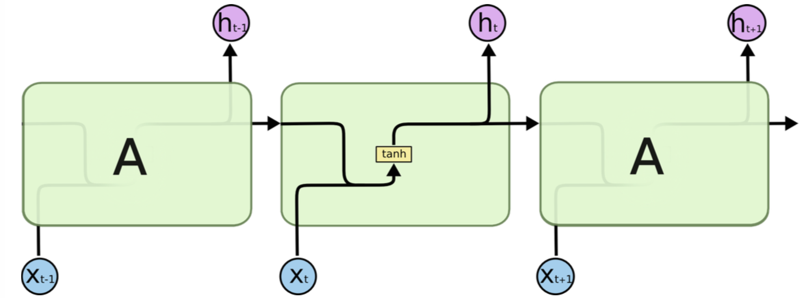
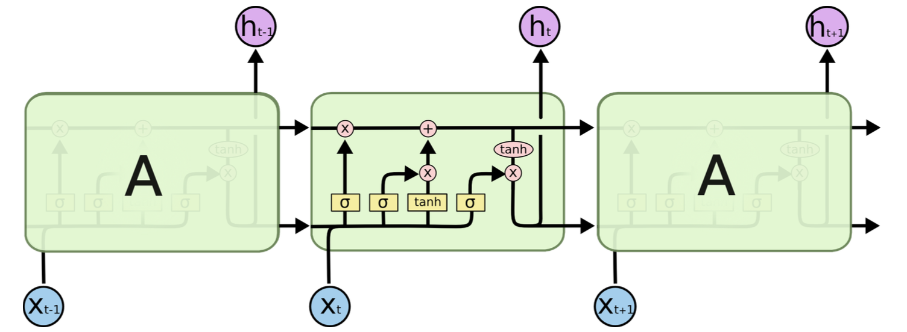

# 语言模型

## 简介
语言模型即 Language Model，简称LM，它是一个概率分布模型，简单来说，就是用来计算一个句子的概率的模型。**利用它可以确定哪个词序列的可能性更大，或者给定若干个词，可以预测下一个最可能出现的词语。**它是自然语言处理领域的一个重要的基础模型。

## 应用场景
**语言模型被应用在很多领域**，如：

* **自动写作**：语言模型可以根据上文生成下一个词，递归下去可以生成整个句子、段落、篇章。
* **QA**：语言模型可以根据Question生成Answer。
* **机器翻译**：当前主流的机器翻译模型大多基于Encoder-Decoder模式，其中Decoder就是一个语言模型，用来生成目标语言。
* **拼写检查**：语言模型可以计算出词语序列的概率，一般在拼写错误处序列的概率会骤减，可以用来识别拼写错误并提供改正候选集。
* **词性标注、句法分析、语音识别......**

## 关于本例
Language Model 常见的实现方式有 N-Gram、RNN、seq2seq。本例中实现了基于N-Gram、RNN的语言模型。**本例的文件结构如下**（`images` 文件夹与使用无关可不关心）：


```text
.
├── data                    # toy、demo数据，用户可据此格式化自己的数据
│   ├── chinese.test.txt    # test用的数据demo
|   ├── chinese.train.txt   # train用的数据demo
│   └── input.txt           # infer用的输入数据demo
├── config.py               # 配置文件，包括data、train、infer相关配置
├── infer.py                # 预测任务脚本，即生成文本
├── network_conf.py         # 本例中涉及的各种网络结构均定义在此文件中，希望进一步修改模型结构，请修改此文件
├── reader.py               # 读取数据接口
├── README.md               # 文档
├── train.py                # 训练任务脚本
└── utils.py                # 定义通用的函数，例如：构建字典、加载字典等
```

**注：一般情况下基于N-Gram的语言模型不如基于RNN的语言模型效果好，所以实际使用时建议使用基于RNN的语言模型，本例中也将着重介绍基于RNN的模型，简略介绍基于N-Gram的模型。**

## RNN 语言模型
### 简介

RNN是一个序列模型，基本思路是：在时刻t，将前一时刻t-1的隐藏层输出和t时刻的词向量一起输入到隐藏层从而得到时刻t的特征表示，然后用这个特征表示得到t时刻的预测输出，如此在时间维上递归下去，如下图所示：

<p align=center></p>

可以看出RNN善于使用上文信息、历史知识，具有“记忆”功能。理论上RNN能实现“长依赖”（即利用很久之前的知识），但在实际应用中发现效果并不理想，于是出现了很多RNN的变种，如常用的LSTM和GRU，它们对传统RNN的cell进行了改进，弥补了RNN的不足，下图是LSTM的示意图：

<p align=center></p>

本例中即使用了LSTM、GRU。

### 模型实现

本例中RNN语言模型的实现简介如下：

* **定义模型参数**：`config.py`中的`Config_rnn`**类**中定义了模型的参数变量。
* **定义模型结构**：`network_conf.py`中的`rnn_lm`**函数**中定义了模型的**结构**，如下：
    * 输入层：将输入的词（或字）序列映射成向量，即embedding。
    * 中间层：根据配置实现RNN层，将上一步得到的embedding向量序列作为输入。
    * 输出层：使用softmax归一化计算单词的概率，将output结果返回
    * loss：定义模型的cost为多类交叉熵损失函数。
* **训练模型**：`train.py`中的`main`方法实现了模型的训练，实现流程如下：
    * 准备输入数据：建立并保存词典、构建train和test数据的reader。
    * 初始化模型：包括模型的结构、参数。
    * 构建训练器：demo中使用的是Adam优化算法。
    * 定义回调函数：构建`event_handler`来跟踪训练过程中loss的变化，并在每轮时结束保存模型的参数。
    * 训练：使用trainer训练模型。

* **生成文本**：`infer.py`中的`main`方法实现了文本的生成，实现流程如下：
    * 根据配置选择生成方法：RNN模型 or N-Gram模型。
    * 加载train好的模型和词典文件。
    * 读取`input_file`文件（每行为一个sentence的前缀），用启发式图搜索算法`beam_search`根据各sentence的前缀生成文本。
    * 将生成的文本及其前缀保存到文件`output_file`。


## N-Gram 语言模型

### 简介
N-Gram模型也称为N-1阶马尔科夫模型，它有一个有限历史假设：当前词的出现概率仅仅与前面N-1个词相关。一般采用最大似然估计（Maximum Likelihood Estimation，MLE）的方法对模型的参数进行估计。当N取1、2、3时，N-Gram模型分别称为unigram、bigram和trigram语言模型。一般情况下，N越大、训练语料的规模越大，参数估计的结果越可靠，但由于模型较简单、表达能力不强以及数据稀疏等问题。一般情况下用N-Gram实现的语言模型不如RNN、seq2seq效果好。

### 模型实现

本例中N-Gram语言模型的实现简介如下：

* **定义模型参数**：`config.py`中的`Config_ngram`**类**中定义了模型的参数变量。
* **定义模型结构**：`network_conf.py`中的`ngram_lm`**函数**中定义了模型的**结构**，如下：
    * 输入层：本例中N取5，将前四个词分别做embedding，然后连接起来作为输入。
    * 中间层：根据配置实现DNN层，将上一步得到的embedding向量序列作为输入。
    * 输出层：使用softmax归一化计算单词的概率，将output结果返回
    * loss：定义模型的cost为多类交叉熵损失函数。
* **训练模型**：`train.py`中的`main`方法实现了模型的训练，实现流程与上文中RNN语言模型基本一致。
* **生成文本**：`infer.py`中的`main`方法实现了文本的生成，实现流程与上文中RNN语言模型基本一致，区别在于构建input时本例会取每个前缀的最后4（N-1）个词作为输入。

## 使用说明

运行本例的方法如下：

* 1，运行`python train.py`命令，开始train模型（默认使用RNN），待训练结束。
* 2，运行`python infer.py`命令做prediction。（输入的文本默认为`data/input.txt`，生成的文本默认保存到`data/output.txt`中。）


**如果用户需要使用自己的语料、定制模型，需要修改的地方主要是`语料`和`config.py`中的配置，需要注意的细节和适配工作详情如下：**


### 语料适配

* 清洗语料：去除原文中空格、tab、乱码，按需去除数字、标点符号、特殊符号等。
* 编码格式：utf-8，本例中已经对中文做了适配。
* 内容格式：每个句子占一行；每行中的各词之间使用一个空格符分开。
* 按需要配置`config.py`中对于data的配置：

    ```python
    # -- config : data --

    train_file = 'data/chinese.train.txt'
    test_file = 'data/chinese.test.txt'
    vocab_file = 'data/vocab_cn.txt'  # the file to save vocab

    build_vocab_method = 'fixed_size'  # 'frequency' or 'fixed_size'
    vocab_max_size = 3000  # when build_vocab_method = 'fixed_size'
    unk_threshold = 1  # # when build_vocab_method = 'frequency'

    min_sentence_length = 3
    max_sentence_length = 60
    ```

    其中，`build_vocab_method `指定了构建词典的方法：**1，按词频**，即将出现次数小于`unk_threshold `的词视为`<UNK>`；**2，按词典长度**，`vocab_max_size`定义了词典的最大长度，如果语料中出现的不同词的个数大于这个值，则根据各词的词频倒序排，取`top(vocab_max_size)`个词纳入词典。

    其中`min_sentence_length`和`max_sentence_length `分别指定了句子的最小和最大长度，小于最小长度的和大于最大长度的句子将被过滤掉、不参与训练。

    *注：需要注意的是词典越大生成的内容越丰富但训练耗时越久，一般中文分词之后，语料中不同的词能有几万乃至几十万，如果vocab\_max\_size取值过小则导致\<UNK\>占比过高，如果vocab\_max\_size取值较大则严重影响训练速度（对精度也有影响），所以也有“按字”训练模型的方式，即：把每个汉字当做一个词，常用汉字也就几千个，使得字典的大小不会太大、不会丢失太多信息，但汉语中同一个字在不同词中语义相差很大，有时导致模型效果不理想。建议用户多试试、根据实际情况选择是“按词训练”还是“按字训练”。*

### 模型适配、训练

* 按需调整`config.py`中对于模型的配置，详解如下：

    ```python
    # -- config : train --

    use_which_model = 'rnn'  # must be: 'rnn' or 'ngram'
    use_gpu = False  # whether to use gpu
    trainer_count = 1  # number of trainer


    class Config_rnn(object):
        """
        config for RNN language model
        """
        rnn_type = 'gru'  # or 'lstm'
        emb_dim = 200
        hidden_size = 200
        num_layer = 2
        num_passs = 2
        batch_size = 32
        model_file_name_prefix = 'lm_' + rnn_type + '_params_pass_'


    class Config_ngram(object):
        """
        config for N-Gram language model
        """
        emb_dim = 200
        hidden_size = 200
        num_layer = 2
        N = 5
        num_passs = 2
        batch_size = 32
        model_file_name_prefix = 'lm_ngram_pass_'
    ```

    其中，`use_which_model`指定了要train的模型，如果使用RNN语言模型则设置为'rnn'，如果使用N-Gram语言模型则设置为'ngram'；`use_gpu`指定了train的时候是否使用gpu；`trainer_count`指定了并行度、用几个trainer去train模型；`rnn_type` 用于配置rnn cell类型，可以取‘lstm’或‘gru’；`hidden_size`配置unit个数；`num_layer`配置RNN的层数；`num_passs`配置训练的轮数；`emb_dim`配置embedding的dimension；`batch_size `配置了train model时每个batch的大小；`model_file_name_prefix `配置了要保存的模型的名字前缀。

* 运行`python train.py`命令训练模型，模型将被保存到当前目录。

### 按需生成文本

* 按需调整`config.py`中对于infer的配置，详解如下：

    ```python
    # -- config : infer --

    input_file = 'data/input.txt'  # input file contains sentence prefix each line
    output_file = 'data/output.txt'  # the file to save results
    num_words = 10  # the max number of words need to generate
    beam_size = 5  # beam_width, the number of the prediction sentence for each prefix
    ```

    其中，`input_file`中保存的是带生成的文本前缀，utf-8编码，每个前缀占一行，形如：

    ```text
    我
    我 是
    ```
    用户将需要生成的文本前缀按此格式存入文件即可；
    `num_words`指定了要生成多少个单词（实际生成过程中遇到结束符会停止生成，所以实际生成的词个数可能会比此值小）；`beam_size`指定了beam search方法的width，即每个前缀生成多少个候选词序列；`output_file`指定了生成结果的存放位置。

* 运行`python infer.py`命令生成文本，生成的结果格式如下：

    ```text
    我
        我 <EOS>    0.107702672482
        我 爱 。我 中国 中国 <EOS>    0.000177299271939
        我 爱 中国 。我 是 中国 <EOS>    4.51695544709e-05
        我 爱 中国 中国 <EOS>    0.000910127729821
        我 爱 中国 。我 是 <EOS>    0.00015957862922
    ```
    其中，‘我’是前缀，其下方的五个句子时补全的结果，每个句子末尾的浮点数表示此句子的生成概率。
