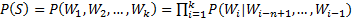

# 语言模型
## 简介
语言模型即 Language Model，简称LM，它是一个概率分布模型，简单来说，就是用来计算一个句子的概率的模型。给定句子（词语序列）：<br>
<div align=center></div>
它的概率可以表示为：<br><br>
<div align=center> &nbsp;&nbsp;&nbsp;&nbsp;(式1)</div>

语言模型可以计算（式1）中的P(S)及其中间结果。**利用它可以确定哪个词序列的可能性更大，或者给定若干个词，可以预测下一个最可能出现的词语。**

## 应用场景
**语言模型被应用在多个领域**，如：

* **自动写作**：语言模型可以根据上文生成下一个词，递归下去可以生成整个句子、段落、篇章。
* **QA**：语言模型可以根据Question生成Answer。
* **机器翻译**：当前主流的机器翻译模型大多基于Encoder-Decoder模式，其中Decoder就是一个语言模型，用来生成目标语言。
* **拼写检查**：语言模型可以计算出词语序列的概率，一般在拼写错误处序列的概率会骤减，可以用来识别拼写错误并提供改正候选集。
* **词性标注、句法分析、语音识别......**

## 关于本例
Language Model 常见的实现方式有 N-Gram、RNN、seq2seq。本例中实现了基于N-Gram、RNN的语言模型。**本例的文件结构如下**：

* data_util.py：实现了对语料的读取以及词典的建立、保存和加载。
* lm_rnn.py：实现了基于rnn的语言模型的定义、训练以及做预测。
* lm_ngram.py：实现了基于n-gram的语言模型的定义、训练以及做预测。

**注：***一般情况下基于N-Gram的语言模型不如基于RNN的语言模型效果好，所以实际使用时建议使用基于RNN的语言模型，本例中也将着重介绍基于RNN的模型，简略介绍基于N-Gram的模型。*

## RNN 语言模型
### 简介

RNN是一个序列模型，基本思路是：在时刻t，将前一时刻t-1的隐藏层输出h<small>t-1</small>和t时刻的词向量x<small>t</small>一起输入到隐藏层从而得到时刻t的特征表示h<small>t</small>，然后用这个特征表示得到t时刻的预测输出ŷ ，如此在时间维上递归下去，如下图所示：

<div align=center></div>

可以看出RNN善于使用上文信息、历史知识，具有“记忆”功能。理论上RNN能实现“长依赖”（即利用很久之前的知识），但在实际应用中发现效果并不理想，于是出现了很多RNN的变种，如常用的LSTM和GRU，它们对传统RNN的cell进行了改进，弥补了RNN的不足，下图是LSTM的示意图：

<div align=center></div> 

本例中即使用了LSTM、GRU。

### 模型结构

lm_rnn.py 中的 lm() 函数定义了模型的结构。解析如下：

* 1，首先，在\_\_main\_\_中定义了模型的参数变量。

	```python
	    # -- config : model --
	    rnn_type = 'gru' # or 'lstm'
	    emb_dim = 200
	    hidden_size = 200
	    num_passs = 2
	    num_layer = 2
	
	```
	其中 rnn\_type 用于配置rnn cell类型，可以取‘lstm’或‘gru’；hidden\_size配置unit个数；num\_layer配置RNN的层数；num\_passs配置训练的轮数；emb_dim配置embedding的dimension。

* 2，将输入的词（或字）序列映射成向量，即embedding。

	```python
		data = paddle.layer.data(name="word", type=paddle.data_type.integer_value_sequence(vocab_size))
		target = paddle.layer.data("label", paddle.data_type.integer_value_sequence(vocab_size))
		emb = paddle.layer.embedding(input=data, size=emb_dim)
	
	```
* 3，根据配置实现RNN层，将上一步得到的embedding向量序列作为输入。

	```python
	    if rnn_type == 'lstm':
	        rnn_cell = paddle.networks.simple_lstm(
	            input=emb, size=hidden_size)
	        for _ in range(num_layer - 1):
	            rnn_cell = paddle.networks.simple_lstm(
	                input=rnn_cell, size=hidden_size)
	    elif rnn_type == 'gru':
	        rnn_cell = paddle.networks.simple_gru(
	            input=emb, size=hidden_size)
	        for _ in range(num_layer - 1):
	            rnn_cell = paddle.networks.simple_gru(
	                input=rnn_cell, size=hidden_size)
	```
* 4，实现输出层（使用softmax归一化计算单词的概率，将output结果返回）、定义模型的cost（多类交叉熵损失函数）。

	```python
		# fc and output layer
		output = paddle.layer.fc(
	        input=[rnn_cell], size=vocab_size, act=paddle.activation.Softmax())
	
	    # loss
	    cost = paddle.layer.classification_cost(input=output, label=target)
	```

### 训练模型

lm\_rnn.py 中的 train() 方法实现了模型的训练，流程如下：

* 1，准备输入数据：本例中使用的是标准PTB数据，调用data\_util.py中的build\_vocab()方法建立词典，并使用save\_vocab()方法将词典持久化，以备复用（当语料量大时生成词典比较耗时，所以这里把第一次生成的词典保存下来复用）。然后使用data\_util.py中的train\_data()、test\_data()方法建立train\_reader和test\_reader用来实现对train数据和test数据的读取。

* 2，初始化模型：包括模型的结构、参数、优化器（demo中使用的是Adam）以及训练器trainer。如下：

	```python
	  	# network config
	    cost, _ = lm(len(word_id_dict), emb_dim, rnn_type, hidden_size, num_layer)
	
	    # create parameters
	    parameters = paddle.parameters.create(cost)
	
	    # create optimizer
	    adam_optimizer = paddle.optimizer.Adam(
	        learning_rate=1e-3,
	        regularization=paddle.optimizer.L2Regularization(rate=1e-3),
	        model_average=paddle.optimizer.ModelAverage(average_window=0.5))
	
	    # create trainer
	    trainer = paddle.trainer.SGD(
	        cost=cost, parameters=parameters, update_equation=adam_optimizer)
	
	```

* 3，定义回调函数event_handler来跟踪训练过程中loss的变化，并在每轮时结束保存模型的参数：

	```python
		# define event_handler callback
	    def event_handler(event):
	        if isinstance(event, paddle.event.EndIteration):
	            if event.batch_id % 100 == 0:
	                print("\nPass %d, Batch %d, Cost %f, %s" % (
	                    event.pass_id, event.batch_id, event.cost,
	                    event.metrics))
	            else:
	                sys.stdout.write('.')
	                sys.stdout.flush()
	
	        # save model each pass
	        if isinstance(event, paddle.event.EndPass):
	            result = trainer.test(reader=ptb_reader)
	            print("\nTest with Pass %d, %s" % (event.pass_id, result.metrics))
	            with gzip.open(model_file_name_prefix + str(event.pass_id) + '.tar.gz', 'w') as f:
	                parameters.to_tar(f)
	```

* 4，开始train模型：
	
	```python
	trainer.train(
	        reader=ptb_reader, event_handler=event_handler, num_passes=num_passs)
	```

### 生成文本
lm\_rnn.py中的predict()方法实现了做prediction、生成文本。流程如下：

* 1，首先加载并缓存词典和模型，其中加载train好的模型参数方法如下：
	
	```python
		parameters = paddle.parameters.Parameters.from_tar(gzip.open(model_file_name))
	```

* 2，生成文本，本例中生成文本的方式是启发式图搜索算法beam search，即lm\_rnn.py中的\_generate\_with\_beamSearch()方法。

### <font color='red'>使用此demo</font>

本例中使用的是标准的PTB数据，如果用户要实现自己的model，则只需要做如下适配工作：

#### 语料适配
* 清洗语料：去除空格、tab、乱码，根据需要去除数字、标点符号、特殊符号等。
* 编码格式：utf-8，本例中已经对中文做了适配。
* 内容格式：每个句子占一行；每行中的各词之间使用一个空格分开。
* 按需要配置lm\_rnn.py中\_\_main\_\_函数中对于data的配置：
	
	```python
	    # -- config : data --
	    train_file = 'data/ptb.train.txt'
	    test_file = 'data/ptb.test.txt'
	    vocab_file = 'data/vocab_cn.txt'  # the file to save vocab
	    vocab_max_size = 3000
	    min_sentence_length = 3
	    max_sentence_length = 60
	
	```
	其中，vocab\_max\_size定义了词典的最大长度，如果语料中出现的不同词的个数大于这个值，则根据各词的词频倒序排，取top(vocab\_max\_size)个词纳入词典。
	
	*注：需要注意的是词典越大生成的内容越丰富但训练耗时越久，一般中文分词之后，语料中不同的词能有几万乃至几十万，如果vocab\_max\_size取值过小则导致\<UNK\>占比过高，如果vocab\_max\_size取值较大则严重影响训练速度（对精度也有影响），所以也有“按字”训练模型的方式，即：把每个汉字当做一个词，常用汉字也就几千个，使得字典的大小不会太大、不会丢失太多信息，但汉语中同一个字在不同词中语义相差很大，有时导致模型效果不理想。建议用户多试试、根据实际情况选择是“按词训练”还是“按字训练”。*
	
#### 模型适配

根据语料的大小按需调整模型的\_\_main\_\_中定义的参数。

然后运行 python lm_rnn.py即可训练模型、做prediction。
	
## n-gram 语言模型


n-gram模型也称为n-1阶马尔科夫模型，它有一个有限历史假设：当前词的出现概率仅仅与前面n-1个词相关。因此 (式1) 可以近似为：
<div align=center></div> 
一般采用最大似然估计（Maximum Likelihood Estimation，MLE）的方法对模型的参数进行估计。当n取1、2、3时，n-gram模型分别称为unigram、bigram和trigram语言模型。一般情况下，n越大、训练语料的规模越大，参数估计的结果越可靠，但由于模型较简单、表达能力不强以及数据稀疏等问题。一般情况下用n-gram实现的语言模型不如rnn、seq2seq效果好。

### 模型结构

lm\_ngram.py中的lm()定义了模型的结构，大致如下：

* 1，demo中n取5，将前四个词分别做embedding，然后连接起来作为特征向量。
* 2，后接DNN的hidden layer。
* 3，将DNN的输出通过softmax layer做分类，得到下个词在词典中的概率分布。
* 4，模型的loss采用交叉熵，用Adam optimizer对loss做优化。

图示如下：
<div align=center></div> 

### 模型训练

lm\_ngram.py中的train()方法实现了模型的训练，过程和RNN LM类似，简介如下：

* 1，准备输入数据：使用的是标准PTB数据，调用data\_util.py中的build\_vocab()方法建立词典，并使用save\_vocab()方法将词典持久化，使用data\_util.py中的train\_data()、test\_data()方法建立train\_reader和test\_reader用来实现对train数据和test数据的读取。
* 2，初始化模型：包括模型的结构、参数、优化器（demo中使用的是Adam）以及trainer。
* 3，定义回调函数event_handler来跟踪训练过程中loss的变化，并在每轮时结束保存模型的参数。
* 4，使用trainer开始train模型。

### 生成文本
lm\_ngram.py中的\_\_main\_\_方法中对prediction（生成文本）做了简单的实现。流程如下：

* 1，首先加载词典和模型：
	
	```python
	# prepare model
	word_id_dict = reader.load_vocab(vocab_file)  # load word dictionary
	_, output_layer = lm(len(word_id_dict), emb_dim, hidden_size, num_layer)  # network config
	model_file_name =  model_file_name_prefix + str(num_passs - 1) + '.tar.gz'
parameters = paddle.parameters.Parameters.from_tar(gzip.open(model_file_name))  # load parameters
	```

* 2，根据4（n-1）个词的上文预测下一个单词并打印：

	```python
	# generate
	text = 'the end of the'  # use 4 words to predict the 5th word
	input = [[word_id_dict.get(w, word_id_dict['<UNK>']) for w in text.split()]]
	predictions = paddle.infer(
	    output_layer=output_layer,
	    parameters=parameters,
	    input=input,
	    field=['value'])
	id_word_dict = dict([(v, k) for k, v in word_id_dict.items()])  # dictionary with type {id : word}
	predictions[-1][word_id_dict['<UNK>']] = -1  # filter <UNK>
	next_word = id_word_dict[np.argmax(predictions[-1])]
	print(next_word.encode('utf-8'))
	```
	
	*注：这里展示了另一种做预测的方法，即使用paddle.infer方法。RNN的实例中使用的是paddle.inference.Inference接口。*