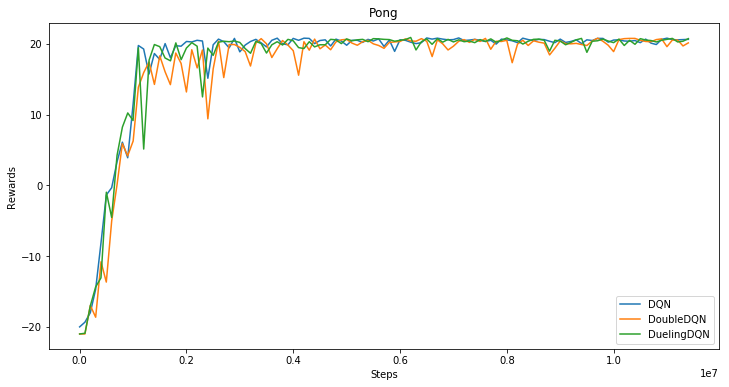

## 基于PaddlePaddle的Fluid版本复现DQN, DoubleDQN, DuelingDQN三个模型

基于PaddlePaddle下一代API Fluid复现了深度强化学习领域的DQN模型，在经典的Atari 游戏上复现了论文同等水平的指标，模型接收游戏的图像作为输入，采用端到端的模型直接预测下一步要执行的控制信号，本仓库一共包含以下3类模型：
+ DQN模型：
[Human-level Control Through Deep Reinforcement Learning](http://www.nature.com/nature/journal/v518/n7540/full/nature14236.html)
+ DoubleDQN模型：
[Deep Reinforcement Learning with Double Q-Learning](https://www.aaai.org/ocs/index.php/AAAI/AAAI16/paper/viewPaper/12389)
+ DuelingDQN模型：
[Dueling Network Architectures for Deep Reinforcement Learning](http://proceedings.mlr.press/v48/wangf16.html)

## 模型效果：Atari游戏表现

### Atari游戏介绍

请点击[这里](https://gym.openai.com/envs/#atari)了解Atari游戏。

### Pong游戏训练结果
三个模型在训练过程中随着训练步数的变化，能得到的平均游戏奖励如下图所示（大概3小时每1百万步）：

<div align="center">
</img>
</div>

## 使用教程

### 依赖:
+ python2.7
+ gym
+ tqdm
+ opencv-python
+ paddlepaddle-gpu>=1.0.0
+ ale_python_interface

### 下载依赖：

+ 安装PaddlePaddle：
    建议通过PaddlePaddle源码进行编译安装  
+ 下载其它依赖：
    ```
    pip install -r requirement.txt
    pip install gym[atari]
    ```
    安装ale_python_interface可以参考[这里](https://github.com/mgbellemare/Arcade-Learning-Environment)

### 训练模型：

```
# 使用GPU训练Pong游戏（默认使用DQN模型）
python train.py --rom ./rom_files/pong.bin --use_cuda

# 训练DoubleDQN模型
python train.py --rom ./rom_files/pong.bin --use_cuda --alg DoubleDQN

# 训练DuelingDQN模型
python train.py --rom ./rom_files/pong.bin --use_cuda --alg DuelingDQN
```

训练更多游戏，可以从[这里](https://github.com/openai/atari-py/tree/master/atari_py/atari_roms)下载游戏rom

### 测试模型：

```
# Play the game with saved model and calculate the average rewards
# 使用训练过程中保存的最好模型玩游戏，以及计算平均奖励（rewards）
python play.py --rom ./rom_files/pong.bin --use_cuda --model_path ./saved_model/DQN-pong

# 以可视化的形式来玩游戏
python play.py --rom ./rom_files/pong.bin --use_cuda --model_path ./saved_model/DQN-pong --viz 0.01
```

[这里](https://pan.baidu.com/s/1gIsbNw5V7tMeb74ojx-TMA)是Pong和Breakout游戏训练好的模型，可以直接用来测试。
