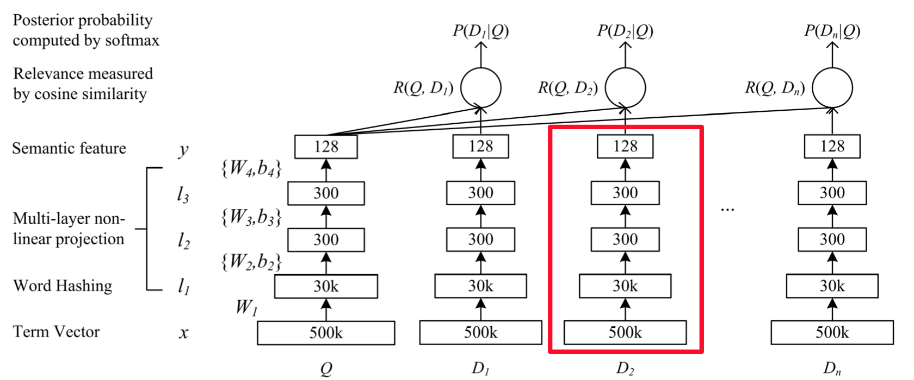
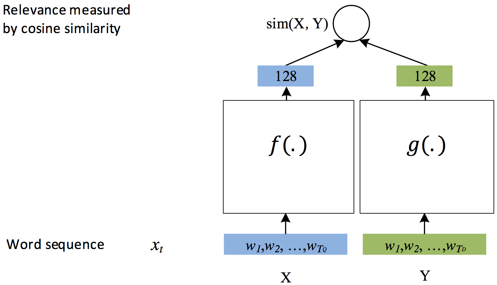

The minimum PaddlePaddle version needed for the code sample in this directory is v0.10.0. If you are on a version of PaddlePaddle earlier than v0.10.0, [please update your installation](http://www.paddlepaddle.org/docs/develop/documentation/en/build_and_install/pip_install_en.html).

---

# Deep Structured Semantic Models (DSSM)
Deep Structured Semantic Models (DSSM) is simple but powerful DNN based model for matching web search queries and the URL based documents. This example demonstrates how to use PaddlePaddle to implement a generic DSSM model for modeling the semantic similarity between two strings.

## Background Introduction
DSSM \[[1](##References)]is a classic semantic model proposed by the Institute of Physics. It is used to study the semantic distance between two texts. The general implementation of DSSM is as follows.

1. The CTR predictor measures the degree of association between a user search query and a candidate web page.
2. Text relevance, which measures the degree of semantic correlation between two strings.
3. Automatically recommend, measure the degree of association between User and the recommended Item.


## Model Architecture

In the original paper \[[1](#References)] the DSSM model uses the implicit semantic relation between the user search query and the document as metric. The model structure is as follows

<p align="center">
<br/><br/>
Figure 1. DSSM In the original paper
</p>


With the subsequent optimization of the DSSM model to simplify the structure \[[3](#References)]，the model becomes：

<p align="center">
<br/><br/>
Figure 2. DSSM generic structure
</p>

The blank box in the figure can be replaced by any model, such as fully connected FC, convoluted CNN, RNN, etc. The structure is designed to measure the semantic distance between two elements (such as strings).

In practice，DSSM model serves as a basic building block, with different loss functions to achieve specific functions, such as

- In ranking system, the pairwise rank loss function.
- In the CTR estimate, instead of the binary classification on the click, use cross-entropy loss for a classification model
- In regression model,  the cosine similarity is used to calculate the similarity

## Model Implementation
At a high level, DSSM model is composed of three components: the left and right DNN, and loss function on top of them. In complex tasks, the structure of the left DNN and the light DNN can be different. In this example, we keep these two DNN structures the same. And we choose any of FC, CNN, and RNN for the DNN architecture.

In PaddlePaddle, the loss functions are supported for any of classification, regression, and ranking. Among them, the distance between the left and right DNN is calculated by the cosine similarity. In the classification task, the predicted distribution is calculated by softmax.

Here we demonstrate:

- How CNN, FC do text information extraction can refer to [text classification](https://github.com/PaddlePaddle/models/blob/develop/text_classification/README.md#模型详解)
- The contents of the RNN / GRU can be found in  [Machine Translation](https://github.com/PaddlePaddle/book/blob/develop/08.machine_translation/README.md#gated-recurrent-unit-gru)
- For Pairwise Rank learning, please refer to [learn to rank](https://github.com/PaddlePaddle/models/blob/develop/ltr/README.md)

Figure 3 shows the general architecture for both regression and classification models.

<p align="center">
<br/><br/>
Figure 3. DSSM for REGRESSION or CLASSIFICATION
</p>

The structure of the Pairwise Rank is more complex, as shown in Figure 4.

<p align="center">
<br/><br/>
图 4. DSSM for Pairwise Rank
</p>

In below, we describe how to train DSSM model in PaddlePaddle. All the codes are included in  `./network_conf.py`.


### Create a word vector table for the text
```python
def create_embedding(self, input, prefix=''):
    """
    Create word embedding. The `prefix` is added in front of the name of
    embedding"s learnable parameter.
    """
    logger.info("Create embedding table [%s] whose dimention is %d" %
                (prefix, self.dnn_dims[0]))
    emb = paddle.layer.embedding(
        input=input,
        size=self.dnn_dims[0],
        param_attr=ParamAttr(name='%s_emb.w' % prefix))
    return emb
```

Since the input (embedding table) is a list of the IDs of the words corresponding to a sentence, the word vector table outputs the sequence of word vectors.

### CNN implementation
```python
def create_cnn(self, emb, prefix=''):

    """
    A multi-layer CNN.
    :param emb: The word embedding.
    :type emb: paddle.layer
    :param prefix: The prefix will be added to of layers' names.
    :type prefix: str
    """

    def create_conv(context_len, hidden_size, prefix):
        key = "%s_%d_%d" % (prefix, context_len, hidden_size)
        conv = paddle.networks.sequence_conv_pool(
            input=emb,
            context_len=context_len,
            hidden_size=hidden_size,
            # set parameter attr for parameter sharing
            context_proj_param_attr=ParamAttr(name=key + "contex_proj.w"),
            fc_param_attr=ParamAttr(name=key + "_fc.w"),
            fc_bias_attr=ParamAttr(name=key + "_fc.b"),
            pool_bias_attr=ParamAttr(name=key + "_pool.b"))
        return conv

    conv_3 = create_conv(3, self.dnn_dims[1], "cnn")
    conv_4 = create_conv(4, self.dnn_dims[1], "cnn")
    return paddle.layer.concat(input=[conv_3, conv_4])
```

CNN accepts the word sequence of the embedding table, then process the data by convolution and pooling, and finally outputs a semantic vector.

### RNN implementation

RNN is suitable for learning variable length of the information

```python
def create_rnn(self, emb, prefix=''):
    """
    A GRU sentence vector learner.
    """
    gru = paddle.networks.simple_gru(
        input=emb,
        size=self.dnn_dims[1],
        mixed_param_attr=ParamAttr(name='%s_gru_mixed.w' % prefix),
        mixed_bias_param_attr=ParamAttr(name="%s_gru_mixed.b" % prefix),
        gru_param_attr=ParamAttr(name='%s_gru.w' % prefix),
        gru_bias_attr=ParamAttr(name="%s_gru.b" % prefix))
    sent_vec = paddle.layer.last_seq(gru)
    return sent_vec
```

### FC implementation

```python
def create_fc(self, emb, prefix=''):

    """
    A multi-layer fully connected neural networks.
    :param emb: The output of the embedding layer
    :type emb: paddle.layer
    :param prefix: A prefix will be added to the layers' names.
    :type prefix: str
    """

    _input_layer = paddle.layer.pooling(
        input=emb, pooling_type=paddle.pooling.Max())
    fc = paddle.layer.fc(
        input=_input_layer,
        size=self.dnn_dims[1],
        param_attr=ParamAttr(name='%s_fc.w' % prefix),
        bias_attr=ParamAttr(name="%s_fc.b" % prefix))
    return fc
```

In the construction of FC, we use `paddle.layer.pooling` for the maximum pooling operation on the word vector sequence. Then we transform the sequence into a fixed dimensional vector.

### Multi-layer DNN implementation

```python
def create_dnn(self, sent_vec, prefix):
    if len(self.dnn_dims) > 1:
        _input_layer = sent_vec
        for id, dim in enumerate(self.dnn_dims[1:]):
            name = "%s_fc_%d_%d" % (prefix, id, dim)
            fc = paddle.layer.fc(
                input=_input_layer,
                size=dim,
                act=paddle.activation.Tanh(),
                param_attr=ParamAttr(name='%s.w' % name),
                bias_attr=ParamAttr(name='%s.b' % name),
                )
            _input_layer = fc
    return _input_layer
```

### Classification / Regression
The structure of classification and regression is similar. Below function can be used for both tasks.
Please check the function `_build_classification_or_regression_model` in [network_conf.py]( https://github.com/PaddlePaddle/models/blob/develop/dssm/network_conf.py) for detail implementation.

### Pairwise Rank

Please check the function `_build_rank_model` in [network_conf.py]( https://github.com/PaddlePaddle/models/blob/develop/dssm/network_conf.py) for implementation.

## Data Format
Below is a simple example for the data in `./data`

### Regression data format
```
# 3 fields each line:
#   - source word list
#   - target word list
#   - target
<word list> \t <word list> \t <float>
```

The example of this format is as follows.

```
Six bags of apples    Apple 6s    0.1
The new driver    The driving school    0.9
```

### Classification data format
```
# 3 fields each line:
#   - source word list
#   - target word list
#   - target
<word list> \t <word list> \t <label>
```

The example of this format is as follows.


```
Six bags of apples    Apple 6s    0
The new driver    The driving school    1
```


### Ranking data format
```
# 4 fields each line:
#   - source word list
#   - target1 word list
#   - target2 word list
#   - label
<word list> \t <word list> \t <word list> \t <label>
```

The example of this format is as follows.

```
Six bags of apples    Apple 6s    The new driver    1
The new driver    The driving school    Apple 6s    1
```

## Training

We use `python train.py -y 0 --model_arch 0 --class_num 2` with the data in  `./data/classification` to train a DSSM model for classification. The paremeters to execute the script `train.py` can be found by execution `python infer.py --help`. Some important parameters are：

- `train_data_path` Training data path
- `test_data_path`  Test data path, optional
- `source_dic_path`  Source dictionary path
- `target_dic_path` Target dictionary path
- `model_type`  The type of loss function of the model: classification 0, sort 1, regression 2
- `model_arch` Model structure: FC 0，CNN 1, RNN 2
- `dnn_dims` The dimension of each layer of the model is set, the default is `256,128,64,32`，with 4 layers.

## To predict using the trained model

The paremeters to execute the script `infer.py` can be found by execution `python infer.py --help`. Some important parameters are：

- `data_path` Path for the data to predict
- `prediction_output_path` Prediction output path

## References

1. Huang P S, He X, Gao J, et al. Learning deep structured semantic models for web search using clickthrough data[C]//Proceedings of the 22nd ACM international conference on Conference on information & knowledge management. ACM, 2013: 2333-2338.
2. [Microsoft Learning to Rank Datasets](https://www.microsoft.com/en-us/research/project/mslr/)
3. [Gao J, He X, Deng L. Deep Learning for Web Search and Natural Language Processing[J]. Microsoft Research Technical Report, 2015.](https://www.microsoft.com/en-us/research/wp-content/uploads/2016/02/wsdm2015.v3.pdf)
