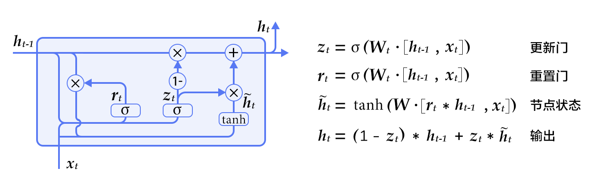
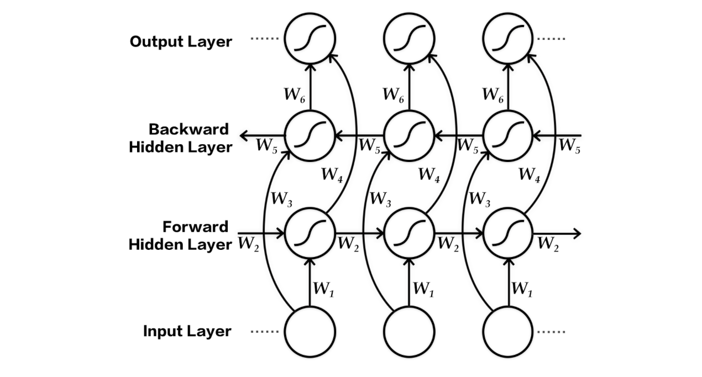

The minimum PaddlePaddle version needed for the code sample in this directory is v0.10.0. If you are on a version of PaddlePaddle earlier than v0.10.0, [please update your installation](http://www.paddlepaddle.org/docs/develop/documentation/en/build_and_install/pip_install_en.html).

---

# Neural Machine Translation Model

## Background Introduction
Neural Machine Translation (NMT) is a simple new architecture for getting machines to learn to translate. Traditional machine translation methods are mainly based on phrase-based statistical translation approaches that use separately engineered subcomponents rules or statistical models. NMT models use deep learning and representation learning. This example describes how to construct an end-to-end neural machine translation (NMT) model using the recurrent neural network (RNN) in PaddlePaddle.

## Model Overview
RNN-based neural machine translation follows the encoder-decoder architecture. A common choice for the encoder and decoder is the recurrent neural network (RNN), used by most NMT models. Below is an example diagram of a general approach for NMT.

<p align="center"><br/>Figure 1. Encoder - Decoder frame </ p>

The input and output of the neural machine translation model can be any of character, word or phrase. This example illustrates the word-based NMT.

- **Encoder**: Encodes the source language sentence into a vector as input to the decoder. The original input of the decoder is the `id` sequence $ w = {w_1, w_2, ..., w_T} $ of the word, expressed in the one-hot code. In order to reduce the input dimension, and to establish the semantic association between words, the model is a word that is expressed by hot independent code. Word embedding is a word vector. For more information about word vector, please refer to PaddleBook [word vector] (https://github.com/PaddlePaddle/book/blob/develop/04.word2vec/README.cn.md) chapter. Finally, the RNN unit processes the input word by word to get the encoding vector of the complete sentence.

- **Decoder**: Accepts the input of the encoder, decoding the target language sequence $ u = {u_1, u_2, ..., u_ {T '}} $ one by one. For each time step, the RNN unit outputs a hidden vector. Then the conditional probability of the next target word is calculated by `Softmax` normalization, i.e. $ P (u_i | w, u_1, u_2, ..., u_ {t- 1}) $. Thus, given the input $ w $, the corresponding translation result is $ u $

$$ P(u_1,u_2,...,u_{T'} | w) = \prod_{t=1}^{t={T'}}p(u_t|w, u_1, u_2, u_{t-1})$$

In Chinese to English translation, for example, the source language is Chinese, and the target language is English. The following is a sentence after the source language word segmentation.

```
祝愿 祖国 繁荣 昌盛
```

Corresponding target language English translation results for:

```
Wish motherland rich and powerful
```

In the preprocessing step, we prepare the parallel corpus data of the source language and the target language. Then we construct the dictionaries of the source language and the target language respectively. In the training stage, we use the pairwise parallel corpus training model. In the model test stage, the model automatically generates the corresponding English translation, and then it evaluates the resulting results with standard translations. For the evaluation metric, BLEU is most commonly used.

### RNN unit
The original structure of the RNN uses a vector to store the hidden state. However, the RNN of this structure is prone to have gradient vanishing problem, which is difficult to model for a long time. This issue can be addressed by using LSTM \[[1](#References)] and  GRU (Gated Recurrent Unit) \[[2](#References)]. This solves the problem of long-term dependency by carefully forgetting the previous information. In this example, we demonstrate the GRU based model.

<p align="center">
<br/>
图 2. GRU 单元
 </p>

We can see that, in addition to the implicit state, the GRU also contains two gates: the Update Gate and the Reset Gate. At each time step, the update of the threshold and the hidden state is determined by the formula on the right side of Figure 2. These two thresholds determine how the state is updated.

### Bi-directional Encoder
In the above basic model, when the encoder sequentially processes the input sentence sequence, the state of the current time contains only the history input information without the sequence information of the future time. For sequence modeling, the context of the future also contains important information. With the bi-directional encoder (Figure 3), we can get both information at the same time:

<p align="center">
<br/>
Figure 3. Bi-directional encoder structure diagram
 </p>


The bi-directional encoder \[[3](#References)\] shown in Figure 3 consists of two independent RNNs that encode the input sequence from the forward and backward, respectively. Then it combines the outputs of the two RNNs together, as the final encoding output.

In PaddlePaddle, bi-directional encoders can easily call using APIs:

```python
src_word_id = paddle.layer.data(
    name='source_language_word',
    type=paddle.data_type.integer_value_sequence(source_dict_dim))

# source embedding
src_embedding = paddle.layer.embedding(
    input=src_word_id, size=word_vector_dim)

# bidirectional GRU as encoder
encoded_vector = paddle.networks.bidirectional_gru(
    input=src_embedding,
    size=encoder_size,
    fwd_act=paddle.activation.Tanh(),
    fwd_gate_act=paddle.activation.Sigmoid(),
    bwd_act=paddle.activation.Tanh(),
    bwd_gate_act=paddle.activation.Sigmoid(),
    return_seq=True)
```

### Beam Search Algorithm
After the training is completed, the model will input and decode the corresponding target language translation result according to the source language. Decoding, a direct way is to take each step conditional probability of the largest word, as the current moment of output. But the local optimal does not necessarily guarantee the global optimal. If the search for the full space is large, the cost is too large. In order to solve this problem, beam search algorithm is commonly used. Beam search is a heuristic graph search algorithm that controls the search width with a parameter $ k $] as follows:

**1**. During decoding, always maintain $ k $ decoded sub-sequences;

**2**. At the middle of time $ t $, for each sequence in the $ k $ sub-sequence, calculate the probability of the next word and take the maximum of $ k $ words with the largest probability, combining $ k ^ 2 $ New child sequence;

**3**. Take the maximum probability of $ k $ in these combination sequences to update the original subsequence;

**4**. iterate through it until you get $ k $ complete sentences as candidates for translation results.

For more information on beam search, refer to the [beam search](https://github.com/PaddlePaddle/book/blob/develop/08.machine_translation/README.md#beam-search-algorithm) section in PaddleBook [machine translation](https://github.com/PaddlePaddle/book/tree/develop/08.machine_translation) chapter.


### Decoder without Attention mechanism
- In the relevant section of PaddleBook (https://github.com/PaddlePaddle/book/blob/develop/08.machine_translation/README.cn.md), the Attention Mechanism has been introduced. This example demonstrates Encoder-Decoder structure without attention mechanism. With regard to the attention mechanism, please refer to PaddleBook and references \[[3](#References)].

In PaddlePaddle, commonly used RNN units can be conveniently called using APIs. For example, `recurrent_layer_group` can be used to implement custom actions at each point in the RNN. First, customize the single-step logic function, and then use the function `recurrent_group ()` to cycle through the single-step logic function to process the entire sequence. In this case, the unattended mechanism of the decoder uses `recurrent_layer_group` to implement the function` gru_decoder_without_attention () `. Corresponding code is as follows:


```python
# the initialization state for decoder GRU
encoder_last = paddle.layer.last_seq(input=encoded_vector)
encoder_last_projected = paddle.layer.fc(
    size=decoder_size, act=paddle.activation.Tanh(), input=encoder_last)

# the step function for decoder GRU
def gru_decoder_without_attention(enc_vec, current_word):
    '''
    Step function for gru decoder
    :param enc_vec: encoded vector of source language
    :type enc_vec: layer object
    :param current_word: current input of decoder
    :type current_word: layer object
    '''
    decoder_mem = paddle.layer.memory(
            name="gru_decoder",
            size=decoder_size,
            boot_layer=encoder_last_projected)

    context = paddle.layer.last_seq(input=enc_vec)

    decoder_inputs = paddle.layer.fc(
        size=decoder_size * 3, input=[context, current_word])

    gru_step = paddle.layer.gru_step(
        name="gru_decoder",
        act=paddle.activation.Tanh(),
        gate_act=paddle.activation.Sigmoid(),
        input=decoder_inputs,
        output_mem=decoder_mem,
        size=decoder_size)

     out = paddle.layer.fc(
        size=target_dict_dim,
        bias_attr=True,
        act=paddle.activation.Softmax(),
        input=gru_step)
    return out  
```

In the model training and testing phase, the behavior of the decoder is different:

- **Training phase**: The word vector of the target translation `trg_embedding` is passed as a parameter to the single step logic` gru_decoder_without_attention () `. The function` recurrent_group () `loop calls the single step logic execution, and finally calculates the target translation with the actual decoding;
- **Testing phase**: The decoder predicts the next word based on the last generated word, `GeneratedInput ()`. The automatic fetch model predicts the highest probability of the $ k $ word vector passed to the single step logic. Then the beam_search () function calls the function `gru_decoder_without_attention ()` to complete the beam search and returns as a result.

The training and generated returns are implemented in the following `if-else` conditional branches:

```python
group_input1 = paddle.layer.StaticInput(input=encoded_vector)
group_inputs = [group_input1]

decoder_group_name = "decoder_group"
if is_generating:
    trg_embedding = paddle.layer.GeneratedInput(
        size=target_dict_dim,
        embedding_name="_target_language_embedding",
        embedding_size=word_vector_dim)
    group_inputs.append(trg_embedding)

    beam_gen = paddle.layer.beam_search(
        name=decoder_group_name,
        step=gru_decoder_without_attention,
        input=group_inputs,
        bos_id=0,
        eos_id=1,
        beam_size=beam_size,
        max_length=max_length)

    return beam_gen
else:
    trg_embedding = paddle.layer.embedding(
        input=paddle.layer.data(
            name="target_language_word",
            type=paddle.data_type.integer_value_sequence(target_dict_dim)),
        size=word_vector_dim,
        param_attr=paddle.attr.ParamAttr(name="_target_language_embedding"))
    group_inputs.append(trg_embedding)

    decoder = paddle.layer.recurrent_group(
        name=decoder_group_name,
        step=gru_decoder_without_attention,
        input=group_inputs)

    lbl = paddle.layer.data(
        name="target_language_next_word",
        type=paddle.data_type.integer_value_sequence(target_dict_dim))
    cost = paddle.layer.classification_cost(input=decoder, label=lbl)

    return cost
```

## Data Preparation
The data used in this example is from [WMT14] (http://www-lium.univ-lemans.fr/~schwenk/cslm_joint_paper/), which is a parallel corpus of French-to-English translation. Use [bitexts] (http://www-lium.univ-lemans.fr/~schwenk/cslm_joint_paper/data/bitexts.tgz) as training data, [dev + test data] (http://www-lium.univ-lemans.fr/~schwenk/cslm_joint_paper/data/dev+test.tgz) as validation and test data. PaddlePaddle has been packaged in the data set of the read interface, in the first run, the program will automatically complete the download. Users do not need to manually complete the relevant data preparation!

## Model Training and Testing

### Model Training

Starting the model training is very simple, just in the command line window to execute `python train.py`. The `train ()` function in the `train.py` script of the model training phase completes the following logic:

**a) Define the network, parse the network structure, initialize the model parameters.**

```python
# define the network topolgy.
cost = seq2seq_net(source_dict_dim, target_dict_dim)
parameters = paddle.parameters.create(cost)
```

**b) Set the training process optimization strategy. Define the training data to read `reader`**

```python
# define optimization method
optimizer = paddle.optimizer.RMSProp(
    learning_rate=1e-3,
    gradient_clipping_threshold=10.0,
    regularization=paddle.optimizer.L2Regularization(rate=8e-4))

# define the trainer instance
trainer = paddle.trainer.SGD(
    cost=cost, parameters=parameters, update_equation=optimizer)

# define data reader
wmt14_reader = paddle.batch(
    paddle.reader.shuffle(
        paddle.dataset.wmt14.train(source_dict_dim), buf_size=8192),
    batch_size=55)
```

**c) Define the event handle, print the training intermediate results, save the model snapshot**

```python
# define the event_handler callback
def event_handler(event):
    if isinstance(event, paddle.event.EndIteration):
        if not event.batch_id % 100 and event.batch_id:
            with gzip.open(
                    os.path.join(save_path,
                                 "nmt_without_att_%05d_batch_%05d.tar.gz" %
                                 event.pass_id, event.batch_id), "w") as f:
                parameters.to_tar(f)

        if event.batch_id and not event.batch_id % 10:
            logger.info("Pass %d, Batch %d, Cost %f, %s" % (
                event.pass_id, event.batch_id, event.cost, event.metrics))
```

**d) Start training**

```python
# start training
trainer.train(
    reader=wmt14_reader, event_handler=event_handler, num_passes=2)
```

The output sample is

```text
Pass 0, Batch 0, Cost 267.674663, {'classification_error_evaluator': 1.0}
.........
Pass 0, Batch 10, Cost 172.892294, {'classification_error_evaluator': 0.953895092010498}
.........
Pass 0, Batch 20, Cost 177.989329, {'classification_error_evaluator': 0.9052488207817078}
.........
Pass 0, Batch 30, Cost 153.633665, {'classification_error_evaluator': 0.8643803596496582}
.........
Pass 0, Batch 40, Cost 168.170543, {'classification_error_evaluator': 0.8348183631896973}
```

### Generate Translation Results
In PaddlePaddle, it is also easy to use translated models to generate translated text.

1. First of all, please modify the `generate.py` script` main` passed to the `generate` function parameters to choose which saved model to use. The default parameters are as follows:

    ```python
    generate(
        source_dict_dim=30000,
        target_dict_dim=30000,
        batch_size=20,
        beam_size=3,
        model_path="models/nmt_without_att_params_batch_00100.tar.gz")
    ```

2. In the terminal phase, execute the `python generate.py` command. The` generate () `in the script executes the following code:

    **a) Load the test sample**

    ```python
    # load data  samples for generation
    gen_creator = paddle.dataset.wmt14.gen(source_dict_dim)
    gen_data = []
    for item in gen_creator():
        gen_data.append((item[0], ))
    ```

    **b) Initialize the model, execute `infer ()` for each input sample to generate `beam search` translation results**

    ```python
    beam_gen = seq2seq_net(source_dict_dim, target_dict_dim, True)
    with gzip.open(init_models_path) as f:
        parameters = paddle.parameters.Parameters.from_tar(f)
    # prob is the prediction probabilities, and id is the prediction word.
    beam_result = paddle.infer(
        output_layer=beam_gen,
        parameters=parameters,
        input=gen_data,
        field=['prob', 'id'])
    ```

    **c) Next, load the source and target language dictionaries, convert the sentences represented by the `id` sequence into the original language and output the results.**

    ```python
    beam_result = inferer.infer(input=test_batch, field=["prob", "id"])

    gen_sen_idx = np.where(beam_result[1] == -1)[0]
    assert len(gen_sen_idx) == len(test_batch) * beam_size

    start_pos, end_pos = 1, 0
    for i, sample in enumerate(test_batch):
        print(" ".join([
            src_dict[w] for w in sample[0][1:-1]
        ]))  # skip the start and ending mark when print the source sentence
        for j in xrange(beam_size):
            end_pos = gen_sen_idx[i * beam_size + j]
            print("%.4f\t%s" % (beam_result[0][i][j], " ".join(
                trg_dict[w] for w in beam_result[1][start_pos:end_pos])))
            start_pos = end_pos + 2
        print("\n")
    ```

Set the width of the beam search to 3, enter a French sentence. Then it automatically generate the corresponding test data for the translation results, the output format is as follows:

```text
Elles connaissent leur entreprise mieux que personne .
-3.754819        They know their business better than anyone . <e>
-4.445528        They know their businesses better than anyone . <e>
-5.026885        They know their business better than anybody . <e>

```
- The first line of input for the source language.
- Second ~ beam_size + 1 line is the result of the `beam_size` translation generated by the column search
    - the output of the same row is separated into two columns by "\ t", the first column is the log probability of the sentence, and the second column is the text of the translation result.
    - the symbol `<s>` represents the beginning of the sentence, the symbol `<e>` indicates the end of a sentence, and if there is a word that is not included in the dictionary, it is replaced with the symbol `<unk>`.

So far, we have implemented a basic machine translation model using PaddlePaddle. We can see, PaddlePaddle provides a flexible and rich API. This enables users to easily choose and use a various complex network configuration. NMT itself is also a rapidly developing field, and many new ideas continue to emerge. This example is a basic implementation of NMT. Users can also implement more complex NMT models using PaddlePaddle.


## References
[1] Sutskever I, Vinyals O, Le Q V. [Sequence to Sequence Learning with Neural Networks] (https://arxiv.org/abs/1409.3215) [J]. 2014, 4: 3104-3112.

[2] Cho K, Van Merriënboer B, Gulcehre C, et al. [Learning phrase representations using RNN encoder-decoder for statistical machine translation](http://www.aclweb.org/anthology/D/D14/D14-1179.pdf) [C]. Proceedings of the 2014 Conference on Empirical Methods in Natural Language Processing (EMNLP), 2014: 1724-1734.

[3] Bahdanau D, Cho K, Bengio Y. [Neural machine translation by exclusive learning to align and translate] (https://arxiv.org/abs/1409.0473) [C]. Proceedings of ICLR 2015, 2015
