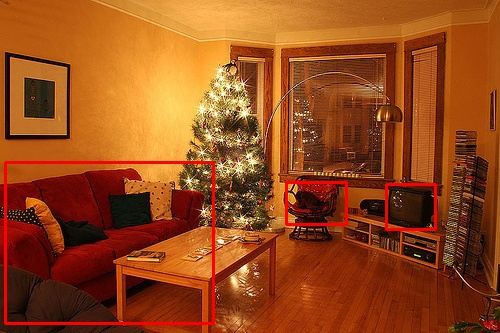
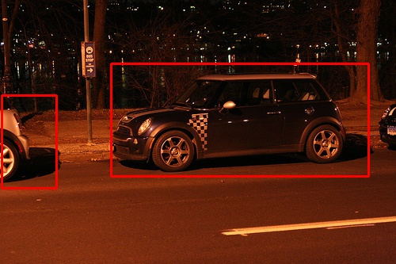
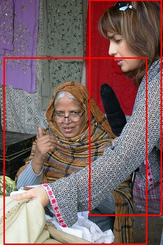
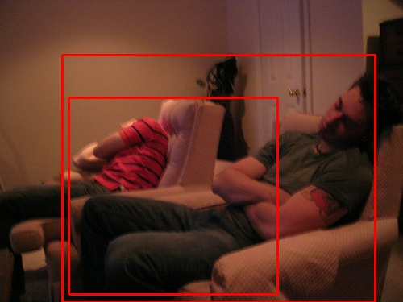

运行本目录下的程序示例需要使用PaddlePaddle v0.10.0 版本。如果您的PaddlePaddle安装版本低于此要求，请按照[安装文档](http://www.paddlepaddle.org/docs/develop/documentation/zh/build_and_install/pip_install_cn.html)中的说明更新PaddlePaddle安装版本。

---

# SSD目标检测
## 概述
SSD全称：Single Shot MultiBox Detector，是目标检测领域较新且效果较好的检测算法之一\[[1](#引用)\]，有着检测速度快且检测精度高的有的。PaddlePaddle已集成SSD算法，本示例旨在介绍如何使用PaddlePaddle中的SSD模型进行目标检测。下文首先简要介绍SSD原理，然后介绍示例包含文件及如何使用，接着介绍如何在PASCAL VOC数据集上训练、评估及检测，最后简要介绍如何在自有数据集上使用SSD。

## SSD原理
SSD使用一个卷积神经网络实现“端到端”的检测：输入为原始图像，输出为检测结果，无需借助外部工具或流程进行特征提取、候选框生成等。论文中SSD使用VGG16\[[2](#引用)\]作为基础网络进行图像特征提取。但SSD对原始VGG16网络做了一些改变：

1. 将最后的fc6、fc7全连接层变为卷积层，卷积层参数通过对原始fc6、fc7参数采样得到。
2. 将pool5层的参数由2x2-s2（kernel大小为2x2，stride size为2）更改为3x3-s1-p1（kernel大小为3x3，stride size为1，padding size为1）。
3. 在conv4\_3、conv7、conv8\_2、conv9\_2、conv10\_2及pool11层后面接了priorbox层，priorbox层的主要目的是根据输入的特征图（feature map）生成一系列的矩形候选框。更详细的介绍可参考\[[1](#引用)\]。

下图为模型（输入图像尺寸：300x300）的总体结构：

<p align="center">
 <br/>
图1. SSD 网络结构
</p>

图中每个矩形盒子代表一个卷积层，最后两个矩形框分别表示汇总各卷积层输出结果和后处理阶段。在预测阶段，网络会输出一组候选矩形框，每个矩形包含：位置和类别得分。图中倒数第二个矩形框即表示网络的检测结果的汇总处理。由于候选矩形框数量较多且很多矩形框重叠严重，这时需要经过后处理来筛选出质量较高的少数矩形框，主要方法有非极大值抑制（Non-maximum Suppression）。

从SSD的网络结构可以看出，候选矩形框在多个特征图（feature map）上生成，不同的feature map具有的感受野不同，这样可以在不同尺度扫描图像，相对于其他检测方法可以生成更丰富的候选框，从而提高检测精度；另一方面SSD对VGG16的扩展部分以较小的代价实现对候选框的位置和类别得分的计算，整个过程只需要一个卷积神经网络完成，所以速度较快。

## 示例总览
本示例共包含如下文件：

<table>
<caption>表1. 示例文件</caption>
<tr><th>文件</th><th>用途</th></tr>
<tr><td>train.py</td><td>训练脚本</td></tr>
<tr><td>eval.py</td><td>评估脚本，用于评估训好模型</td></tr>
<tr><td>infer.py</td><td>检测脚本，给定图片及模型，实施检测</td></tr>
<tr><td>visual.py</td><td>检测结果可视化</td></tr>
<tr><td>image_util.py</td><td>图像预处理所需公共函数</td></tr>
<tr><td>data_provider.py</td><td>数据处理脚本，生成训练、评估或检测所需数据</td></tr>
<tr><td>config/pascal_voc_conf.py</td><td>神经网络超参数配置文件</td></tr>
<tr><td>data/label_list</td><td>类别列表</td></tr>
<tr><td>data/prepare_voc_data.py</td><td>准备训练PASCAL VOC数据列表</td></tr>
</table>

训练阶段需要对数据做预处理，包括裁剪、采样等，这部分操作在```image_util.py```和```data_provider.py```中完成。

需要注意：**```config/vgg_config.py```是参数配置文件，含有训练参数、神经网络参数等。配置文件中的参数针对PASCAL VOC数据集而配置，当训练自有数据时，需要进行针对性的修改。**

```data/prepare_voc_data.py```脚本用来生成文件列表，包括切分训练集和测试集，使用时需要事先下载并解压数据，默认采用VOC2007和VOC2012。

## PASCAL VOC数据集
### 数据准备

1. 请首先下载数据集：VOC2007\[[3](#引用)\]和VOC2012\[[4](#引用)\]。VOC2007包含训练集和测试集，VOC2012只包含训练集，将下载好的数据解压，目录结构为```data/VOCdevkit/VOC2007```和```data/VOCdevkit/VOC2012```。
1. 进入```data```目录，运行```python prepare_voc_data.py```即可生成```trainval.txt```和```test.txt```。核心函数为：

    ```python
    def prepare_filelist(devkit_dir, years, output_dir):
        trainval_list = []
        test_list = []
        for year in years:
            trainval, test = walk_dir(devkit_dir, year)
            trainval_list.extend(trainval)
            test_list.extend(test)
        random.shuffle(trainval_list)
        with open(osp.join(output_dir, 'trainval.txt'), 'w') as ftrainval:
            for item in trainval_list:
                ftrainval.write(item[0] + ' ' + item[1] + '\n')

        with open(osp.join(output_dir, 'test.txt'), 'w') as ftest:
            for item in test_list:
                ftest.write(item[0] + ' ' + item[1] + '\n')
    ```

   该函数首先对每一年（year）数据进行处理，然后将训练图像的文件路径列表进行随机乱序，最后保存训练文件列表和测试文件列表。默认```prepare_voc_data.py```和```VOCdevkit```在相同目录下，且生成的文件列表也在该目录次数。

   需注意```trainval.txt```既包含VOC2007的训练数据，也包含VOC2012的训练数据，```test.txt```只包含VOC2007的测试数据。

   下面是```trainval.txt```前几行输入示例：

    ```text
    VOCdevkit/VOC2007/JPEGImages/000005.jpg VOCdevkit/VOC2007/Annotations/000005.xml
    VOCdevkit/VOC2007/JPEGImages/000007.jpg VOCdevkit/VOC2007/Annotations/000007.xml
    VOCdevkit/VOC2007/JPEGImages/000009.jpg VOCdevkit/VOC2007/Annotations/000009.xml
    ```

    文件共两个字段，第一个字段为图像文件的相对路径，第二个字段为对应标注文件的相对路径。

### 预训练模型准备
下载预训练的VGG-16模型，我们提供了一个转换好的模型，下载模型[http://paddlemodels.bj.bcebos.com/v2/vgg_model.tar.gz](http://paddlemodels.bj.bcebos.com/v2/vgg_model.tar.gz)，并将其放置路径为```vgg/vgg_model.tar.gz```。

### 模型训练
直接执行```python train.py```即可进行训练。需要注意本示例仅支持CUDA GPU环境，无法在CPU上训练，主要因为使用CPU训练速度很慢，实践中一般使用GPU来处理图像任务，这里实现采用硬编码方式使用cuDNN，不提供CPU版本。```train.py```的一些关键执行逻辑：

```python
paddle.init(use_gpu=True, trainer_count=4)
data_args = data_provider.Settings(
                data_dir='./data',
                label_file='label_list',
                resize_h=cfg.IMG_HEIGHT,
                resize_w=cfg.IMG_WIDTH,
                mean_value=[104,117,124])
train(train_file_list='./data/trainval.txt',
      dev_file_list='./data/test.txt',
      data_args=data_args,
      init_model_path='./vgg/vgg_model.tar.gz')
```

主要包括：

1. 调用```paddle.init```指定使用4卡GPU训练。
2. 调用```data_provider.Settings```配置数据预处理所需参数，其中```cfg.IMG_HEIGHT```和```cfg.IMG_WIDTH```在配置文件```config/vgg_config.py```中设置，这里均为300，300x300是一个典型配置，兼顾效率和检测精度，也可以通过修改配置文件扩展到512x512。
3. 调用```train```执行训练，其中```train_file_list```指定训练数据列表，```dev_file_list```指定评估数据列表，```init_model_path```指定预训练模型位置。
4. 训练过程中会打印一些日志信息，每训练1个batch会输出当前的轮数、当前batch的cost及mAP（mean Average Precision，平均精度均值），每训练一个pass，会保存一次模型，默认保存在```checkpoints```目录下（注：需事先创建）。

下面给出SDD300x300在VOC数据集（train包括07+12，test为07）上的mAP曲线，迭代140轮mAP可达到71.52%。

<p align="center">
 <br/>
图2. SSD300x300 mAP收敛曲线
</p>


### 模型评估
执行```python eval.py```即可对模型进行评估，```eval.py```的关键执行逻辑如下：

```python
paddle.init(use_gpu=True, trainer_count=4)  # use 4 gpus

data_args = data_provider.Settings(
    data_dir='./data',
    label_file='label_list',
    resize_h=cfg.IMG_HEIGHT,
    resize_w=cfg.IMG_WIDTH,
    mean_value=[104, 117, 124])

eval(
    eval_file_list='./data/test.txt',
    batch_size=4,
    data_args=data_args,
    model_path='models/pass-00000.tar.gz')
```

调用```paddle.init```指定使用4卡GPU评估；```data_provider.Settings```参见训练阶段的配置；调用```eval```执行评估，其中```eval_file_list```指定评估数据列表，```batch_size```指定评估时batch size的大小，```model_path ```指定模型:位置。评估结束会输出```loss```信息和```mAP```信息。

### 图像检测
执行```python infer.py```即可使用训练好的模型对图片实施检测，```infer.py```关键逻辑如下：

```python
infer(
    eval_file_list='./data/infer.txt',
    save_path='infer.res',
    data_args=data_args,
    batch_size=4,
    model_path='models/pass-00000.tar.gz',
    threshold=0.3)
```

其中```eval_file_list```指定图像路径列表；```save_path```指定预测结果保存路径；```data_args```如上；```batch_size```为每多少样本预测一次；```model_path```指模型的位置；```threshold```为置信度阈值，只有得分大于或等于该值的才会输出。下面给出```infer.res```的一些输出样例：

```text
VOCdevkit/VOC2007/JPEGImages/006936.jpg 12 0.997844 131.255611777 162.271582842 396.475315094 334.0
VOCdevkit/VOC2007/JPEGImages/006936.jpg 14 0.998557 229.160234332 49.5991278887 314.098775387 312.913876176
VOCdevkit/VOC2007/JPEGImages/006936.jpg 14 0.372522 187.543615699 133.727034628 345.647156239 327.448492289
...
```

共包含4个字段，以tab分割，第一个字段是检测图像路径，第二字段为检测矩形框内类别，第三个字段是置信度，第四个字段是4个坐标值（以空格分割）。

示例还提供了一个可视化脚本，直接运行```python visual.py```即可，须指定输出检测结果路径及输出目录，默认可视化后图像保存在```./visual_res```，下面是用训练好的模型infer部分图像并可视化的效果：

<p align="center">



 <br />
图3. SSD300x300 检测可视化示例
</p>


## 自有数据集
在自有数据上训练PaddlePaddle SSD需要完成两个关键准备，首先需要适配网络可以接受的输入格式，这里提供一个推荐的结构，以```train.txt```为例

```text
image00000_file_path    image00000_annotation_file_path
image00001_file_path    image00001_annotation_file_path
image00002_file_path    image00002_annotation_file_path
...
```

文件共两列，以空白符分割，第一列为图像文件的路径，第二列为对应标注数据的文件路径。对图像文件的读取比较直接，略微复杂的是对标注数据的解析，本示例中标注数据使用xml文件存储，所以需要在```data_provider.py```中对xml解析，核心逻辑如下：

```python
bbox_labels = []
root = xml.etree.ElementTree.parse(label_path).getroot()
for object in root.findall('object'):
    bbox_sample = []
    # start from 1
    bbox_sample.append(float(settings.label_list.index(
         object.find('name').text)))
    bbox = object.find('bndbox')
    difficult = float(object.find('difficult').text)
    bbox_sample.append(float(bbox.find('xmin').text)/img_width)
    bbox_sample.append(float(bbox.find('ymin').text)/img_height)
    bbox_sample.append(float(bbox.find('xmax').text)/img_width)
    bbox_sample.append(float(bbox.find('ymax').text)/img_height)
    bbox_sample.append(difficult)
    bbox_labels.append(bbox_sample)
```

这里一条标注数据包括：label、xmin、ymin、xmax、ymax和is\_difficult，is\_difficult表示该object是否为难例，实际中如果不需要，只需把该字段置零即可。自有数据也需要提供对应的解析逻辑，假设标注数据（比如image00000\_annotation\_file\_path）存储格式如下：

```text
label1 xmin1 ymin1 xmax1 ymax1
label2 xmin2 ymin2 xmax2 ymax2
...
```

每行对应一个物体，共5个字段，第一个为label（注背景为0，需从1编号），剩余4个为坐标，对应的解析逻辑可更改为如下：

```python
bbox_labels = []
with open(label_path) as flabel:
    for line in flabel:
        bbox_sample = []
        bbox = [float(i) for i in line.strip().split()]
        label = bbox[0]
        bbox_sample.append(label)
        bbox_sample.append(bbox[1]/float(img_width))
        bbox_sample.append(bbox[2]/float(img_height))
        bbox_sample.append(bbox[3]/float(img_width))
        bbox_sample.append(bbox[4]/float(img_height))
        bbox_sample.append(0.0)
        bbox_labels.append(bbox_sample)
```

**同时需要注意根据图像大小及检测物体的大小等更改网络结构相关的超参数，请仿照```config/vgg_config.py```创建自己的配置文件，参数设置经验请参考论文\[[1](#引用)\]。**

## 引用
1. Wei Liu, Dragomir Anguelov, Dumitru Erhan, Christian Szegedy, Scott Reed, Cheng-Yang Fu, Alexander C. Berg. [SSD: Single shot multibox detector](https://arxiv.org/abs/1512.02325). European conference on computer vision. Springer, Cham, 2016.
2. Simonyan, Karen, and Andrew Zisserman. [Very deep convolutional networks for large-scale image recognition](https://arxiv.org/abs/1409.1556). arXiv preprint arXiv:1409.1556 (2014).
3. [The PASCAL Visual Object Classes Challenge 2007](http://host.robots.ox.ac.uk/pascal/VOC/voc2007/index.html)
4. [Visual Object Classes Challenge 2012 (VOC2012)](http://host.robots.ox.ac.uk/pascal/VOC/voc2012/index.html)
