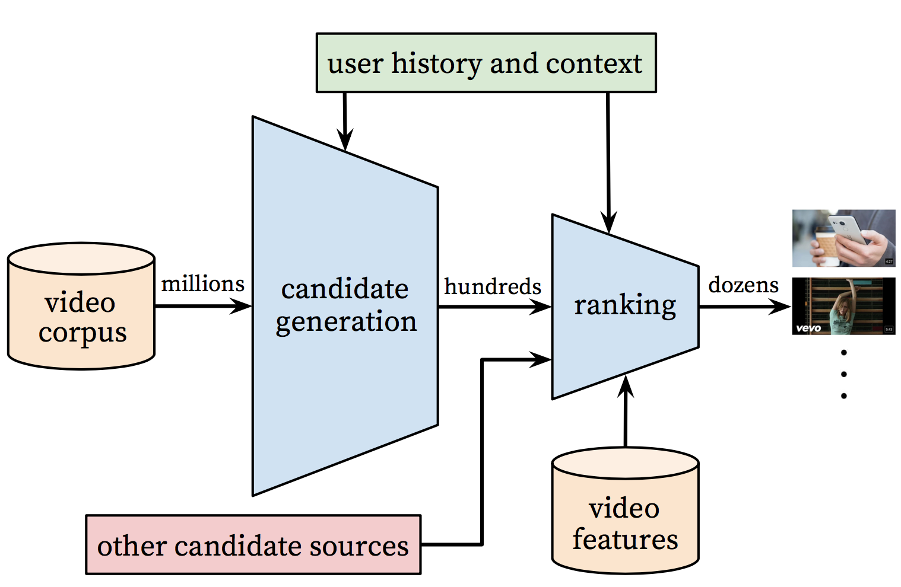
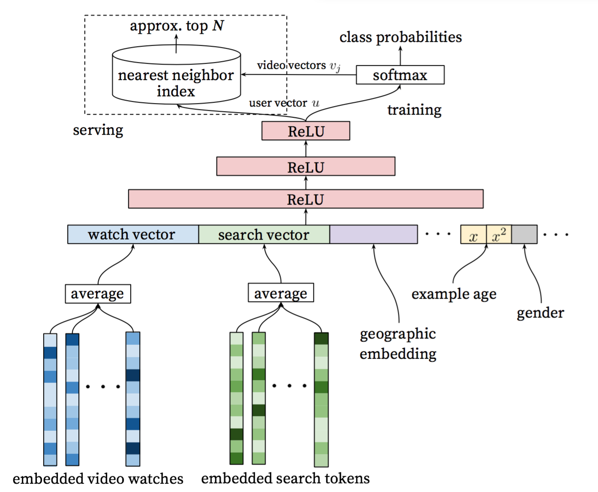

The minimum PaddlePaddle version needed for the code sample in this directory is v0.10.0. If you are on a version of PaddlePaddle earlier than v0.10.0, [please update your installation](http://www.paddlepaddle.org/docs/develop/documentation/en/build_and_install/pip_install_en.html).

---

# Deep Neural Networks for YouTube Recommendations

## Introduction\[[1](#References)\]
YouTube is the world's largest platform for creating, sharing and discovering video content. Youtube recommendations are responsible for helping more than a billion users discover personalized content from an ever-growing corpus of videos.
- Scale: Many existing recommendation algorithm proven to work well on small problems fail to operate on massive scale. Highly specialized distributed learning algorithms and efficient serving systems are essential.
- Freshness: YouTube has a very dynamic corpus with many hours of video are uploaded per second. The recommendation system should model newly uploaded content as well as the latest actions taken by user.
- Noise: Historical user behavior on YouTube is inherently difficult to predict due to sparsity and a variety of unobservable external factors. Furthermore, the noisy implicit feedback signals instead of the ground truth of user satisfaction is observed, and metadata associated with content is poorly structured, which forces the algorithms to be robust.

The overall structure of the recommendation system is illustrated in Figure 1.
<p align="center">
 <br/>
Figure 1. Recommendation system architecture[1]
</p>

The system is comprised of two neural networks: one for candidate generation and one for ranking.
- The candidate generation network: It takes events from the user's YouTube activity history as input and retrieves a small subset(hundreds) of videos, highly relevant to the user, from a large corpus. The similarity between users is expressed in terms of coarse features such as IDs of video watches, search query tokens and demographics.
- The ranking network: It accomplishes this task by assigning a score to each video according to a desired objective function using a rich set of features describing the video and user.

This markdown describes the principle and use of the candidate generation network in detail.

## Candidate Generation
Here, candidate generation is modeled as extreme multiclass classification where the prediction problem becomes accurately classifying a specific video watch  at time  among millions of video  (classes) from a corpus  based on user  and context ,

%3D%5Cfrac%7Be%5E%7B%5Cmathbf%7Bv_i%7D%5Cmathbf%7Bu%7D%7D%7D%7B%5Csum_%7Bj%5Cin%20V%7D%5E%7B%20%7De%5E%7B%5Cmathbf%7Bv_j%7D%5Cmathbf%7Bu%7D%7D%7D)

where  represents a high-dimensional "embedding" of the user, context pair and the  represent embeddings of each candidate video. The task of the deep neural network is to learn user embeddings  as a function of the user's history and context that are useful for discriminating among videos with a softmax classifier.

Figure 2 shows the general network architecture of candidate generation model:
<p align="center">
 <br/>
Figure 2. Candidate generation model architecture[1]
</p>

- Input layer: A user's watch history is represented by a variable-length sequence of sparse video IDs, and search history is similarly represented by a variable-length sequence of search tokens.
- Embedding layer: The input features each is mapped to a fixed-sized dense vector representation via the embeddings, and then simply averaging the embeddings. The embeddings are learned jointly with all other model parameters through normal gradient descent back-propagation updates.
- Hidden layer: Features are concatenated into a wide first layer, followed by several layers of fully connected Rectified Linear Units (ReLU). The output of the last ReLU layer is the previous mentioned high-dimensional "embedding" of the user , so called user vector.
- Output layer: A softmax classifier is connected to do discriminating millions of classes (videos). To speed up training process, a technique is applied that samples negative classes from background distribution with importance weighting. The previous mentioned high-dimensional "embedding" of the candidate video  is obtained by weight and bias of the softmax layer. At serving time, the most likely N classes (videos) is computed for presenting to the user. To Score millions of items under a strict serving laterncy, the scoring problem reduces to a nearest neighbor search in the dot product space, and Locality Sensitive Hashing is relied on.

## Data Pre-processing
In this example, here moke the click log of users as sample data, and its format is as follows:
```
user-id \t province \t city \t history-clicked-video-info-sequence \t phone

history-clicked-video-info-sequence is formated as
video-info1;video-info2;...;video-infoK

video-info is formated as
video-id:category:tag1_tag2_tag3_...tagM

For example:
USER_ID_15  Shanghai  Shanghai    VIDEO_42:CATEGORY_9:TAG115;VIDEO_43:CATEGORY_9:TAG116_TAG115;VIDEO_44:CATEGORY_2:TAG117_TAG71  GO T5
```
Run this code in `youtube_recall` directory (the same below) to prepare the sample data.
```
cd data
tar -zxvf data.tar
```

Then, run `data_preprocess.py` for data pre-processiong. Refer to the following instructions：
```
usage: data_processor.py [-h] --train_set_path TRAIN_SET_PATH --output_dir
                         OUTPUT_DIR [--feat_appear_limit FEAT_APPEAR_LIMIT]

PaddlePaddle Deep Candidate Generation Example

optional arguments:
  -h, --help            show this help message and exit
  --train_set_path TRAIN_SET_PATH
                        path of the train set
  --output_dir OUTPUT_DIR
                        directory to output
  --feat_appear_limit FEAT_APPEAR_LIMIT
                        the minimum number of feature values appears (default:
                        20)
```
The fucntion of this script is as follows:
- Filter low-frequency features\[[2](#References)\], which appears less than `feat_appear_limit` times.
- Encode features, and generate dictionary `feature_dict.pkl`.
- Count the probability of each video appears and write into `item_freq.pkl`, and provide it to NCE layer.

For example, run the following command to accomplish data pre-processing:
```
mkdir output
python data_processor.py --train_set_path=./data/train.txt \
                                     --output_dir=./output \
                                     --feat_appear_limit=20
```

## Model Implementaion
The details of model implementation is illustrated as follows. The code is in `./network_conf.py`.

### Input layer
```python
def _build_input_layer(self):
    """
    build input layer
    """
    self._history_clicked_items = paddle.layer.data(
        name="history_clicked_items", type=paddle.data_type.integer_value_sequence(
            len(self._feature_dict['history_clicked_items'])))
    self._history_clicked_categories = paddle.layer.data(
        name="history_clicked_categories", type=paddle.data_type.integer_value_sequence(
            len(self._feature_dict['history_clicked_categories'])))
    self._history_clicked_tags = paddle.layer.data(
        name="history_clicked_tags", type=paddle.data_type.integer_value_sequence(
            len(self._feature_dict['history_clicked_tags'])))
    self._user_id = paddle.layer.data(
        name="user_id", type=paddle.data_type.integer_value(
            len(self._feature_dict['user_id'])))
    self._province = paddle.layer.data(
        name="province", type=paddle.data_type.integer_value(
            len(self._feature_dict['province'])))
    self._city = paddle.layer.data(
        name="city", type=paddle.data_type.integer_value(len(self._feature_dict['city'])))
    self._phone = paddle.layer.data(
        name="phone", type=paddle.data_type.integer_value(len(self._feature_dict['phone'])))
    self._target_item = paddle.layer.data(
        name="target_item", type=paddle.data_type.integer_value(
            len(self._feature_dict['history_clicked_items'])))
```

### Embedding layer
The each of input features is mapped to a fixed-sized dense vector representation
```python
def _create_emb_attr(self, name):
    """
    create embedding parameter
    """
    return paddle.attr.Param(
        name=name, initial_std=0.001, learning_rate=1, l2_rate=0, sparse_update=False)

def _build_embedding_layer(self):
    """
    build embedding layer
    """
    self._user_id_emb = paddle.layer.embedding(input=self._user_id,
                                               size=64,
                                               param_attr=self._create_emb_attr(
                                                   '_proj_user_id'))
    self._province_emb = paddle.layer.embedding(input=self._province,
                                                size=8,
                                                param_attr=self._create_emb_attr(
                                                    '_proj_province'))
    self._city_emb = paddle.layer.embedding(input=self._city,
                                            size=16,
                                            param_attr=self._create_emb_attr('_proj_city'))
    self._phone_emb = paddle.layer.embedding(input=self._phone,
                                             size=16,
                                             param_attr=self._create_emb_attr('_proj_phone'))
    self._history_clicked_items_emb = paddle.layer.embedding(
        input=self._history_clicked_items,
        size=64,
        param_attr=self._create_emb_attr('_proj_history_clicked_items'))
    self._history_clicked_categories_emb = paddle.layer.embedding(
        input=self._history_clicked_categories,
        size=8,
        param_attr=self._create_emb_attr('_proj_history_clicked_categories'))
    self._history_clicked_tags_emb = paddle.layer.embedding(
        input=self._history_clicked_tags,
        size=64,
        param_attr=self._create_emb_attr('_proj_history_clicked_tags'))
```

### Hiddern layer
Here improves the original networks in \[[Original Paper](#References)\](Covington, Paul, Jay Adams, and Emre Sargin. "Deep neural networks for youtube recommendations." Proceedings of the 10th ACM Conference on Recommender Systems. ACM, 2016.)
- By modifying that the embeddings of video watches are not simply averaged but are connected to a LSTM layer with max temporal pooling instead, so that the deep sequential information related to user interests can be learned well.
- Considering data scale and efficiency of training, only two ReLU layers are applied, which also leads to good performance.

```python
self._rnn_cell = paddle.networks.simple_lstm(input=self._history_clicked_items_emb, size=64)
self._lstm_last = paddle.layer.pooling(
    input=self._rnn_cell, pooling_type=paddle.pooling.Max())
self._avg_emb_cats = paddle.layer.pooling(input=self._history_clicked_categories_emb,
                                          pooling_type=paddle.pooling.Avg())
self._avg_emb_tags = paddle.layer.pooling(input=self._history_clicked_tags_emb,
                                          pooling_type=paddle.pooling.Avg())
self._fc_0 = paddle.layer.fc(
    name="Relu1",
    input=[self._lstm_last, self._user_id_emb,
           self._city_emb, self._phone_emb],
    size=self._dnn_layer_dims[0],
    act=paddle.activation.Relu())

self._fc_1 = paddle.layer.fc(
    name="Relu2",
    input=self._fc_0,
    size=self._dnn_layer_dims[1],
    act=paddle.activation.Relu())
```

### Output layer
To speed up training process, Noise-contrastive estimation, NCE\[[3](#references)\] is applied to sample negative classes from background distribution with importance weighting. The previous mentioned `item_freq.pkl`[data pre-processing](#data pre-processing) is used as neg_distribution.
```python
return paddle.layer.nce(
                input=self._fc_1,
                label=self._target_item,
                num_classes=len(self._feature_dict['history_clicked_items']),
                param_attr=paddle.attr.Param(name="nce_w"),
                bias_attr=paddle.attr.Param(name="nce_b"),
                num_neg_samples=5,
                neg_distribution=self._item_freq)
```

## Train
First of all, prepare `reader.py`, the function of which is to convert raw features into encoding id. One piece of train data generates several data instances according to `window_size`, and then is fed into trainer.
```
window_size=2
train data:
user-id \t province \t city \t video-info1;video-info2;...;video-infoK \t phone

several data instances:
user-id,province,city,[<unk>,video-id1],[<unk>,category1],[<unk>,tags1],phone,video-id2
user-id,province,city,[video-id1,video-id2],[category1,category2],[tags1,tags2],phone,video-id3
user-id,province,city,[video-id2,video-id3],[category2,category3],[tags2,tags3],phone,video-id4
......
```
The relevant code is as follows:
```python
for i in range(1, len(history_clicked_items_all)):
    start = max(0, i - self._window_size)
    history_clicked_items = history_clicked_items_all[start:i]
    history_clicked_categories = history_clicked_categories_all[start:i]
    history_clicked_tags_str = history_clicked_tags_all[start:i]
    history_clicked_tags = []
    for tags_a in history_clicked_tags_str:
        for tag in tags_a.split("_"):
            history_clicked_tags.append(int(tag))
    target_item = history_clicked_items_all[i]
    yield user_id, province, city, \
          history_clicked_items, history_clicked_categories, \
          history_clicked_tags, phone, target_item
```
```python
reader = Reader(feature_dict, args.window_size)
    trainer.train(
        paddle.batch(
            paddle.reader.shuffle(
                lambda: reader.train(args.train_set_path),
                buf_size=7000), args.batch_size),
        num_passes=args.num_passes,
        feeding=feeding,
        event_handler=event_handler)
```
Then start training.
```shell
mkdir output/model
python train.py --train_set_path='./data/train.txt' \
    --test_set_path='./data/test.txt' \
    --model_output_dir='./output/model/' \
    --feature_dict='./output/feature_dict.pkl' \
    --item_freq='./output/item_freq.pkl'
```

## Offline prediction
Input user related features, and then get the most likely N videos for user.
```shell
python infer.py --infer_set_path='./data/infer.txt' \
    --model_path='./output/model/model_pass_00000.tar.gz' \
    --feature_dict='./output/feature_dict.pkl' \
    --batch_size=50
```

## Online prediction
For online prediction, Approximate Nearest Neighbor(ANN) is adopted to directly recall top N most likely watch video. Here shows how to get user vector and video vector.

### User Vector
User vector is the output of the last RELU layer with cascading a constant term 1 in the front. Here the dimension of the last RELU layer is 31, and thus the dimension of user vector is 32.


### Video Vector
Video vector is extracted from the parameters of softmax layer. If there are M different videos, the output of softmax layer will be the probability of click of these M videos.


To get  from user vector , a  matrix which consists of the parameters w, b of softmax layer is multiplied. Each column of this matrix is a 32-dim video vector, according to the dictionary order one by one.


### SIMPLE-LSH conversion

However, most of ANN systems currently only support cosin sorting, not by inner product sorting, which leads to big effect difference.

To solve it, user and video vectors are sliently modified by a SIMPLE-LSH conversion\[[4](#References)\], so that inner sorting is equivalent to cosin sorting after conversion.

Details are as follows:
- For video vector , . The modified video vector , and let .

- For user vector , and the modified user vector , and let , where  is normalized .

When online predicting, for a coming , it should recall  by inner product sorting. After  conversion, the order of inner prodct sorting is unchanged. Since  and  are both equal to 1, %20%3D%20%5Ctilde%7B%5Cmathbf%7Bu%7D%7D%5Ccdot%20%5Ctilde%7B%5Cmathbf%7Bv%7D%7D), which makes cosin-supported-only ANN system works.

And in order to retain precision, use  is also equivalent.

### Implemention
Run `user_vector.py` to generate user vector. First input the features into network and then infer. The output of the last RELU layer is saved in variable probs[1]. By cascading a contant term 1 in the front and making SIMPLE-LSH conversion, user vector is generated.
```python
probs = inferer.infer(
        input=test_batch,
        feeding=feeding,
        field=["value"],
        flatten_result=False)
for i, res in enumerate(zip(probs[1])):
    # do simple lsh conversion
    user_vector = [1.000]
    for i in res[0]:
        user_vector.append(i)
    user_vector.append(0.000)
    norm = np.linalg.norm(user_vector)
    user_vector_norm = [str(_ / norm) for _ in user_vector]
    print ",".join(user_vector_norm)
```

Run `item_vector.py` to generate video vector. First load the model and extract the parameters nce_w and nce_b. And then generate ith video vector by putting nce_b[0][i] in the first dimension and nce_b[0][i] in the next. Finally make SIMPLE-LSH conversion, finding the maximum norm and processing according to .

```python
# load the trained model.
    with gzip.open(args.model_path) as f:
        parameters = paddle.parameters.Parameters.from_tar(f)

    nce_w = parameters.get("nce_w")
    nce_b = parameters.get("nce_b")
    item_vector = convt_simple_lsh(get_item_vec_from_softmax(nce_w, nce_b))

def get_item_vec_from_softmax(nce_w, nce_b):
    """
    get item vectors from softmax parameter
    """
    if nce_w is None or nce_b is None:
        return None
    vector = []
    total_items_num = nce_w.shape[0]
    if total_items_num != nce_b.shape[1]:
        return None
    dim_vector = nce_w.shape[1] + 1
    for i in range(0, total_items_num):
        vector.append([])
        vector[i].append(nce_b[0][i])
        for j in range(1, dim_vector):
            vector[i].append(nce_w[i][j - 1])
    return vector


def convt_simple_lsh(vector):
    """
    do simple lsh conversion
    """
    max_norm = 0
    num_of_vec = len(vector)
    for i in range(0, num_of_vec):
        norm = np.linalg.norm(vector[i])
        if norm > max_norm:
            max_norm = norm
    for i in range(0, num_of_vec):
        vector[i].append(
            math.sqrt(
                math.pow(max_norm, 2) - math.pow(np.linalg.norm(vector[i]), 2)))
    return vector
```

Use `user_vector.py` and `item_vector.py` to calculate user and item vectors. For example, run the following commands:
```shell
python user_vector.py --infer_set_path='./data/infer.txt' \
        --model_path='./output/model/model_pass_00000.tar.gz' \
            --feature_dict='./output/feature_dict.pkl' \
                --batch_size=50
python item_vector.py --model_path='./output/model/model_pass_00000.tar.gz' \
            --feature_dict='./output/feature_dict.pkl'
```

## Offline data mining
Since it is inevitable to consume large amount of machine resources for online predicting, an alternative is offline data mining, e.g. hottest videos, user personalized recommendation, item-based recommendation, and online systems directly access it. Here shows an example to get user personalized recommendation.
```
python infer_user.py --model_path='./output/model/model_pass_00000.tar.gz' \
            --feature_dict='./output/feature_dict.pkl'
```

## References
1. Covington, Paul, Jay Adams, and Emre Sargin. "Deep neural networks for youtube recommendations." Proceedings of the 10th ACM Conference on Recommender Systems. ACM, 2016.
2. https://code.google.com/archive/p/word2vec/
3. http://paddlepaddle.org/docs/develop/models/nce_cost/README.html
4. Neyshabur, Behnam, and Nathan Srebro. "On symmetric and asymmetric LSHs for inner product search." arXiv preprint arXiv:1410.5518 (2014).
