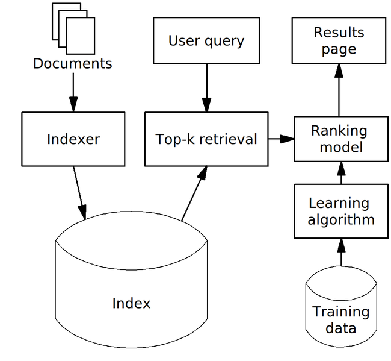
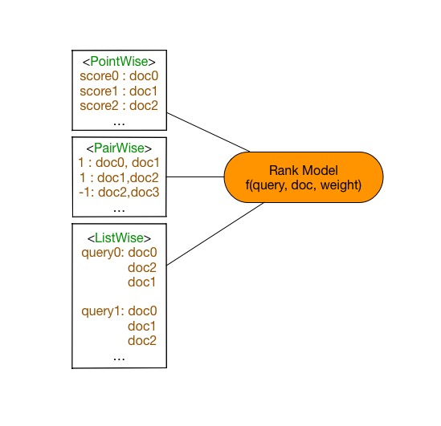
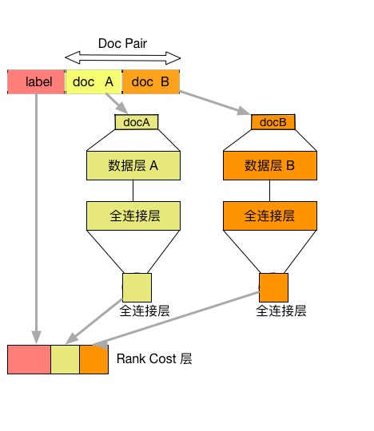
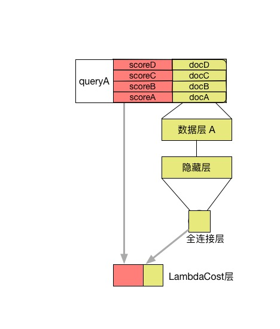

运行本目录下的程序示例需要使用PaddlePaddle v0.10.0 版本。如果您的PaddlePaddle安装版本低于此要求，请按照[安装文档](http://www.paddlepaddle.org/docs/develop/documentation/zh/build_and_install/pip_install_cn.html)中的说明更新PaddlePaddle安装版本。

---

# 排序学习(Learning To Rank)

排序学习技术\[[1](#参考文献1)\]是构建排序模型的机器学习方法，在信息检索、自然语言处理，数据挖掘等机器学场景中具有重要作用。排序学习的主要目的是对给定一组文档，对任意查询请求给出反映相关性的文档排序。在本例子中，利用标注过的语料库训练两种经典排序模型RankNet[[4](#参考文献4)\]和LamdaRank[[6](#参考文献6)\]，分别可以生成对应的排序模型，能够对任意查询请求，给出相关性文档排序。

## 背景介绍

排序学习技术随着互联网的快速增长而受到越来越多关注，是机器学习中的常见任务之一。一方面人工排序规则不能处理海量规模的候选数据，另一方面无法为不同渠道的候选数据给于合适的权重，因此排序学习在日常生活中应用非常广泛。排序学习起源于信息检索领域，目前仍然是许多信息检索场景中的核心模块，例如搜索引擎搜索结果排序，推荐系统候选集排序，在线广告排序等等。本例以文档检索任务阐述排序学习模型。

<p align="center">
<br/>
图1. 排序模型在文档检索的典型应用搜索引擎中的作用
</p>

假定有一组文档$S$，文档检索任务是依据和请求的相关性，给出文档排列顺序。查询引擎根据查询请求，排序模型会给每个文档打出分数，依据打分情况倒序排列文档，得到查询结果。在训练模型时，给定一条查询，并给出对应的文档最佳排序和得分。在预测时候，给出查询请求，排序模型生成文档排序。常见的排序学习方法划分为以下三类：

- Pointwise 方法

  Pointwise方法是通过近似为回归问题解决排序问题，输入的单条样本为**得分-文档**，将每个查询-文档对的相关性得分作为实数分数或者序数分数，使得单个查询-文档对作为样本点(Pointwise的由来)，训练排序模型。预测时候对于指定输入，给出查询-文档对的相关性得分。

- Pairwise方法

  Pairwise方法是通过近似为分类问题解决排序问题，输入的单条样本为**标签-文档对**。对于一次查询的多个结果文档，组合任意两个文档形成文档对作为输入样本。即学习一个二分类器，对输入的一对文档对AB（Pairwise的由来），根据A相关性是否比B好，二分类器给出分类标签1或0。对所有文档对进行分类，就可以得到一组偏序关系，从而构造文档全集的排序关系。该类方法的原理是对给定的文档全集$S$，降低排序中的逆序文档对的个数来降低排序错误，从而达到优化排序结果的目的。

- Listwise方法

  Listwise方法是直接优化排序列表，输入为单条样本为一个**文档排列**。通过构造合适的度量函数衡量当前文档排序和最优排序差值，优化度量函数得到排序模型。由于度量函数很多具有非连续性的性质，优化困难。

<p align="center">
<br/>
图2. 排序模型三类方法
</p>

## 实验数据

本例中的实验数据采用了排序学习中的基准数据[LETOR]([http://research.microsoft.com/en-us/um/beijing/projects/letor/LETOR4.0/Data/MQ2007.rar](http://research.microsoft.com/en-us/um/beijing/projects/letor/LETOR4.0/Data/MQ2007.rar))语料库，部分来自于Gov2网站的查询请求结果，包含了约1700条查询请求结果文档列表，并对文档相关性做出了人工标注。其中，一条查询含有唯一的查询id，对应于多个具有相关性的文档，构成了一次查询请求结果文档列表。每个文档由一个一维数组的特征向量表示，并对应一个人工标注与查询的相关性分数。

本例在第一次运行的时会自动下载LETOR MQ2007数据集并缓存，无需手动下载。

`mq2007`数据集分别提供了三种类型排序模型的生成格式，需要指定生成格式`format`

例如调用接口

```python
pairwise_train_dataset = functools.partial(paddle.dataset.mq2007.train, format="pairwise")
for label, left_doc, right_doc in pairwise_train_dataset():
    ...
```

## 模型概览

对于排序模型，本例中提供了Pairwise方法的模型RankNet和Listwise方法的模型LambdaRank，分别代表了两类学习方法。Pointwise方法的排序模型退化为回归问题，请参考PaddleBook中[推荐系统](https://github.com/PaddlePaddle/book/blob/develop/05.recommender_system/README.cn.md)一课。

## RankNet排序模型

[RankNet](http://icml.cc/2015/wp-content/uploads/2015/06/icml_ranking.pdf)是一种经典的Pairwise的排序学习方法，是典型的前向神经网络排序模型。在文档集合$S$中的第$i$个文档记做$U_i$，它的文档特征向量记做$x_i$，对于给定的一个文档对$U_i$, $U_j$，RankNet将输入的单个文档特征向量$x$映射到$f(x)$，得到$s_i=f(x_i)$, $s_j=f(x_j)$。将$U_i$相关性比$U_j$好的概率记做$P_{i,j}$，则

$$P_{i,j}=P(U_{i}>U_{j})=\frac{1}{1+e^{-\sigma (s_{i}-s_{j}))}}$$

由于排序度量函数大多数非连续，非光滑，因此RankNet需要一个可以优化的度量函数$C$。首先使用交叉熵作为度量函数衡量预测代价，将损失函数$C$记做

$$C_{i,j}=-\bar{P_{i,j}}logP_{i,j}-(1-\bar{P_{i,j}})log(1-P_{i,j})$$

其中$\bar{P_{i,j}}$代表真实概率，记做

$$\bar{P_{i,j}}=\frac{1}{2}(1+S_{i,j})$$

而$S_{i,j}$ = {+1,0}，表示$U_i$和$U_j$组成的Pair的标签，即Ui相关性是否好于$U_j$。

最终得到了可求导的度量损失函数

$$C=\frac{1}{2}(1-S_{i,j})\sigma (s_{i}-s{j})+log(1+e^{-\sigma (s_{i}-s_{j})})$$

可以使用常规的梯度下降方法进行优化。细节见[RankNet](http://icml.cc/2015/wp-content/uploads/2015/06/icml_ranking.pdf)

同时，得到文档$U_i$在排序优化过程的梯度信息为

$$\lambda _{i,j}=\frac{\partial C}{\partial s_{i}} = \frac{1}{2}(1-S_{i,j})-\frac{1}{1+e^{\sigma (s_{i}-s_{j})}}$$

表示的含义是本轮排序优化过程中文档$U_i$的上升或者下降量。

根据以上推论构造RankNet网络结构，由若干层隐藏层和全连接层构成，如图所示，将文档特征使用隐藏层，全连接层逐层变换，完成了底层特征空间到高层特征空间的变换。其中docA和docB结构对称，分别输入到最终的RankCost层中。

<p align="center">
<br/>
图3. RankNet网络结构示意图
</p>

- 全连接层(fully connected layer) : 指上一层中的每个节点都连接到下层网络。本例子中同样使用`paddle.layer.fc`实现，注意输入到RankCost层的全连接层维度为1。
- RankCost层： RankCost层是排序网络RankNet的核心，度量docA相关性是否比docB好，给出预测值并和label比较。使用了交叉熵(cross enctropy)作为度量损失函数，使用梯度下降方法进行优化。细节可见[RankNet](http://icml.cc/2015/wp-content/uploads/2015/06/icml_ranking.pdf)[4]。

由于Pairwise中的网络结构是左右对称，可定义一半网络结构，另一半共享网络参数。在PaddlePaddle中允许网络结构中共享连接，具有相同名字的参数将会共享参数。使用PaddlePaddle实现RankNet排序模型，定义网络结构的示例代码见 [ranknet.py](ranknet.py) 中的 `half_ranknet` 函数。

`half_ranknet` 函数中定义的结构使用了和图3相同的模型结构：两层隐藏层，分别是`hidden_size=10`的全连接层和`hidden_size=1`的全连接层。本例中的`input_dim`指输入**单个文档**的特征的维度，label取值为1，0。每条输入样本为`<label>，<docA, docB>`的结构，以`docA`为例，输入`input_dim`的文档特征，依次变换成10维，1维特征，最终输入到RankCost层中，比较docA和docB在RankCost输出得到预测值。

### RankNet模型训练

训练`RankNet`模型在命令行执行：
```bash
python train.py --model_type ranknet
```
初次执行会自动下载数据，训练RankNet模型，并将每个轮次的模型参数存储下来。

### RankNet模型预测

使用训练好的`RankNet`模型继续进行预测，在命令行执行：
```bash
python infer.py --model_type ranknet --test_model_path models/ranknet_params_0.tar.gz
```

本例提供了rankNet模型的训练和预测两个部分。完成训练后的模型分为拓扑结构(需要注意`rank_cost`不是模型拓扑结构的一部分)和模型参数文件两部分。在本例子中复用了`ranknet`训练时的模型拓扑结构`half_ranknet`，模型参数从外存中加载。模型预测的输入为单个文档的特征向量，模型会给出相关性得分。将预测得分排序即可得到最终的文档相关性排序结果。

##  用户自定义RankNet数据

上述的代码使用了PaddlePaddle内置的排序数据，如果希望使用自定义格式数据，可以参考PaddlePaddle内置的`mq2007`数据集，编写一个新的生成器函数。例如输入数据为如下格式，只包含doc0-doc2三个文档。

\<query_id\> \<relevance_score\> \<feature_vector\>的格式(featureid: feature_value)

```
query_id : 1, relevance_score:1, feature_vector 0:0.1, 1:0.2, 2:0.4  #doc0
query_id : 1, relevance_score:2, feature_vector 0:0.3, 1:0.1, 2:0.4  #doc1
query_id : 1, relevance_score:0, feature_vector 0:0.2, 1:0.4, 2:0.1  #doc2
query_id : 2, relevance_score:0, feature_vector 0:0.1, 1:0.4, 2:0.1  #doc0
.....
```

需要将输入样本转换为Pairwise的输入格式，例如组合生成格式与mq2007 Pairwise格式相同的结构

\<label\> \<docA_feature_vector\>\<docB_feature_vector\>

```
1 doc1 doc0
1 doc1 doc2
1 doc0 doc2
....
```

注意，一般在Pairwise格式的数据中，label=1表示docA和查询的相关性好于docB，事实上label信息隐含在docA和docB组合pair中。如果存在`0 docA docB`，交换顺序构造`1 docB docA`即可。

另外组合所有的pair会有训练数据冗余，因为可以从部分偏序关系恢复文档集上的全序关系。相关研究见[PairWise approach](http://www.machinelearning.org/proceedings/icml2007/papers/139.pdf)[[5](#参考文献5)\]，本例不予赘述。

```python
# a customized data generator
def gen_pairwise_data(text_line_of_data):
    """
      return :
      ------
      label : np.array, shape=(1)
      docA_feature_vector : np.array, shape=(1, feature_dimension)
      docA_feature_vector : np.array, shape=(1, feature_dimension)
    """
    return label, docA_feature_vector, docB_feature_vector
```

对应于paddle的输入中，`integer_value`为单个整数，`dense_vector`为实数一维向量，与生成器对应，需要在训练模型之前指明输入数据对应关系。

```python
# Define the input data order
feeding = { "label":0,
            "left/data" :1,
            "right/data":2}
```

## LambdaRank排序模型

[LambdaRank](https://papers.nips.cc/paper/2971-learning-to-rank-with-nonsmooth-cost-functions.pdf)\[[6](#参考文献))\]是Listwise的排序方法，是Bugers[6]等人从RankNet发展而来，使用构造lambda函数(LambdaRank名字的由来)的方法优化度量标准NDCG(Normalized Discounted Cumulative Gain)，每个查询后得到的结果文档列表都单独作为一个训练样本。NDCG是信息论中很衡量文档列表排序质量的标准之一，前$K$个文档的NDCG得分记做

$$NDCG@K=Z_{k}\sum (2^{rel_{i}})1/log(k+1)$$

前文中RankNet中推导出，文档排序需要的是排序错误的梯度信息。NDCG度量函数是非光滑，非连续的，不能直接求得梯度信息，因此将|delta(NDCG)|=|NDCG(new) - NDCG(old)|引入，构造lambda函数为

$$\lambda _{i,j}=\frac{\partial C}{\partial s_{i}}=-\frac{\sigma }{1+e^{\sigma (s_{i}-s{j})}}|\Delta NDCG|$$

替换RankNet中的梯度表示，得到的排序模型称为[LambdaRank](https://papers.nips.cc/paper/2971-learning-to-rank-with-nonsmooth-cost-functions.pdf)

由以上推导可知，LambdaRank网络结构和RankNet结构非常相似。如图所示

<p align="center">
<br/>
图4. LambdaRank的网络结构示意图
</p>

一个查询得到的结果文档列表作为一条样本输入到网络中，替换RankCost为LambdaCost层，其他结构与RankNet相同。

- LambdaCost层 : LambdaCost层使用NDCG差值作为Lambda函数，score是一个一维的序列，对于单调训练样本全连接层输出的是1x1的序列，二者的序列长度都等于该条查询得到的文档数量。Lambda函数的构造详细见[LambdaRank](https://papers.nips.cc/paper/2971-learning-to-rank-with-nonsmooth-cost-functions.pdf)

使用PaddlePaddle定义LambdaRank网络结构的示例代见 [lambda_rank.py](lambda_rank.py) 中的`lambda_rank`函数。

上述结构中使用了和图3相同的模型结构。和RankNet相似，分别使用了`hidden_size=10`和`hidden_size=1`的两个全连接层。本例中的input_dim指输入**单个文档**的特征的维度。每条输入样本为label，\<docA, docB\>的结构，以docA为例，输入input_dim的文档特征，依次变换成10维，1维特征，最终输入到LambdaCost层中。需要注意这里的label和data格式为**dense_vector_sequence**，表示一列文档得分或者文档特征组成的**序列**。

### LambdaRank模型训练

训练`LambdaRank`模型在命令行执行：
```bash
python train.py --model_type lambdarank
```
初次运行脚本会自动下载数据训练LambdaRank模型，并将每个轮次的模型存储下来。

### LambdaRank模型预测

LambdaRank模型预测过程和RankNet相同。预测时的模型拓扑结构复用代码中的模型定义，从外存加载对应的参数文件。预测时的输入是文档列表，输出是该文档列表的各个文档相关性打分，根据打分对文档进行重新排序，即可得到最终的文档排序结果。

使用训练好的`LambdaRank`模型继续进行预测，在命令行执行：
```bash
python infer.py --model_type lambdarank --test_model_path models/lambda_rank_params_0.tar.gz
```

## 自定义 LambdaRank数据

上面的代码使用了PaddlePaddle内置的mq2007数据，如果希望使用自定义格式数据，可以参考PaddlePaddle内置的`mq2007`数据集，编写一个生成器函数。例如输入数据为如下格式，只包含doc0-doc2三个文档。

\<query_id\> \<relevance_score\> \<feature_vector\>的格式

```
query_id : 1, relevance_score:1, feature_vector 0:0.1, 1:0.2, 2:0.4  #doc0
query_id : 1, relevance_score:2, feature_vector 0:0.3, 1:0.1, 2:0.4  #doc1
query_id : 1, relevance_score:0, feature_vector 0:0.2, 1:0.4, 2:0.1  #doc2
query_id : 2, relevance_score:0, feature_vector 0:0.1, 1:0.4, 2:0.1  #doc0
query_id : 2, relevance_score:2, feature_vector 0:0.1, 1:0.4, 2:0.1  #doc1
.....
```

需要转换为Listwise格式，例如

`<query_id><relevance_score> <feature_vector>`

```tex
1    1    0.1,0.2,0.4
1    2    0.3,0.1,0.4
1    0    0.2,0.4,0.1

2    0    0.1,0.4,0.1
2    2    0.1,0.4,0.1
......
```

**数据格式注意**

- 数据中每条样本对应的文档数量都必须大于`lambda_cost`层的NDCG_num
- 若单条样本对应的文档都为0，文档相关性都为0，NDCG计算无效，那么可以判定该query无效，我们在训练中过滤掉了这样的query。

```python
# self define data generator
def gen_listwise_data(text_all_lines_of_data):
    """
    return :
    ------
    label : np.array, shape=(samples_num, )
    querylist : np.array, shape=(samples_num, feature_dimension)
    """
    return label_list, query_docs_feature_vector_matrix
```

对应于PaddlePaddle输入，`label`的类型为`dense_vector_sequence`，是得分的序列，`data`的类型为`dense_vector_sequence`，是特征向量的序列输入，`input_dim`为单个文档的一维特征向量维度，与生成器对应，需要在训练模型之前指明输入数据对应关系。

```python
# Define the input data order
feeding = {"label":0,
           "data" : 1}
```

## 训练过程中输出自定义评估指标

这里，我们以 `RankNet` 为例，介绍如何在训练过程中输出自定义评估指标。这个方法同样可以用来在训练过程中获取网络某一层输出矩阵的值。

`RankNet`网络学习一个打分函数对左右两个输入进行打分，左右两个输入的分值差异越大，打分函数对正负例的区分能力越强，模型的泛化能力越好。假设我们希望输出：训练过程中模型对左右输入打分之差绝对值的平均值这样一个指标。为了计算这个自定义的指标，需要获取每个`mini-batch`之后分值层（对应着`ranknet`中的`name`为`left_score`和`right_score`的层）的输出矩阵。可以通过下面两步来实现这一功能：

1. 在`event_handler`中处理`PaddlePaddle`预定义的`paddle.event.EndIteration`或是`paddle.event.EndPass`事件。
2. 调用`event.gm.getLayerOutputs`，传入网络中指定层的名字，便可获取该层在一个`mini-batch`前向计算结束后的值。

下面是代码示例：

```python
def score_diff(right_score, left_score):
    return np.average(np.abs(right_score - left_score))

def event_handler(event):
    if isinstance(event, paddle.event.EndIteration):
        if event.batch_id % 25 == 0:
            diff = score_diff(
                event.gm.getLayerOutputs("right_score")["right_score"][
                    "value"],
                event.gm.getLayerOutputs("left_score")["left_score"][
                    "value"])
            logger.info(("Pass %d Batch %d : Cost %.6f, "
                         "average absolute diff scores: %.6f") %
                        (event.pass_id, event.batch_id, event.cost, diff))
```

## 总结

LTR在实际生活中有着广泛的应用。排序模型构造方法一般可划分为PointWise方法，Pairwise方法，Listwise方法，本例以LETOR的mq2007数据为例子，阐述了Pairwise的经典方法RankNet和Listwise方法中的LambdaRank，展示如何使用PaddlePaddle框架构造对应的排序模型结构，并提供了自定义数据类型样例。PaddlePaddle提供了灵活的编程接口，并可以使用一套代码运行在单机单GPU和多机分布式多GPU下实现LTR类型任务。

## 注意事项

1. 本例作为LTR的演示示例，**所采用的网络规模较小**，在应用中须结合实际情况调整网络复杂度，对网络规模重新进行设置。
2. 本例实验数据中的特征向量为**查询-文档对**的联合特征，当使用查询和文档的独立特征时，可参考[DSSM](https://github.com/PaddlePaddle/models/tree/develop/dssm)构建网络。

## 参考文献

1. https://en.wikipedia.org/wiki/Learning_to_rank
2. Liu T Y. [Learning to rank for information retrieval](http://ftp.nowpublishers.com/article/DownloadSummary/INR-016)[J]. Foundations and Trends® in Information Retrieval, 2009, 3(3): 225-331.
3. Li H. [Learning to rank for information retrieval and natural language processing](http://www.morganclaypool.com/doi/abs/10.2200/S00607ED2V01Y201410HLT026)[J]. Synthesis Lectures on Human Language Technologies, 2014, 7(3): 1-121.
4. Burges C, Shaked T, Renshaw E, et al. [Learning to rank using gradient descent](http://machinelearning.wustl.edu/mlpapers/paper_files/icml2005_BurgesSRLDHH05.pdf)[C]//Proceedings of the 22nd international conference on Machine learning. ACM, 2005: 89-96.
5. Cao Z, Qin T, Liu T Y, et al. [Learning to rank: from pairwise approach to listwise approach](http://machinelearning.wustl.edu/mlpapers/paper_files/icml2007_CaoQLTL07.pdf)[C]//Proceedings of the 24th international conference on Machine learning. ACM, 2007: 129-136.
6. Burges C J C, Ragno R, Le Q V. [Learning to rank with nonsmooth cost functions](https://papers.nips.cc/paper/2971-learning-to-rank-with-nonsmooth-cost-functions.pdf)[C]//NIPS. 2006, 6: 193-200.
