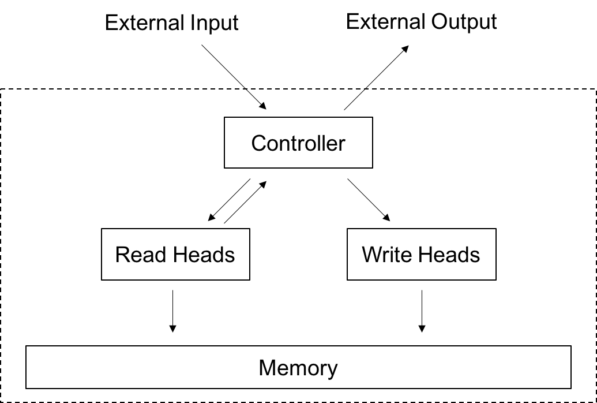

运行本目录下的程序示例需要使用PaddlePaddle v0.11.0 版本。如果您的PaddlePaddle安装版本低于此要求，请按照[安装文档](http://www.paddlepaddle.org/docs/develop/documentation/zh/build_and_install/pip_install_cn.html)中的说明更新PaddlePaddle安装版本。

---

# 带外部记忆机制的神经机器翻译

带**外部记忆**（External Memory）机制的神经机器翻译模型（Neural Machine Translation, NMT），是神经机器翻译模型的一个重要扩展。它引入可微分的记忆网络作为额外的记忆单元，拓展神经翻译模型内部工作记忆（Working Memory）的容量或带宽，辅助完成翻译等任务中信息的临时存取，改善模型表现。

类似模型不仅可应用于翻译任务，同时可广泛应用于其他需 “大容量动态记忆” 的任务，例如：机器阅读理解 / 问答、多轮对话、长文本生成等。同时，“记忆” 作为认知的重要部分之一，可用于强化其他多种机器学习模型的表现。

本文所采用的外部记忆机制，主要指**神经图灵机** \[[1](#参考文献)\] 方式（将于后文详细描述）。值得一提的是，神经图灵机仅仅是神经网络模拟记忆机制的尝试之一。记忆机制长久以来被广泛研究，近年来在深度学习的背景下，涌现出一系列有价值的工作，例如记忆网络（Memory Networks）、可微分神经计算机（Differentiable Neural Computers, DNC）等。本文仅讨论和实现神经图灵机机制。

本文的实现主要参考论文\[[2](#参考文献)\]， 并假设读者已充分阅读并理解 PaddlePaddle Book 中 [机器翻译](https://github.com/PaddlePaddle/book/tree/develop/08.machine_translation) 一章。


## 模型概述

### 记忆机制简介

记忆（Memory)，是认知的重要环节之一。记忆赋予认知在时间上的协调性，使得复杂认知（如推理、规划，不同于静态感知）成为可能。灵活的记忆机制，是机器模仿人类智能所需要拥有的关键能力之一。

#### 静态记忆

任何机器学习模型，原生就拥有一定的静态记忆能力：无论它是参数模型（模型参数即记忆），还是非参模型（样本即记忆）；无论是传统的 SVM（支持向量即记忆），还是神经网络模型（网络连接权值即记忆）。然而，这里的 “记忆” 绝大部分是指**静态记忆**，即在模型训练结束后，“记忆” 是固化的；在模型推断时，模型是静态一致的，不拥有额外的跨时间步的信息记忆能力。

#### 动态记忆 1 --- RNNs 中的隐状态向量

在处理序列认知问题（如自然语言处理、序列决策等）时，由于每个时间步对信息的处理需要依赖其他时间步的信息，我们往往需要在不同时间步上维持一个持久的信息通路。带有隐状态向量 $h$（或 LSTM 中的状态 $c$）的循环神经网络（Recurrent Neural Networks, RNNs） ，即拥有这样的 “**动态记忆**” 能力。每一个时间步，模型均可从 $h$ 或 $c$ 中获取过去时间步的 “记忆” 信息，并可往上持续叠加新的信息以更新记忆。在模型推断时，不同的样本具有完全不同的一组记忆信息（$h$ 或 $c$），具有 “动态” 性。

尽管上述对 LSTM中细胞状态 $c$ 的直觉说法有着诸多不严谨之处：例如从优化的角度看， $c$ 的引入或者 GRU 中的线性 Leaky 结构的引入，是为了在梯度计算中使得单步梯度的雅克比矩阵的谱分布更接近单位阵，以减轻长程梯度衰减问题，降低优化难度。但这不妨碍我们从直觉的角度将它理解为增加 “线性通路” 使得 “记忆通道” 更顺畅，如图1（引自[此文](http://colah.github.io/posts/2015-08-Understanding-LSTMs/)）所示的 LSTM 中的细胞状态向量 $c$ 可视为这样一个用于信息持久化的 “线性记忆通道”。

<div align="center">
<br/>
图1. LSTM 中的细胞状态向量作为 “记忆通道” 示意图
</div>

#### 动态记忆 2 --- Seq2Seq 中的注意力机制

然而上节所述的单个向量 $h$ 或 $c$ 的信息带宽有限。在序列到序列生成模型中，这样的带宽瓶颈更表现在信息从编码器（Encoder）转移至解码器（Decoder）的过程中：仅仅依赖一个有限长度的状态向量来编码整个变长的源语句，有着较大的潜在信息丢失。

\[[3](#参考文献)\] 提出了注意力机制（Attention Mechanism），以克服上述困难。在解码时，解码器不再仅仅依赖来自编码器的唯一的句级编码向量的信息，而是依赖一个向量组的记忆信息：向量组中的每个向量为编码器的各字符（Token）的编码向量（例如 $h_t$）。通过一组可学习的注意强度（Attention Weights) 来动态分配注意力资源，以线性加权方式读取信息，用于序列的不同时间步的符号生成（可参考 PaddlePaddle Book [机器翻译](https://github.com/PaddlePaddle/book/tree/develop/08.machine_translation)一章）。这种注意强度的分布，可看成基于内容的寻址（请参考神经图灵机 \[[1](#参考文献)\] 中的寻址描述），即在源语句的不同位置根据其内容决定不同的读取强度，起到一种和源语句 “软对齐（Soft Alignment）” 的作用。

相比上节的单个状态向量，这里的 “向量组” 蕴含着更多更精准的信息，例如它可以被认为是一个无界的外部记忆模块（Unbounded External Memory），有效拓宽记忆信息带宽。“无界” 指的是向量组的向量个数非固定，而是随着源语句的字符数的变化而变化，数量不受限。在源语句的编码完成时，该外部存储即被初始化为各字符的状态向量，而在其后的整个解码过程中被读取使用。

#### 动态记忆 3 --- 神经图灵机

图灵机（Turing Machine）或冯诺依曼体系（Von Neumann Architecture），是计算机体系结构的雏形。运算器（如代数计算）、控制器（如逻辑分支控制）和存储器三者一体，共同构成了当代计算机的核心运行机制。神经图灵机（Neural Turing Machines）\[[1](#参考文献)\] 试图利用神经网络模拟可微分（即可通过梯度下降来学习）的图灵机，以实现更复杂的智能。而一般的机器学习模型，大部分忽略了显式的动态存储。神经图灵机正是要弥补这样的潜在缺陷。

<div align="center">
<br/>
图2. 图灵机结构漫画
</div>

图灵机的存储机制，常被形象比喻成在一个纸带（Tape）的读写操作。读头（Read Head）和 写头（Write Head）负责在纸带上读出或者写入信息；纸袋的移动、读写头的读写动作和内容，则受控制器 （Contoller) 控制（见图2，引自[此处](http://www.worldofcomputing.net/theory/turing-machine.html)）；同时纸带的长度通常有限。

神经图灵机则以矩阵 $M \in \mathcal{R}^{n \times m}$ 模拟 “纸带”，其中 $n$ 为记忆向量（又成记忆槽）的数量，$m$ 为记忆向量的长度。以前馈神经网络或循环神经网络来模拟控制器，决定本次读写在不同的记忆槽上的读写强度分布，即寻址：

  - 基于内容的寻址（Content-based Addressing)：寻址强度依赖于记忆槽的内容和该次读写的实际内容；
  - 基于位置的寻址(Location-based Addressing)：寻址强度依赖于上次寻址操作的寻址强度（例如偏移）；
  - 混合寻址：混合上述寻址方式（例如线性插值）；

（详情请参考论文\[[1](#参考文献)\]）。根据寻址情况，图灵机写入 $M$ 或从 $M$ 读出信息，供其他网络使用。神经图灵机结构示意图，见图3，引自\[[1](#参考文献)\]。

<div align="center">
<br/>
图3. 神经图灵机结构示意图
</div>

和上节的注意力机制相比，神经图灵机有着诸多相同点和不同点。相同点例如：

- 均利用矩阵（或向量组）形式的外部存储。
- 均利用可微分的寻址方式。

不同在于：

- 神经图灵机有读有写，是真正意义上的存储器；而注意力机制在编码完成时即初始化存储内容（仅简单缓存，非可微分的写操作），在其后的解码过程中只读不写。
- 神经图灵机不仅有基于内容的寻址，同时结合基于位置的寻址，使得例如 “序列复制” 等需 “连续寻址” 的任务更容易；而注意力机制仅考虑基于内容的寻址，以实现 Soft Aligment。
- 神经图灵机利用有界（Bounded) 存储；而注意力机制利用无界（Unbounded）存储。

#### 三种记忆方式的混合，以强化神经机器翻译模型

尽管在一般的序列到序列模型中，注意力机制已经是标配。然而，注意机制中的外部存储仅用于存储编码器信息。在解码器内部，信息通路仍依赖 RNN 的状态单向量 $h$ 或 $c$。于是，利用神经图灵机的外部存储机制，来补充解码器内部的单向量信息通路，成为自然而然的想法。

于是，我们混合上述的三种动态记忆机制，即RNN 原有的状态向量、注意力机制被保留；同时，基于简化版的神经图灵机的有界外部记忆机制被引入以补充解码器单状态向量记忆。整体的模型实现参考论文\[[2](#参考文献)\]。少量的实现差异，详见[其他讨论](#其他讨论)一章。

这里额外需要理解的是，为什么不直接通过增加 $h$ 或 $c$的维度来扩大信息带宽？

- 一方面因为通过增加 $h$ 或 $c$的维度是以 $O(n^2)$ 的存储和计算复杂度为代价（状态-状态转移矩阵）；而基于神经图灵机的记忆扩展代价是 $O(n)$的，因其寻址是以记忆槽（Memory Slot）为单位，而控制器的参数结构仅仅是和 $m$（记忆槽的大小）有关。
- 基于状态单向量的记忆读写机制，仅有唯一的读写强度，即本质上是**全局**的；而神经图灵机的机制是**局部**的，即读写本质上仅在部分记忆槽（寻址强度的分布锐利，即真正大的强度仅分布于部分记忆槽）。局部的特性让记忆的存取更干净，干扰更小。


### 模型网络结构

网络总体结构在带注意机制的序列到序列结构（即RNNsearch\[[3](##参考文献)\]） 基础上叠加简化版神经图灵机\[[1](#参考文献)\]外部记忆模块。

- 编码器（Encoder）采用标准**双向 GRU 结构**（非 stack），不赘述。
- 解码器（Decoder）采用和论文\[[2](#参考文献)\] 基本相同的结构，见图4（修改自论文\[[2](#参考文献参考文献)\]) 。

<div align="center">
<br/>
图4. 通过外部记忆增强的解码器结构示意图
</div>

解码器结构图，解释如下：

1. $M_{t-1}^B$ 和 $M_t^B$ 为有界外部存储矩阵，前者为上一时间步存储矩阵的状态，后者为当前时间步的状态。$\textrm{read}^B$ 和 $\textrm{write}$ 为对应的读写头（包含其控制器）。$r_t$ 为对应的读出向量。
2. $M^S$ 为无界外部存储矩阵，$\textrm{read}^S$ 为对应的读头，二者配合即实现传统的注意力机制。$c_t$ 为对应的读出向量。
3. $y_{t-1}$ 为解码器上一步的输出字符并做词向量（Word Embedding）映射，作为当前步的输入，$y_t$ 为解码器当前步的解码符号的概率分布。
4. 虚线框内（除$M^S$外），整体可视为有界外部存储模块。可以看到，除去该部分，网络结构和 RNNsearch\[[3](#参考文献)\] 基本一致（略有不一致之处为：用于 attention 的 decoder state 被改进，即叠加了一隐层并引入了 $y_{t-1}$）。


## 算法实现

算法实现于以下几个文件中：

- `external_memory.py`: 主要实现简化版的 **神经图灵机** 于 `ExternalMemory` 类，对外提供初始化和读写函数。
- `model.py`: 相关模型配置函数，包括双向 GPU 编码器（`bidirectional_gru_encoder`），带外部记忆强化的解码器（`memory_enhanced_decoder`），带外部记忆强化的序列到序列模型（`memory_enhanced_seq2seq`）。
- `data_utils.py`: 相关数据处理辅助函数。
- `train.py`: 模型训练。
- `infer.py`: 部分示例样本的翻译（模型推断）。

### `ExternalMemory` 类

`ExternalMemory` 类实现通用的简化版**神经图灵机**。相比完整版神经图灵机，该类仅实现了基于内容的寻址（Content Addressing, Interpolation），不包括基于位置的寻址（ Convolutional Shift, Sharpening)。读者可以自行将其补充成为一个完整的神经图灵机。

该类结构如下：

```python
class ExternalMemory(object):
    """External neural memory class.

    A simplified Neural Turing Machines (NTM) with only content-based
    addressing (including content addressing and interpolation, but excluding
    convolutional shift and sharpening). It serves as an external differential
    memory bank, with differential write/read head controllers to store
    and read information dynamically as needed. Simple feedforward networks are
    used as the write/read head controllers.

    For more details, please refer to
    `Neural Turing Machines <https://arxiv.org/abs/1410.5401>`_.
    """

    def __init__(self,
                 name,
                 mem_slot_size,
                 boot_layer,
                 initial_weight,
                 readonly=False,
                 enable_interpolation=True):
        """ Initialization.

        :param name: Memory name.
        :type name: basestring
        :param mem_slot_size: Size of memory slot/vector.
        :type mem_slot_size: int
        :param boot_layer: Boot layer for initializing the external memory. The
                           sequence layer has sequence length indicating the number
                           of memory slots, and size as memory slot size.
        :type boot_layer: LayerOutput
        :param initial_weight: Initializer for addressing weights.
        :type initial_weight: LayerOutput
        :param readonly: If true, the memory is read-only, and write function cannot
                         be called. Default is false.
        :type readonly: bool
        :param enable_interpolation: If set true, the read/write addressing weights
                                     will be interpolated with the weights in the
                                     last step, with the affine coefficients being
                                     a learnable gate function.
        :type enable_interpolation: bool
        """
        pass

    def _content_addressing(self, key_vector):
        """Get write/read head's addressing weights via content-based addressing.
        """
        pass

    def _interpolation(self, head_name, key_vector, addressing_weight):
        """Interpolate between previous and current addressing weights.
        """
        pass

    def _get_addressing_weight(self, head_name, key_vector):
        """Get final addressing weights for read/write heads, including content
        addressing and interpolation.
        """
        pass

    def write(self, write_key):
        """Write onto the external memory.
        It cannot be called if "readonly" set True.

        :param write_key: Key vector for write heads to generate writing
                          content and addressing signals.
        :type write_key: LayerOutput
        """
        pass

    def read(self, read_key):
        """Read from the external memory.

        :param write_key: Key vector for read head to generate addressing
                          signals.
        :type write_key: LayerOutput
        :return: Content (vector) read from external memory.
        :rtype: LayerOutput
        """
        pass
```

其中，私有方法包含：

- `_content_addressing`: 通过基于内容的寻址，计算得到读写操作的寻址强度。
- `_interpolation`: 通过插值寻址（当前寻址强度和上一时间步寻址强度的线性加权），更新当前寻址强度。
- `_get_addressing_weight`: 调用上述两个寻址操作，获得对存储单元的读写操作的最终寻址强度。


对外接口包含：

- `__init__`：类实例初始化。
    - 输入参数 `name`: 外部记忆单元名，不同实例的相同命名将共享同一外部记忆单元。
    - 输入参数 `mem_slot_size`: 单个记忆槽（向量）的维度。
    - 输入参数 `boot_layer`: 用于内存槽初始化的层。需为序列类型，序列长度表明记忆槽的数量。
    - 输入参数 `initial_weight`: 用于初始化寻址强度。
    - 输入参数 `readonly`: 是否打开只读模式（例如打开只读模式，该实例可用于注意力机制）。打开只读模式，`write` 方法不可被调用。
    - 输入参数 `enable_interpolation`: 是否允许插值寻址（例如当用于注意力机制时，需要关闭插值寻址）。
- `write`: 写操作。
    - 输入参数 `write_key`：某层的输出，其包含的信息用于写头的寻址和实际写入信息的生成。
- `read`: 读操作。
    - 输入参数 `read_key`：某层的输出，其包含的信息用于读头的寻址。
    - 返回：读出的信息（可直接作为其他层的输入）。

部分关键实现逻辑：

- 神经图灵机的 “外部存储矩阵” 采用 `Paddle.layer.memory`实现。该序列的长度表示记忆槽的数量，序列的 `size` 表示记忆槽（向量）的大小。该序列依赖一个外部层作为初始化， 其记忆槽的数量取决于该层输出序列的长度。因此，该类不仅可用来实现有界记忆（Bounded Memory)，同时可用来实现无界记忆 (Unbounded Memory，即记忆槽数量可变)。

   ```python
   self.external_memory = paddle.layer.memory(
       name=self.name,
       size=self.mem_slot_size,
       boot_layer=boot_layer)
   ```
- `ExternalMemory`类的寻址逻辑通过 `_content_addressing` 和 `_interpolation` 两个私有方法实现。读和写操作通过 `read` 和 `write` 两个函数实现，包括上述的寻址操作。并且读和写的寻址独立进行，不同于 \[[2](#参考文献)\] 中的二者共享同一个寻址强度，目的是为了使得该类更通用。
- 为了简单起见，控制器（Controller）未被专门模块化，而是分散在各个寻址和读写函数中。控制器主要包括寻址操作和写操作时生成写入/擦除向量等，其中寻址操作通过上述的`_content_addressing` 和 `_interpolation` 两个私有方法实现，写操作时的写入/擦除向量的生成则在 `write` 方法中实现。上述均采用简单的前馈网络模拟控制器。读者可尝试剥离控制器逻辑并模块化，同时可尝试循环神经网络做控制器。
- `ExternalMemory` 类具有只读模式，同时差值寻址操作可关闭。主要目的是便于用该类等价实现传统的注意力机制。

- `ExternalMemory` 只能和 `paddle.layer.recurrent_group`配合使用，具体在用户自定义的 `step` 函数中使用（示例请详细代码），它不可以单独存在。

### `memory_enhanced_seq2seq` 及相关函数

涉及三个主要函数：

```python
def bidirectional_gru_encoder(input, size, word_vec_dim):
    """Bidirectional GRU encoder.

    :params size: Hidden cell number in decoder rnn.
    :type size: int
    :params word_vec_dim: Word embedding size.
    :type word_vec_dim: int
    :return: Tuple of 1. concatenated forward and backward hidden sequence.
             2. last state of backward rnn.
    :rtype: tuple of LayerOutput
    """
    pass


def memory_enhanced_decoder(input, target, initial_state, source_context, size,
                            word_vec_dim, dict_size, is_generating, beam_size):
    """GRU sequence decoder enhanced with external memory.

    The "external memory" refers to two types of memories.
    - Unbounded memory: i.e. attention mechanism in Seq2Seq.
    - Bounded memory: i.e. external memory in NTM.
    Both types of external memories can be implemented with
    ExternalMemory class, and are both exploited in this enhanced RNN decoder.

    The vanilla RNN/LSTM/GRU also has a narrow memory mechanism, namely the
    hidden state vector (or cell state in LSTM) carrying information through
    a span of sequence time, which is a successful design enriching the model
    with the capability to "remember" things in the long run. However, such a
    vector state is somewhat limited to a very narrow memory bandwidth. External
    memory introduced here could easily increase the memory capacity with linear
    complexity cost (rather than quadratic for vector state).

    This enhanced decoder expands its "memory passage" through two
    ExternalMemory objects:
    - Bounded memory for handling long-term information exchange within decoder
      itself. A direct expansion of traditional "vector" state.
    - Unbounded memory for handling source language's token-wise information.
      Exactly the attention mechanism over Seq2Seq.

    Notice that we take the attention mechanism as a particular form of external
    memory, with read-only memory bank initialized with encoder states, and a
    read head with content-based addressing (attention). From this view point,
    we arrive at a better understanding of attention mechanism itself and other
    external memory, and a concise and unified implementation for them.

    For more details about external memory, please refer to
    `Neural Turing Machines <https://arxiv.org/abs/1410.5401>`_.

    For more details about this memory-enhanced decoder, please
    refer to `Memory-enhanced Decoder for Neural Machine Translation
    <https://arxiv.org/abs/1606.02003>`_. This implementation is highly
    correlated to this paper, but with minor differences (e.g. put "write"
    before "read" to bypass a potential bug in V2 APIs. See
    (`issue <https://github.com/PaddlePaddle/Paddle/issues/2061>`_).
    """
    pass


def memory_enhanced_seq2seq(encoder_input, decoder_input, decoder_target,
                            hidden_size, word_vec_dim, dict_size, is_generating,
                            beam_size):
    """Seq2Seq Model enhanced with external memory.

    The "external memory" refers to two types of memories.
    - Unbounded memory: i.e. attention mechanism in Seq2Seq.
    - Bounded memory: i.e. external memory in NTM.
    Both types of external memories can be implemented with
    ExternalMemory class, and are both exploited in this Seq2Seq model.

    :params encoder_input: Encoder input.
    :type encoder_input: LayerOutput
    :params decoder_input: Decoder input.
    :type decoder_input: LayerOutput
    :params decoder_target: Decoder target.
    :type decoder_target: LayerOutput
    :params hidden_size: Hidden cell number, both in encoder and decoder rnn.
    :type hidden_size: int
    :params word_vec_dim: Word embedding size.
    :type word_vec_dim: int
    :param dict_size: Vocabulary size.
    :type dict_size: int
    :params is_generating: Whether for beam search inferencing (True) or
                           for training (False).
    :type is_generating: bool
    :params beam_size: Beam search width.
    :type beam_size: int
    :return: Cost layer if is_generating=False; Beam search layer if
             is_generating = True.
    :rtype: LayerOutput
    """
    pass
```

- `bidirectional_gru_encoder` 函数实现双向单层 GRU（Gated Recurrent Unit） 编码器。返回两组结果：一组为字符级编码向量序列（包含前后向），一组为整个源语句的句级编码向量（仅后向）。前者用于解码器的注意力机制中记忆矩阵的初始化，后者用于解码器的状态向量的初始化。

- `memory_enhanced_decoder` 函数实现通过外部记忆增强的 GRU 解码器。它利用同一个`ExternalMemory` 类实现两种外部记忆模块：

    - 无界外部记忆：即传统的注意力机制。利用`ExternalMemory`，打开只读开关，关闭插值寻址。并利用解码器的第一组输出作为 `ExternalMemory` 中存储矩阵的初始化（`boot_layer`）。因此，该存储的记忆槽数目是动态可变的，取决于编码器的字符数。

        ```python
        unbounded_memory = ExternalMemory(
            name="unbounded_memory",
            mem_slot_size=size * 2,
            boot_layer=unbounded_memory_init,
            initial_weight=unbounded_memory_weight_init,
            readonly=True,
            enable_interpolation=False)
        ```
    - 有界外部记忆：利用`ExternalMemory`，关闭只读开关，打开插值寻址。并利用解码器的第一组输出，取均值池化（pooling）后并扩展为指定序列长度后，叠加随机噪声（训练和推断时保持一致），作为 `ExternalMemory` 中存储矩阵的初始化（`boot_layer`）。因此，该存储的记忆槽数目是固定的。即代码中的：

        ```python
        bounded_memory = ExternalMemory(
            name="bounded_memory",
            mem_slot_size=size,
            boot_layer=bounded_memory_init,
            initial_weight=bounded_memory_weight_init,
            readonly=False,
            enable_interpolation=True)
        ```

    注意到，在我们的实现中，注意力机制（或无界外部存储）和神经图灵机（或有界外部存储）被实现成相同的 `ExternalMemory` 类。前者是**只读**的， 后者**可读可写**。这样处理仅仅是为了便于统一我们对 “注意机制” 和 “记忆机制” 的理解和认识，同时也提供更简洁和统一的实现版本。注意力机制也可以通过 `paddle.networks.simple_attention` 实现。

- `memory_enhanced_seq2seq` 函数定义整个带外部记忆机制的序列到序列模型，是模型定义的主调函数。它首先调用`bidirectional_gru_encoder` 对源语言进行编码，然后通过 `memory_enhanced_decoder` 进行解码。


此外，在该实现中，将 `ExternalMemory` 的 `write` 操作提前至 `read` 之前，以避开潜在的拓扑连接局限，详见 [Issue](https://github.com/PaddlePaddle/Paddle/issues/2061)。我们可以看到，本质上他们是等价的。

## 快速开始

### 数据自定义

数据是通过无参的 `reader()` 迭代器函数，进入训练过程。因此我们需要为训练数据和测试数据分别构造两个 `reader()` 迭代器。`reader()` 函数使用 `yield` 来实现迭代器功能（即可通过 `for instance in reader()` 方式迭代运行）， 例如

```python
def reader():
    for instance in data_list:
        yield instance
```

`yield` 返回的每条样本需为三元组，分别包含编码器输入字符列表（即源语言序列，需 ID 化），解码器输入字符列表（即目标语言序列，需 ID 化，且序列右移一位），解码器输出字符列表（即目标语言序列，需 ID 化）。

用户需自行完成字符的切分 (Tokenize) ，并构建字典完成 ID 化。

PaddlePaddle 的接口 [paddle.paddle.wmt14](https://github.com/PaddlePaddle/Paddle/blob/develop/python/paddle/v2/dataset/wmt14.py)， 默认提供了一个经过预处理的、较小规模的 [wmt14 英法翻译数据集的子集](http://paddlepaddle.bj.bcebos.com/demo/wmt_shrinked_data/wmt14.tgz)(该数据集有193319条训练数据，6003条测试数据，词典长度为30000)。并提供了两个reader creator函数如下：

```python
paddle.dataset.wmt14.train(dict_size)
paddle.dataset.wmt14.test(dict_size)
```

这两个函数被调用时即返回相应的`reader()`函数，供`paddle.traner.SGD.train`使用。当我们需要使用其他数据时，可参考 [paddle.paddle.wmt14](https://github.com/PaddlePaddle/Paddle/blob/develop/python/paddle/v2/dataset/wmt14.py) 构造相应的 data creator，并替换 `paddle.dataset.wmt14.train` 和 `paddle.dataset.wmt14.train` 成相应函数名。

### 训练

命令行输入：

```bash
python train.py
```
或自定义部分参数, 例如:

```bash
python train.py \
--dict_size 30000 \
--word_vec_dim 512 \
--hidden_size 1024 \
--memory_slot_num 8 \
--use_gpu False \
--trainer_count 1 \
--num_passes 100 \
--batch_size 128 \
--memory_perturb_stddev 0.1
```

即可运行训练脚本，训练模型将被定期保存于本地 `./checkpoints`。参数含义可运行

```bash
python train.py --help
```


### 解码

命令行输入：

```bash
python infer.py
```
或自定义部分参数, 例如:

```bash
python infer.py \
--dict_size 30000 \
--word_vec_dim 512 \
--hidden_size 1024 \
--memory_slot_num 8 \
--use_gpu False \
--trainer_count 1 \
--memory_perturb_stddev 0.1 \
--infer_data_num 10 \
--model_filepath checkpoints/params.latest.tar.gz \
--beam_size 3
```

即可运行解码脚本，产生示例翻译结果。参数含义可运行：

```bash
python infer.py --help
```


## 其他讨论

#### 和论文\[[2](#参考文献)\]实现的差异

差异如下：

1. 基于内容的寻址公式不同: 原文为 $a = v^T(WM^B + Us)$，本示例为 $a = v^T \textrm{tanh}(WM^B + Us)$，以保持和 \[[3](#参考文献)\] 中的注意力机制寻址方式一致。
2. 有界外部存储的初始化方式不同: 原文为 $M^B = \sigma(W\sum_{i=0}^{i=n}h_i)/n + V$, $V_{i,j}~\in \mathcal{N}(0, 0.1)$，本示例为 $M^B = \sigma(\frac{1}{n}W\sum_{i=0}^{i=n}h_i) + V$。
3. 外部记忆机制的读和写的寻址逻辑不同：原文二者共享同一个寻址强度，相当于权值联结（Weight Tying）正则。本示例不施加该正则，读和写采用独立寻址。
4. 同时间步内的外部记忆读写次序不同：原文为先读后写，本示例为先写后读，本质等价。

## 参考文献

1. Alex Graves, Greg Wayne, Ivo Danihelka, [Neural Turing Machines](https://arxiv.org/abs/1410.5401). arXiv preprint arXiv:1410.5401, 2014.
2. Mingxuan Wang, Zhengdong Lu, Hang Li, Qun Liu, [Memory-enhanced Decoder Neural Machine Translation](https://arxiv.org/abs/1606.02003). In Proceedings of EMNLP, 2016, pages 278–286.
3. Dzmitry Bahdanau, Kyunghyun Cho, Yoshua Bengio, [Neural Machine Translation by Jointly Learning to Align and Translate](https://arxiv.org/abs/1409.0473). arXiv preprint arXiv:1409.0473, 2014.
