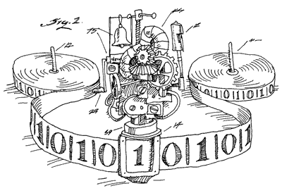

# Neural Machine Translation with External Memory

带**外部存储或记忆**（External Memory）模块的神经机器翻译模型（Neural Machine Translation, NTM），是神经机器翻译模型的一个重要扩展。它利用可微分（differentiable）的外部记忆模块（其读写控制器以神经网络方式实现），来拓展神经翻译模型内部的工作记忆（Working Memory）的带宽或容量，即作为一个高效的 “外部知识库”，辅助完成翻译等任务中信息的临时存储和提取，有效提升模型效果。

该模型不仅可应用于翻译任务，同时可广泛应用于其他需要 “大容量动态记忆” 的自然语言处理和生成任务。例如：机器阅读理解 / 问答（Machine Reading Comprehension / Question Answering)、多轮对话（Multi-turn Dialog）、其他长文本生成任务等。同时，“记忆” 作为认知的重要部分之一，可被用于强化其他多种机器学习模型的表现。该示例仅基于神经机器翻译模型（单指 Seq2Seq， 序列到序列）结合外部记忆机制，起到抛砖引玉的作用，并解释 PaddlePaddle 在搭建此类模型时的灵活性。

本文所采用的外部记忆机制，主要指**神经图灵机**\[[1](#references)\]。值得一提的是，神经图灵机仅仅是神经网络模拟记忆机制的尝试之一。记忆机制长久以来被广泛研究，近年来在深度神经网络的背景下，涌现出一系列有意思的工作。例如：记忆网络（Memory Networks）、可微分神经计算机（Differentiable Neural Computers, DNC）等。除神经图灵机外，其他均不在本文的讨论范围内。

本文的实现主要参考论文\[[2](#references)\]，但略有不同。并基于 PaddlePaddle V2 APIs。初次使用请参考PaddlePaddle [安装教程](https://github.com/PaddlePaddle/Paddle/blob/develop/doc/getstarted/build_and_install/docker_install_cn.rst)。


## Model Overview

### Introduction

记忆（Memory)，是人类（或动物）认知的重要环节之一。记忆赋予认知在时间上的协调性，使得复杂认知（不同于感知）成为可能。记忆，同样是机器学习模型需要拥有的关键能力之一。

可以说，任何机器学习模型，原生就拥有一定的记忆能力，无论它是参数模型，还是非参模型，无论是传统的 SVM（支持向量即记忆），还是神经网络模型（网络参数即记忆）。然而，这里的 “记忆” 绝大部分是指**静态记忆**，即在模型训练结束后，“记忆” 是固化的，在预测时，模型是静态一致的，不拥有额外的跨时间步的记忆能力。

#### 动态记忆 #1 --- RNNs 中的隐状态向量

当我们需要处理带时序的序列认知问题（如自然语言处理、序列决策优化等），我们需要在不同时间步上维持一个相对稳定的信息通路。带有隐状态向量 $h$（Hidden State 或 Cell State $c$）的 RNN 模型 ，即拥有这样的 “**动态记忆**” 能力。每一个时间步，模型均可从 $h$ 或 $c$ 中获取过去时间步的 “记忆” 信息，并可动态地往上叠加新的信息。这些信息在模型推断时随着不同的样本而不同，是 “动态” 的。

注意，在 LSTM 中的 $c$ 的引入，或者GRU中 $h$ 的 Leaky 结构的引入，从优化的角度看有着不同的解释（为了在梯度计算中改良 Jacobian 矩阵的特征值，以减轻长程梯度衰减问题，降低优化难度），但不妨碍我们从直觉的角度将它理解为增加 “线性通路” 使得 “记忆通道” 更顺畅。

#### 动态记忆 #2 --- Seq2Seq 中的注意力机制

然而这样的一个向量化的 $h$ 的信息带宽极为有限。在 Seq2Seq 序列到序列生成模型中，这样的带宽瓶颈更表现在信息从编码器（encoder）转移至解码器（decoder）的过程中的信息丢失，即通常所说的 “依赖一个状态向量来编码整个源句子，有着严重的信息损失”。

于是，注意力机制（Attention Mechanism）被提出，用于克服上述困难。在解码时，解码器不再仅仅依赖来自编码器的唯一的状态向量，而是依赖一个向量组（其中的每个向量记录编码器处理每个token时的状态向量），并通过软性的、全局分布的的注意强度（attention strengths/ weights) 来分配注意力资源，提取（线性加权）信息用于序列的不同位置的符号生成。这种注意强度的分布，可看成基于内容的寻址，即在源语句的不同位置获取不同的读取强度，起到一种和源语言 “软对齐（Soft Alignment）” 的作用。

这里的 “向量组” 蕴含着更多更精准的信息，它可以被认为是一个无界的外部存储器（Unbounded External Memory）。在源语言的编码（encoding）完成时，该外部存储即被初始化为各 token 的状态向量，而在其后的整个解码过程中，只读不写（这是该机制不同于 NTM的地方之一）。同时，读取的过程仅采用基于内容的寻址（Content-based Addressing），而不使用基于位置的寻址 (Location-based Addressing)。当然，这两点局限不是非要如此，仅仅是传统的注意力机制如此，有待进一步的探索。此外，这里的 “无界” 指的是 “记忆向量组” 的向量个数非固定，而是随着源语言的 token 数的变化而变化，数量不受限。

#### 动态记忆 #3 --- 神经图灵机

图灵机（Turing Machines)，或冯诺依曼体系（Von Neumann Architecture），计算机体系结构的雏形。运算器（如代数计算）、控制器（如逻辑分支控制）和存储器三者一体，共同构成了当代计算机的核心运行机制。神经图灵机（Neural Turing Machines）\[[1](#references)\] 试图利用神经网络模型模拟可微分（于是可通过梯度下降来学习）的图灵机，以实现更复杂的智能。而一般的机器学习模型，大部分忽略了显式存储。神经图灵机正是要弥补这样的潜在缺陷。

<div align="center">
<br/>
图1. 图灵机（漫画）。
</div>

图灵机的存储机制，被形象比喻成一个纸带（tape），在这个纸带上有读写头（write/read heads）负责读出或者写入信息，纸袋的移动和读写头则受控制器 （contoller) 控制（见图1）。神经图灵机则以矩阵$M \in \mathcal{R}^{n \times m}$模拟 “纸带”（$n$为记忆槽/记忆向量的数量，$m$为记忆向量的长度），以前馈神经网络（Feedforward Neural Network）或者 循环神经网络（Recurrent Neural Network）来模拟控制器，在 “纸带” 上实现基于内容和基于位置的寻址（不赘述，请参考论文\[[1](#references)\]），并最终写入或读出信息，供其他网络使用（见图2）。

<div align="center">
<br/>
图2. 神经图灵机结构示意图。
</div>

和上述的注意力机制相比，神经图灵机有着很多相同点和不同点。相同在于：均利用外部存储和其上的相关操作，矩阵（或向量组）形式的存储，可微分的寻址方式。不同在于：神经图灵机有读有写（真正意义上的存储器），并且其寻址不仅限于基于内容的寻址，同时结合基于位置的寻址（使得例如 “长序列复制” 等需要 “连续寻址” 的任务更容易），此外它是有界的（bounded)。

#### 三种记忆混合，强化神经机器翻译模型

尽管在一般的 Seq2Seq 模型中，注意力机制都已经是标配。然而，注意机制的外部存储仅仅是用于存储源语言的信息。在解码器内部，信息通路仍然是依赖于 RNN 的状态单向量 $h$ 或 $c$。于是，利用神经图灵机的外部存储机制，来补充（或替换）解码器内部的单向量信息通路，成为自然而然的想法。

当然，我们也可以仅仅通过扩大 $h$ 或 $c$的维度来扩大信息带宽，然而，这样的扩展是以 $O(n^2)$ 的存储（状态-状态转移矩阵）和计算复杂度为代价。而基于神经图灵机的记忆扩展的代价是 $O(n)$的，因为寻址是以记忆槽（Memory Slot）为单位，而控制器的参数结构仅仅是和 $m$（记忆槽的大小）有关。值得注意的是，尽管矩阵拉长了也是向量，但基于状态单向量的记忆读取和写入机制，本质上是**全局**的，而 NTM 的机制是局部的，即读取和写入本质上只在部分记忆槽（尽管实际上是全局写入，但是寻址强度的分布是很锐利的，即真正大的强度仅分布于部分记忆槽），因而可以认为是**局部**的。局部的特性让记忆的存取更干净。

所以，在该实现中，RNNs 原有的状态向量 $h$ 或 $c$、 Seq2Seq 常见的注意力机制，被保留；同时，类似 NTM （简化版，无基于位置的寻址） 的有界外部记忆网络被以补充 $h$ 的形式加入。整体的模型实现则类似于论文\[[2](#references)\]（网络结构见 [Architecture](#architecture)一章），但有少量差异。同时参考该模型的另外一份基于V1 APIs [配置](https://github.com/lcy-seso/paddle_confs_v1/blob/master/mt_with_external_memory/gru_attention_with_external_memory.conf)， 同样有少量差异。具体讨论于 [Discussions](#discussions) 一章。

注意到，在我们的实现中，注意力机制（或无界外部存储）和神经图灵机（或有界外部存储）被实现成相同的 ExternalMemory 类。只是前者是**只读**的， 后者**可读可写**。这样处理仅仅是为了便于统一我们对 “记忆机制” 的理解和认识，同时也提供更简洁和统一的实现版本。

### Architecture

网络总体结构基于传统的 Seq2Seq 结构，即RNNsearch\[[3](#references)\] 结构基础上叠加简化版 NTM\[[1](#references)\]。

- 编码器（encoder）采用标准**双向GRU结构**（非 stack），不再赘述。
- 解码器（decoder）采用和论文\[[2](#references)\] 基本相同的结构，见图3（修改自论文\[[2](#references)\]) 。

<div align="center">
<br/>
图3. 通过外部记忆增强的解码器结构示意图。
</div>

解码器结构图，解释如下：

1. $M_{t-1}^B$ 和 $M_t^B$ 为有界外部存储矩阵，前者为上一时间步存储矩阵的状态，后者为当前时间步的状态。$\textrm{read}^B$ 和 $\textrm{write}$ 为对应的读写头（包含其控制器）。$r_t$ 为对应的读出向量。
2. $M^S$ 为无界外部存储矩阵，$\textrm{read}^S$ 为对应的读头（无 写头），二者配合即实现传统的注意力机制。$c_t$ 为对应的读出向量（即 attention context)。
3. $y_{t-1}$ 为解码器上一步的输出字符并做词嵌入（Word Embedding)，作为当前步的输入，$y_t$ 为解码器当前步的解码符号的概率分布。
4. 虚线框内（除$M^S$外），整体可视为有界外部存储模块。可以看到，除去该部分，网络结构和 RNNsearch\[[3](#references)\] 基本一致（略有不一致之处为：用于 attention 的 decoder state 被改进，即叠加了一 Tanh 隐层并引入了 $y_{t-1}$）。


## Implementation

整体实现的关键部分在辅助模型类`ExternalMemory` 和模型配置函数 `memory_enhanced_seq2seq`。

### `ExternalMemory` Class

`ExternalMemory` 类实现通用的简化版**神经图灵机**。相比完整版神经图灵机，该类仅实现了基于内容的寻址（Content Addressing, Interpolation），不包括基于位置的寻址（ Convolutional Shift, Sharpening)。读者可以自行将其补充成为一个完整的神经图灵机。

类结构如下：

```
class ExternalMemory(object):
	__init__(self, name, mem_slot_size, boot_layer, readonly, enable_projection)
	__content_addressing__(self, key_vector)
	__interpolation__(self, head_name, key_vector, addressing_weight)
	__get_adressing_weight__(self, head_name, key_vector)
	write(self, write_key)
	read(self, read_key)
```

神经图灵机的 “外部存储” 采用 `Paddle.layer.memory`实现，注意这里的`is_seq`需要设成`True`, 该序列的长度表示记忆槽的数量（$n$), `size` 表示记忆槽（向量）的大小。同时依赖一个外部层作为初始化， $n$ 取决于该层输出序列的长度。因此，该类不仅可用来实现有界记忆（Bounded Memory)，同时可用来实现无界记忆 (Unbounded Memory，即记忆槽数量可变)。

`ExternalMemory`类的寻址逻辑通过 `__content_addressing__` 和 `__interpolation__` 两个私有函数实现。读和写操作通过 `read` 和 `write` 两个函数实现。并且读和写的寻址独立进行，不同于 \[[2](#references)\] 中的二者共享同一个寻址强度，目的是为了使得该类更通用。

为了简单起见，控制器（Controller）未被专门模块化，而是分散在各个寻址和读写函数中，并且采用简单的前馈网络。读者可尝试剥离控制器逻辑并模块化，同时可尝试循环神经网络做控制器。

`ExternalMemory` 类具有只读模式，同时差值寻址操作可关闭。便于用该类等价实现传统的注意力机制。

注意， `ExternalMemory` 仅可用于和 `paddle.layer.recurrent_group`配合使用（使用在其用户自定义的 `step` 函数中）。它不可以单独存在。

### `memory_enhanced_seq2seq` Related Functions

涉及三个主要函数：

```
memory_enhanced_seq2seq(...)
bidirectional_gru_encoder(...)
memory_enhanced_decoder(...)
```

`memory_enhanced_seq2seq` 函数定义整个带外部存储增强的序列到序列模型，是模型定义的主调函数。`memory_enhanced_seq2seq` 首先调用`bidirectional_gru_encoder` 对源语言进行编码，然后通过 `memory_enhanced_decoder` 进行解码。

`bidirectional_gru_encoder` 函数实现双向单层 GRU（Gated Recurrent Unit） 编码器。返回两组（均为`LayerOutput`）结果：一组为向量序列（包含所有字符的前后向编码结果），一组为整个源语句的最终编码向量（仅包含后向结果）。前者用于解码器的注意力机制，后者用于初始化解码器的状态向量。

`memory_enhanced_decoder` 函数实现通过外部记忆增强的 GRU 解码器。它利用同一个`ExternalMemory` 类实现两种外部记忆模块：

- 无界外部记忆：即传统的注意力机制（Attention）。利用`ExternalMemory`，打开只读开关，关闭插值寻址。并利用解码器的第一组输出作为 `ExternalMemory` 的`boot_layer`（用作存储矩阵的初始化）。因此，该存储的记忆槽数目是动态可变的，取决于编码器的字符（token）数。
- 有界外部记忆：利用`ExternalMemory`，关闭只读开关，打开插值寻址。并利用解码器的第一组输出，取均值 Pooling 后并扩展为指定序列长度后，作为 `ExternalMemory` 的`boot_layer`。因此，该存储的记忆槽数目是固定的，并且其所有记忆槽的初始化内容均相同。

注意，注意力机制也可以通过 `paddle.networks.simple_attention` 实现。

此外，在该实现中，将 `ExternalMemory` 的 `write` 操作提前至 `read` 之前，以避开潜在的拓扑连接局限，详见 [Issue](https://github.com/PaddlePaddle/Paddle/issues/2061)。我们可以看到，本质上他们是等价的。

## Getting Started

### Prepare the Training Data

数据是通过无参的 `reader()` 函数，进入训练过程。因此我们需要为训练数据和测试数据分别构造 `reader()` 函数。`reader()` 函数使用 `yield` 来保证可迭代性（iterable，即可以 `for instance in reader()` 方式迭代运行）, 例如

```
def data_reader():
	for instance in data_list:
		yield instance
```

`yield` 返回的每条样本需为三元组，分别包含编码器输入字符ID列表（即源语言序列），解码器输入字符ID列表（即目标语言序列，且序列右移一位），解码器输出字符ID列表（即目标语言序列）。

用户需自行完成字符的切分 (tokenize) ，并构建字典完成 ID 化。

PaddlePaddle 的接口 paddle.paddle.wmt14 ([wmt14.py](https://github.com/PaddlePaddle/Paddle/blob/develop/python/paddle/v2/dataset/wmt14.py))， 默认提供了一个经过预处理的[较小规模的 wmt14 子集](http://paddlepaddle.bj.bcebos.com/demo/wmt_shrinked_data/wmt14.tgz)。并提供了两个reader creator函数如下：

```
paddle.dataset.wmt14.train(dict_size)
paddle.dataset.wmt14.test(dict_size)
```

这两个函数被调用时即返回相应的`reader()`函数，供`paddle.traner.SGD.train`使用。

当我们需要使用其他数据时，可参考 paddle.paddle.wmt14 ([wmt14.py](https://github.com/PaddlePaddle/Paddle/blob/develop/python/paddle/v2/dataset/wmt14.py)) 构造相应的 data creator，并替换 `paddle.dataset.wmt14.train` 和 `paddle.dataset.wmt14.train` 成相应函数名。

### Running the script

命令行输入：

```Python mt_with_external_memory.py```

即可运行训练脚本（默认训练一轮），训练模型将被定期保存于本地 `params.tar.gz`。训练完成后，将为少量样本生成翻译结果，详见 `infer` 函数。

## Experiments

To Be Added.

## Discussions

#### 和论文\[[2](#references)\]实现的差异

差异如下：

1. 基于内容的寻址公式不同，原文为 $a = v^T(WM^B + Us)$, 本实现为 $a = v^T \textrm{tanh}(WM^B + Us)$，以保持和 \[[3](#references)\] 中的注意力机制寻址方式一致。
2. 有界外部存储的初始化方式不同，原文为：$M^B = \sigma(W\sum_{i=0}^{i=n}h_i)/n + V$, $V_{i,j}~\in \mathcal{N}(0, 0.1)$。本实现暂为 $M^B = \sigma(\frac{1}{n}W\sum_{i=0}^{i=n}h_i) + V$。

## References

1. Alex Graves, Greg Wayne, Ivo Danihelka, [Neural Turing Machines](https://arxiv.org/abs/1410.5401). arXiv preprint arXiv:1410.5401, 2014.
2. Mingxuan Wang, Zhengdong Lu, Hang Li, Qun Liu, [Memory-enhanced Decoder Neural Machine Translation](https://arxiv.org/abs/1606.02003). arXiv preprint arXiv:1606.02003, 2016.
3. Dzmitry Bahdanau, Kyunghyun Cho, Yoshua Bengio, [Neural Machine Translation by Jointly Learning to Align and Translate](https://arxiv.org/abs/1409.0473). arXiv preprint arXiv:1409.0473, 2014.
