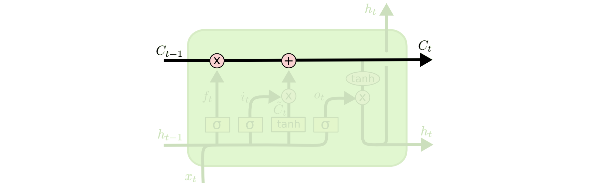
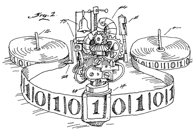
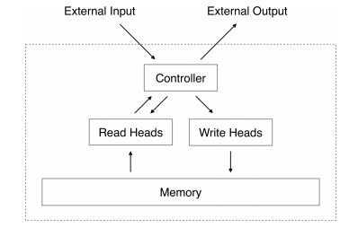
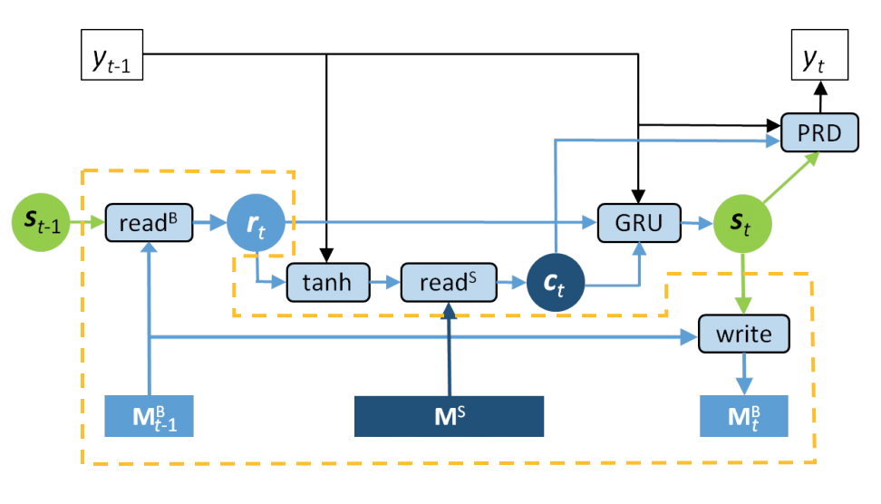

Run the code in this dictionary needs PaddlePaddle v0.11.0. If you version is older than this requirment, please refer to [installation document](http://www.paddlepaddle.org/docs/develop/documentation/zh/build_and_install/pip_install_cn.html) to update.

---

# Neural Machine Translation with External Memory Mechanism

Neural Machine Translation(NMT) with **External Memory** is an import extension of NMT. It introduces a differentiable memory network as an additional memory unit，extends bandwidth or capacity of Working Memory in NMT, then helps to do information access in tasks like translation,  and improves performance of model.

Such models can not only be used in translation, but also other tasks which need Large Capacity Dynamic Memory, like Machine Reading Comprehension, Q&A, multi-turn dialog, Text Generation, etc. As an import part of cognition, memory can also be used to improve performances of other machine learning models.

The External Memory Mechanism is this article, is mainly refer to **Neural Turing Machine** \[[1](#reference)\]. It is worth mentioning that Neural Turing Machines is only one of the attempts in the area of simulating Memory Mechanism by neural network. Memory Mechanism has long been widely studied, and recently in the background of deep learning a series of valuable work is developed, like Memory Networks, Differentiable Neural Computer(DNC), etc. In this article only Neural Turing Machine mechanism is discussed and implemented.

The implementation of this article mainly refers to \[[2](#reference)\], and assumes readers have fully read and understood [Machine Translation chapter](https://github.com/PaddlePaddle/book/tree/develop/08.machine_translation) in PaddlePaddle Book.

## Overview

### Introduction of Memory Mechanism

Memory is an important part of cognition. With memory the cognition could be coordinate in time, make it possible in complex cognition, such as reasoning, planning and others which different from static perception. Flexible memory mechanism is one of the key abilities that machines need to simulate human intelligence.

#### Static Memory

All machine learning models originally have a certain capacity for static memory, whether they are parameter models which parameters are memory, or non-parameter models which samples are memory, and whether it is a traditional SVM which support vector is memory, or neural network which connection weights are memory. However, most of the memory here refers to **static memory**, that is, after the end of training, memory will not change; in inference, the model is static and consistent, and does not have additional ability to save information across time steps.

####Dynamic memory 1 -- the hidden state vectors in RNNs

When dealing with sequential cognitive problems(natural language processing, sequence decision, etc), we often need to maintain a persistent information path in different time steps because of the need to rely on other time steps for information processing at each time step. Recurrent neural networks(RNNs) with hidden state vector $h$ or $c$ in LSTM has such **dynamic memory** capability. In each time step, the model can obtain memory of the past time step from $h$ or $c$, and can continuously add new information to update the memory. In model inference, different samples have completely different set of memory information($h$ or $c$), which is called dynamic.
Even though the intuition above of state $c$ in LSTM has many imprecisely points, for example from the view of optimization, $c$ in LSTM or linear Leaky structure in GRU is introduced to make  the spectral distribution of Jacobian matrix in single step gradient closer to unit matrix and mitigate the long-range gradient vanish and reduce the difficulty of optimization. But this does not prevent us from intuitively understanding it as adding a linear path to make the memory channel more smooth. In Figure 1([from this paper](http://colah.github.io/posts/2015-08-Understanding-LSTMs/)), the cell state vector $c$ in LSTM can be regard as a linear memory channel for information persistence.

<div align="center">
<br/>
Fig 1. state vector in LSTM as memory path
</div>

#### Dynamic Memory 2 -- Attention in Seq2Seq

The bandwidth of vector $h$ or $c$ described in the previous section is limited. In the Seq2Seq generation model, such bottleneck appears in the process of transferring information from an encoder to a decoder. A large potential loss of information happens when only relying on a finite-length state vector to encode the entire variable-length source statement.

An attention mechanism was proposed to overcome the above difficulties\[[3](#reference)\].
When decoding, the decoder no longer only relies on the information of the sentence-level encoding vector from the encoder, but instead relies on the memory of a group vectors: each vector in the group is the encoding vector of tokens in encoder.
Attention resources are dynamically allocated through a set of attentional weights which can be trained, and information is read with linear weights. In this way the symbols can be generated at different time steps of the sequence(see the PaddlePaddle Book [Machine Translation](https://github.com/PaddlePaddle/book/tree/develop/08.machine_translation)). This distribution of attention can be seen as content-based addressing(please refer to the addressing description in Neural Turing Machine\[[1](#reference)\]), that is, read strengths are determined according to the content in different positions of source statement, which is same as Soft Alignment of source statement.

Compared with the single state vector in the previous section, the vector group here contains more and more accurate information. For example, it can be considered as an Unbounded External Memory, which effectively broadens the memory information bandwidth. Unbounded here refers to the fact that the number of vectors in the vector group can be changed with the number of characters with no limit. When the encoding of source sentence is completed, the external storage is initialized as the state vector of each character, and is used in the subsequent decoding process.

#### Dynamic Memory 3 -- Neural Turing Machine

Turing Machine or Von Neumann Architecture is the prototype of computer architecture. Operators like algebraic computation, controllers like logic branch control, and memory constitute the core operating mechanism all together. Neural Turing Machines\[[1](#参考文献)\] try to use a neural network to simulate a Turing Machine that can be differentiated(ie, can learn by gradient descent) and achieve more complex intelligence.
Most of the general machine learning models ignore explicit dynamic storage. Neural Turing Machine is to make up for such potential defects.

<div align="center">
<br/>
Fig 2. The comics of Neural Turing Machine
</div>

The storage mechanism of Turing Machine is often compared to read and write operations on a tape. The Read Head and Write Head are used to read or write information on the tape, the moving of tape and the action of read or write head is controlled by the controller(see Fig.2 [from](http://www.worldofcomputing.net/theory/turing-machine.html)). At the same time the length of the tape is usually limited.

The Neural Turing Machine simulates the tape with the matrix $M \in \mathcal{R}^{n \times m}$, where $n$ is the number of memory vectors(also called memory slots) and $m$ is the length of memory vector. A feed-forward neural network or a recurrent neural network is used to simulate the controller and determine the strength distribution of read and write in different memory slots, ie, addressing:


  - Content-based Addressing：The addressing strength depends on the content of the memory slot and the actual content of reading and writing.
  - Location-based Addressing：The addressing strength depends on the addressing strength of the previous addressing operation(eg, offset).
  - Hybrid addressing：Mix the above addressing modes(eg linear interpolation). For detail please refer to \[[1](#参考文献)\]）。

  Depending on the addressing , the Turing machine writes $M$ or reads information from $M$ for use by other networks. The structure of Neural Turing machine is shown in Fig 3.(from \[[1](#参考文献)\]).

<div align="center">
<br/>
Fig 3. The structure of Neural Turing Machine
</div>

Compared with the attention mechanism in previous section, Neural Turing machine has many similarities and differences.
Similar points such as:
Both use external storage in the form of a matrix(or group of vectors). Both use differentiatied addressing.
The difference is:
The Neural Turing Machine has reading and writing and is the actural memorizer;
The attention mechanism initializes stored contents when the encoding is finished(only simple buffering, non-differentiable writing operations), and read-only during the subsequent decoding process.
Neural Turing Machine not only has content-based addressing, but also makes tasks such as "sequence replication" that require "sequential addressing" easier. While the attention mechanism only considers content-based addressing to achieve soft aligment. Neural Turing Machines use Bounded storage, while attention mechanisms use Unbounded storage.

Compared with the attention mechanism in previous section, Neural Turing Machine has many similarities and differences.

Similar points:

- Both take matrix or vector group to do external storage.
- Both addressing method are differentiated.

The differences:

- The Neural Turing Machine has reading and writing and is the actually memory unit; The attention mechanism initializes stored contents when the encoding is finished(only simple buffering, non-differentiable writing operations), and read-only during the subsequent decoding process.
- Neural Turing Machine not only has content-based addressing, but also makes tasks such as sequence replication that require sequential addressing easier. While the attention mechanism only considers content-based addressing to achieve Soft Aligment.
- Neural Turing Machines use Bounded storage, while attention mechanisms use Unbounded storage.

#### Mix three storage methods to strengthen NMT

Although attention mechanism is already common in general seq2seq.
The external storage in the attention mechanism is only used to store the encoder information. Inside the decoder, the information path still relies on the RNN state vector $h$ or $c$. Therefore, to supplement the single vector information path inside the decoder by external storage mechanism of the Neural Turing Machine becomes a natural idea.

Thus, we mixed three dynamic memory mechanisms above. The original state vector of RNN and the attention mechanism are preserved. And a bounded external memory mechanism based on a simplified version Neural Turing Machine is introduced to supplement the memory of single state vector in decoder.
To know overall model implements please refer to \[[2](#reference)\]. Some differences as detailed in other [chapters](#other discussions).

The additional need to understand here is why not increase the bandwidth directly by increasing the dimension of $h$ or $c$?

- Increasing the dimension of $h$ or $c$ also increases the expense of the storage with $O(n^2)$(state-state transfer matrix); the cost of memory expansion based on Neural Turing Machine is $O(n)$, because its addressing is based on the Memory Slot, and the controller's parameter structure is only related to $m$(memory slot size).
- The Reading and Writing mechanism based on single state vector has only a unique read-write strength, which is essentially **global**. But the mechanism of Neural Turing Machine is **local**, that is, reading and writing are essentially only on part of memory (the distribution of the addressing intensity is sharp, ie, the really large intensity is only distributed in part of memory slots).

### Model Network Structure

Adding a simplified version of Neural Turing Machine[[1](#reference)\] external memory module on the basis of a sequence-to-sequence structure with attention mechanism(ie, RNN-search\[[3](##reference)\])
- The Encoder uses a standard **bidirectional GRU structure**(not stack) and will not repeat here.
- Decoder uses the same structure in \[[2](#reference)\], see Fig 4.(modified from the paper\[[2](#reference)\]).

<div align="center">
<br/>
Fig 4. The structure of decoder with external momory
</div>

The structure of decoder, explained as follows：

1. $M_{t-1}^B$ and $M_t^B$ are Bounded external storage matrix. The former is the state of storage matrix in previous timestamp, the latter is the state of current. $\textrm{read}^B$ and $\textrm{write}$ are corresponding read-write header including controller. $r_t$ is corresponding output vector.
2. $M^S$ is Unbounded external storage matrix, $\textrm{read}^S$ is corresponding read header, the two cooperate to achieve the traditional attention mechanism. $c_t$ is the corresponding output vector.
3. $y_{t-1}$ is the output character of decoder and then get Word Embedding mapping as current input, $y_t$ is the probability distribution of decoder character in current step.
4. In the dashed box(except $M^S$), the whole can be regarded as a bounded external storage module. It can be seen that, except for this part, the network structure is basically the same as RNNsearch\[[3](#reference)\] (a slight inconsistency: the decoder state used for attention is improved, ie superimposed a hidden layer and $y_{t-1}$ was introduced.

## Algorithm implementation

The algorithm is implemented in the following files:
- `external_memory.py`: Mainly implements a simplified version of **Neural Turing Machine** in the class`External Memory`, providing initialization and read-write functions.
- `model.py`: Model configuration function including bidirectional GRU encoder(`bidirectional_gru_encoder`), memory enhanced decoder(`memory_enhanced_decoder`), memory enhanced seq2seq(`memory_enhanced_seq2seq`).
- `data_utils.py`: Data processing functions.
- `train.py`: Train model.
- `infer.py`: Translation of some samples(model inference).

### `ExternalMemory`

`ExternalMemory` implements a generic, simplified version of **Neural Turing Machine**. Compared with full version of Neural Turing Machine, this class only implements Content Addressing interpolation rather than Convolutional Shift(Sharpening). Readers can complement it as a complete Neural Turing Machine by themselves.

The structure is as below：

```python
class ExternalMemory(object):
    """External neural memory class.

    A simplified Neural Turing Machines (NTM) with only content-based
    addressing (including content addressing and interpolation, but excluding
    convolutional shift and sharpening). It serves as an external differential
    memory bank, with differential write/read head controllers to store
    and read information dynamically as needed. Simple feedforward networks are
    used as the write/read head controllers.

    For more details, please refer to
    `Neural Turing Machines <https://arxiv.org/abs/1410.5401>`_.
    """

    def __init__(self,
                 name,
                 mem_slot_size,
                 boot_layer,
                 initial_weight,
                 readonly=False,
                 enable_interpolation=True):
        """ Initialization.

        :param name: Memory name.
        :type name: basestring
        :param mem_slot_size: Size of memory slot/vector.
        :type mem_slot_size: int
        :param boot_layer: Boot layer for initializing the external memory. The
                           sequence layer has sequence length indicating the number
                           of memory slots, and size as memory slot size.
        :type boot_layer: LayerOutput
        :param initial_weight: Initializer for addressing weights.
        :type initial_weight: LayerOutput
        :param readonly: If true, the memory is read-only, and write function cannot
                         be called. Default is false.
        :type readonly: bool
        :param enable_interpolation: If set true, the read/write addressing weights
                                     will be interpolated with the weights in the
                                     last step, with the affine coefficients being
                                     a learnable gate function.
        :type enable_interpolation: bool
        """
        pass

    def _content_addressing(self, key_vector):
        """Get write/read head's addressing weights via content-based addressing.
        """
        pass

    def _interpolation(self, head_name, key_vector, addressing_weight):
        """Interpolate between previous and current addressing weights.
        """
        pass

    def _get_addressing_weight(self, head_name, key_vector):
        """Get final addressing weights for read/write heads, including content
        addressing and interpolation.
        """
        pass

    def write(self, write_key):
        """Write onto the external memory.
        It cannot be called if "readonly" set True.

        :param write_key: Key vector for write heads to generate writing
                          content and addressing signals.
        :type write_key: LayerOutput
        """
        pass

    def read(self, read_key):
        """Read from the external memory.

        :param write_key: Key vector for read head to generate addressing
                          signals.
        :type write_key: LayerOutput
        :return: Content (vector) read from external memory.
        :rtype: LayerOutput
        """
        pass
```

Among the code, private methods include:
- `_content_addressing`: Addressing though content and calculate the addressing strength of read-write operations.
- `_interpolation`:Addressing though interpolating(linear weight of the current addressing strength and the previous addressing strength).
- `_get_addressing_weight`:Using the above two addressing operations to get the final addressing strength for read-write operations of storage units.

The external interfaces include:
- `__init__`: Instance initialization.
    - `name`: The external memory unit name. The same name of different instances will share the same external memory unit.
    - `mem_slot_size`: The dimension of a single memory slot(vector).
    - `boot_layer`: The layer to initialize the memory slot. It needs to be a sequence, and the length of the sequence indicates the number of memory slot.
    - `initial_weight`: To initialize addressing strength.
    - `read only`: Whether opens read-only mode(for example, open read-only mode, this instance can be used for attention mechanism). If read-only mode is used, the write method can not be invoked.
    - `enable_interpolation`: Allows interpolating addressing (for example, when the attention mechanism is used, we need to close the interpolation addressing).
- `write`: Writing operation.
    - `write_key`: The output of a certain layer, the information contained in it is used to write the addressable address and generate the actual writing information.
- `read`: Reading operation.
    - `read_key`: The output of a layer, and the information contained in it is used for addressing the read header.
    - return: The output information which can be directly used as input to other layers.

Part of the key implementation logic:
- The external storage matrix of Neural Turing Machine is implemented by `Paddle.layer.memory`. The
length of the sequence represents the number of memory slot, and the size of the sequence represents the size of memory slot(vector).The sequence relies on an external layer as initialization, and the number of its memory slot depends on the length of the output sequence. Therefore, the class can be used not only to realize the Bounded Memory, but also to realize Unbounded Memory whose number of memory cells is variable.
    ```python
    self.external_memory = paddle.layer.memory(
        name=self.name,
        size=self.mem_slot_size,
        boot_layer=boot_layer)
    ```
- The addressing logic of `ExternalMemory` is implemented through two private methods, `_content_addressing` and `_interpolation`. Read and write operations are implemented through two functions `read` and `write`, including the above addressing operation. And addressing and writing independently, unlike those in\[[2](#reference)\], both of them share the same addressing strength to make this class more general.
- For simplicity, the Controller is not specifically modularized, but dispersed in various addressing and read write functions. The controller mainly includes the writing/erasing vector in addressing operation and writing operation, in which the addressing operation is implemented by two private methods of `_content_addressing` and `_interpolation` mentioned above. All of them above use simple feed-forward network simulation controller. Readers can peel off the logic and modularity of the controller and try recurrent neural network as the controller.
- Class `ExternalMemory` has read-only mode, and the differential addressing operation can be closed. The main purpose is to make use of this equivalence to realize the traditional attention mechanism.
- Class `ExternalMemory` can only be used in conjunction with `paddle.layer.recurrent_group`, specifically used in the user defined function `step` which can not exist alone.

### `memory_enhanced_seq2seq` and related functions.
It involves three main functions:

```python
def bidirectional_gru_encoder(input, size, word_vec_dim):
    """Bidirectional GRU encoder.

    :params size: Hidden cell number in decoder rnn.
    :type size: int
    :params word_vec_dim: Word embedding size.
    :type word_vec_dim: int
    :return: Tuple of 1. concatenated forward and backward hidden sequence.
             2. last state of backward rnn.
    :rtype: tuple of LayerOutput
    """
    pass


def memory_enhanced_decoder(input, target, initial_state, source_context, size,
                            word_vec_dim, dict_size, is_generating, beam_size):
    """GRU sequence decoder enhanced with external memory.

    The "external memory" refers to two types of memories.
    - Unbounded memory: i.e. attention mechanism in Seq2Seq.
    - Bounded memory: i.e. external memory in NTM.
    Both types of external memories can be implemented with
    ExternalMemory class, and are both exploited in this enhanced RNN decoder.

    The vanilla RNN/LSTM/GRU also has a narrow memory mechanism, namely the
    hidden state vector (or cell state in LSTM) carrying information through
    a span of sequence time, which is a successful design enriching the model
    with the capability to "remember" things in the long run. However, such a
    vector state is somewhat limited to a very narrow memory bandwidth. External
    memory introduced here could easily increase the memory capacity with linear
    complexity cost (rather than quadratic for vector state).

    This enhanced decoder expands its "memory passage" through two
    ExternalMemory objects:
    - Bounded memory for handling long-term information exchange within decoder
      itself. A direct expansion of traditional "vector" state.
    - Unbounded memory for handling source language's token-wise information.
      Exactly the attention mechanism over Seq2Seq.

    Notice that we take the attention mechanism as a particular form of external
    memory, with read-only memory bank initialized with encoder states, and a
    read head with content-based addressing (attention). From this view point,
    we arrive at a better understanding of attention mechanism itself and other
    external memory, and a concise and unified implementation for them.

    For more details about external memory, please refer to
    `Neural Turing Machines <https://arxiv.org/abs/1410.5401>`_.

    For more details about this memory-enhanced decoder, please
    refer to `Memory-enhanced Decoder for Neural Machine Translation
    <https://arxiv.org/abs/1606.02003>`_. This implementation is highly
    correlated to this paper, but with minor differences (e.g. put "write"
    before "read" to bypass a potential bug in V2 APIs. See
    (`issue <https://github.com/PaddlePaddle/Paddle/issues/2061>`_).
    """
    pass


def memory_enhanced_seq2seq(encoder_input, decoder_input, decoder_target,
                            hidden_size, word_vec_dim, dict_size, is_generating,
                            beam_size):
    """Seq2Seq Model enhanced with external memory.

    The "external memory" refers to two types of memories.
    - Unbounded memory: i.e. attention mechanism in Seq2Seq.
    - Bounded memory: i.e. external memory in NTM.
    Both types of external memories can be implemented with
    ExternalMemory class, and are both exploited in this Seq2Seq model.

    :params encoder_input: Encoder input.
    :type encoder_input: LayerOutput
    :params decoder_input: Decoder input.
    :type decoder_input: LayerOutput
    :params decoder_target: Decoder target.
    :type decoder_target: LayerOutput
    :params hidden_size: Hidden cell number, both in encoder and decoder rnn.
    :type hidden_size: int
    :params word_vec_dim: Word embedding size.
    :type word_vec_dim: int
    :param dict_size: Vocabulary size.
    :type dict_size: int
    :params is_generating: Whether for beam search inferencing (True) or
                           for training (False).
    :type is_generating: bool
    :params beam_size: Beam search width.
    :type beam_size: int
    :return: Cost layer if is_generating=False; Beam search layer if
             is_generating = True.
    :rtype: LayerOutput
    """
    pass
```

- `bidirectonal_gru_encoder`: The function implements a bidirectional single layer GRU(Gated Recurrent Unit) encoder. Two sets of result are returned: one are character lever encoded vector sequences(including forward and backward) and the other are sentence-level encoded vectors(backward only) for the entire source statement.
The former is used to initialize the memory matrix in the attentional mechanism of the decoder, and the latter is used to initialize the state vector of decoder.

- `memory_enhanced_decoder`: The function implements an external memory enhanced GRU decoder. It uses the same class `ExternalMemory` to implement two external memory modules.

    - `Unbounded external memory`: The traditional attention mechanism. With `ExternalMemory`, turn on the read-only switch and turn off interpolation addressing. The first output of the decoder is used as the initialization of the storage matrix in `ExternalMemory`(`boot_layer`). Therefore, the number of memory slots stored is dynamically variable, depending on the number of characters in the encoder.

        ```python
        unbounded_memory = ExternalMemory(
            name="unbounded_memory",
            mem_slot_size=size * 2,
            boot_layer=unbounded_memory_init,
            initial_weight=unbounded_memory_weight_init,
            readonly=True,
            enable_interpolation=False)
        ```

    - `Bounded external memory`: Using External Memory to turn-off read-only switch and open interpolation addressing. And taking the first set of output of the decoder, after the mean pool(pooling) is taken and extended to the specified sequence length, the superposition of random noise(when training and inference is consistent) is used as the initialization of the memory matrix in the External Memory(boot_layer). Therefore, the number of memory slot is fixed. That is, the code:
        ```python
        bounded_memory = ExternalMemory(
            name="bounded_memory",
            mem_slot_size=size,
            boot_layer=bounded_memory_init,
            initial_weight=bounded_memory_weight_init,
            readonly=False,
            enable_interpolation=True)
        ```

    It is noted that in our implementation, the attention mechanism(unbounded external storage) and the Neural Turing Machine(bounded external storage) are implemented as the same class External Memory. The former is read-only, the latter can be read and written. This is only for the sake of unifying our understanding of the "attention mechanism"  and "memory mechanism" and at the same time a more simply and unified implementation is provided. Attention mechanism can also be achieved through `paddle.networks.simple_attention`.

- `memory_enhanced_seq2seq` defines the whole sequence to sequence model with external memory mechanism, which is the main function of the model definition. It first calls `bidirectional_gru_encoder` to encode the source language, and then decodes it through `memory_enhanced_decoder`.

In addition, in this implementation, the `write` operation of `ExternalMemory` is moved before `read` to avoid the potential limitations of topological connection. See [Issue](https://github.com/PaddlePaddle/Paddle/issues/2061) for detail, we could see they are equivalent in essence.

## Quick start

### Data customization

Data is input into the training process through the `reader()` iterator function with no parameter. Therefore, we need to construct two `reader()` iterators for training data and test data respectively. The `reader()` uses `yield` to implement iterator function(it can run iteratively for instance in `Reader()`), for example:
```python
def reader():
    for instance in data_list:
        yield instance
```
Each sample of `yield` returns should be three tuples, including the encoders input character list(i.e., the source languages sequence vector), the decoder input character list(that is, the target language sequence vector, and a right shift of the sequence), the decoder output character list(that is, the sequence of target language vector).

Users need to finish the character segmentation(Tokenize) and build the dictionary to transform language to vector by themselves.

The PaddlePaddle interface [paddle.paddle.wmt14](https://github.com/PaddlePaddle/Paddle/blob/develop/python/paddle/v2/dataset/wmt14.py) provides a subset of a preprocessed, small scale wmt14 English translation [wmt14 subset](http://paddlepaddle.bj.bcebos.com/demo/wmt_shrinked_data/wmt14.tgz)(the dataset has 193319 training data, 6003 test data, and a directionary length of 30000) by default. Two reader creator functions are provided as follows:

```python
paddle.dataset.wmt14.train(dict_size)
paddle.dataset.wmt14.test(dict_size)
```

When these two functions are called, the corresponding `reader()` function is returned for `paddle.trainer.SGD.train`. When we need to use other data, we can refer to [paddle.paddle.wmt14](https://github.com/PaddlePaddle/Paddle/blob/develop/python/paddle/v2/dataset/wmt14.py) to construct the corresponding data creator and replace `paddle.dataset.wmt14.train` and `paddle.dataset wmt14.train` as the corresponding function names.

### train

In command line input:

```bash
python train.py
```

or customize some of the parameters, such as:

```bash
python train.py \
--dict_size 30000 \
--word_vec_dim 512 \
--hidden_size 1024 \
--memory_slot_num 8 \
--use_gpu False \
--trainer_count 1 \
--num_passes 100 \
--batch_size 128 \
--memory_perturb_stddev 0.1
```

then the training script could be run，the model will be saved in  `./checkpoints`. The parameters meanings can be displayed by:

```bash
python train.py --help
```

### Decoder

In command line input：

```bash
python infer.py
```

or customize some of the parameters, such as:

```bash
python infer.py \
--dict_size 30000 \
--word_vec_dim 512 \
--hidden_size 1024 \
--memory_slot_num 8 \
--use_gpu False \
--trainer_count 1 \
--memory_perturb_stddev 0.1 \
--infer_data_num 10 \
--model_filepath checkpoints/params.latest.tar.gz \
--beam_size 3
```

then run the decoder script and generate translation result. The meaning of parameters can be displayed by:

```bash
python infer.py --help
```

## Other Discussions

#### Differences of implementation with\[[2](#reference)\]

The differences are：

1. The content based addressing formula is different: the original is $a = v^T(WM^B + Us)$, and in this example is  $a = v^T \textrm{tanh} (WM^B + Us) $ to keep the same as the attention mechanism addressing mode in \[[3](#reference)\].
2. The initialization method of the bounded external storage is different: the original is $M^B = \sigma (W\sum_{i=0}^{i=n}h_i) /n + V$, $V_{i, j}~\in \mathcal{N} (0, 0.1) $, and in this example is $M^B = \sigma (\frac{1}{n}W\sum_{i=0}^{i=n}h_i) + V$.
3. The addressing logic of external memory mechanism of read-write is different: In original paper they share the same addressing strength, which is equivalent to the Weight Tying regularization. This example does not apply this rule, with reading and writing independently.
4. The order of external memory in the same time step is different: In original it is first reading and then writing. The example is first writing and then reading. In essence they are equivalent.

## References

1. Alex Graves, Greg Wayne, Ivo Danihelka, [Neural Turing Machines](https://arxiv.org/abs/1410.5401). arXiv preprint arXiv:1410.5401, 2014.
2. Mingxuan Wang, Zhengdong Lu, Hang Li, Qun Liu, [Memory-enhanced Decoder Neural Machine Translation](https://arxiv.org/abs/1606.02003). In Proceedings of EMNLP, 2016, pages 278–286.
3. Dzmitry Bahdanau, Kyunghyun Cho, Yoshua Bengio, [Neural Machine Translation by Jointly Learning to Align and Translate](https://arxiv.org/abs/1409.0473). arXiv preprint arXiv:1409.0473, 2014.
