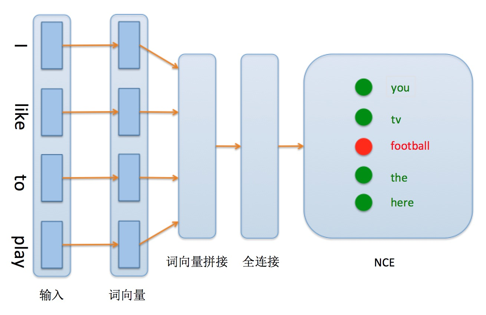

运行本目录下的程序示例需要使用PaddlePaddle v0.10.0 版本。如果您的PaddlePaddle安装版本低于此要求，请按照[安装文档](http://www.paddlepaddle.org/docs/develop/documentation/zh/build_and_install/pip_install_cn.html)中的说明更新PaddlePaddle安装版本。

---

# 使用噪声对比估计加速语言模型训练

## 为什么需要噪声对比估计

语言模型是许多自然语言处理任务的基础，也是获得词向量表示的一种有效方法。神经概率语言模型（Neural Probabilistic Language Model, NPLM）刻画了词语序列 $\omega_1,...,\omega_T$ 属于某个固定语言的概率 $P(\omega_1^T)$ ：
$$P(\omega_1^T)= \prod_{t=1}^{T}P(\omega_t|\omega_1^{t-1})$$

为了降低建模和求解的难度，通常会引入一定条件独立假设：词语$w_t$的概率只受之前$n-1$个词语的影响，于是有：

$$ P(\omega_1^T) \approx \prod P(\omega_t|\omega_{t-n-1}^{t-1}) \tag{1}$$

从式($1$)中看到，可以通过建模条件概率 $P(\omega_t|w_{t-n-1},...,\omega_{t-1})$ 进而计算整个序列  $\omega_1,...,\omega_T$ 的概率。于是，我们可以将语言模型求解的任务简单地概括为：

**给定词语序列的向量表示 $h$ ，称之为上下文（context），模型预测下一个目标词语 $\omega$ 的概率。**

在[$n$-gram 语言模型](https://github.com/PaddlePaddle/book/tree/develop/04.word2vec)中，上下文取固定的 $n-1$ 个词，[RNN 语言模型](https://github.com/PaddlePaddle/models/tree/develop/generate_sequence_by_rnn_lm)可以处理任意长度的上下文。

给定上下文 $h$，NPLM 学习一个分值函数（scoring function）$s_\theta(\omega, h)$，$s$ 刻画了上下文 $h$ 向量和所有可能的下一个词的向量表示 $\omega'$ 之间的相似度，再通过在全词表空间对打分函数 $s$ 的取值进行归一化（除以归一化因子 $Z$），得到目标词 $\omega$ 的概率分布，其中：$\theta$ 是可学习参数，这一过程用式($2$)表示，也就是 `Softmax` 函数的计算过程。

$$P_\theta^h(\omega) = \frac{\text{exp}{s_\theta(\omega, h)}}{Z}，Z=\sum_{\omega'} \exp{s_\theta(\omega', h)}\tag{2}$$

极大似然估计（MLE，Maximum Likelihood Estimation）是求解概率($2$)最常用的学习准则。然而，不论是估计概率 $P_\theta^h(\omega)$ 还是计算似然（likelihood）的梯度时，都要计算归一化因子$Z$。$Z$ 的计算随着词典大小线性增长，当训练大规模语言模型时，例如，当词典增长到百万级别甚至更大，训练时间将变得十分漫长，因此，我们**需要其它可能的学习准则，他的求解过程从计算上应该更加轻便可解。**

models 的另一篇介绍了使用[Hsigmoid加速词向量训练](https://github.com/PaddlePaddle/models/tree/develop/hsigmoid) ，这里我们介绍另一种基于采样的提高语言模型训练速度的方法：使用噪声对比估计（Noise-contrastive estimation, NCE）\[[1](#参考文献)\]。

## 什么是噪声对比估计

噪声对比估计是一种基于采样思想的概率密度估计准则，用于估计/拟合：概率函数由非归一化的分值函数和归一化因子两部分构成，这样一类特殊的概率函数\[[1](#参考文献)\] 。噪声对比估计通过构造下面这样一个辅助问题避免在全词典空间计算归一化因子 $Z$ ，从而降低计算代价：

给定上下文 $h$ 和任意已知的噪声分布 $P_n$ ，学习一个二类分类器来拟合：目标 $\omega$ 来自真实分布 $P_\theta$ ($D = 1$) 还是噪声分布 $P_n$（$D = 0$）的概率。假设来自噪声分布的负类样本的数量 $k$ 倍于目标样本，于是有：

$$P(D=1|h,\omega) = \frac{P_\theta(h, \omega)}{P_\theta (h, \omega) + kP_n} \tag{3}$$

我们直接用`Sigmoid`函数来刻画式($3$)这样一个二分类概率：

$$P(D=1|h,\omega) = \sigma (\Delta s_\theta(w,h)) \tag{4}$$

有了上面的问题设置便可以基于二分类来进行极大似然估计：增大正样本的概率同时降低负样本的概率[[2,3](#参考文献)]，也就是最小化下面这样一个损失函数：

$$
J^h(\theta )=E_{ P_d^h }\left[ \log { P^h(D=1|w,\theta ) }  \right] +kE_{ P_n }\left[ \log P^h (D=0|w,\theta ) \right]$$
$$
 \\\\\qquad =E_{ P_d^h }\left[ \log { \sigma (\Delta s_\theta(w,h)) }  \right] +kE_{ P_n }\left[ \log (1-\sigma (\Delta s_\theta(w,h)))  \right] \tag{5}$$

式($5$)便是基于噪声对比估计而定义的NCE损失函数，至此，我们还剩下两个问题：
1. 式($5$)中的 $s_\theta(w,h)$ 是什么？
    - 在神经网络的实现中，$s_\theta(h,\omega)$ 是未归一化的分值。
    - NCE cost 层的可学习参数 $W$ 是一个 $|V| \times d$ 维度的矩阵，$|V|$ 是词典大小，$d$ 是上下文向量$h$的维度；
    - 训练时下一个词的真实类别 $t$ 是正类，从指定的噪声分布中采样 $k$ 个负类样本它们的类别分别记作： $\{n_1, ..., n_k\}$；
    - 抽取 $W$ 中第 $\{t, n_1, ..., n_k\}$ 行（共计 $k + 1$ 行）分别与 $h$ 计算分值  $s_\theta(w,h)$ ，再通过($5$)式计算最终的损失；
2. 噪声分布如何选择？
    - 实践中，可以任意选择合适的噪声分布（噪声分布暗含着一定的先验）。
    - 最常用选择有：使用基于全词典之上的`unigram`分布（词频统计），无偏的均匀分布。
    - 在PaddlePaddle中用户如果用户未指定噪声分布，默认采用均匀分布。

使用NCE准确训练时，最后一层的计算代价只与负采样数目线性相关，当负采样数目逐渐增大时，NCE 估计准则会收敛到极大似然估计。因此，在使用NCE准则训练时，可以通过控制负采样数目来控制对归一化的概率分布近似的质量。

## 实验数据
本例采用 Penn Treebank (PTB) 数据集（[Tomas Mikolov预处理版本](http://www.fit.vutbr.cz/~imikolov/rnnlm/simple-examples.tgz)）来训练一个 5-gram 语言模型。PaddlePaddle 提供了 [paddle.dataset.imikolov](https://github.com/PaddlePaddle/Paddle/blob/develop/python/paddle/v2/dataset/imikolov.py) 接口来方便地使用PTB数据。当没有找到下载好的数据时，脚本会自动下载并验证文件的完整性。语料语种为英文，共有42068句训练数据，3761句测试数据。

## 网络结构
在 5-gram 神经概率语言模型详细网络结构见图1：

<p align="center">
<br/>
图1. 5-gram 网络配置结构
</p>

模型主要分为如下几个部分构成：

1. **输入层**：输入样本由原始英文单词组成，每个英文单词首先被转换为字典中的 id 表示。

2. **词向量层**：id 表示通过词向量层作用得到连续表示的词向量表示，能够更好地体现词与词之间的语义关系。训练完成之后，词语之间的语义相似度可以使用词向量之间的距离来表示，语义越相似，距离越近。

3. **词向量拼接层**：将词向量进行串联，并将词向量首尾相接形成一个长向量。这样可以方便后面全连接层的处理。

4. **全连接隐层**：将上一层获得的长向量输入到一层隐层的神经网络，输出特征向量。全连接的隐层可以增强网络的学习能力。

5. **NCE层**：训练时可以直接实用 PaddlePaddle 提供的 `paddle.layer.nce` 作为损失函数。


## 训练
在命令行窗口运行命令``` python train.py ```可以直接开启训练任务。

- 程序第一次运行会检测用户缓存文件夹中是否包含 ptb 数据集，如果未包含，则自动下载。
- 运行过程中，每10个 batch 会打印模型训练在训练集上的代价值
- 每个 pass 结束后，会计算测试数据集上的损失，并同时会保存最新的模型快照。

在模型文件`network_conf.py`中 NCE 调用代码如下：

```python
return paddle.layer.nce(
            input=hidden_layer,
            label=next_word,
            num_classes=dict_size,
            param_attr=paddle.attr.Param(name="nce_w"),
            bias_attr=paddle.attr.Param(name="nce_b"),
            num_neg_samples=25,
            neg_distribution=None)
```

NCE 层的一些重要参数解释如下：

| 参数名                   | 参数作用                                 | 介绍                                                                                                                                                 |
| :----------------------- | :--------------------------------------- | :--------------------------------------------------------------------------------------------------------------------------------------------------- |
| param\_attr / bias\_attr | 用来设置参数名字                         | 方便预测阶段加载参数，具体在预测一节中介绍。                                                                                                         |
| num\_neg\_samples        | 负样本采样个数                           | 可以控制正负样本比例，这个值取值区间为 [1, 字典大小-1]，负样本个数越多则整个模型的训练速度越慢，模型精度也会越高                                     |
| neg\_distribution        | 生成负样例标签的分布，默认是一个均匀分布 | 可以自行控制负样本采样时各个类别的采样权重。例如：希望正样例为“晴天”时，负样例“洪水”在训练时更被着重区分，则可以将“洪水”这个类别的采样权重增加 |

## 预测
1. 在命令行运行 :
    ```bash
    python infer.py \
      --model_path "models/XX" \
      --batch_size 1 \
      --use_gpu false \
      --trainer_count 1
    ```
    参数含义如下：
    - `model_path`：指定训练好的模型所在的路径。必选。
    - `batch_size`：一次预测并行的样本数目。可选，默认值为 `1`。
    - `use_gpu`：是否使用 GPU 进行预测。可选，默认值为 `False`。
    - `trainer_count` : 预测使用的线程数目。可选，默认为 `1`。**注意：预测使用的线程数目必选大于一次预测并行的样本数目**。

2. 需要注意的是：**预测和训练的计算逻辑不同**。预测使用全连接矩阵乘法后接`softmax`激活，输出基于各类别的概率分布，需要替换训练中使用的`paddle.train.nce`层。在PaddlePaddle中，NCE层将可学习参数存储为一个 `[类别数目 × 上一层输出向量宽度]` 大小的矩阵，预测时，**全连接运算在加载NCE层学习到参数时，需要进行转置**，代码如下：
    ```python
    return paddle.layer.mixed(
          size=dict_size,
          input=paddle.layer.trans_full_matrix_projection(
              hidden_layer, param_attr=paddle.attr.Param(name="nce_w")),
          act=paddle.activation.Softmax(),
          bias_attr=paddle.attr.Param(name="nce_b"))
    ```
    上述代码片段中的 `paddle.layer.mixed` 必须以 PaddlePaddle 中 `paddle.layer.×_projection` 为输入。`paddle.layer.mixed` 将多个 `projection` （输入可以是多个）计算结果求和作为输出。`paddle.layer.trans_full_matrix_projection` 在计算矩阵乘法时会对参数$W$进行转置。

3. 预测的输出格式如下：
    ```text
    0.6734  their   may want to move
    ```

    每一行是一条预测结果，内部以“\t”分隔，共计3列：
    - 第一列：下一个词的概率。
    - 第二列：模型预测的下一个词。
    - 第三列：输入的 $n$ 个词语，内部以空格分隔。


## 参考文献
1. Gutmann M, Hyvärinen A. [Noise-contrastive estimation: A new estimation principle for unnormalized statistical models](http://proceedings.mlr.press/v9/gutmann10a/gutmann10a.pdf)[C]//Proceedings of the Thirteenth International Conference on Artificial Intelligence and Statistics. 2010: 297-304.

1. Mnih A, Kavukcuoglu K. [Learning word embeddings efficiently with noise-contrastive estimation](https://papers.nips.cc/paper/5165-learning-word-embeddings-efficiently-with-noise-contrastive-estimation.pdf)[C]//Advances in neural information processing systems. 2013: 2265-2273.

1. Mnih A, Teh Y W. [A Fast and Simple Algorithm for Training Neural Probabilistic Language Models](http://xueshu.baidu.com/s?wd=paperuri%3A%280735b97df93976efb333ac8c266a1eb2%29&filter=sc_long_sign&tn=SE_xueshusource_2kduw22v&sc_vurl=http%3A%2F%2Farxiv.org%2Fabs%2F1206.6426&ie=utf-8&sc_us=5770715420073315630)[J]. Computer Science, 2012:1751-1758.
