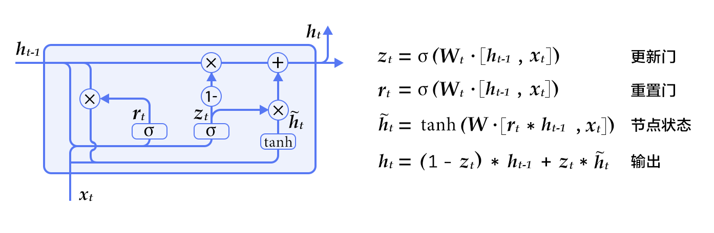

# 神经网络机器翻译模型

## 背景介绍
机器翻译利用计算机将源语言转换成目标语言的同义表达，是自然语言处理中重要的研究方向，有着广泛的应用需求，其实现方式也经历了不断地演化。传统机器翻译方法主要基于规则或统计模型，需要人为地指定翻译规则或设计语言特征，效果依赖于人对源语言与目标语言的理解程度。近些年来，深度学习的提出与迅速发展使得特征的自动学习成为可能。深度学习首先在图像识别和语音识别中取得成功，进而在机器翻译等自然语言处理领域中掀起了研究热潮。机器翻译中的深度学习模型直接学习源语言到目标语言的映射，大为减少了学习过程中人的介入，同时显著地提高了翻译质量。本例介绍在PaddlePaddle中如何利用循环神经网络（Recurrent Neural Network, RNN）构建一个端到端（End-to-End）的神经网络机器翻译（Neural Machine Translation, NMT）模型。

## 模型概览
基于 RNN 的神经网络机器翻译模型遵循编码器－解码器结构，其中的编码器和解码器均是一个循环神经网络。将构成编码器和解码器的两个 RNN 沿时间步展开，得到如下的模型结构图：

<p align="center"><br/>图 1. 编码器－解码器框架 </p>

神经机器翻译模型的输入输出可以是字符，也可以是词或者短语。不失一般性，本例以基于词的模型为例说明编码器／解码器的工作机制：

- **编码器**：将源语言句子编码成一个向量，作为解码器的输入。解码器的原始输入是表示词的 `id` 序列 $w = {w_1, w_2, ..., w_T}$，用独热（One-hot）码表示。为了对输入进行降维，同时建立词语之间的语义关联，模型为热独码表示的单词学习一个词嵌入（Word Embedding）表示，也就是常说的词向量，关于词向量的详细介绍请参考 PaddleBook 的[词向量](https://github.com/PaddlePaddle/book/blob/develop/04.word2vec/README.cn.md)一章。最后 RNN 单元逐个词地处理输入，得到完整句子的编码向量。

- **解码器**：接受编码器的输入，逐个词地解码出目标语言序列 $u = {u_1, u_2, ..., u_{T'}}$。每个时间步，RNN 单元输出一个隐藏向量，之后经 `Softmax` 归一化计算出下一个目标词的条件概率，即 $P(u_i | w, u_1, u_2, ..., u_{t-1})$。因此，给定输入 $w$，其对应的翻译结果为 $u$ 的概率则为

$$ P(u_1,u_2,...,u_{T'} | w) = \prod_{t=1}^{t={T'}}p(u_t|w, u_1, u_2, u_{t-1})$$

以中文到英文的翻译为例，源语言是中文，目标语言是英文。下面是一句源语言分词后的句子

```
祝愿 祖国 繁荣 昌盛
```

对应的目标语言英文翻译结果为：

```
Wish motherland rich and powerful
```

在预处理阶段，准备源语言与目标语言互译的平行语料数据，并分别构建源语言和目标语言的词典；在训练阶段，用这样成对的平行语料训练模型；在模型测试阶段，输入中文句子，模型自动生成对应的英语翻译，然后将生成结果与标准翻译对比进行评估。在机器翻译领域，BLEU 是最流行的自动评估指标之一。

### RNN 单元
RNN 的原始结构用一个向量来存储隐状态，然而这种结构的 RNN 在训练时容易发生梯度弥散（gradient vanishing），对于长时间的依赖关系难以建模。因此人们对 RNN 单元进行了改进，提出了 LSTM\[[1](#参考文献)] 和 GRU\[[2](#参考文献)]，这两种单元以门来控制应该记住的和遗忘的信息，较好地解决了序列数据的长时依赖问题。以本例所用的 GRU 为例，其基本结构如下：

<p align="center">
<br/>
图 2. GRU 单元
 </p>

可以看到除了隐含状态以外，GRU 内部还包含了两个门：更新门(Update Gate)、重置门(Reset Gate)。在每一个时间步，门限和隐状态的更新由图 2 右侧的公式决定。这两个门限决定了状态以何种方式更新。

### 双向编码器
在上述的基本模型中，编码器在顺序处理输入句子序列时，当前时刻的状态只包含了历史输入信息，而没有未来时刻的序列信息。而对于序列建模，未来时刻的上下文同样包含了重要的信息。可以使用如图 3 所示的这种双向编码器来同时获取当前时刻输入的上下文：
<p align="center">
<br/>
图 3. 双向编码器结构示意图
 </p>

图 3 所示的双向编码器\[[3](#参考文献)\]由两个独立的 RNN 构成，分别从前向和后向对输入序列进行编码，然后将两个 RNN 的输出合并在一起，作为最终的编码输出。
在 PaddlePaddle 中，双向编码器可以很方便地调用相关 APIs 实现：

```python
#### Encoder
src_word_id = paddle.layer.data(
    name='source_language_word',
    type=paddle.data_type.integer_value_sequence(source_dict_dim))
# source embedding
src_embedding = paddle.layer.embedding(
    input=src_word_id, size=word_vector_dim)
# use bidirectional_gru
encoded_vector = paddle.networks.bidirectional_gru(
    input=src_embedding,
    size=encoder_size,
    fwd_act=paddle.activation.Tanh(),
    fwd_gate_act=paddle.activation.Sigmoid(),
    bwd_act=paddle.activation.Tanh(),
    bwd_gate_act=paddle.activation.Sigmoid(),
    return_seq=True)
```

### 柱搜索（Beam Search） 算法
训练完成后的生成阶段，模型根据源语言输入，解码生成对应的目标语言翻译结果。解码时，一个直接的方式是取每一步条件概率最大的词，作为当前时刻的输出。但局部最优并不一定能得到全局最优，即这种做法并不能保证最后得到的完整句子出现的概率最大。如果对解的全空间进行搜索，其代价又过大。为了解决这个问题，通常采用柱搜索（Beam Search）算法。柱搜索是一种启发式的图搜索算法，用一个参数 $k$ 控制搜索宽度，其要点如下：

**1**. 在解码的过程中，始终维护 $k$ 个已解码出的子序列；

**2**. 在中间时刻 $t$, 对于 $k$ 个子序列中的每个序列，计算下一个词出现的概率并取概率最大的前 $k$ 个词，组合得到 $k^2$ 个新子序列；

**3**. 取 **2** 中这些组合序列中概率最大的前 $k$ 个以更新原来的子序列;

**4**. 不断迭代下去，直至得到 $k$ 个完整的句子，作为翻译结果的候选。

关于柱搜索的更多介绍，可以参考 PaddleBook 中[机器翻译](https://github.com/PaddlePaddle/book/blob/develop/08.machine_translation/README.cn.md)一章中[柱搜索](https://github.com/PaddlePaddle/book/blob/develop/08.machine_translation/README.cn.md#柱搜索算法)一节。


### 无注意力机制的解码器
PaddleBook中[机器翻译](https://github.com/PaddlePaddle/book/blob/develop/08.machine_translation/README.cn.md)的相关章节中，已介绍了带注意力机制（Attention Mechanism）的 Encoder-Decoder 结构，本例则介绍的是不带注意力机制的 Encoder-Decoder 结构。关于注意力机制，读者可进一步参考 PaddleBook 和参考文献\[[3](#参考文献)]。

对于流行的RNN单元，PaddlePaddle 已有很好的实现均可直接调用。如果希望在 RNN 每一个时间步实现某些自定义操作，可使用 PaddlePaddle 中的`recurrent_layer_group`。首先，自定义单步逻辑函数，再利用函数 `recurrent_group()` 循环调用单步逻辑函数处理整个序列。本例中的无注意力机制的解码器便是使用`recurrent_layer_group`来实现，其中，单步逻辑函数`gru_decoder_without_attention()`相关代码如下：

```python
#### Decoder
encoder_last = paddle.layer.last_seq(input=encoded_vector)
with paddle.layer.mixed(
        size=decoder_size,
        act=paddle.activation.Tanh()) as encoder_last_projected:
        encoder_last_projected += paddle.layer.full_matrix_projection(
            input=encoder_last)
# gru step
def gru_decoder_without_attention(enc_vec, current_word):
    '''
    Step function for gru decoder
    :param enc_vec: encoded vector of source language
    :type enc_vec: layer object
    :param current_word: current input of decoder
    :type current_word: layer object
    '''
    decoder_mem = paddle.layer.memory(
        name='gru_decoder',
        size=decoder_size,
        boot_layer=encoder_last_projected)

    context = paddle.layer.last_seq(input=enc_vec)

    with paddle.layer.mixed(size=decoder_size * 3) as decoder_inputs:
        decoder_inputs +=paddle.layer.full_matrix_projection(input=context)
        decoder_inputs += paddle.layer.full_matrix_projection(
                input=current_word)

    gru_step = paddle.layer.gru_step(
        name='gru_decoder',
        act=paddle.activation.Tanh(),
        gate_act=paddle.activation.Sigmoid(),
        input=decoder_inputs,
        output_mem=decoder_mem,
        size=decoder_size)

    with paddle.layer.mixed(
            size=target_dict_dim,
            bias_attr=True,
            act=paddle.activation.Softmax()) as out:
        out += paddle.layer.full_matrix_projection(input=gru_step)
    return out
```

在模型训练和测试阶段，解码器的行为有很大的不同：

- **训练阶段**：目标翻译结果的词向量`trg_embedding`作为参数传递给单步逻辑`gru_decoder_without_attention()`，函数`recurrent_group()`循环调用单步逻辑执行，最后计算目标翻译与实际解码的差异cost并返回；
- **测试阶段**：解码器根据最后一个生成的词预测下一个词，`GeneratedInputV2()`自动取出模型预测出的概率最高的$k$个词的词向量传递给单步逻辑，`beam_search()`函数调用单步逻辑函数`gru_decoder_without_attention()`完成柱搜索并作为结果返回。

训练和生成的逻辑分别实现在如下的`if-else`条件分支中：

```python
decoder_group_name = "decoder_group"
group_input1 = paddle.layer.StaticInputV2(input=encoded_vector, is_seq=True)
group_inputs = [group_input1]
if not generating:
    trg_embedding = paddle.layer.embedding(
        input=paddle.layer.data(
            name='target_language_word',
            type=paddle.data_type.integer_value_sequence(target_dict_dim)),
            size=word_vector_dim,
            param_attr=paddle.attr.ParamAttr(name='_target_language_embedding'))
    group_inputs.append(trg_embedding)

    decoder = paddle.layer.recurrent_group(
        name=decoder_group_name,
        step=gru_decoder_without_attention,
        input=group_inputs)

    lbl = paddle.layer.data(
        name='target_language_next_word',
            type=paddle.data_type.integer_value_sequence(target_dict_dim))
    cost = paddle.layer.classification_cost(input=decoder, label=lbl)

    return cost
else:

    trg_embedding = paddle.layer.GeneratedInputV2(
        size=target_dict_dim,
        embedding_name='_target_language_embedding',
        embedding_size=word_vector_dim)
    group_inputs.append(trg_embedding)

    beam_gen = paddle.layer.beam_search(
        name=decoder_group_name,
        step=gru_decoder_without_attention,
        input=group_inputs,
        bos_id=0,
        eos_id=1,
        beam_size=beam_size,
        max_length=max_length)

    return beam_gen
```

## 数据准备
本例所用到的数据来自[WMT14](http://www-lium.univ-lemans.fr/~schwenk/cslm_joint_paper/)，该数据集是法文到英文互译的平行语料。用[bitexts](http://www-lium.univ-lemans.fr/~schwenk/cslm_joint_paper/data/bitexts.tgz)作为训练数据，[dev+test data](http://www-lium.univ-lemans.fr/~schwenk/cslm_joint_paper/data/dev+test.tgz)作为验证与测试数据。在PaddlePaddle中已经封装好了该数据集的读取接口，在首次运行的时候，程序会自动完成下载，用户无需手动完成相关的数据准备。

## 模型的训练与测试

在定义好网络结构后，就可以进行模型训练与测试了。根据用户运行时传递的参数是`--train` 还是 `--generate`，Python 脚本的 `main()` 函数分别调用函数`train()`和`generate()`来完成模型的训练与测试。

### 模型训练
模型训练阶段，函数 `train()` 依次完成了如下的逻辑：

**a) 由网络定义，解析网络结构，初始化模型参数**

```
# initialize model
cost = seq2seq_net(source_dict_dim, target_dict_dim)
parameters = paddle.parameters.create(cost)
```

**b) 设定训练过程中的优化策略、定义训练数据读取 `reader`**

```
# define optimize method and trainer
optimizer = paddle.optimizer.RMSProp(
    learning_rate=1e-3,
    gradient_clipping_threshold=10.0,
    regularization=paddle.optimizer.L2Regularization(rate=8e-4))
trainer = paddle.trainer.SGD(
    cost=cost, parameters=parameters, update_equation=optimizer)
# define data reader
wmt14_reader = paddle.batch(
    paddle.reader.shuffle(
        paddle.dataset.wmt14.train(source_dict_dim), buf_size=8192),
    batch_size=55)
```

**c) 定义事件句柄，打印训练中间结果、保存模型快照**

```
# define event_handler callback
def event_handler(event):
    if isinstance(event, paddle.event.EndIteration):
        if event.batch_id % 100 == 0 and event.batch_id > 0:
            with gzip.open('models/nmt_without_att_params_batch_%d.tar.gz' %
                           event.batch_id, 'w') as f:
                parameters.to_tar(f)

        if event.batch_id % 10 == 0:
            print "\nPass %d, Batch %d, Cost%f, %s" % (
                event.pass_id, event.batch_id, event.cost, event.metrics)
        else:
            sys.stdout.write('.')
            sys.stdout.flush()
```

**d) 开始训练**

```
# start to train
trainer.train(
    reader=wmt14_reader, event_handler=event_handler, num_passes=2)
```

启动模型训练的十分简单，只需在命令行窗口中执行

```
python nmt_without_attention_v2.py --train
```

输出样例为

```
Pass 0, Batch 0, Cost 267.674663, {'classification_error_evaluator': 1.0}
.........
Pass 0, Batch 10, Cost 172.892294, {'classification_error_evaluator': 0.953895092010498}
.........
Pass 0, Batch 20, Cost 177.989329, {'classification_error_evaluator': 0.9052488207817078}
.........
Pass 0, Batch 30, Cost 153.633665, {'classification_error_evaluator': 0.8643803596496582}
.........
Pass 0, Batch 40, Cost 168.170543, {'classification_error_evaluator': 0.8348183631896973}
```


### 模型测试
模型测试阶段，函数`generate()`执行了依次如下逻辑：

**a) 加载测试样本**

```
# load data  samples for generation
gen_creator = paddle.dataset.wmt14.gen(source_dict_dim)
gen_data = []
for item in gen_creator():
    gen_data.append((item[0], ))
```

**b) 初始化模型，执行`infer()`为每个输入样本生成`beam search`的翻译结果**

```
beam_gen = seq2seq_net(source_dict_dim, target_dict_dim, True)
with gzip.open(init_models_path) as f:
    parameters = paddle.parameters.Parameters.from_tar(f)
# prob is the prediction probabilities, and id is the prediction word.
beam_result = paddle.infer(
    output_layer=beam_gen,
    parameters=parameters,
    input=gen_data,
    field=['prob', 'id'])
```

**c) 加载源语言和目标语言词典，将`id`序列表示的句子转化成原语言并输出结果**

```
# get the dictionary
src_dict, trg_dict = paddle.dataset.wmt14.get_dict(source_dict_dim)

# the delimited element of generated sequences is -1,
# the first element of each generated sequence is the sequence length
seq_list = []
seq = []
for w in beam_result[1]:
    if w != -1:
        seq.append(w)
    else:
        seq_list.append(' '.join([trg_dict.get(w) for w in seq[1:]]))
        seq = []

prob = beam_result[0]
for i in xrange(len(gen_data)):
    print "\n*******************************************************\n"
    print "src:", ' '.join([src_dict.get(w) for w in gen_data[i][0]]), "\n"
    for j in xrange(beam_size):
        print "prob = %f:" % (prob[i][j]), seq_list[i * beam_size + j]
```

模型测试的执行与模型训练类似，只需执行

```
python nmt_without_attention_v2.py --generate
```
则自动为测试数据生成了对应的翻译结果。
设置beam search的宽度为3，输入某个法文句子

```
src: <s> Elles connaissent leur entreprise mieux que personne . <e>
```

其对应的英文翻译结果为

```
prob = -3.754819: They know their business better than anyone . <e>
prob = -4.445528: They know their businesses better than anyone . <e>
prob = -5.026885: They know their business better than anybody . <e>
```

* `prob`表示生成句子的得分，随之其后则是翻译生成的句子；
* `<s>` 表示句子的开始，`<e>`表示一个句子的结束，如果出现了在词典中未包含的词，则用`<unk>`替代。

至此，我们在 PaddlePaddle 上实现了一个初步的机器翻译模型。我们可以看到，PaddlePaddle 提供了灵活丰富的API供大家选择和使用，使得我们能够很方便完成各种复杂网络的配置。机器翻译本身也是个快速发展的领域，各种新方法新思想在不断涌现。在学习完本例后，读者若有兴趣和余力，可基于 PaddlePaddle 平台实现更为复杂、性能更优的机器翻译模型。


## 参考文献
[1] Sutskever I, Vinyals O, Le Q V. [Sequence to Sequence Learning with Neural Networks](https://arxiv.org/abs/1409.3215)[J]. 2014, 4:3104-3112.

[2]Cho K, Van Merriënboer B, Gulcehre C, et al. [Learning phrase representations using RNN encoder-decoder for statistical machine translation](http://www.aclweb.org/anthology/D/D14/D14-1179.pdf)[C]. Proceedings of the 2014 Conference on Empirical Methods in Natural Language Processing (EMNLP), 2014: 1724-1734.

[3] Bahdanau D, Cho K, Bengio Y. [Neural machine translation by jointly learning to align and translate](https://arxiv.org/abs/1409.0473)[C]. Proceedings of ICLR 2015, 2015
