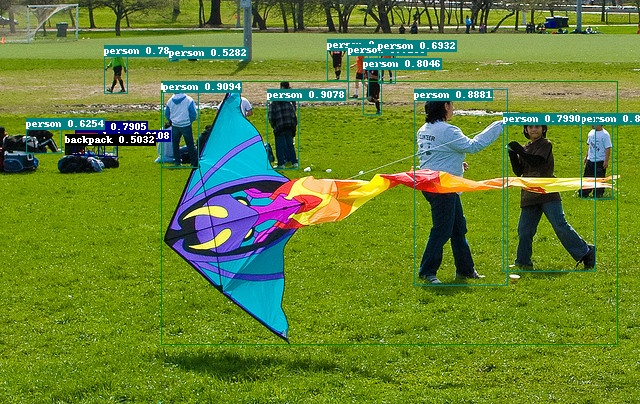

# 安装文档


## 环境要求

- PaddlePaddle 2.3
- OS 64位操作系统
- Python 3(3.5.1+/3.6/3.7/3.8/3.9)，64位版本
- pip/pip3(9.0.1+)，64位版本
- CUDA >= 10.2
- cuDNN >= 7.6

## 安装说明

### 1. 安装PaddlePaddle

```
# CUDA10.2
python -m pip install paddlepaddle-gpu==2.3.2 -i https://mirror.baidu.com/pypi/simple

# CPU
python -m pip install paddlepaddle==2.3.2 -i https://mirror.baidu.com/pypi/simple
```
- 更多CUDA版本或环境快速安装，请参考[PaddlePaddle快速安装文档](https://www.paddlepaddle.org.cn/install/quick)
- 更多安装方式例如conda或源码编译安装方法，请参考[PaddlePaddle安装文档](https://www.paddlepaddle.org.cn/documentation/docs/zh/install/index_cn.html)

请确保您的PaddlePaddle安装成功并且版本不低于需求版本。使用以下命令进行验证。

```
# 在您的Python解释器中确认PaddlePaddle安装成功
>>> import paddle
>>> paddle.utils.run_check()

# 确认PaddlePaddle版本
python -c "import paddle; print(paddle.__version__)"
```

### 2. 安装PaddleCV

```
# 克隆PaddleModelPipeline仓库
cd <path/to/clone/PaddleModelPipeline>
git clone https://github.com/jerrywgz/PaddleModelPipeline.git

# 安装其他依赖
cd PaddleModelPipeline

# 编译安装paddlecv
python setup.py install
```

同时支持whl包安装使用，详细步骤参考[文档](whl.md)

安装后确认测试通过：

```
python tests/test_pipeline.py
```

测试通过后会提示如下信息：

```
.
----------------------------------------------------------------------
Ran 1 tests in 2.967s

OK
```

## 快速体验

**恭喜！** 您已经成功安装了PaddleCV，接下来快速体验目标检测效果

```
# 在GPU上预测一张图片
export CUDA_VISIBLE_DEVICES=0
python -u tools/predict.py --config=configs/single_op/PP-YOLOE+.yml --input=demo/000000014439.jpg
```

会在`output`文件夹下生成一个画有预测结果的同名图像。

结果如下图：


