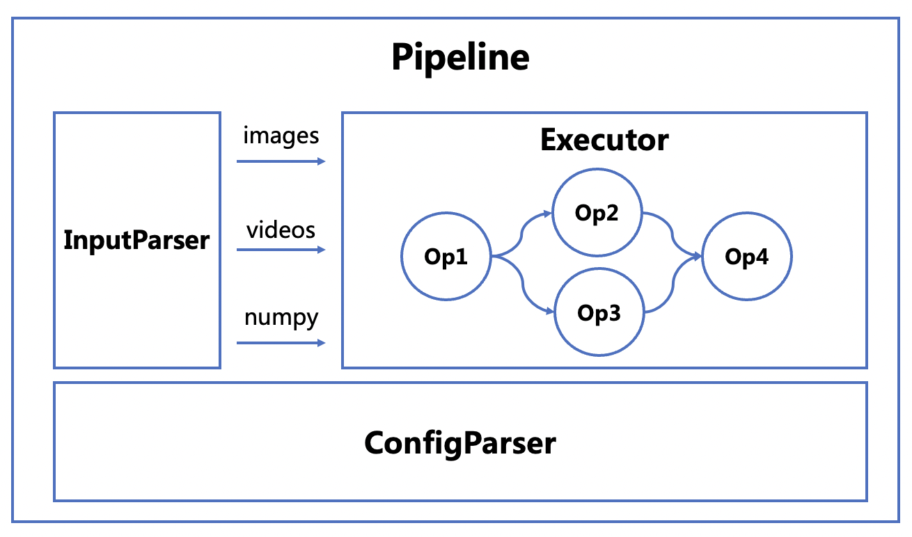

# 系统设计思想

- [目标](#1)
- [框架设计](#2)
  - [2.1 配置模块设计](#2.1)
  - [2.2 输入模块设计](#2.2)
  - [2.3 算子实现方案](#2.3)
  - [2.4 系统串联方案](#2.4)


<a name="1"></a>

## 目标
为了解决深度学习单模型及串联系统部署问题，飞桨模型团队设计了一套通用统一的部署系统，其核心特点包括：

1. 通用性：系统既要满足单模型部署，又要支持多模型复杂的拓扑关系
2. 高可用性：支持多种不同输入类型，通过配置文件即可高效实现复现系统串联
4. 高灵活性：支持自定义算子便捷接入，灵活实现定制化部署需求

<a name="2"></a>

## 框架设计

系统整体架构如图所示

<div align=center>

</div>

<a name="2.1"></a>

**一. 配置模块设计**

配置模块解析配置文件，拆分为环境配置和模型配置，同时检查配置项是否合规。环境配置负责管理部署环境相关配置，例如`run_mode`和`device`等。模型配置负责管理每个模型算子配置，包括模型路径、前后处理等。通过`Inputs`配置段实现模型间复杂的串联关系。配置示例可以参考[PP-PicoDet.yml](../configs/single_op/PP-PicoDet.yml)

同时支持命令行更新配置文件任意配置项功能，利于开发者快速进行更改环境，替换模型，超参调优等工作。

配置文件管理部分，系统针对每个任务（task），推荐用户使用对应的配置文件，并提供`get_config_file`接口实现自动下载, 例如:

```python
import paddlecv
paddlecv.get_config_file('detection')
```

<a name="2.2"></a>

**二. 输入模块设计**

输入模块解析输入文件格式，支持图片，图片文件夹，视频，numpy数据格式。统一使用`input`字段作为输入接口。输入模块代码实现参考[链接](../ppcv/engine/pipeline.py#L45)

<a name="2.3"></a>

**三. 算子实现方案**

系统算子分为模型算子（MODEL）、衔接算子（CONNECTOR）和输出算子（OUTPUT）三部分。三部分算子均有固定的输出格式和输出字段。模型算子将每个模型的预处理、前向推理、后处理端到端全流程进行独立封装；衔接算子连接模型算子的各类输入输出，例如扣图、过滤等；输出字段负责单模型或复杂系统的输出形式，例如可视化、结果保存等功能。详细算子实现流程请参考[文档](how_to_add_new_op.md)

<a name="2.4"></a>

**四. 系统串联方案**

系统通过有向无环图（DAG）串联各个算子并执行，每个算子需要指定`Inputs`字段，字段格式为`{last_op_name}.{last_op_output_name}`，即需要包含前置算子名称和对应输出字段名。从而建立算子之间的拓扑关系，并通过拓扑排序的方式决定算子执行顺序。系统串联执行过程中，会维护全量输出结果，并根据算子指定的`Inputs`字段对结果进行过滤，保证各算子内部计算独立。执行器核心代码实现参考[链接](../ppcv/core/framework.py#L92)
