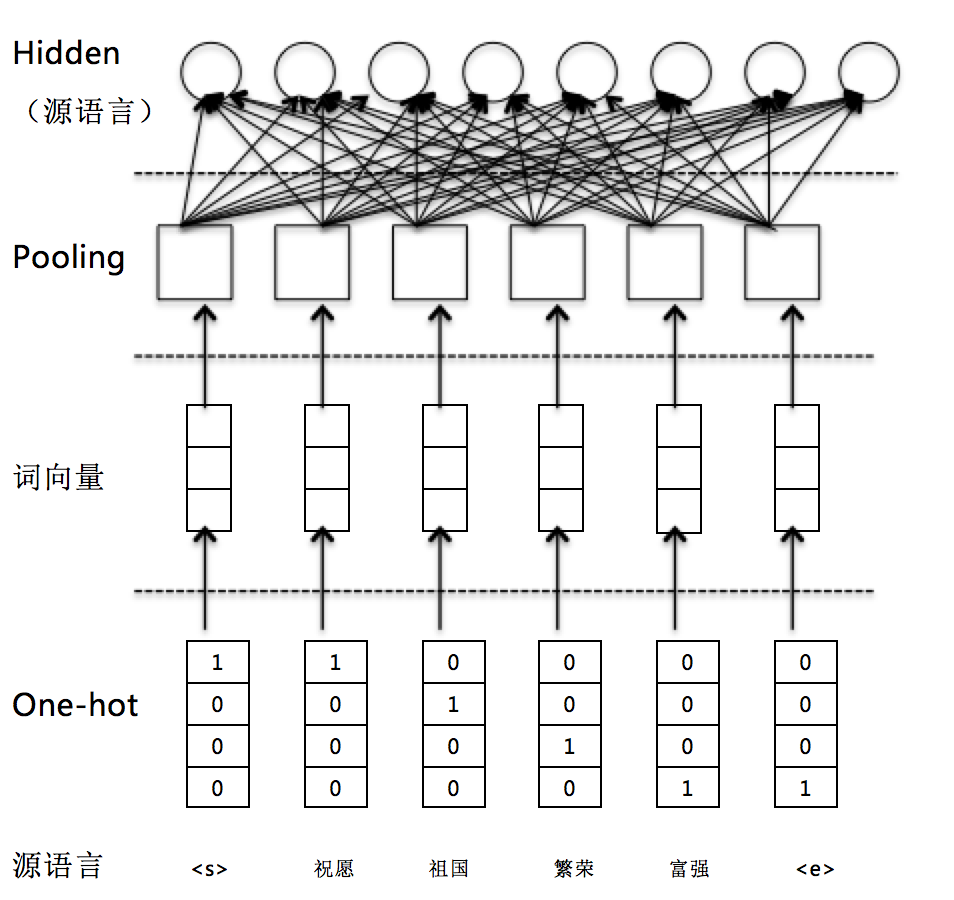

# 回归问题

回归问题是机器学习中的一个经典问题，主要目的是构建一个函数将输入数据与输出数据关联起来。本示例中利用机器翻译中的[WMT-14](https://github.com/PaddlePaddle/book/tree/develop/08.machine_translation#数据介绍)，构建了一个相同结构的网络，对源数据与目标数据进行编码。迭代更新源数据网络的参数，来拟合目标数据的编码，完成了一个简单的回归问题。经典的线性回归，请参考[fit_a_line](https://github.com/PaddlePaddle/book/tree/develop/01.fit_a_line).

## 数据准备

本示例使用[WMT-14](http://www-lium.univ-lemans.fr/~schwenk/cslm_joint_paper/)数据集，因为完整的数据集数据量较大，使用PaddlePaddle接口paddle.dataset.wmt14中默认提供了一个经过预处理的[较小规模的数据集](http://paddlepaddle.bj.bcebos.com/demo/wmt_shrinked_data/wmt14.tgz)。

该数据集有193319条训练数据，6003条测试数据，词典长度为30000。因为数据规模限制，使用该数据集训练出来的模型效果无法保证

## 模型概览

本示例采用机器翻译的数据集作为训练数据。为了使用源序列数据拟合目标序列数据，需要对源序列与目标序列通过相同网络结构来编码处理，生成相同大小的向量。值得注意的是，目标序列的参数在需要在训练过程中固定。

### 源序列编码器

编码阶段分为四步：

1. one-hot vector表示：将源语言句子$x=\left \{ x_1,x_2,...,x_T \right \}$的每个词$x_i$表示成一个列向量$w_i\epsilon \left \{ 0,1 \right \}^{\left | V \right |},i=1,2,...,T$。这个向量$w_i$的维度与词汇表大小$\left | V \right |$ 相同，并且只有一个维度上有值1（该位置对应该词在词汇表中的位置），其余全是0。

2. 映射到低维语义空间的词向量：word_embeding

3. Pooling层：对word_embding向量进行池化处理

3. Hidden层：对池化后的向量连一个全连接层，编码得到固定长度的向量

<p align="center">
<br/>
图5. 源序列编码编码器
</p>

目标序列的编码器结果与源序列编码器保持一致

## 流程说明

### 模型结构

1. 首先，定义了一些全局变量。

  ```python
   dict_size = 30000 # 字典维度
   input1_dict_dim = input2_dict_dim = dict_size #源序列与目标序列字典维度
   word_emb_dim = 512 #词向量维度
   hidden_dim = 512 #全连接层维度
  ```

2. 其次，实现编码器框架。分为四步：

-  输入是一个文字序列，被表示成整型的序列。序列中每个元素是文字在字典中的索引。所以，我们定义数据层的数据类型为`integer_value_sequence`（整型序列），序列中每个元素的范围是`[0, source_dict_dim)`。

 ```python
    input_data = paddle.layer.data(
        name='input_word',
        type=paddle.data_type.integer_value_sequence(input_dict_dim))
 ```
 -  将上述编码映射到低维语言空间的词向量$\mathbf{s}$。
  ```python
    input_emb = paddle.layer.embedding(
            input=input_data,
            size=word_emb_dim,
            param_attr=paddle.attr.Param(name='_emb_basic1', initial_std=0.02))
  ```

 - 对词向量进行池化处理。

  ```python
    input_vec = paddle.layer.pooling(
            input=input_emb,
            pooling_type=paddle.pooling.Sum(),
            bias_attr=paddle.attr.ParameterAttribute(
            name='_avg.bias_basic1', initial_std=0.01))
  ```

 - 使用全连接层对池化后的向量进行编码处理。

  ```python
    hidden_input = paddle.layer.fc(
            input=input_vec,
            size=hidden_dim,
            act=paddle.activation.Tanh(),
            param_attr=paddle.attr.Param(name='_hidden_input.w1', initial_std=0.03),
            bias_attr=paddle.attr.ParameterAttribute(
            name='_hidden_input.bias1'))
  ```

3. 目标序列编码器框架
目标序列与源序列的编码网络结构一致，不同的是参数is_static=True，使得目标序列的网络结果参数在训练过程中保持不变

  ```python
    input_emb = paddle.layer.embedding(
            input=input_data,
            size=word_emb_dim,
            param_attr=paddle.attr.Param(name='_emb_basic2', is_static=True))

        input_vec = paddle.layer.pooling(
            input=input_emb,
            pooling_type=paddle.pooling.Sum(),
            bias_attr=paddle.attr.ParameterAttribute(
            name='_avg.bias_basic2', is_static=True))

        hidden_input = paddle.layer.fc(
            input=input_vec,
            size=hidden_dim,
            act=paddle.activation.Tanh(),
            param_attr=paddle.attr.Param(name='_hidden_input.w2', is_static=True),
            bias_attr=paddle.attr.ParameterAttribute(
            name='_hidden_input.bias2', is_static=True))
  ```
### 训练模型

1. 数据定义

    获取wmt14的dataset reader。

    ```python
    if not is_generating:
        wmt14_reader = paddle.batch(
            paddle.reader.shuffle(
                paddle.dataset.wmt14.train(dict_size=dict_size), buf_size=8192),
            batch_size=5)
    ```

2. 构造trainer

    根据优化目标cost,网络拓扑结构和模型参数来构造出trainer用来训练，在构造时还需指定优化方法，这里使用最基本的SGD方法。

    ```python
    #train the network
    cost = regression_net(input1_dict_dim, input2_dict_dim)
    parameters = paddle.parameters.create(cost)

    # define optimize method and trainer
    optimizer = paddle.optimizer.Adam(
        learning_rate=5e-5,
        regularization=paddle.optimizer.L2Regularization(rate=8e-4))

    trainer = paddle.trainer.SGD(
        cost=cost, parameters=parameters, update_equation=optimizer)
    ```

3. 启动训练

    ```python
    # start to train
    trainer.train(
        reader=wmt14_reader, event_handler=event_handler, num_passes=2)
    ```

## 运行与输出

本部分介绍如何利用样例中的`regression.py`脚本进行回归模型训练。

`regression.py`中的代码分为四部分：

**encode_net函数**：定义编码器网络结构，上文已经有说明。

**regression_net函数**：模型训练函数。定义回归模型网络结果。

**main函数**：主函数，定义优化方式、训练输出等内容，并组织训练流程。

要运行本样例，直接在`regression.py`所在路径下执行`python ./regression.py`即可，样例会自动依次执行数据集下载、数据读取、模型训练和测试等步骤。

模型训练过程输出形式为：
```
Pass 0, Batch 0, Cost 199.840833
Pass 0, Batch 100, Cost 146.913696
Pass 0, Batch 200, Cost 33.758130
Pass 0, Batch 300, Cost 30.043756
Pass 0, Batch 400, Cost 57.393976
Pass 0, Batch 500, Cost 54.718372
Pass 0, Batch 600, Cost 10.710149
Pass 0, Batch 700, Cost 6.287951
```
可以观察到模型训练结果一直在下降
