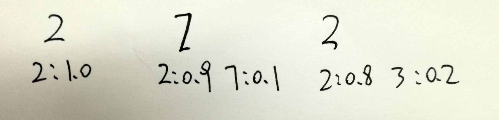

# 回归问题

回归属于有监督学习中的一种方法，其核心思想是从连续型统计数据中得到数学模型，然后将该模型应用于预测或者分类。本示例瞄准的是模型回归问题，即用一个performance非常好的网络来教新网络进行学习。其中performance好的网络参数在学习过程中固定不变（通过设置layer参数属性 `is_static=True` 实现），需要在训练之前进行初始化。
经典的线性回归问题，请参考[fit_a_line](https://github.com/PaddlePaddle/book/tree/develop/01.fit_a_line).

## 背景介绍

回归问题通常指的是确定两种或两种以上变量间相互依赖的定量关系的一类问题。通常可以分为线性回归和非线性回归。通常的回归方法包括：Linear Regression，Logistic Regression，Ridge Regression等。与分类问题不同的是分类一般针对离散型结果而言的, 回归是针对连续型结果的，但其本质还是一样的。

在实际应用中，一个大的DNN通常效果效果较好，通过对同一数据集进行多次学习得到数个不同的DNN模型，然后进行ensemble通常能够提升模型性能，然而这种方式明显增加了模型训练代价，影响实际应用。因此Hinton提出了一种名为Knowledge Distillation(KD)[[1](#参考文献1)\]的方法。将大规模的DNN训练模型中的细粒度知识迁移至小规模网络的训练当中，使其学习的速度效率提高了很多，并且在小粒度的任务当中对于容易引起困惑的实例的分类效果得到了加强。举个例子，对于MNIST数据集中的手写数字"2"（存在多种手写格式），其真实label是"2"，但是一个性能较好的大网络可能会给label"3"或"7"一些概率值（意味着该手写数字与3或者7有一定相似性，这种情况是实际存在的），这种信息通常被称为"soft targets"，与之相对的真实label称为"hard target"。

<p align="center">
<br/>
图1. 手写字体示例
</p>

为了方便理解，本示例采用两个拓扑结构一致的网络进行拟合，其中一个网络的参数已经提前学习好，需要在训练过程中保持不变（通过设置 `is_static=True` 实现）。本示例描述的是对两条语义相近的语句使用不同网络进行编码，其中一个的网络编码方式已经确定，通过调整另一个网络的参数进行拟合，使得两个网络对于语义相近的语句的编码相近。

## 数据准备

本示例采用的数据示例如下图所示，左右两端语句的语意相近，中间以 `\t` 分割。
用户需要自行编写数据读取接口,使用其它数据来进行测试

<p align="center">
<br/>
图2. 数据示例
</p>

### 数据文件格式

压缩数据集包 `train_data.tar.gz` ,其中包含3个数据文件 train、test、dict，其中train与test的数据格式一致，如下所示，以 `\t`分割，单次之间以空格分割
```
克里斯 保罗 经历    人物 故事 克里斯
成都 到 康定 火车 票    成都 到 康定 火车 有 吗
```
dict的格式如下所示：
```
<s>
<e>
<unk>
炫飞
闹钟
灵岩
```
其中 `<s>` 表示开头，`<e>` 表示结尾，`<unk>` 表示未知字符。

### 数据生成器

本示例使用的是文本数据，需要先用词典进行编码，生成一个整数序列。编写的数据读取接口实际上就是一个Python生成器，该生成器负责解析数据文件中的每一行内容，然后传送给输入层 `paddle.layer.data` ，该输入层的输入数据类型为 `paddle.data_type.integer_value_sequence` 。该Python生成器的需要包含一个生成词典的函数和生成适合输入的Python list的函数。
```python
def __read_to_dict__(tar_file, dict_size):
    def __to_dict__(fd, size):
        out_dict = dict()
        for line_count, line in enumerate(fd):
            if line_count < size:
                out_dict[line.strip()] = line_count
            else:
                break
        return out_dict
    with tarfile.open(tar_file, mode='r') as f:
        names = [
            each_item.name for each_item in f
            if each_item.name.endswith("dict")
        ]
        assert len(names) == 1
        word_dict = __to_dict__(f.extractfile(names[0]), dict_size)
    return word_dict
```
```python
def reader_creator(tar_file, file_name, dict_size):
    def reader():
        word_dict = __read_to_dict__(tar_file, dict_size)
        with tarfile.open(tar_file, mode='r') as f:
            names = [
                each_item.name for each_item in f
                if each_item.name.endswith(file_name)
            ]
            for name in names:
                for line in f.extractfile(name):
                    line_split = line.strip().split('\t')
                    if len(line_split) != 2:
                        continue
                    first_seq = line_split[0]  # first sequence
                    first_words = first_seq.split()
                    first_ids = [
                        word_dict.get(w, UNK_IDX)
                        for w in [START] + first_words + [END]
                    ]
                    second_seq = line_split[1]  # second sequence relate to first
                    second_words = second_seq.split()
                    second_ids = [second_dict.get(w, UNK_IDX) for w in second_words]

                    # remove sequence whose length > 80 in training mode
                    if len(first_ids) > 80 or len(second_ids) > 80:
                        continue
                    second_ids_next = second_ids + [frist_dict[END]]
                    second_ids = [word_dict[START]] + second_ids

                    yield first_ids, second_ids, second_ids_next
    return reader

 def train(dict_size):
    return reader_creator('train_data.tar.gz', 'train', dict_size)
 ```

使用方式如下：
```python
    data_reader = paddle.batch(
        paddle.reader.shuffle(
            data_process.train(dict_size), buf_size=8192),
        batch_size=5)
```

## 模型概览

本示例是通过调整源网络模型的参数拟合目标网络模型，需要对源序列与目标序列通过一致的网络拓扑结构来编码处理，生成相同规格的向量。值得注意的是，目标网络的参数在需要在训练过程中保持不变。

### 序列编码器

编码阶段分为四步：

1. one-hot vector表示：将源语言句子$x=\left \{ x_1,x_2,...,x_T \right \}$的每个词$x_i$表示成一个列向量$w_i\epsilon \left \{ 0,1 \right \}^{\left | V \right |},i=1,2,...,T$。这个向量$w_i$的维度与词汇表大小$\left | V \right |$ 相同，并且只有一个维度上有值1（该位置对应该词在词汇表中的位置），其余全是0。

2. 映射到低维语义空间的词向量：word_embeding，详细参考[paddle.layer.embedding](http://www.paddlepaddle.org/doc_cn/api/v2/config/layer.html#embedding).

3. Pooling层：对word_embding向量进行池化处理,包括 `MaxPooling` 和 `AvgPooling`, 将单层序列经过运算变成一个0层序列（独立的元素，类型可以是PaddlePaddle支持的任意输入数据类型）

3. Hidden层：对池化后的向量连一个全连接层，编码得到固定长度的向量

<p align="center">
<br/>
图3. 序列编码器示意图
</p>

## 流程说明

### 模型结构

1. 首先，定义了一些全局变量。
```python
   dict_size = 30000 # 字典维度
   word_emb_dim = 512 #词向量维度
   hidden_dim = 512 #全连接层维度
```

2. 其次，实现编码器框架。分为四步：

-  输入是一个文字序列，被表示成整型的序列。序列中每个元素是文字在字典中的索引。所以，我们定义数据层的数据类型为`integer_value_sequence`（整型序列），序列中每个元素的范围是`[0, input_dict_dim)`。
```python
    input_data = paddle.layer.data(
        name=input_name,
        type=paddle.data_type.integer_value_sequence(input_dict_dim))
```
 -  将上述编码映射到低维语言空间的词向量$\mathbf{s}$。
```python
    input_emb = paddle.layer.embedding(
            input=input_data,
            size=word_emb_dim,
            param_attr=paddle.attr.Param(name=_emb_name, initial_std=0.02, is_static=is_static))
```

 - 对词向量进行池化处理。
```python
    input_vec = paddle.layer.pooling(
            input=input_emb,
            pooling_type=paddle.pooling.Sum(),
            bias_attr=paddle.attr.ParameterAttribute(
            name=_avg_name, initial_std=0.01, is_static=is_static))
```

 - 使用全连接层对池化后的向量进行编码处理。
```python
    hidden_input = paddle.layer.fc(
            input=input_vec,
            size=hidden_dim,
            act=paddle.activation.Tanh(),
            param_attr=paddle.attr.Param(name=hidden_input_w, initial_std=0.03, is_static=is_static),
            bias_attr=paddle.attr.ParameterAttribute(
            name=hidden_input_bias, is_static=is_static))
```
目标网络的拓扑结构与源网络保持一致，不同的是参数is_static=True，使得目标网络的参数在训练过程中保持不变。

### 目标网络参数初始化

若网络层的参数包含 `is_static=True` ，则该层的参数在网络训练过程中保持不变。在本示例中需要对目标网络的embeding层、pooling层和fc层的参数进行初始化
```python
    # initial the parameters of input2 networks
    parameters.set('_emb_basic', load_parameter('./models/_avg.bias_basic', dict_size, word_emb_dims))
    parameters.set('_avg.bias_basic', load_parameter('./models/_emb_basic', word_emb_dim, 1))
    parameters.set('_hidden_input.w2', load_parameter('./models/_hidden_input.w2', word_emb_dim, hidden_dim))
    parameters.set('_hidden_input.bias2', load_parameter('./models/_hidden_input.bias2', hidden_dim, 1))
```

### 训练模型

1. 数据定义

    获取data reader。
```python
    # define data reader
    data_reader = paddle.batch(
        paddle.reader.shuffle(
            data_process.train(dict_size), buf_size=8192),
        batch_size=5)
```

2. 构造trainer

    根据优化目标cost,网络拓扑结构和模型参数来构造出trainer用来训练，在构造时还需指定优化方法，这里使用最基本的SGD方法。

```python
    #train the network
    cost = regression_net(input1_dict_dim, input2_dict_dim)
    parameters = paddle.parameters.create(cost)

    # initial the parameters of input2 networks
    parameters.set('_emb_basic', load_parameter('./models/_avg.bias_basic', dict_size, word_emb_dims))
    parameters.set('_avg.bias_basic', load_parameter('./models/_emb_basic', word_emb_dim, 1))
    parameters.set('_hidden_input.w2', load_parameter('./models/_hidden_input.w2', word_emb_dim, hidden_dim))
    parameters.set('_hidden_input.bias2', load_parameter('./models/_hidden_input.bias2', hidden_dim, 1))

    # define optimize method and trainer
    optimizer = paddle.optimizer.Adam(
        learning_rate=5e-5,
        regularization=paddle.optimizer.L2Regularization(rate=8e-4))

    trainer = paddle.trainer.SGD(
        cost=cost, parameters=parameters, update_equation=optimizer)
```

3. 启动训练
```python
    trainer.train(
        reader=data_reader, event_handler=event_handler, num_passes=2)
```

## 运行与输出

本部分介绍如何利用样例中的`regression.py`脚本进行回归模型训练。

`regression.py`中的代码分为四部分：

**encode_net函数**：定义编码器网络结构，上文已经有说明。

**regression_net函数**：模型训练函数。定义回归模型网络结果。

**main函数**：主函数，定义优化方式、训练输出等内容，参数初始化，并组织训练流程。

要运行本样例，直接在`regression.py`所在路径下执行`python ./regression.py`即可，样例会自动依次执行数据集下载、数据读取、模型训练和测试等步骤。

模型训练过程输出形式为：
```
Pass 0, Batch 0, Cost 283.923291
Pass 0, Batch 100, Cost 6.700358
Pass 0, Batch 200, Cost 0.154797
Pass 0, Batch 300, Cost 0.185172
Pass 0, Batch 400, Cost 0.095839
```
可以观察到模型训练结果一直在下降

## 参考文献
1. Hinton, G., Vinyals, O., & Dean, J. (2015). [Distilling the knowledge in a neural network](https://arxiv.org/abs/1503.02531). arXiv preprint arXiv:1503.02531.
2. Ba, J., & Caruana, R. (2014). [Do deep nets really need to be deep?](https://arxiv.org/abs/1312.6184). In Advances in neural information processing systems (pp. 2654-2662).
