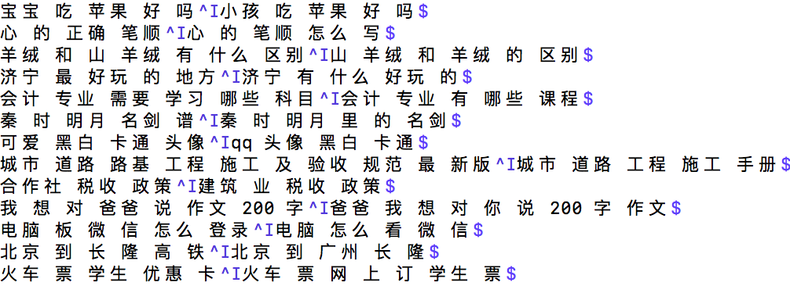

# 回归问题

回归问题是机器学习中的一个经典问题，主要目的是构建一个函数将输入数据与输出数据关联起来。本示例中拟合两条语意相近的语句，通过构建了一个相同结构的网络，对源数据与目标数据进行编码。迭代更新源数据网络的参数，来拟合目标数据的编码，完成了一个简单的回归问题。用户可以利用机器翻译中的[WMT-14](https://github.com/PaddlePaddle/book/tree/develop/08.machine_translation#数据介绍)数据集来测试该配置文件，经典的线性回归，请参考[fit_a_line](https://github.com/PaddlePaddle/book/tree/develop/01.fit_a_line).

## 数据准备

本示例模拟的是两条语句相近的两条语句的编码相似，具体示例如下图所示，左右两端语句的语意相近，中间以 `\t` 分割。
用户需要自行编写数据读取接口,使用其它数据来进行测试

<p align="center">
<br/>
图1. 数据示例
</p>

本示例使用的是文本数据，需要先用词典进行编码，生成一个整数序列。编写的数据读取接口实际上就是一个Python生成器，该生成器负责解析数据文件中的每一行内容，然后传送给输入层 `paddle.layer.data` ，该输入层的输入数据类型为 `paddle.data_type.integer_value_sequence` 。该Python生成器的需要包含一个生成词典的函数和生成适合输入的Python list的函数。
```python
def __read_to_dict__(tar_file, dict_size):
    def __to_dict__(fd, size):
        out_dict = dict()
        for line_count, line in enumerate(fd):
            if line_count < size:
                out_dict[line.strip()] = line_count
            else:
                break
        return out_dict
    with tarfile.open(tar_file, mode='r') as f:
        names = [
            each_item.name for each_item in f
            if each_item.name.endswith("dict")
        ]
        assert len(names) == 1
        src_dict = __to_dict__(f.extractfile(names[0]), dict_size)
    return src_dict
  ```
  ```python
def reader_creator(tar_file, file_name, dict_size):
    def reader():
        src_dict = __read_to_dict__(tar_file, dict_size)
        with tarfile.open(tar_file, mode='r') as f:
            names = [
                each_item.name for each_item in f
                if each_item.name.endswith(file_name)
            ]
            for name in names:
                for line in f.extractfile(name):
                    line_split = line.strip().split('\t')
                    if len(line_split) != 2:
                        continue
                    src_seq = line_split[0]  # one source sequence
                    src_words = src_seq.split()
                    src_ids = [
                        src_dict.get(w, UNK_IDX)
                        for w in [START] + src_words + [END]
                    ]
                    trg_seq = line_split[1]  # one target sequence
                    trg_words = trg_seq.split()
                    trg_ids = [src_dict.get(w, UNK_IDX) for w in trg_words]

                    # remove sequence whose length > 80 in training mode
                    if len(src_ids) > 80 or len(trg_ids) > 80:
                        continue
                    trg_ids_next = trg_ids + [src_dict[END]]
                    trg_ids = [src_dict[START]] + trg_ids

                    yield src_ids, trg_ids, trg_ids_next
    return reader

def train(dict_size):
    return reader_creator('train_data.tar.gz', 'train', dict_size)
  ```

本示例在第一次使用时可以采用[WMT-14](http://www-lium.univ-lemans.fr/~schwenk/cslm_joint_paper/)数据集，因为完整的数据集数据量较大，使用PaddlePaddle接口paddle.dataset.wmt14中默认提供了一个经过预处理的[较小规模的数据集](http://paddlepaddle.bj.bcebos.com/demo/wmt_shrinked_data/wmt14.tgz)。

使用方式如下：

  ```python
   data_reader = paddle.batch(
        paddle.reader.shuffle(
            paddle.dataset.wmt14.train(dict_size), buf_size=8192),
        batch_size=5)
  ```

## 模型概览

本示例采用机器翻译的数据集作为训练数据。为了使用源序列数据拟合目标序列数据，需要对源序列与目标序列通过相同网络结构来编码处理，生成相同大小的向量。值得注意的是，目标序列的参数在需要在训练过程中固定。

### 源序列编码器

编码阶段分为四步：

1. one-hot vector表示：将源语言句子$x=\left \{ x_1,x_2,...,x_T \right \}$的每个词$x_i$表示成一个列向量$w_i\epsilon \left \{ 0,1 \right \}^{\left | V \right |},i=1,2,...,T$。这个向量$w_i$的维度与词汇表大小$\left | V \right |$ 相同，并且只有一个维度上有值1（该位置对应该词在词汇表中的位置），其余全是0。

2. 映射到低维语义空间的词向量：word_embeding

3. Pooling层：对word_embding向量进行池化处理

3. Hidden层：对池化后的向量连一个全连接层，编码得到固定长度的向量

<p align="center">
<br/>
图2. 源序列编码编码器
</p>

目标序列的编码器结果与源序列编码器保持一致

## 流程说明

### 模型结构

1. 首先，定义了一些全局变量。

  ```python
   dict_size = 30000 # 字典维度
   input1_dict_dim = input2_dict_dim = dict_size #源序列与目标序列字典维度
   word_emb_dim = 512 #词向量维度
   hidden_dim = 512 #全连接层维度
  ```

2. 其次，实现编码器框架。分为四步：

-  输入是一个文字序列，被表示成整型的序列。序列中每个元素是文字在字典中的索引。所以，我们定义数据层的数据类型为`integer_value_sequence`（整型序列），序列中每个元素的范围是`[0, source_dict_dim)`。

 ```python
    input_data = paddle.layer.data(
        name='input_word',
        type=paddle.data_type.integer_value_sequence(input_dict_dim))
 ```
 -  将上述编码映射到低维语言空间的词向量$\mathbf{s}$。
  ```python
    input_emb = paddle.layer.embedding(
            input=input_data,
            size=word_emb_dim,
            param_attr=paddle.attr.Param(name='_emb_basic1', initial_std=0.02))
  ```

 - 对词向量进行池化处理。

  ```python
    input_vec = paddle.layer.pooling(
            input=input_emb,
            pooling_type=paddle.pooling.Sum(),
            bias_attr=paddle.attr.ParameterAttribute(
            name='_avg.bias_basic1', initial_std=0.01))
  ```

 - 使用全连接层对池化后的向量进行编码处理。

  ```python
    hidden_input = paddle.layer.fc(
            input=input_vec,
            size=hidden_dim,
            act=paddle.activation.Tanh(),
            param_attr=paddle.attr.Param(name='_hidden_input.w1', initial_std=0.03),
            bias_attr=paddle.attr.ParameterAttribute(
            name='_hidden_input.bias1'))
  ```

3. 目标序列编码器框架
目标序列与源序列的编码网络结构一致，不同的是参数is_static=True，使得目标序列的网络结果参数在训练过程中保持不变

  ```python
    input_emb = paddle.layer.embedding(
            input=input_data,
            size=word_emb_dim,
            param_attr=paddle.attr.Param(name='_emb_basic2', is_static=True))

        input_vec = paddle.layer.pooling(
            input=input_emb,
            pooling_type=paddle.pooling.Sum(),
            bias_attr=paddle.attr.ParameterAttribute(
            name='_avg.bias_basic2', is_static=True))

        hidden_input = paddle.layer.fc(
            input=input_vec,
            size=hidden_dim,
            act=paddle.activation.Tanh(),
            param_attr=paddle.attr.Param(name='_hidden_input.w2', is_static=True),
            bias_attr=paddle.attr.ParameterAttribute(
            name='_hidden_input.bias2', is_static=True))
  ```
### 训练模型

1. 数据定义

    获取wmt14的dataset reader。

    ```python
    if not is_generating:
        data_reader = paddle.batch(
            paddle.reader.shuffle(
                data_process.train(dict_size), buf_size=8192),
            batch_size=5)
    ```

2. 构造trainer

    根据优化目标cost,网络拓扑结构和模型参数来构造出trainer用来训练，在构造时还需指定优化方法，这里使用最基本的SGD方法。

    ```python
    #train the network
    cost = regression_net(input1_dict_dim, input2_dict_dim)
    parameters = paddle.parameters.create(cost)

    # define optimize method and trainer
    optimizer = paddle.optimizer.Adam(
        learning_rate=5e-5,
        regularization=paddle.optimizer.L2Regularization(rate=8e-4))

    trainer = paddle.trainer.SGD(
        cost=cost, parameters=parameters, update_equation=optimizer)
    ```

3. 启动训练

    ```python
    # start to train
    trainer.train(
        reader=data_reader, event_handler=event_handler, num_passes=2)
    ```

## 运行与输出

本部分介绍如何利用样例中的`regression.py`脚本进行回归模型训练。

`regression.py`中的代码分为四部分：

**encode_net函数**：定义编码器网络结构，上文已经有说明。

**regression_net函数**：模型训练函数。定义回归模型网络结果。

**main函数**：主函数，定义优化方式、训练输出等内容，并组织训练流程。

要运行本样例，直接在`regression.py`所在路径下执行`python ./regression.py`即可，样例会自动依次执行数据集下载、数据读取、模型训练和测试等步骤。

模型训练过程输出形式为：
```
Pass 0, Batch 0, Cost 283.923291
Pass 0, Batch 100, Cost 6.700358
Pass 0, Batch 200, Cost 0.154797
Pass 0, Batch 300, Cost 0.185172
Pass 0, Batch 400, Cost 0.095839
```
可以观察到模型训练结果一直在下降
