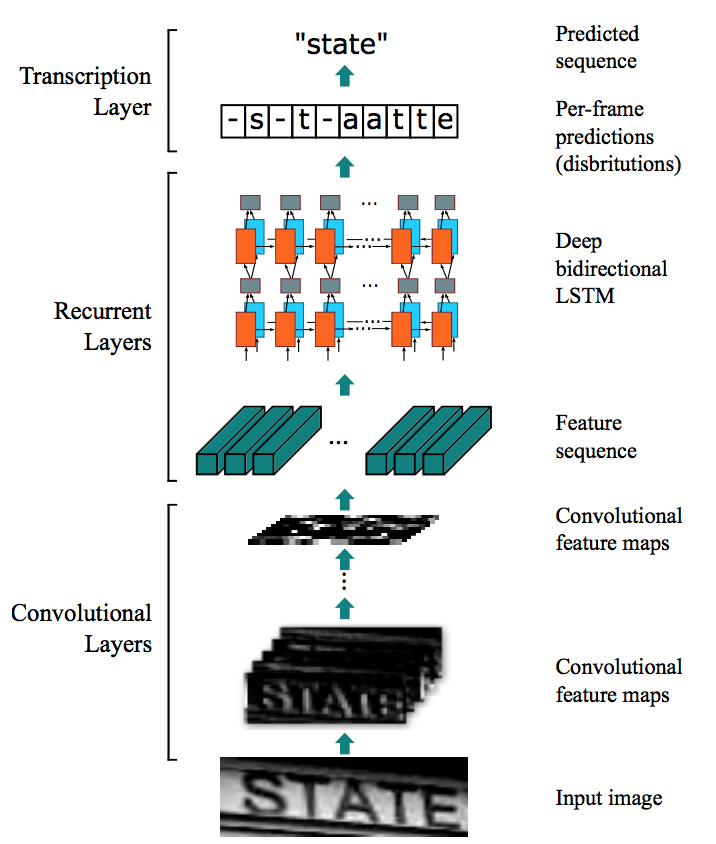

# 场景文字识别 (STR, Scene Text Recognition)

## STR任务简介

在现实生活中，包括路牌、菜单、大厦标语在内的很多场景均会有文字出现，这些场景的照片中的文字为图片场景的理解提供了更多信息，\[[1](#参考文献)\]使用深度学习模型自动识别路牌中的文字，帮助街景应用获取更加准确的地址信息。

本文将针对 **场景文字识别 (STR, Scene Text Recognition)** 任务，演示如何用 PaddlePaddle 实现 一个端对端 CTC 的模型 **CRNN(Convolutional Recurrent Neural Network)**
\[[2](#参考文献)\]，该模型有如下比较显著的特点：

1. 端对端训练，直接从原始数据到目标标签序列学习。
2. 输入的图片数据集不要求有统一的尺寸。
3. 模型更小，性能也更好，容易支持工业级应用。

具体的，本文使用如下图片进行训练，需要识别文字对应的文字 "keep"。

<p align="center">
<br/>
图 1. 数据示例 "keep"
</p>

## 模型介绍

论文\[[2](#参考文献)\] 中描述的模型的特点是，使用神经网络实现了一个端对端训练的模型，直接从图像输入数据预测出对应的文字标签。模型的整体结构如下图:

<p align="center">
 <br/>
图 2. 模型结构
</p>

从下往上的模块分别为

-   Convolutional Layers, 自动提取图像特征；最终会产生一个三维的图像特征映射，可以拆分成图像特征序列。
-   Recurrent Layers, 接受图像特征序列，并且在每个时间步上预测出对应标签（字符），所有时间步的字符组成字符串。
-   Transaction Layer, 将预测出的字符串加工成符合语法的单词，比如 **-s-t-aatte** 转化为 **state**。

### 利用CNN进行图像特征序列提取
模型的第一步是特征的提取，对于图像任务，一般使用CNN来作为特征提取的基本模块。

为了能够兼容对不同尺寸的图片，比如下图中的两张图片，将其高度固定，就变成了宽度不相同的图片。

<p align="center">
<br/>
<br/>
图 3. 不同尺寸的图片
</p>

直接使用CNN应用到图片上，最后在pooling层会得到高度一致，但宽度不同的图像特征（矩阵），由于CNN中的卷积(convolution)和池化(pooling)两种操作均会在高层特征上综合每个局部区域像素级的特征，
因此在CNN最上层输出的特征表示中，每个像素均包含了原始图片中一个小的局部区域的信息。

CRNN将CNN输出特征表示（矩阵）按列切割成一个特征向量(可以称为Frame，帧)的序列，作为模型更上层结构的输入，如下图展示，这里的每个特征向量均表示了原始图像中一个窄的矩形的信息。
<p align="center">
<br/>
图 4. 图像特征序列
</p>

### 利用RNN建模序列信息
CNN可以从原始图像学习到特征向量的序列，但只能建模局部像素的信息，而RNN则进一步建模特征序列中包含的全局信息。

CTC 将特征序列中帧与目标标签序列的对应关系建模成一系列的多分类问题，是为序列标注任务设计的一种端到端损失函数 \[[3](#参考文献)\]。具体地，为每一帧通过多分类模型生成一个标签，如此输入的特征序列会对应预测成标签序列，这个过程中，对输入特征序列建模的就是RNN。

论文中具体使用的RNN算法是GRU（Gated Recurrent Units）\[[6](#参考文献)\], 是比 `LSTM` 简单一些的RNN实现， RNN为每个时间步建模特征序列中的全局信息，并作为 CTC 的输入，得到标签的分布（每个标签对应一个预测概率，所有标签的概率构成一个分布，可以表示为一个0~1间的浮点数向量），所有时间步会生成多个向量，也就是一个浮点数向量的序列。

比如下表中的演示，横向为各个实践步对应的帧，纵向为字符标签的概率分布向量（这里列举5种字符）


 Char/Probability | frame 0 | frame 1 | frame 3
------------------|---------|---------|---------
 'e'              |     0.1 |     0.21 |     0.2
 'h'              |     0.3 |     0.1 |     0.12
 'a'              |     0.1 |     0.3 |     0.1
 'l'              |     0.2 |     0.2 |     0.22
 'o'              |     0.1 |     0.1 |     0.1
 ...              |     ... |     ... |     ...


<p align="center">
表 1. RNN每个frame输出的标签分布示例
</p>

通过查找上表，很容易得到模型生成任何标签序列的概率，比如生成3个字符 "hel" 的概率的计算如下：

```
0.3 * 0.21 * 0.22 = 0.01386
```

对应标签的概率分布，会有多种映射从标签分布转化成目标序列，例如一个10帧的输入特征序列要生成目标序列（ "hello"），可以有如下映射方式(`-`表示空格)：

- `-h-el-ll-o`
- `hello----`
- `-h-e-l-lo`
- ...

上面几种映射方式转化到目标序列 `hello` 有如下特点：

1. 每种映射的长度相同，这个例子里长度都是10。
2. 假定不同的映射方式间概率独立。
3. 映射的序列，默认会去掉空格和连续重复的标签，比如 `ll-o` 会变成 `lo`。

因此，模型生成目标序列的学习概率就变成了综合所有能生成目标序列的映射的概率之和，即：

$$p(l|y) = \sum_{\pi:B(\pi)=l} p(\pi | y)$$

其中，$l$表示目标序列，$y$ 是标签分布的序列，$\pi$ 表示将预测出的序列分布转化为目标标签序列的映射。

### 模型训练

输入原始的图片数据，CRNN会利用CNN来学习提取图像特征，转化为特征向量的序列，交由RNN学习；
RNN为每个时间步建模特征序列中的全局信息，并由 CTC 生成目标序列所有映射的概率求和，得到标签的分布，作为模型生成目标序列的预测概率（学习损失）。

## 使用 PaddlePaddle 训练与预测

### 图像数据及处理
本任务使用数据集\[[4](#参考文献)\]，数据中包括了图片数据和对应的目标文本，其中预测的目标文本需要转化为一维的ID列表，我们用data_provider.py里的类`AciiDic`来实现。

```python
class AsciiDic(object):
    UNK = 0

    def __init__(self):
        self.dic = {
            '<unk>': self.UNK,
        }
    ...
```

包括图片处理在内的其他数据集处理封装在data_provider.py里的类 `ImageDataset`中：

### 模型构建

模型的代码具体参见 [model.py](./model.py)，我们使用了一个类 `Model` 来封装模型的结构，在模型的构造函数中直接构造完模型的结构。

```python
class Model(object):
    def __init__(self, num_classes, shape, is_infer=False):
        self.num_classes = num_classes
        self.shape = shape
        self.is_infer = is_infer
        self.image_vector_size = shape[0] * shape[1]

        self.__declare_input_layers__()
        self.__build_nn__()

```

接下来声明模型的输入数据类型:

```python
def __declare_input_layers__(self):
    self.image = layer.data(
        name='image',
        type=paddle.data_type.dense_vector(self.image_vector_size),
        height=self.shape[0],
        width=self.shape[1])

    if self.is_infer == False:
        self.label = layer.data(
            name='label',
            type=paddle.data_type.integer_value_sequence(self.num_classes))

```

`image` 是一个float 的向量表示 `dense_vector` ，label 是文本中字符的 id 序列，在PaddlePaddle中是 integer_value_sequence类型 。 。

构建CNN模块，我们使用 `img_conv_group` 来构建一个深层的CNN网络，PaddlePaddle 中的 `img_conv_group` 打包了CNN常用的结构，
包括 `Conv` （卷积）、`BN`（batch normalization)、`Relu` (RELU激活函数)、Pooling (池化)等操作。

这里我们使用了4个 `img_conv_group` ：

```python
def conv_groups(input_image, num, with_bn):
    assert num % 4 == 0

    tmp = img_conv_group(
        input=input_image,
        num_channels=1,
        conv_padding=1,
        conv_num_filter=[16] * (num / 4),
        conv_filter_size=3,
        conv_act=Relu(),
        conv_with_batchnorm=with_bn,
        pool_size=2,
        pool_stride=2, )

    ...
```

组合CNN模块：

```python
    def __build_nn__(self):
        # CNN output image features, 128 float matrixes
        conv_features = ctc_convs(self.image, 8, True)
        ...
```

我们把CNN产生的特征按列分割成特征向量序列，这里用到 `layer.block_expand` ，也就是按 `x` 轴和 `y` 轴切割特征（矩阵）得到特征序列。 `layer.block_expand` 的设定包括指定特征序列步长的大小 `(block_x, block_y)` ，这里是，`x` 方向 1个像素，`y` 方向 11 个像素（对应CNN输出特征矩阵的高），两个方向上的步长(stride)都是1个block，最终 `sliced_feature` 就是像素尺寸 (1, 11) 的特征向量序列。

```python
    def __build_nn__(self):
        # CNN output image features, 128 float matrixes
        conv_features = ctc_convs(self.image, 8, True)

        # cutting CNN output into a sequence of feature vectors, which are
        # 1 pixel wide and 11 pixel high.
        sliced_feature = layer.block_expand(
            input=conv_features,
            num_channels=128,
            stride_x=1,
            stride_y=1,
            block_x=1,
            block_y=11)
```

特征向量序列传入给RNN模块：

```python
        # RNNs to capture sequence information forwards and backwards.
        gru_forward = simple_gru(input=sliced_feature, size=128, act=Relu())
        gru_backward = simple_gru(
            input=sliced_feature, size=128, act=Relu(), reverse=True)
```

这里使用了 `simple_gru` 是比 `LSTM` 简单一些的RNN实现，对于一个确定的序列，
我们使用了 `simple_gru` 分别对其正反顺序均作了建模，学习两个方向的state序列。

从RNN学习的特征序列，将由 `fc` 映射为维度 `self.num_classes + 1` 的向量（多出来的1表示空格），多个时间步会构成一个序列。

```python
        # map each step of RNN to character distribution.
        self.output = layer.fc(
            input=[gru_forward, gru_backward],
            size=self.num_classes + 1,
            act=Linear())
```

 上述的输出`self.output`将作为 `CTC` loss的输入，这里我们使用了 对应warp CTC\[[5](#参考文献)\] 的封装 `layer.warp_ctc` ：

```python
        # warp CTC to calculate cost for a CTC task.
        self.cost = layer.warp_ctc(
            input=self.output,
            label=self.label,
            size=self.num_classes + 1,
            norm_by_times=True,
            blank=self.num_classes)
```

具体的参数包括，传入前面 `fc` 生成的标签分布的向量序列 `self.output` 以及目标标签序列 `self.label` ，标签字典的大小 `self.num_classes+1` ， 按时间步归一设 `True` ，空格对应的类别 ID 为 `self.num_classes` 。


### 运行训练和测试
训练脚本参照 [./train.py](./train.py)，设置了如下命令行参数：

```
usage: train.py [-h] --image_shape IMAGE_SHAPE --train_file_list
                TRAIN_FILE_LIST --test_file_list TEST_FILE_LIST
                [--batch_size BATCH_SIZE]
                [--model_output_prefix MODEL_OUTPUT_PREFIX]
                [--trainer_count TRAINER_COUNT]
                [--save_period_by_batch SAVE_PERIOD_BY_BATCH]
                [--num_passes NUM_PASSES]

PaddlePaddle CTC example

optional arguments:
  -h, --help            show this help message and exit
  --image_shape IMAGE_SHAPE
                        image's shape, format is like '173,46'
  --train_file_list TRAIN_FILE_LIST
                        path of the file which contains path list of train
                        image files
  --test_file_list TEST_FILE_LIST
                        path of the file which contains path list of test
                        image files
  --batch_size BATCH_SIZE
                        size of a mini-batch
  --model_output_prefix MODEL_OUTPUT_PREFIX
                        prefix of path for model to store (default:
                        ./model.ctc)
  --trainer_count TRAINER_COUNT
                        number of training threads
  --save_period_by_batch SAVE_PERIOD_BY_BATCH
                        save model to disk every N batches
  --num_passes NUM_PASSES
                        number of passes to train (default: 1)
```

其中最重要的几个参数包括：

- `image_shape` 图片的尺寸
- `train_file_list` 训练数据的列表文件，每行一个路径加对应的text，格式类似：
```
word_1.png, "PROPER"
```
- `test_file_list` 测试数据的列表文件，格式同上

### 预测
预测部分由infer.py完成，本示例对于ctc的预测使用的是最优路径解码算法(CTC greedy decoder)，即在每个时间步选择一个概率最大的字符。在使用过程中，需要在infer.py中指定具体的模型目录、图片固定尺寸、batch_size和图片文件的列表文件。例如：
```python
model_path = "model.ctc-pass-9-batch-150-test-10.0065517931.tar.gz"  
image_shape = "173,46"
batch_size = 50
infer_file_list = 'data/test_data/Challenge2_Test_Task3_GT.txt'
```
然后运行```python infer.py```


### 具体执行的过程：

1.从官方下载数据\[[7](#参考文献)\]（Task 2.3: Word Recognition (2013 edition)），会有三个文件: Challenge2_Training_Task3_Images_GT.zip、Challenge2_Test_Task3_Images.zip和 Challenge2_Test_Task3_GT.txt。
分别对应训练集的图片和图片对应的单词，测试集的图片，测试数据对应的单词，然后执行以下命令，对数据解压并移动至目标文件夹：

```
mkdir -p data/train_data
mkdir -p data/test_data
unzip Challenge2_Training_Task3_Images_GT.zip -d data/train_data
unzip Challenge2_Test_Task3_Images.zip -d data/test_data
mv Challenge2_Test_Task3_GT.txt data/test_data
```

2.获取训练数据文件夹中 `gt.txt` 的路径 (data/train_data）和测试数据文件夹中`Challenge2_Test_Task3_GT.txt`的路径(data/test_data)

3.执行命令
```
python train.py --train_file_list data/train_data/gt.txt --test_file_list data/test_data/Challenge2_Test_Task3_GT.txt --image_shape '173,46'
```
4.训练过程中，模型参数会自动备份到指定目录，默认为 ./model.ctc

5.设置infer.py中的相关参数(模型所在路径)，运行```python infer.py``` 进行预测


### 其他数据集

-   [SynthText in the Wild Dataset](http://www.robots.ox.ac.uk/~vgg/data/scenetext/)(41G)

-   [ICDAR 2003 Robust Reading Competitions](http://www.iapr-tc11.org/mediawiki/index.php?title=ICDAR_2003_Robust_Reading_Competitions)

### 注意事项

- 由于模型依赖的 `warp CTC` 只有CUDA的实现，本模型只支持 GPU 运行
- 本模型参数较多，占用显存比较大，实际执行时可以调节batch_size 控制显存占用
- 本模型使用的数据集较小，可以选用其他更大的数据集\[[4](#参考文献)\]来训练需要的模型

## 参考文献

1. [Google Now Using ReCAPTCHA To Decode Street View Addresses](https://techcrunch.com/2012/03/29/google-now-using-recaptcha-to-decode-street-view-addresses/)
2. Shi B, Bai X, Yao C. [An end-to-end trainable neural network for image-based sequence recognition and its application to scene text recognition](https://arxiv.org/pdf/1507.05717.pdf)[J]. IEEE Transactions on Pattern Analysis and Machine Intelligence, 2016. APA
3. Graves A, Fernández S, Gomez F, et al. [Connectionist temporal classification: labelling unsegmented sequence data with recurrent neural networks](http://machinelearning.wustl.edu/mlpapers/paper_files/icml2006_GravesFGS06.pdf)[C]//Proceedings of the 23rd international conference on Machine learning. ACM, 2006: 369-376.
4. [SynthText in the Wild Dataset](http://www.robots.ox.ac.uk/~vgg/data/scenetext/)
5. [warp CTC github](https://github.com/baidu-research/warp-ctc)
6. Junyoung Chung, Caglar Gulcehre, KyungHyun Cho, et al. [Empirical Evaluation of Gated Recurrent Neural Networks on Sequence Modeling](https://arxiv.org/pdf/1412.3555.pdf)[C]//Proceedings of  Deep Learning and Representation Learning Workshop of the 27th NIPS, 2014.
7. [Focused Scene Text](http://rrc.cvc.uab.es/?ch=2&com=introduction)
