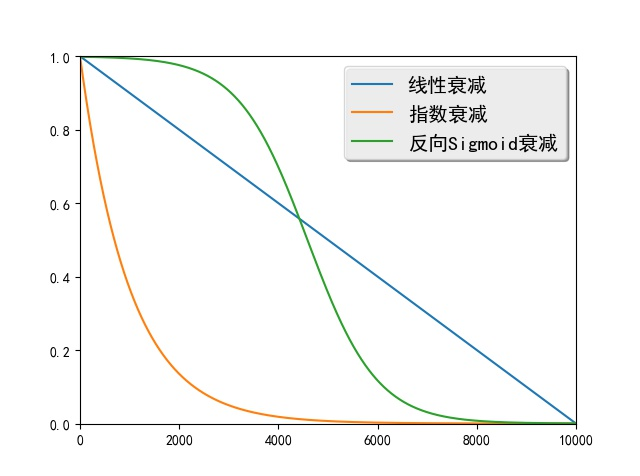

Run these examples of programs in this directory require PaddlePaddle v0.10.0 . If your PaddlePaddle installation is lower than this requirement, please follow the instructions in the [installation documentation](http://www.paddlepaddle.org/docs/develop/documentation/zh/build_and_install/pip_install_cn.html) to update the PaddlePaddle version.

---

# Scheduled Sampling

## Introduction

The generate target of sequence generate task is to maximize the probability of target sequence when a given source is input. During the training, the model input real elements as decoders to each step, then maximize the probability of next element. During the generation, the element created in the previous decoder step is used as current input, consequently generate the next element. In this case, It can been seen probability distribution in training stage and generation stage are not consistent.

Scheduled Sampling \[[1](#参考文献)\] is a method to solve the inconsistent distribution of input data during training and generation.In the early stage of training, this method mainly uses the real elements in the target sequence as the decoder input, and can quickly guide the model from a randomly initialized state to a reasonable state. As training progresses, the method will gradually increase the use of the generated element as decoder input to solve the problem of inconsistent data distribution.

In the process from a standard sequence to a sequence model, if an incorrect element is created in the preceding part of the sequence , the subsequent input state will be affected, and the error will gradually accumulate as the generation proceeds forwards. Scheduled Sampling uses the generated element as a decoder input with a certain probability, so that even if the previous one generates error, its training target is still to maximize the probability of the real target sequence, and the model will do the training in the right direction. Therefore, this method increases the fault-tolerant capability of the model. 

## Algorithm Introduction

Scheduled Sampling is mainly used in the training stage from sequence to sequence model.But It doesn't require Scheduled Sampling in  generation phrase

When the decoder maximizes the probability of the $t$ element during the training phase, the standard sequence-to-sequence model uses the real element $y_{t-1}$ at the previous moment as input. Let's assume that the element generated at a time is $g_{t-1}$, and the Scheduled Sampling algorithm uses $g_{t-1}$ as a decoder input with a certain probability.

Suppose that the $i$ mini-batch is currently trained. The Scheduled Sampling defines a probability $\epsilon_i$ to control the decoder's input. $\epsilon_i$ is a variable that decays as $i$ increases. The common definition is as follows:

 - Linear decay：$\epsilon_i=max(\epsilon,k-c*i)$，Where $\epsilon$ limits the minimum value of $\epsilon_i$, $k$ and $c$ control the magnitude of linear decay.

 - Exponential decay：$\epsilon_i=k^i$，Where $0<k<1$ and $k$ control the magnitude of the exponential decay.

 - Reverse Sigmoid decay：$\epsilon_i=k/(k+exp(i/k))$，Where $k>1$, $k$ also controls the magnitude of attenuation.

Figure 1 shows the attenuation curves for these three methods.

<p align="center">
<br>
Figure 1. Attenuation curves for linear decay, exponential decay, and inverse Sigmoid decay
</p>

As shown in Figure 2, at the decoder's $t$ time, the Scheduled Sampling uses the element $y_{t-1}$ generated at the previous moment as the decoder input with the probability of $\epsilon_i$, and uses the element $g_{t-1}$ generated at the last moment  as a decoder input with the probability of $1-\epsilon_i$. From Figure 1, it can be seen that as $i$ increases, $\epsilon_i$ will continue to decrease. The decoder will continue to use the generated elements as input, and the data distribution during the training phase and the generation phase will become more and more consistent.

<p align="center">
<br>
figure2. Scheduled Sampling select different elements as decoder inputs
</p>

## Model implementation

Because Scheduled Sampling is an improvement over the sequence-to-sequence model, its whole implementation framework is similar to the sequence-to-sequence model. To emphasize the point of this article, only the parts related to Scheduled Sampling are introduced here. For complete code, see `network_conf.py`.

First import the required package and define the class that controls the decay probability `RandomScheduleGenerator` , as follows:

```python
import numpy as np
import math


class RandomScheduleGenerator:
    """
    The random sampling rate for scheduled sampling algoithm, which uses devcayed
    sampling rate.

    """
    ...
```
The following three methods of class `RandomScheduleGenerator` will be defined respectively: `__init__`, `getScheduleRate` and `processBatch`.

The `__init__` method initializes the class, and its `schedule_type` parameter specifies which attenuation method to use, the options being `constant`, `linear`, `exponential`, and `inverse_sigmoid`. `Constant` refers to the use of a fixed $\epsilon_i$ for all mini-batch, `linear` for linear decay, ʻexponential` for exponential decay, and ʻinverse_sigmoid` for inverse Sigmoid decay. The parameters `a` and `b` for the `__init__` method represent the parameters of the decay method and need to be tuned on the validation set. `self.schedule_computers` maps the decay mode to a function that computes $\epsilon_i$. The last line assigns the selected attenuation function to the `self.schedule_computer` variable according to `schedule_type`.

```python
def __init__(self, schedule_type, a, b):
    """
    schduled_type: is the type of the decay. It supports constant, linear,
    exponential, and inverse_sigmoid right now.
    a: parameter of the decay (MUST BE DOUBLE)
    b: parameter of the decay (MUST BE DOUBLE)
    """
    self.schedule_type = schedule_type
    self.a = a
    self.b = b
    self.data_processed_ = 0
    self.schedule_computers = {
        "constant": lambda a, b, d: a,
        "linear": lambda a, b, d: max(a, 1 - d / b),
        "exponential": lambda a, b, d: pow(a, d / b),
        "inverse_sigmoid": lambda a, b, d: b / (b + math.exp(d * a / b)),
    }
    assert (self.schedule_type in self.schedule_computers)
    self.schedule_computer = self.schedule_computers[self.schedule_type]
```

`getScheduleRate` calculate $\epsilon_i$ based on the decay function and the amount of data already processed.

```python
def getScheduleRate(self):
    """
    Get the schedule sampling rate. Usually not needed to be called by the users
    """
    return self.schedule_computer(self.a, self.b, self.data_processed_)

```

The `processBatch` method is sampled according to the probability value $\epsilon_i$ to get `indexes`, and the probability that each element in `indexes` takes `0` is $\epsilon_i$, and the probability that the value is `1` is $1. -\epsilon_i$. `indexes` determines whether the decoder's input is a real or generated element. A value of `0` indicates that a real element is used, and a value `1` indicates that the generated element is used.

```python
def processBatch(self, batch_size):
    """
    Get a batch_size of sampled indexes. These indexes can be passed to a
    MultiplexLayer to select from the grouth truth and generated samples
    from the last time step.
    """
    rate = self.getScheduleRate()
    numbers = np.random.rand(batch_size)
    indexes = (numbers >= rate).astype('int32').tolist()
    self.data_processed_ += batch_size
    return indexes
```

Scheduled Sampling needs to add an input `true_token_flag` to the sequence-to-sequence model to control the decoder input.

```python
true_token_flags = paddle.layer.data(
    name='true_token_flag',
    type=paddle.data_type.integer_value_sequence(2))
```

Here also need to encapsulate the original reader, add the data generator of `true_token_flag`. The following uses linear decay as an example to show how to call `RandomScheduleGenerator` defined above to generate input data for `true_token_flag`.

```python
def gen_schedule_data(reader,
                      schedule_type="linear",
                      decay_a=0.75,
                      decay_b=1000000):
    """
    Creates a data reader for scheduled sampling.

    Output from the iterator that created by original reader will be
    appended with "true_token_flag" to indicate whether to use true token.

    :param reader: the original reader.
    :type reader: callable
    :param schedule_type: the type of sampling rate decay.
    :type schedule_type: str
    :param decay_a: the decay parameter a.
    :type decay_a: float
    :param decay_b: the decay parameter b.
    :type decay_b: float

    :return: the new reader with the field "true_token_flag".
    :rtype: callable
    """
    schedule_generator = RandomScheduleGenerator(schedule_type, decay_a, decay_b)

    def data_reader():
        for src_ids, trg_ids, trg_ids_next in reader():
            yield src_ids, trg_ids, trg_ids_next, \
                  [0] + schedule_generator.processBatch(len(trg_ids) - 1)

    return data_reader
```

This code adds the data inputed by control decoder after the original input data(the source sequence element `src_ids`, the target sequence element `trg_ids`, and the next element `trg_ids_next` of target element sequence ). Since the first element of the decoder is the sequence starter, the first element of the appended data is set to `0`, indicating that the first step of the decoder always uses the first element of the real target sequence (ie, the sequence start symbol).

The decoder function called at each step of `recurrent_group` during training is as follows:

```python
def gru_decoder_with_attention_train(enc_vec, enc_proj, true_word,
                                       true_token_flag):
      """
      The decoder step for training.
      :param enc_vec: the encoder vector for attention
      :type enc_vec: LayerOutput
      :param enc_proj: the encoder projection for attention
      :type enc_proj: LayerOutput
      :param true_word: the ground-truth target word
      :type true_word: LayerOutput
      :param true_token_flag: the flag of using the ground-truth target word
      :type true_token_flag: LayerOutput
      :return: the softmax output layer
      :rtype: LayerOutput
      """

      decoder_mem = paddle.layer.memory(
          name='gru_decoder', size=decoder_size, boot_layer=decoder_boot)

      context = paddle.networks.simple_attention(
          encoded_sequence=enc_vec,
          encoded_proj=enc_proj,
          decoder_state=decoder_mem)

      gru_out_memory = paddle.layer.memory(
          name='gru_out', size=target_dict_dim)

      generated_word = paddle.layer.max_id(input=gru_out_memory)

      generated_word_emb = paddle.layer.embedding(
          input=generated_word,
          size=word_vector_dim,
          param_attr=paddle.attr.ParamAttr(name='_target_language_embedding'))

      current_word = paddle.layer.multiplex(
          input=[true_token_flag, true_word, generated_word_emb])

      decoder_inputs = paddle.layer.fc(
          input=[context, current_word],
          size=decoder_size * 3,
          act=paddle.activation.Linear(),
          bias_attr=False)

      gru_step = paddle.layer.gru_step(
          name='gru_decoder',
          input=decoder_inputs,
          output_mem=decoder_mem,
          size=decoder_size)

      out = paddle.layer.fc(
          name='gru_out',
          input=gru_step,
          size=target_dict_dim,
          act=paddle.activation.Softmax())
      return out
```

This function uses the `memory` layer `gru_out_memory` to remember the elements generated at a time and selects the most probable word `generated_word` as the generated word according to `gru_out_memory`. The `multiplex` layer will choose between the real element `true_word` and the generated element `generated_word`, and will use the result of the selection as a decoder input. The `multiplex` layer uses three inputs, `true_token_flag`, `true_word`, and `generated_word_emb`. For each of these three inputs, if the value of `true_token_flag` is `0`, then the `multiplex` layer outputs the corresponding element in `true_word`; if the value in `true_token_flag` is `1`, then ` The multiplex` layer outputs the corresponding elements in `generated_word_emb`.


## References

[1] Bengio S, Vinyals O, Jaitly N, et al. [Scheduled sampling for sequence prediction with recurrent neural networks](http://papers.nips.cc/paper/5956-scheduled-sampling-for-sequence-prediction-with-recurrent-neural-networks)//Advances in Neural Information Processing Systems. 2015: 1171-1179.
