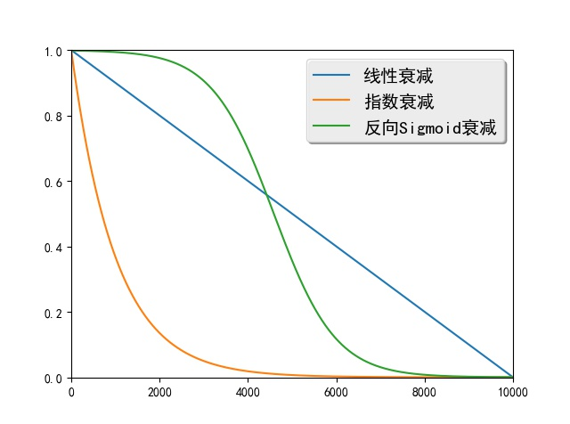

运行本目录下的程序示例需要使用PaddlePaddle v0.10.0 版本。如果您的PaddlePaddle安装版本低于此要求，请按照[安装文档](http://www.paddlepaddle.org/docs/develop/documentation/zh/build_and_install/pip_install_cn.html)中的说明更新PaddlePaddle安装版本。

---

# Scheduled Sampling

## 概述

序列生成任务的生成目标是在给定源输入的条件下，最大化目标序列的概率。训练时该模型将目标序列中的真实元素作为解码器每一步的输入，然后最大化下一个元素的概率。生成时上一步解码得到的元素被用作当前的输入，然后生成下一个元素。可见这种情况下训练阶段和生成阶段的解码器输入数据的概率分布并不一致。

Scheduled Sampling \[[1](#参考文献)\]是一种解决训练和生成时输入数据分布不一致的方法。在训练早期该方法主要使用目标序列中的真实元素作为解码器输入，可以将模型从随机初始化的状态快速引导至一个合理的状态。随着训练的进行，该方法会逐渐更多地使用生成的元素作为解码器输入，以解决数据分布不一致的问题。

标准的序列到序列模型中，如果序列前面生成了错误的元素，后面的输入状态将会收到影响，而该误差会随着生成过程不断向后累积。Scheduled Sampling以一定概率将生成的元素作为解码器输入，这样即使前面生成错误，其训练目标仍然是最大化真实目标序列的概率，模型会朝着正确的方向进行训练。因此这种方式增加了模型的容错能力。

## 算法简介
Scheduled Sampling主要应用在序列到序列模型的训练阶段，而生成阶段则不需要使用。

训练阶段解码器在最大化第$t$个元素概率时，标准序列到序列模型使用上一时刻的真实元素$y_{t-1}$作为输入。设上一时刻生成的元素为$g_{t-1}$，Scheduled Sampling算法会以一定概率使用$g_{t-1}$作为解码器输入。

设当前已经训练到了第$i$个mini-batch，Scheduled Sampling定义了一个概率$\epsilon_i$控制解码器的输入。$\epsilon_i$是一个随着$i$增大而衰减的变量，常见的定义方式有：

 - 线性衰减：$\epsilon_i=max(\epsilon,k-c*i)$，其中$\epsilon$限制$\epsilon_i$的最小值，$k$和$c$控制线性衰减的幅度。

 - 指数衰减：$\epsilon_i=k^i$，其中$0<k<1$，$k$控制着指数衰减的幅度。

 - 反向Sigmoid衰减：$\epsilon_i=k/(k+exp(i/k))$，其中$k>1$，$k$同样控制衰减的幅度。

图1给出了这三种方式的衰减曲线，

<p align="center">
<br>
图1. 线性衰减、指数衰减和反向Sigmoid衰减的衰减曲线
</p>

如图2所示，在解码器的$t$时刻Scheduled Sampling以概率$\epsilon_i$使用上一时刻的真实元素$y_{t-1}$作为解码器输入，以概率$1-\epsilon_i$使用上一时刻生成的元素$g_{t-1}$作为解码器输入。从图1可知随着$i$的增大$\epsilon_i$会不断减小，解码器将不断倾向于使用生成的元素作为输入，训练阶段和生成阶段的数据分布将变得越来越一致。

<p align="center">
<br>
图2. Scheduled Sampling选择不同元素作为解码器输入示意图
</p>

## 模型实现

由于Scheduled Sampling是对序列到序列模型的改进，其整体实现框架与序列到序列模型较为相似。为突出本文重点，这里仅介绍与Scheduled Sampling相关的部分，完整的代码见`network_conf.py`。

首先导入需要的包，并定义控制衰减概率的类`RandomScheduleGenerator`，如下：

```python
import numpy as np
import math


class RandomScheduleGenerator:
    """
    The random sampling rate for scheduled sampling algoithm, which uses devcayed
    sampling rate.

    """
    ...
```

下面将分别定义类`RandomScheduleGenerator`的`__init__`、`getScheduleRate`和`processBatch`三个方法。

`__init__`方法对类进行初始化，其`schedule_type`参数指定了使用哪种衰减方式，可选的方式有`constant`、`linear`、`exponential`和`inverse_sigmoid`。`constant`指对所有的mini-batch使用固定的$\epsilon_i$，`linear`指线性衰减方式，`exponential`表示指数衰减方式，`inverse_sigmoid`表示反向Sigmoid衰减。`__init__`方法的参数`a`和`b`表示衰减方法的参数，需要在验证集上调优。`self.schedule_computers`将衰减方式映射为计算$\epsilon_i$的函数。最后一行根据`schedule_type`将选择的衰减函数赋给`self.schedule_computer`变量。

```python
def __init__(self, schedule_type, a, b):
    """
    schduled_type: is the type of the decay. It supports constant, linear,
    exponential, and inverse_sigmoid right now.
    a: parameter of the decay (MUST BE DOUBLE)
    b: parameter of the decay (MUST BE DOUBLE)
    """
    self.schedule_type = schedule_type
    self.a = a
    self.b = b
    self.data_processed_ = 0
    self.schedule_computers = {
        "constant": lambda a, b, d: a,
        "linear": lambda a, b, d: max(a, 1 - d / b),
        "exponential": lambda a, b, d: pow(a, d / b),
        "inverse_sigmoid": lambda a, b, d: b / (b + math.exp(d * a / b)),
    }
    assert (self.schedule_type in self.schedule_computers)
    self.schedule_computer = self.schedule_computers[self.schedule_type]
```

`getScheduleRate`根据衰减函数和已经处理的数据量计算$\epsilon_i$。

```python
def getScheduleRate(self):
    """
    Get the schedule sampling rate. Usually not needed to be called by the users
    """
    return self.schedule_computer(self.a, self.b, self.data_processed_)

```

`processBatch`方法根据概率值$\epsilon_i$进行采样，得到`indexes`，`indexes`中每个元素取值为`0`的概率为$\epsilon_i$，取值为`1`的概率为$1-\epsilon_i$。`indexes`决定了解码器的输入是真实元素还是生成的元素，取值为`0`表示使用真实元素，取值为`1`表示使用生成的元素。

```python
def processBatch(self, batch_size):
    """
    Get a batch_size of sampled indexes. These indexes can be passed to a
    MultiplexLayer to select from the grouth truth and generated samples
    from the last time step.
    """
    rate = self.getScheduleRate()
    numbers = np.random.rand(batch_size)
    indexes = (numbers >= rate).astype('int32').tolist()
    self.data_processed_ += batch_size
    return indexes
```

Scheduled Sampling需要在序列到序列模型的基础上增加一个输入`true_token_flag`，以控制解码器输入。

```python
true_token_flags = paddle.layer.data(
    name='true_token_flag',
    type=paddle.data_type.integer_value_sequence(2))
```

这里还需要对原始reader进行封装，增加`true_token_flag`的数据生成器。下面以线性衰减为例说明如何调用上面定义的`RandomScheduleGenerator`产生`true_token_flag`的输入数据。

```python
def gen_schedule_data(reader,
                      schedule_type="linear",
                      decay_a=0.75,
                      decay_b=1000000):
    """
    Creates a data reader for scheduled sampling.

    Output from the iterator that created by original reader will be
    appended with "true_token_flag" to indicate whether to use true token.

    :param reader: the original reader.
    :type reader: callable
    :param schedule_type: the type of sampling rate decay.
    :type schedule_type: str
    :param decay_a: the decay parameter a.
    :type decay_a: float
    :param decay_b: the decay parameter b.
    :type decay_b: float

    :return: the new reader with the field "true_token_flag".
    :rtype: callable
    """
    schedule_generator = RandomScheduleGenerator(schedule_type, decay_a, decay_b)

    def data_reader():
        for src_ids, trg_ids, trg_ids_next in reader():
            yield src_ids, trg_ids, trg_ids_next, \
                  [0] + schedule_generator.processBatch(len(trg_ids) - 1)

    return data_reader
```

这段代码在原始输入数据（即源序列元素`src_ids`、目标序列元素`trg_ids`和目标序列下一个元素`trg_ids_next`）后追加了控制解码器输入的数据。由于解码器第一个元素是序列开始符，因此将追加的数据第一个元素设置为`0`，表示解码器第一步始终使用真实目标序列的第一个元素（即序列开始符）。

训练时`recurrent_group`每一步调用的解码器函数如下：

```python
def gru_decoder_with_attention_train(enc_vec, enc_proj, true_word,
                                       true_token_flag):
      """
      The decoder step for training.
      :param enc_vec: the encoder vector for attention
      :type enc_vec: LayerOutput
      :param enc_proj: the encoder projection for attention
      :type enc_proj: LayerOutput
      :param true_word: the ground-truth target word
      :type true_word: LayerOutput
      :param true_token_flag: the flag of using the ground-truth target word
      :type true_token_flag: LayerOutput
      :return: the softmax output layer
      :rtype: LayerOutput
      """

      decoder_mem = paddle.layer.memory(
          name='gru_decoder', size=decoder_size, boot_layer=decoder_boot)

      context = paddle.networks.simple_attention(
          encoded_sequence=enc_vec,
          encoded_proj=enc_proj,
          decoder_state=decoder_mem)

      gru_out_memory = paddle.layer.memory(
          name='gru_out', size=target_dict_dim)

      generated_word = paddle.layer.max_id(input=gru_out_memory)

      generated_word_emb = paddle.layer.embedding(
          input=generated_word,
          size=word_vector_dim,
          param_attr=paddle.attr.ParamAttr(name='_target_language_embedding'))

      current_word = paddle.layer.multiplex(
          input=[true_token_flag, true_word, generated_word_emb])

      decoder_inputs = paddle.layer.fc(
          input=[context, current_word],
          size=decoder_size * 3,
          act=paddle.activation.Linear(),
          bias_attr=False)

      gru_step = paddle.layer.gru_step(
          name='gru_decoder',
          input=decoder_inputs,
          output_mem=decoder_mem,
          size=decoder_size)

      out = paddle.layer.fc(
          name='gru_out',
          input=gru_step,
          size=target_dict_dim,
          act=paddle.activation.Softmax())
      return out
```

该函数使用`memory`层`gru_out_memory`记忆上一时刻生成的元素，根据`gru_out_memory`选择概率最大的词语`generated_word`作为生成的词语。`multiplex`层会在真实元素`true_word`和生成的元素`generated_word`之间做出选择，并将选择的结果作为解码器输入。`multiplex`层使用了三个输入，分别为`true_token_flag`、`true_word`和`generated_word_emb`。对于这三个输入中每个元素，若`true_token_flag`中的值为`0`，则`multiplex`层输出`true_word`中的相应元素；若`true_token_flag`中的值为`1`，则`multiplex`层输出`generated_word_emb`中的相应元素。

## 参考文献

[1] Bengio S, Vinyals O, Jaitly N, et al. [Scheduled sampling for sequence prediction with recurrent neural networks](http://papers.nips.cc/paper/5956-scheduled-sampling-for-sequence-prediction-with-recurrent-neural-networks)//Advances in Neural Information Processing Systems. 2015: 1171-1179.
