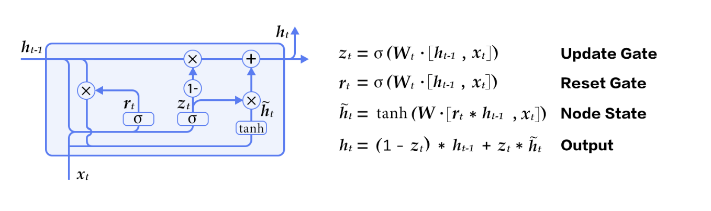

# 神经机器翻译模型

机器翻译利用计算机将源语言的表达转换成目标语言的同义表达，是自然语言处理中非常重要的研究方向。机器翻译有着广泛的应用需求，其实现方式也经历了不断的演化。传统的机器翻译方法主要基于规则或统计模型，需要人为地指定翻译规则或设计语言特征，效果依赖于人对源语言与目标语言的理解程度。近些年来，深度学习的提出与迅速发展使得特征的自动学习成为了可能。深度学习首先在图像识别和语音识别中取得成功，进而在机器翻译等自然语言处理领域中掀起了研究热潮。机器翻译中的深度学习模型直接学习源语言到目标语言的映射，大为减少了学习过程中人的介入，同时显著地提高了翻译质量。本教程主要介绍的就是在Paddlepaddle中如何利用循环神经网络（RNN），构建一个端到端（End-to-End）的神经机器翻译（Neural Machine Translation）模型。

#
## 模型结构

基于RNN的机器翻译模型常见的是一个编码器－解码器（Encoder－Decoder）结构，其中的编码器和解码器均是一个循环神经网络。将构成编码器和解码器的两个 RNN 在时间上展开， 我们可以得到如下的模型结构图

<p align="center"><br/>图 1. 编码器－解码器框架 </p>

- **编码器**：将用源语言表达的句子编码成一个向量，作为解码器的输入。解码器的原始输入是表示字符或词的 id 序列,
用独热码(One-hot encoding)表示。为了对输入进行降维，同时建立词语之间的语义关联，紧接着我们将独热码表示转换为词嵌入(Word Embedding)表示。最后 RNN 单元逐字符或逐词处理输入，得到完整句子的编码向量。

- **解码器**：接受编码器的输入，逐个字符或词地解码生成用目标语言表达的翻译结果。每个时间步， RNN 单元的输出是经过了 Softmax 层运算后的一个向量，表示当前时刻目标语言词典中每个词出现的条件概率，即。因此，给定输入，其对应的翻译结果为的概率则为

<center></center>


以中文到英文的翻译为例，对于如下分词后的句子

```
祝愿 祖国 繁荣 昌盛
```

其对应的英文翻译正确结果应该是

```
Wish motherland rich and powerful
```

在预处理阶段，我们需要准备如上的源语言与目标语言之间互译的平行语料数据，并分别构建源语言和目标语言的词典；在训练阶段，我们用这样成对的语料训练模型；而在模型测试阶段，英文句子则是我们期望看到的翻译结果。

### RNN 单元
构成RNN的单元可以为标准的基本单元，即用一个向量存储RNN的隐状态，然而基于这种结构的RNN在训练时容易发生梯度弥散（gradient vanishing），对于长时间的依赖关系难以建模。因此通常所用的RNN单元是GRU或者LSTM，这两种单元以门限来控制应该记住的和遗忘的信息，解决了序列数据的的长时依赖问题。以本教程所用的GRU为例，其基本结构如下

<p align="center">
<br/>
图 2. GRU 单元
 </p>

可以看到除了隐含状态(Node State)以外，GRU内部还包含了两个门限：更新门(Update Gate)、重置门(Reset Gate)。在每一个时间步，门限和隐状态的更新由图2右侧的公式决定。这两个门限决定了状态以何种方式更新。
### 双向编码器
在上述的基本模型中，编码器在顺序处理输入句子序列时，当前时刻的状态只包含了历史输入信息，而没有未来时刻的序列信息。而对于序列建模，未来时刻的上下文同样包含了重要的信息。因此我们可以采用一个双向的编码器来同时获取当前时刻输入的上下文，其结构如下图所示
<p align="center">
<br/>
图 3. 双向编码器
 </p>

该双向编码器[1]由两个独立的编码器构成，分别从前向和后向对输入序列进行编码，然后将两个编码器的输出合并在一起，作为最终的编码输出。
在Paddlepaddle中，双向编码器可以很方便地实现：

```python

    #### Encoder
    src_word_id = paddle.layer.data(
        name='source_language_word',
        type=paddle.data_type.integer_value_sequence(source_dict_dim))
    # source embedding
    src_embedding = paddle.layer.embedding(
        input=src_word_id, size=word_vector_dim)
    # use bidirectional_gru
    encoded_vector = paddle.networks.bidirectional_gru(
        input=src_embedding,
        size=encoder_size,
        fwd_act=paddle.activation.Tanh(),
        fwd_gate_act=paddle.activation.Sigmoid(),
        bwd_act=paddle.activation.Tanh(),
        bwd_gate_act=paddle.activation.Sigmoid(),
        return_seq=True)

```

### 集束搜索（Beam Search） 算法
在完成训练后的测试阶段，模型根据输入的不同，输出对应的翻译结果。解码时，一个直接的方式是取每一步条件概率最大的词，作为当前时刻的输出。但即局部最优并不一定能得到全局最优，即这种做法并不能保证最后得到的完整句子出现的概率最大。如果对全空间进行搜索，其代价又过大。为了解决这个问题，通常采用集束搜索（Beam Search）算法。集束搜索是一种启发式的图搜索算法，用一个参数`k`控制搜索宽度，其要点如下：

**1.** 在解码的过程中，始终维护`k`个已解码出的子序列；

**2.** 在中间时刻`t`, 这`k`个子序列与所有词组合，取这些组合中概率最大的`k`个以更新原来的子序列;

**3.** 不断迭代下去，直至得到`k`个完整的句子，作为翻译结果的候选。

### 注意力机制

在图 1 中，我们看到在编码器的所有隐含状态中，只有最后一个隐含状态作为解码器的输入，用一个编码向量表示了整个输入序列。这样的处理方式同样有值得改进的地方，一个改进就是引进注意力（Attention）机制，将编码器的每一个隐含状态加权后输入解码器，加权系数是训练过程中待学习的参数。此部分超出了本教程的内容，如有兴趣，可进一步参考[1]。

### 无注意力机制的解码器
为简单起见，本教程所用的解码器无Attention机制。在Paddlepaddle中，无Attention的解码器单步逻辑`gru_decoder_without_attention`可以按如下的方式实现：

```python
	#### Decoder
    encoder_last = paddle.layer.last_seq(input=encoded_vector)
    with paddle.layer.mixed(
            size=decoder_size,
            act=paddle.activation.Tanh()) as encoder_last_projected:
        encoder_last_projected += paddle.layer.full_matrix_projection(
            input=encoder_last)
    # gru step
    def gru_decoder_without_attention(enc_vec, current_word):

        decoder_mem = paddle.layer.memory(
            name='gru_decoder',
            size=decoder_size,
            boot_layer=encoder_last_projected)

        context = paddle.layer.last_seq(input=enc_vec)

        with paddle.layer.mixed(size=decoder_size * 3) as decoder_inputs:
            decoder_inputs += paddle.layer.full_matrix_projection(input=context)
            decoder_inputs += paddle.layer.full_matrix_projection(
                input=current_word)

        gru_step = paddle.layer.gru_step(
            name='gru_decoder',
            act=paddle.activation.Tanh(),
            gate_act=paddle.activation.Sigmoid(),
            input=decoder_inputs,
            output_mem=decoder_mem,
            size=decoder_size)

        with paddle.layer.mixed(
                size=target_dict_dim,
                bias_attr=True,
                act=paddle.activation.Softmax()) as out:
            out += paddle.layer.full_matrix_projection(input=gru_step)
        return out
```

在模型训练和测试阶段，解码器的行为有很大的不同：

- **训练阶段：**目标翻译结果的词嵌入`trg_embedding`作为参数传递给单步逻辑`gru_decoder_without_attention()`，函数`recurrent_group()`循环调用单步逻辑执行，最后计算目标结果与实际结果的差异cost并返回；
- **测试阶段：**解码器根据最后一个生成的词预测下一个词，`GeneratedInputV2()`自动生成最后一个词的词嵌入并传递给单步逻辑，`beam_search()`完成集束搜索作为结果返回。

这两部分的逻辑分别实现在如下的`if-else`条件分支中：

```python
    decoder_group_name = "decoder_group"
    group_input1 = paddle.layer.StaticInputV2(input=encoded_vector, is_seq=True)
    group_inputs = [group_input1]
    if not generating:
        trg_embedding = paddle.layer.embedding(
            input=paddle.layer.data(
                name='target_language_word',
                type=paddle.data_type.integer_value_sequence(target_dict_dim)),
            size=word_vector_dim,
            param_attr=paddle.attr.ParamAttr(name='_target_language_embedding'))
        group_inputs.append(trg_embedding)

        decoder = paddle.layer.recurrent_group(
            name=decoder_group_name,
            step=gru_decoder_without_attention,
            input=group_inputs)

        lbl = paddle.layer.data(
            name='target_language_next_word',
            type=paddle.data_type.integer_value_sequence(target_dict_dim))
        cost = paddle.layer.classification_cost(input=decoder, label=lbl)

        return cost
    else:

        trg_embedding = paddle.layer.GeneratedInputV2(
            size=target_dict_dim,
            embedding_name='_target_language_embedding',
            embedding_size=word_vector_dim)
        group_inputs.append(trg_embedding)

        beam_gen = paddle.layer.beam_search(
            name=decoder_group_name,
            step=gru_decoder_without_attention,
            input=group_inputs,
            bos_id=0,
            eos_id=1,
            beam_size=beam_size,
            max_length=max_length)

        return beam_gen
```

## 数据准备
本教程所用到的数据来自[WMT14](http://www-lium.univ-lemans.fr/~schwenk/cslm_joint_paper/)，该数据集是法文到英文互译的平行语料数据。用[bitexts](http://www-lium.univ-lemans.fr/~schwenk/cslm_joint_paper/data/bitexts.tgz)作为训练数据，[dev+test data](http://www-lium.univ-lemans.fr/~schwenk/cslm_joint_paper/data/dev+test.tgz)作为验证与测试数据。在Paddlepaddle中已经封装好了该数据集的读取接口，在首次运行的时候，程序会自动完成下载，用户无需手动完成相关的数据准备。

## 模型的训练与测试

在定义好网络结构后，我们就可以进行模型训练与测试了。模型的训练与测试分别由`main()`函数调用`train()`和`generate()`完成：

- **train()：** 依次完成网络的构建、data reader的定义、trainer的建议和事件句柄的定义，最后训练网络；

- **generate()：**: 根据指定的模型路径初始化网络，导入测试数据并由`beam_search`完成翻译过程。

### 模型训练

进行模型训练十分简单，只需在命令行窗口中执行

```
python nmt_without_attention_v2.py --train
```

输出样例为

```
Pass 0, Batch 0, Cost 267.674663, {'classification_error_evaluator': 1.0}
.........
Pass 0, Batch 10, Cost 172.892294, {'classification_error_evaluator': 0.953895092010498}
.........
Pass 0, Batch 20, Cost 177.989329, {'classification_error_evaluator': 0.9052488207817078}
.........
Pass 0, Batch 30, Cost 153.633665, {'classification_error_evaluator': 0.8643803596496582}
.........
Pass 0, Batch 40, Cost 168.170543, {'classification_error_evaluator': 0.8348183631896973}
```


### 模型测试
模型测试的执行与模型训练类似，只需执行

```
python nmt_without_attention_v2.py --generate
```
则自动为测试数据生成了对应的翻译结果。
如果设置beam search的大小为3，输入法文句子

```
src: <s> Elles connaissent leur entreprise mieux que personne . <e>
```

对应的英文翻译结果为，

```
prob = 0.000000: They know their business better than anyone . <e>
prob = 0.000014: They know their businesses better than anyone . <e>
prob = 0.000000: They know their business better than anybody . <e>
```

* `prob`表示生成句子的得分，随之其后则是翻译生成的句子；
* `<s>` 表示句子的开始，`<e>`表示一个句子的结束，如果出现了在词典中未包含的词，则用`<unk>`替代。

至此，我们在Paddlepaddle上实现了一个初步的机器翻译模型。我们可以看到，Paddlepaddle提供了灵活丰富的API供选择和使用，使得我们能够很方便完成各种复杂网络的配置。机器翻译本身也是个快速发展的领域，各种新方法新思想在不断涌现。在学习完本教程后，读者若有兴趣和余力，可基于Paddlepaddle平台实现更为复杂、性能更优的机器翻译模型。


## 参考文献
［1］Bahdanau D, Cho K, Bengio Y. [Neural machine translation by jointly learning to align and translate](https://arxiv.org/abs/1409.0473)[C]. Proceedings of ICLR 2015, 2015
