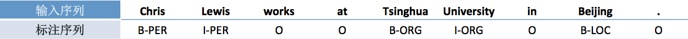
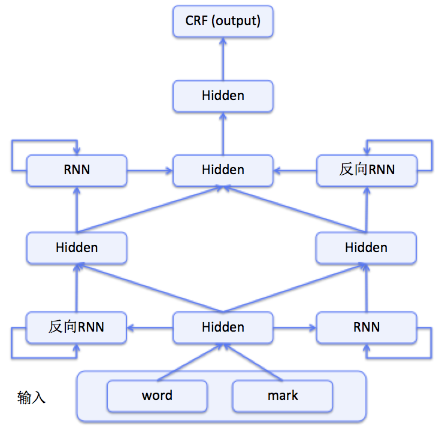

# 命名实体识别

命名实体识别（Named Entity Recognition，NER）又称作“专名识别”，是指识别文本中具有特定意义的实体，主要包括人名、地名、机构名、专有名词等，是自然语言处理研究的一个基础问题。NER任务通常包括实体边界识别、确定实体类别两部分，可以将其作为序列标注问题解决。

序列标注可以分为Sequence Classification、Segment Classification和Temporal Classification三类[[1](#参考文献)]，本例只考虑Segment Classification，即对输入序列中的每个元素在输出序列中给出对应的标签。对于NER任务，由于需要标识边界，一般采用[BIO方式](http://book.paddlepaddle.org/07.label_semantic_roles/)定义的标签集，如下是一个NER的标注结果示例：

<div  align="center">
<br>
图1. BIO标注方法示例
</div>

根据序列标注结果可以直接得到实体边界和实体类别。类似的，分词、词性标注、语块识别、[语义角色标注](http://book.paddlepaddle.org/07.label_semantic_roles/index.cn.html)等任务同样可通过序列标注来解决。

由于序列标注问题的广泛性，产生了[CRF](http://book.paddlepaddle.org/07.label_semantic_roles/index.cn.html)等经典的序列模型，这些模型大多只能使用局部信息或需要人工设计特征。随着深度学习研究的发展，循环神经网络（Recurrent Neural Network，RNN等序列模型能够处理序列元素之间前后关联问题，能够从原始输入文本中学习特征表示，而更加适合序列标注任务，更多相关知识可参考PaddleBook中[语义角色标注](https://github.com/PaddlePaddle/book/blob/develop/07.label_semantic_roles/README.cn.md)一课。

使用神经网络模型解决问题的思路通常是：前层网络学习输入的特征表示，网络的最后一层在特征基础上完成最终的任务；对于序列标注问题，通常：使用基于RNN的网络结构学习特征，将学习到的特征接入CRF完成序列标注。实际上是将传统CRF中的线性模型换成了非线性神经网络。沿用CRF的出发点是：CRF使用句子级别的似然概率，能够更好的解决标记偏置问题[[2](#参考文献)]。本例也将基于此思路建立模型。虽然，这里以NER任务作为示例，但所给出的模型可以应用到其他各种序列标注任务中。

## 模型说明

NER任务的输入是"一句话"，目标是识别句子中的实体边界及类别，我们参照论文\[[2](#参考文献)\]仅对原始句子进行了一些预处理工作：将每个词转换为小写，并将原词是否大写另作为一个特征，共同作为模型的输入。按照上述处理序列标注问题的思路，可构造如下结构的模型（图2是模型结构示意图）：

1. 构造输入
 - 输入1是句子序列，采用one-hot方式表示
 - 输入2是大写标记序列，标记了句子中每一个词是否是大写，采用one-hot方式表示；
2. one-hot方式的句子序列和大写标记序列通过词表，转换为实向量表示的词向量序列；
3. 将步骤2中的2个词向量序列作为双向RNN的输入，学习输入序列的特征表示，得到新的特性表示序列；
4. CRF以步骤3中模型学习到的特征为输入，以标记序列为监督信号，实现序列标注。

<div  align="center">  
<br>
图2. NER模型的网络结构图
</div>


## 数据说明

在本例中，我们使用CoNLL 2003 NER任务中开放出的数据集。该任务（见[此页面](http://www.clips.uantwerpen.be/conll2003/ner/)）只提供了标注工具的下载，原始Reuters数据由于版权原因需另外申请免费下载。在获取原始数据后可参照标注工具中README生成所需数据文件，完成后将包括如下三个数据文件：

| 文件名 | 描述 |
|---|---|
| eng.train | 训练数据 |
| eng.testa | 验证数据，可用来进行参数调优 |
| eng.testb | 评估数据，用来进行最终效果评估 |

为保证本例的完整性，我们从中抽取少量样本放在`data/train`和`data/test`文件中，作为示例使用；由于版权原因，完整数据还请大家自行获取。这三个文件数据格式如下：

```
   U.N.         NNP  I-NP  I-ORG
   official     NN   I-NP  O
   Ekeus        NNP  I-NP  I-PER
   heads        VBZ  I-VP  O
   for          IN   I-PP  O
   Baghdad      NNP  I-NP  I-LOC
   .            .    O     O
```

其中第一列为原始句子序列（第二、三列分别为词性标签和句法分析中的语块标签，这里暂时不用），第四列为采用了I-TYPE方式表示的NER标签（I-TYPE和BIO方式的主要区别在于语块开始标记的使用上，I-TYPE只有在出现相邻的同类别实体时对后者使用B标记，其他均使用I标记），句子之间以空行分隔。

原始数据需要进行数据预处理才能被PaddlePaddle处理，预处理主要包括下面几个步骤:

1. 从原始数据文件中抽取出句子和标签，构造句子序列和标签序列；
2. 将I-TYPE表示的标签转换为BIO方式表示的标签；
3. 将句子序列中的单词转换为小写，并构造大写标记序列；
4. 依据词典获取词对应的整数索引。

我们将在`conll03.py`中完成以上预处理工作（使用方法将在后文给出）：

```python
# import conll03
# conll03.corpus_reader函数完成上面第1步和第2步.
# conll03.reader_creator函数完成上面第3步和第4步.
# conll03.train和conll03.test函数可以获取处理之后的每条样本来供PaddlePaddle训练和测试.
```

预处理完成后，一条训练样本包含3个部分：句子序列、首字母大写标记序列、标注序列。下表是一条训练样本的示例。

| 句子序列 | 大写标记序列 | 标注序列 |
|---|---|---|
| u.n. | 1 | B-ORG |
| official | 0 | O |
| ekeus | 1 | B-PER |
| heads | 0 | O |
| for | 0 | O |
| baghdad | 1 | B-LOC |
| . | 0 | O |

另外，本例依赖的数据还包括：word词典、label词典和预训练的词向量三个文件。label词典已附在`data`目录中，对应于`data/target.txt`；word词典和预训练的词向量来源于[Stanford CS224d](http://cs224d.stanford.edu/)课程作业，请先在该示例所在目录下运行`data/download.sh`脚本进行下载，完成后会将这两个文件一并放入`data`目录下，分别对应`data/vocab.txt`和`data/wordVectors.txt`。

## 使用说明

本示例给出的`conll03.py`和`ner.py`两个Python脚本分别提供了数据相关和模型相关接口。

### 数据接口使用

`conll03.py`提供了使用CoNLL 2003数据的接口，各主要函数的功能已在数据说明部分进行说明。结合我们提供的接口和文件，可以按照如下步骤使用CoNLL 2003数据：

1. 定义各数据文件、词典文件和词向量文件路径；
2. 调用`conll03.train`和`conll03.test`接口。

对应如下代码：

```python
import conll03

# 修改以下变量为对应文件路径
train_data_file = 'data/train'    # 训练数据文件的路径
test_data_file = 'data/test'      # 测试数据文件的路径
vocab_file = 'data/vocab.txt'     # 输入句子对应的字典文件的路径
target_file = 'data/target.txt'   # 标签对应的字典文件的路径
emb_file = 'data/wordVectors.txt' # 预训练的词向量参数的路径

# 返回训练数据的生成器
train_data_reader = conll03.train(train_data_file, vocab_file, target_file)
# 返回测试数据的生成器
test_data_reader = conll03.test(test_data_file, vocab_file, target_file)
```

### 模型接口使用

`ner.py`提供了以下两个接口分别进行模型训练和预测：

1. `ner_net_train(data_reader, num_passes)`函数实现了模型训练功能，参数`data_reader`表示训练数据的迭代器、`num_passes`表示训练pass的轮数。训练过程中每100个iteration会打印模型训练信息。我们同时在模型配置中加入了chunk evaluator，会输出当前模型对语块识别的Precision、Recall和F1值。chunk evaluator 的详细使用说明请参照[文档](http://www.paddlepaddle.org/develop/doc/api/v2/config/evaluators.html#chunk)。每个pass后会将模型保存为`params_pass_***.tar.gz`的文件（`***`表示pass的id）。

2. `ner_net_infer(data_reader, model_file)`函数实现了预测功能，参数`data_reader`表示测试数据的迭代器、`model_file`表示保存在本地的模型文件，预测过程会按如下格式打印预测结果：

    ```
    U.N.      B-ORG
    official  O
    Ekeus     B-PER
    heads     O
    for       O
    Baghdad   B-LOC
    .         O
    ```
    其中第一列为原始句子序列，第二列为BIO方式表示的NER标签。

### 运行程序

本例另在`ner.py`中提供了完整的运行流程，包括数据接口的使用和模型训练、预测。根据上文所述的接口使用方法，使用时需要将`ner.py`中如下的数据设置部分中的各变量修改为对应文件路径：

```python
# 修改以下变量为对应文件路径
train_data_file = 'data/train'    # 训练数据文件的路径
test_data_file = 'data/test'      # 测试数据文件的路径
vocab_file = 'data/vocab.txt'     # 输入句子对应的字典文件的路径
target_file = 'data/target.txt'   # 标签对应的字典文件的路径
emb_file = 'data/wordVectors.txt' # 预训练的词向量参数的路径
```

各接口的调用已在`ner.py`中提供：

```python
# 训练数据的生成器
train_data_reader = conll03.train(train_data_file, vocab_file, target_file)
# 测试数据的生成器
test_data_reader = conll03.test(test_data_file, vocab_file, target_file)

# 模型训练
ner_net_train(data_reader=train_data_reader, num_passes=1)
# 预测
ner_net_infer(data_reader=test_data_reader, model_file='params_pass_0.tar.gz')
```

为运行序列标注模型除适当调整`num_passes`和`model_file`两参数值外，无需再做其它修改（也可根据需要自行调用各接口，如只使用预测功能）。完成修改后，运行本示例只需在`ner.py`所在路径下执行`python ner.py`即可。该示例程序会执行数据读取、模型训练和保存、模型读取及新样本预测等步骤。

### 自定义数据和任务

前文提到本例中的模型可以应用到其他序列标注任务中，这里以词性标注任务为例，给出使用其他数据，并应用到其他任务的操作方法。

假定有如下格式的原始数据：

```
U.N.         NNP
official     NN
Ekeus        NNP
heads        VBZ
for          IN
Baghdad      NNP
.            .  
```

第一列为原始句子序列，第二列为词性标签序列，两列之间以“\t”分隔，句子之间以空行分隔。

为使用PaddlePaddle和本示例提供的模型，可参照`conll03.py`并根据需要自定义数据接口，如下：

1. 参照`conll03.py`中的`corpus_reader`函数，定义接口返回句子序列和标签序列生成器；

    ```python
    # 实现句子和对应标签的抽取，传入数据文件路径，返回句子和标签序列生成器。
    def corpus_reader(filename):
        def reader():
            sentence = []
            labels = []
            with open(filename) as f:
                for line in f:
                    if len(line.strip()) == 0:
                        if len(sentence) > 0:
                            yield sentence, labels
                        sentence = []
                        labels = []
                    else:
                        segs = line.strip().split()
                        sentence.append(segs[0])
                        labels.append(segs[-1])
            f.close()

        return reader
    ```

2. 参照`conll03.py`中的`reader_creator`函数，定义接口返回id化的句子和标签序列生成器。

    ```python
    # 传入corpus_reader返回的生成器、dict类型的word词典和label词典，返回id化的句子和标签序列生成器。
    def reader_creator(corpus_reader, word_dict, label_dict):
        def reader():
            for sentence, labels in corpus_reader():
                word_idx = [
                    word_dict.get(w, UNK_IDX) # 若使用小写单词，请使用w.lower()
                    for w in sentence
                ]
                # 若使用首字母大写标记，请去掉以下注释符号，并在yield语句的word_idx后加上mark
                # mark = [
                #     1 if w[0].isupper() else 0
                #     for w in sentence
                # ]
                label_idx = [label_dict.get(w) for w in labels]
                yield word_idx, label_idx, sentence # 加上sentence方便预测时打印
        return reader
    ```

自定义了数据接口后，要使用本示例中的模型，只需在调用模型训练和预测接口`ner_net_train`和`ner_net_infer`时传入调用`reader_creator`返回的生成器即可。另外需要注意，这里给出的数据接口定义去掉了`conll03.py`一些预处理（使用原始句子，而非转换成小写单词加上大写标记），`ner.py`中的模型相关接口也需要进行一些调整：

1. 修改网络结构定义接口`ner_net`中大写标记相关内容：

    删去`mark`和`mark_embedding`两个变量；

2. 修改模型训练接口`ner_net_train`中大写标记相关内容：

    将变量`feeding`定义改为`feeding = {'word': 0, 'target': 1}`；

3. 修改预测接口`ner_net_infer`中大写标记相关内容：

    将`test_data.append([item[0], item[1]])`改为`test_data.append([item[0]])`。

如果要继续使用NER中的特征预处理（小写单词、大写标记），请参照上文`reader_creator`代码段给出的注释进行修改，此时`ner.py`中的模型相关接口不必进行修改。

## 参考文献

1. Graves A. [Supervised Sequence Labelling with Recurrent Neural Networks](http://www.cs.toronto.edu/~graves/preprint.pdf)[J]. Studies in Computational Intelligence, 2013, 385.
2. Collobert R, Weston J, Bottou L, et al. [Natural Language Processing (Almost) from Scratch](http://www.jmlr.org/papers/volume12/collobert11a/collobert11a.pdf)[J]. Journal of Machine Learning Research, 2011, 12(1):2493-2537.
