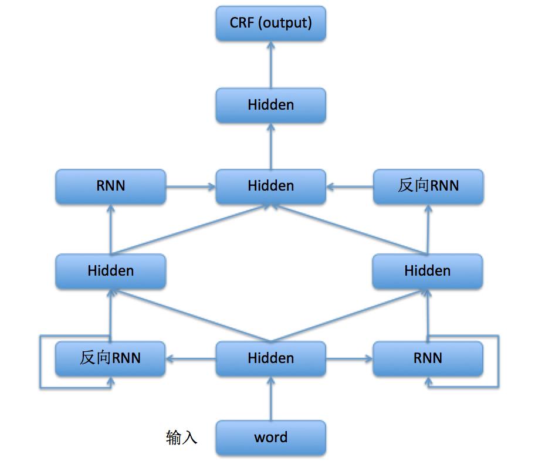

# 命名实体识别

## 背景说明

命名实体识别（Named Entity Recognition，NER）又称作“专名识别”，是指识别文本中具有特定意义的实体，主要包括人名、地名、机构名、专有名词等，是自然语言处理研究的一个基础问题。NER任务通常包括实体边界识别、确定实体类别两部分，可以将其作为序列标注问题，根据序列标注结果可以直接得到实体边界和实体类别。

## 数据说明

在本示例中，我们将使用CoNLL 2003 NER任务中开放出的数据集。由于版权原因，我们暂不提供此数据集的下载，可以按照[此页面](http://www.clips.uantwerpen.be/conll2003/ner/)中的说明免费获取该数据。此数据集中训练和测试数据格式如下：

```
   U.N.         NNP  I-NP  I-ORG
   official     NN   I-NP  O
   Ekeus        NNP  I-NP  I-PER
   heads        VBZ  I-VP  O
   for          IN   I-PP  O
   Baghdad      NNP  I-NP  I-LOC
   .            .    O     O
```

其中第一列为原始句子序列（第二、三列分别为词性标签和句法分析中的语块标签，这里暂时不用），第四列为采用了I-TYPE方式表示的NER标签（I-TYPE和[BIO方式](https://github.com/PaddlePaddle/book/tree/develop/07.label_semantic_roles)的主要区别在于语块开始标记的使用上，I-TYPE只有在出现相邻的同类别实体时对后者使用B标记，其他均使用I标记），而我们这里将使用BIO方式表示的标签集，这两种方式的转换过程在我们提供的`conll03.py`文件中进行。另外，我们附上word词典、label词典和预训练的词向量三个文件（word词典和词向量来源于[Stanford cs224d](http://cs224d.stanford.edu/)课程作业）以供使用。

## 模型说明

在本示例中，我们所使用的模型结构如图1所示。其输入为句子序列，在取词向量转换为词向量序列后，经过多组全连接层、双向RNN进行特征提取，最后接入CRF以学习到的特征为输入，以标记序列为监督信号，完成序列标注。更多关于RNN及其变体的知识可见[此页面](http://book.paddlepaddle.org/06.understand_sentiment/)。
<div  align="center">  
<br>
图1. NER模型网络结构
</div>

## 运行说明

### 数据设置

运行`ner.py`需要对数据设置部分进行更改，将以下代码中的变量值修改为正确的文件路径即可。

```python
# init dataset
train_data_file = 'data/train'    #训练数据文件
test_data_file = 'data/test'      #测试数据文件
vocab_file = 'data/vocab.txt'     #word_dict文件
target_file = 'data/target.txt'   #label_dict文件
emb_file = 'data/wordVectors.txt' #词向量文件
```

### 训练和预测

`ner.py`提供了以下两个接口分别进行模型训练和预测：

1. `ner_net_train(data_reader, num_passes)`函数实现了模型训练功能，参数`data_reader`表示训练数据的迭代器（使用默认值即可）、`num_passes`表示训练pass的轮数。训练过程中每100个iteration会打印模型训练信息，每个pass后会将模型保存下来，并将最终模型保存为`ner_net.tar.gz`。

2. `ner_net_infer(data_reader, model_file)`函数实现了预测功能，参数`data_reader`表示测试数据的迭代器（使用默认值即可）、`model_file`表示保存在本地的模型文件，预测过程会按如下格式打印预测结果：

	```
	   U.N.      B-ORG
	   official  O
	   Ekeus     B-PER
	   heads     O
	   for       O
	   Baghdad   B-LOC
	   .         O
	```
	其中第一列为原始句子序列，第二列为BIO方式表示的NER标签。
