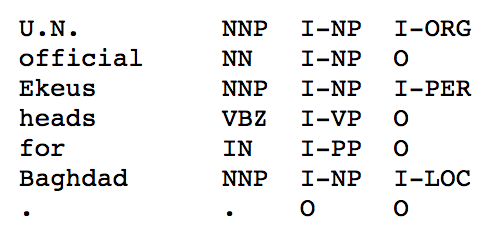

#命名实体识别
##背景说明
命名实体识别（Named Entity Recognition，NER）又称作“专名识别”，是指识别文本中具有特定意义的实体，主要包括人名、地名、机构名、专有名词等，是自然语言处理研究的一个基础问题。NER任务通常包括实体边界识别、确定实体类别两部分，可以将其作为序列标注问题，根据序列标注结果可以直接得到实体边界和实体类别。
##数据说明
在本示例中，我们将使用CoNLL 2003 NER任务中开放出的数据集。由于版权原因，我们暂不提供此数据集的下载，可以按照[此页面](http://www.clips.uantwerpen.be/conll2003/ner/)中的说明免费获取该数据。该数据集中训练和测试数据格式如下
<br>
其中第一列为原始句子序列，第四列为采用了I-TYPE方式表示的NER标签（I-TYPE和[BIO方式](https://github.com/PaddlePaddle/book/tree/develop/07.label_semantic_roles)的主要区别在于语块开始标记的使用上，I-TYPE只有在出现相邻的同类别实体时对后者使用B标记，其他均使用I标记），而我们这里将使用BIO方式表示的标签集，这两种方式的转换过程在我们提供的`conll03.py`文件中进行。另外，我们针对此数据集提供了word词典、label词典和预训练的词向量三个文件，可以直接下载使用。
##模型说明
在本示例中，我们所使用的模型结构如图1所示，更多关于序列标注网络模型的知识可见[此页面](https://github.com/PaddlePaddle/book/tree/develop/07.label_semantic_roles)。
<div  align="center">  
<br>
图1. NER模型网络结构
</div>
##使用说明
在获取到上文提到的数据集和文件资源后，将`ner.py`中如下的数据设置部分进行更改

```python
# init dataset
train_data_file = 'data/train'
test_data_file = 'data/test'
vocab_file = 'data/vocab.txt'
target_file = 'data/target.txt'
emb_file = 'data/wordVectors.txt'
```
TBD
