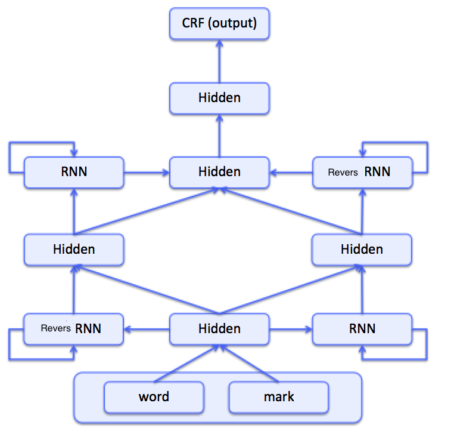

The  program under this directory needs to use the PaddlePaddle v0.10.0 version. If your PaddlePaddle  version is below, update it follow the instructions in the installation [document](http://www.paddlepaddle.org/docs/develop/documentation/en/build_and_install/pip_install_en.html) .


---

# Named Entity Recognition (NER)

The following is the  directory structure and description of this example.

```text
.
├── data                 # the data needed for the program
│   ├── download.sh
├── images               # picturs in the Readme file
├── index.html
├── infer.py             # test program
├── network_conf.py      # defintion of the model
├── reader.py            # interface to read data
├── README.md            # document
├── train.py             # train program
└── utils.py             # functions used
```


## Introduction

Named Entity Recognition (NER), it means identifying specific entities in text, including persons, locations, organizations  and proper nouns. It is a basic problem of Natural Language Processing (NLP). NER tasks usually include two subtaskses, one is to identify entity boundaries, another is to classify the entity into categories. The NER task can be solved as a sequence tagging problem.

Sequence tagging could be classified into 3 categories, namely Sequence Classification, Segment Classification and Temporal Classification[1]. In this example, only Segment Classification is considered. That is, giving each element in the input sequence a corresponding label in the output sequence. BIO tagging method could identify entities boundaries, it was widely used. Here is an example of BIO tagging.

<p align="center">
<br/>
fig.1  BIO tagging example
</p>

According to the sequence tagging results, the entity boundary and the entity category can be obtained directly. Similarly, word segmentation, part of speech tagging, block recognition and semantic role tagging can be solved by sequence tagging.

When using neural network  to solve  problem,  the frontal layers of the network does feature representation learning with input, the last layer of network solves the final task based on the learned features. For sequence tagging problem, Recurrent Neural Networs (RNN) are usually used to learn representation features. After that a CRF layer will do the tagging job.
In fact, the linear part in traditiontal CRF model is replaced by a nonlinear neural network. The main reason for the use of CRF are that it can better solve the label bias problem by using the likelihood probability of sentence level[2].
This example is built on the above ideas. Although the NER task is used here as an example, the given model can be applied to a variety of other sequences tagging tasks.

Because of the wide use of sequence tagging, CRF and other classical sequence models are generated. Most of these models only use local information or need human design features. With the development of deep learning research, Recurrent Neural Network (RNN) and other sequential models can deal with the problem of correlation between sequence elements, and can learn feature representation from original input text, which is more suitable for sequence tagging task.

## Model Details

Input of NER is a sentence,  model is going to identify the entities boundaries and categories. As in [2], only for some simple preprocessing of the original sentence are needed: each word is converted to lowercase, weather it is a uppercase word is a input feature. As shown in Figure 2, the workflow is:

1. yeild input
 - use one-hot method to represent a sentence
 - use one-hot method to represent wheather the word is uppercase
2. look up a tabel, tansfor every word to vector
3. word vectors are inputed into bi-directonal RNN, to learn new feature repersentation
4. he learned featur are feed into CRF larer, and its output is sequence tags

<p align="center">
<br/>
fig.2 NER model
</p>


## Data

We use [CoNLL 2003 NER TASK](http://www.clips.uantwerpen.be/conll2003/ner/)as a example, please down the data as instructions.

+ We only put some example tata at the data directory as train and test file to demonstrate the data format.
+ The program also needs these data:
    1. a dictionary for words
    2. pre-trained word vectors
    3. a dictionary for labels
   dictionary for words and pre-trained vectors come from [Stanford CS224d](http://cs224d.stanford.edu/) work.
   run the download.sh in data directory will get the dictionary for words and vectors.
   data/vocab.txt for the dictionary for words and data/wordVectors.txt for vectors.

CoNLL 2003 original data format：

```
U.N.         NNP  I-NP  I-ORG
official     NN   I-NP  O
Ekeus        NNP  I-NP  I-PER
heads        VBZ  I-VP  O
for          IN   I-PP  O
Baghdad      NNP  I-NP  I-LOC
.            .    O     O
```

First column is the sentence, Second and third columns are not used. Fouth column is the NER tag but in I-TYPE scheme.
In reader.py,  I-TYPE scheme is transformed into BIO method scheme. Here are some generated example data.

| sentense | is upper case| tagged labble |
| -------- | ------------ | -------- |
| u.n.     | 1            | B-ORG    |
| official | 0            | O        |
| ekeus    | 1            | B-PER    |
| heads    | 0            | O        |
| for      | 0            | O        |
| baghdad  | 1            | B-LOC    |
| .        | 0            | O        |

## Run
### Implement a data reader interface

The data_reader funtion in reader.py generates 3 return data: the word's index in dictionary, is it an upper case, the tagged label of the word. These data are response for 3 input data_layers defined at network_conf.ner_net.

### Train

1. run `sh data/download.sh`
2. config `main` in `train.py`，specify the data path:

    ```python
    main(
          train_data_file="data/train",
          test_data_file="data/test",
          vocab_file="data/vocab.txt",
          target_file="data/target.txt",
          emb_file="data/wordVectors.txt",
          model_save_dir="models/")
    ```

3. run `python train.py` ，**note: the default config is using demo data, replace it with the downloaded data please.**

    ```text
    commandline:  --use_gpu=False --trainer_count=1
    Initing parameters..
    Init parameters done.
    Pass 0, Batch 0, Cost 41.430110, {'ner_chunk.precision': 0.01587301678955555, 'ner_chunk.F1-score': 0.028368793427944183, 'ner_chunk.recall': 0.13333334028720856, 'error': 0.939393937587738}
    Test with Pass 0, Batch 0, {'ner_chunk.precision': 0.0, 'ner_chunk.F1-score': 0.0, 'ner_chunk.recall': 0.0, 'error': 0.16260161995887756}
    ```

### Infer
1. configure `main` in [infer.py](./infer.py), configure the model's path, test data, vocabulary file for dictionary, target file for tagged labels.

    ```python
    infer(
        model_path="models/params_pass_0.tar.gz",
        batch_size=2,
        test_data_file="data/test",
        vocab_file="data/vocab.txt",
        target_file="data/target.txt")
    ```

2. run `python infer.py`，to starts testing. Output may be different to  this depending on your trained models:

    ```text
    cricket             O
    -                   O
    leicestershire      B-ORG
    take                O
    over                O
    at                  O
    top                 O
    after               O
    innings             O
    victory             O
    .                   O
    london              B-LOC
    1996-08-30          O
    west                B-MISC
    indian              I-MISC
    all-rounder         O
    phil                B-PER
    simmons             I-PER
    took                O
    four                O

    ```

The  second column are the predicted tags.
Congratulations! job done.

## Reference

1. Graves A. [Supervised Sequence Labelling with Recurrent Neural Networks](http://www.cs.toronto.edu/~graves/preprint.pdf)[J]. Studies in Computational Intelligence, 2013, 385.
2. Collobert R, Weston J, Bottou L, et al. [Natural Language Processing (Almost) from Scratch](http://www.jmlr.org/papers/volume12/collobert11a/collobert11a.pdf)[J]. Journal of Machine Learning Research, 2011, 12(1):2493-2537.
