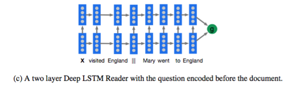
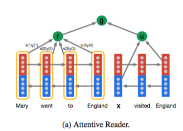
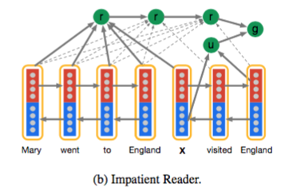
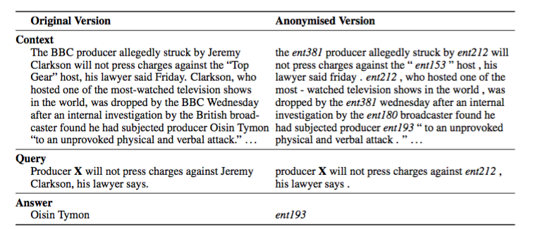

# Teaching Machines to Read and Comprehend
-----
以下是本例目录包含的文件以及对应说明：
```
├── README.md               # 本教程markdown 文档
├── images                  # 本教程图片目录
│   ├── attentive_reader.png
│   ├── impatient_reader.png
│   ├── two_layer_lstm.png
│   └── machine_reader.png
├── train.py                   # 训练脚本
└── attentive_reader.py        # Attentive Reader网络的实现 
└── impatient_reader.py        # Impatient Reader网络的实现
└── two_layer_lstm.py          # 双层LSTM的实现
```
##  背景介绍
---
本教程针对NIPS 2015上的一篇论文《Teaching Machines to Read and Comprehend》中的主要模型架构做了复现工作，阅读本教程，读者将对于文章中所使用的主要模型架构方式有一定的了解，从而进行主要的复现工作，论文的贡献点有以下几点：
* 针对阅读理解缺乏大规模训练数据集，构建了相应的数据集
* 尝试利用神经网络模型解决机器阅读理解问题
由于数据集的建立并不涉及到神经网络模型，更多涉及到NLP中的问题，故而本教程主要针对其中的网络模型做了阐释和复现。
## 模型思路
---
本文主要提及了三个阅读模型，分别是双层lstm，attentive reader 和 impatient reader，下面将逐一介绍三个模型的构建思路
### 双层lstm
在文中最基础也是其他两个模型的重要组成部分的模型，就是deep lstm模型，如下图所示



其中的核心原理其实就是用一个两层 LSTM 来 encode "query||document" 或者 "document||query"，然后用得到的表示做后续的匹配工作。
### Attentive Reader
Attentive的模型如下图所示：



这一模型分别计算 document 和 query，然后通过一个额外的前馈网络把他们组合起来。 
document 部分利用双向 LSTM 来 encode，每个 token 都是由前向后向的隐层状态拼接而成，而 document 则是利用其中所有 token 的加权平均表示的，这里的权重就是 attention，利用 query 部分就是将双向 LSTM 的两个方向的最终状态拼接表示而来。 
最后利用 document 和 query 做后续工作。 
### Impatient Reader
Impatient Reader 其实与 Attentive Reader 有一定的相似之处，但是每读入一个 query token 就迭代计算一次 document 的权重分布，这里只需要设置好query token的长度即可，其网络模型如下图所示：



## 模型效果
---
模型最终的结果是能够在将实体匿名化之后，根据上下文，阅读获得query对应的答案，也就是最终实现machine reading.效果如下图所示：



## 模型构造复现
----
在本教程中，重点对整个文章中最为重要的组成部分，双层lstm进行了复现，对于attentive reader和impatient reader，仅需要调整参数，完成构建即可。双层lstm的模型的构建见文件[two_layer_lstm.py](./two_layer_lstm.py)
### 函数建立
首先建立网络构造函数，输入为词典维度，目标词典维度，模型是否已经生成，窗口大小和阅读最大长度。
```
def two_layer_lstm_net(source_dict_dim,
                   target_dict_dim,
                   is_generating,
                   beam_size=3,
                   max_length=250):
```
### 网络基本参数设置
在这里设置词向量embedding的维度为512，encoder和decoder的维度与之相同：
```
 ### 网络结构定义
    word_vector_dim = 512  # 词向量维度
    decoder_size = 512  # decoder隐藏单元的维度
    encoder_size = 512  # encoder隐藏单元维度
```
### Encoder 输入疑问句
将问句输入网络，进行encoder:
```
src_word_id = paddle.layer.data(
        name='source_words',
        type=paddle.data_type.integer_value_sequence(source_dict_dim))
    src_embedding = paddle.layer.embedding(
        input=src_word_id, size=word_vector_dim)
    src_forward = paddle.networks.simple_gru(
        input=src_embedding, size=encoder_size)
    src_backward = paddle.networks.simple_gru(
        input=src_embedding, size=encoder_size, reverse=True)
    encoded_vector = paddle.layer.concat(input=[src_forward, src_backward])
```
### 将结果输入decoder
从双层lstm得到的输出下一步输入decoder中：
```
  encoded_proj = paddle.layer.fc(
        act=paddle.activation.Linear(),
        size=decoder_size,
        bias_attr=False,
        input=encoded_vector)

    backward_first = paddle.layer.first_seq(input=src_backward)

    decoder_boot = paddle.layer.fc(
        size=decoder_size,
        act=paddle.activation.Tanh(),
        bias_attr=False,
        input=backward_first)
```
接下来，如果模型并未生成，即$is\_generate$的状态为0，则训练模型，生成模型的tar文件，否则如果已有模型tar文件，则直接读取tar文件。
## 模型训练
---
模型训练的代码在[train.py](./train.py)中实现，主要有以下几个部分:
### 模型打包存储函数
将训练好的模型打包为tar文件，以便下次使用：
```
def save_model(trainer, parameters, save_path):
    with open(save_path, 'w') as f:
        trainer.save_parameter_to_tar(f)
```
### 初始化
这里使用CPU进行训练，同时初始设定为没有模型：
```
    paddle.init(use_gpu=False, trainer_count=1)
    is_generating = False

    # 定义dict的维度
    dict_size = 30000
    source_dict_dim = target_dict_dim = dict_size
```
### 定义方法并优化训练器
这里利用paddle自带的adam方法进行优化操作：
```
 optimizer = paddle.optimizer.Adam(
            learning_rate=5e-5,
            regularization=paddle.optimizer.L2Regularization(rate=8e-4))

        cost = two_layer_lstm_net(source_dict_dim, target_dict_dim, is_generating)
        parameters = paddle.parameters.create(cost)

        trainer = paddle.trainer.SGD(
    cost=cost, parameters=parameters, update_equation=optimizer)
```
### 数据集
由于论文自带的数据集过于庞大，这里利用了paddle自带的wmt数据集做了简化，代码如下：
```
        src_dict, trg_dict = paddle.dataset.wmt14.get_dict(dict_size)

        gen_sen_idx = np.where(beam_result[1] == -1)[0]
        assert len(gen_sen_idx) == len(gen_data) * beam_size
```
### 生成回答
最后利用decoder实现阅读的回答步骤：
```
  # 生成回答
        start_pos, end_pos = 1, 0
        for i, sample in enumerate(gen_data):
            print(
                " ".join([src_dict[w] for w in sample[0][1:-1]])
            )
            for j in xrange(beam_size):
                end_pos = gen_sen_idx[i * beam_size + j]
                print("%.4f\t%s" % (beam_result[0][i][j], " ".join(
                    trg_dict[w] for w in beam_result[1][start_pos:end_pos])))
                start_pos = end_pos + 2
            print("\n")
            
```
### 执行训练
在终端执行指令：
```
python train.py 
```
会在终端有如下输出：
```
Pass 0, Batch 0, Cost 306.693146, {'classification_error_evaluator': 1.0}
.........
Pass 0, Batch 10, Cost 211.242233, {'classification_error_evaluator': 0.9268292784690857}
.........
Pass 0, Batch 20, Cost 203.324371, {'classification_error_evaluator': 0.8860759735107422}
.........
Pass 0, Batch 30, Cost 351.998260, {'classification_error_evaluator': 0.8540145754814148}

```
## 执行预测
在终端执行以下指令：
```
python infer.py
```
将产生对应的问句并给出对应的回答
## 扩展
---
读者可以自行下载文章中的原始数据集[3]进行进一步的扩展。
## 参考文献
---
[1] http://www.paddlepaddle.org

[2] http://papers.nips.cc/paper/5945-teaching-machines-to-read-and-comprehend.pdf

[3] https://github.com/deepmind/rc-data/
