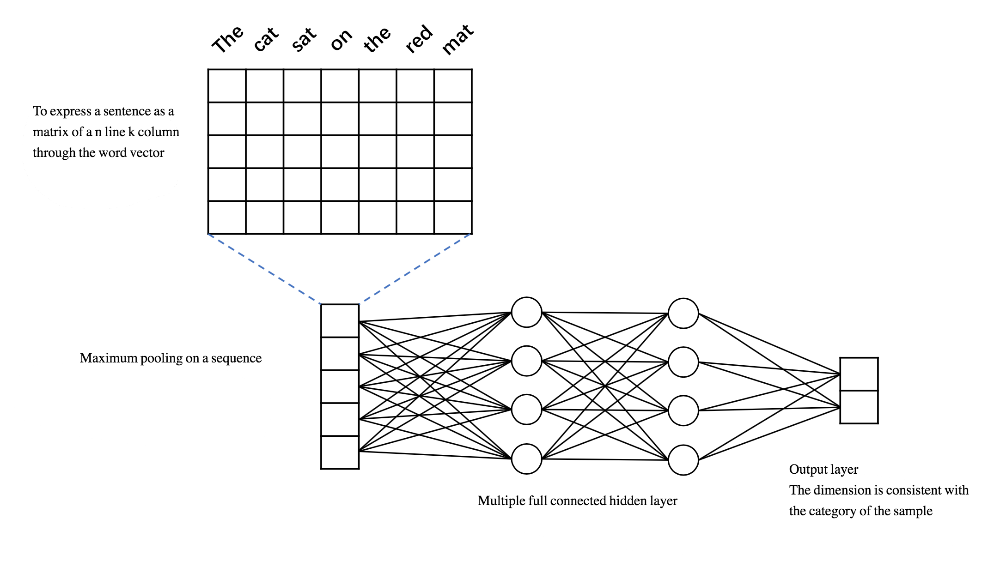
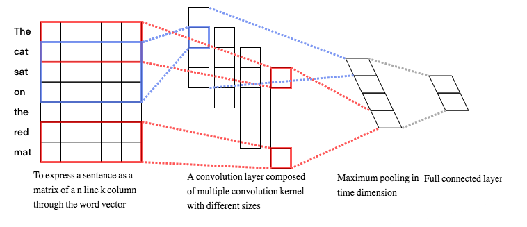

The minimum PaddlePaddle version needed for the code sample in this directory is v0.11.0. If you are on a version of PaddlePaddle earlier than v0.11.0, [please update your installation](http://www.paddlepaddle.org/docs/develop/documentation/zh/build_and_install/pip_install_cn.html).

---

# Text Classification

The following is a description of the files contained in this example:

```text
.
├── images              # Picture in this document
│   ├── cnn_net.png
│   └── dnn_net.png
├── infer.py            # Script for prediction
├── network_conf.py     # The various network structures involved in this example are defined in this file, and if you further modify the model structure, look at this file
├── reader.py           # The interface used to read data, if you use custom format data, look at this file
├── README.md           # The document
├── run.sh              # Running script for training task, if you run the script directly, start the training task with the default parameters
├── train.py            # training script
└── utils.py            # Define common functions. Such as printing logs, parsing command line parameters, building dictionaries, loading dictionaries, and so on
```

## Introduction
Text classification is an important basic work in the filed of Natural Language Processing.The task is to assign a text to one or more classes or categories, The [Emotional Classification](https://github.com/PaddlePaddle/book/blob/develop/06.understand_sentiment/README.md) in [PaddleBook](https://github.com/PaddlePaddle/book) is a typical text classification task. The process is as follows:
1. Collect user comment data from the movie review site.
2. Clean and annotate data.
3. Design the model.
4. Evaluate learning effect of the model.

The trained classifier can **automatically** predict whether the emotion of new user reviews are positive or negative, and play an important role in public opinion monitoring, marketing planning, product brand value assessment and other tasks. The above process is also the routine process that we need to follow for a new text classification task. It can be seen that the great advantage of the deep learning algorithm is that **there is no need to extract complex features and only need to clean and annotate the original text**.

The [Emotional Classification](https://github.com/PaddlePaddle/book/blob/develop/06.understand_sentiment/README.md) in [PaddleBook](https://github.com/PaddlePaddle/book) introduces a complex bidirectional LSTM model. RNN has obvious advantages in some complicated tasks that need to understand language and semantics, but it has a large amount of computation and usually has higher requirements for parameter adjustment techniques. Other models are also considered in a task that has a certain limit on the time of calculation. In addition to time, it is more important that **model selection is the basis for the success of machine learning tasks**. The goal of a machine learning task is always to improve the generalization ability, that is, the ability to predict the unknown new sample：

1. The simple model can't fit the training samples accurately, and can't accurately predict the unknown samples that have not appeared in the training set. This is the **underfitting**.
2. However, too complex models can easily memorizing every sample in training samples, but it has no recognition ability for unknown samples that do not appear in training set. This is the **overfitting**.

"No Free Lunch (NFL)" is one of the basic principles of a machine learning task: No model is superior to others inherently. The design and selection of the model is based on understanding the characteristics of different models, but it is also a process of multiple experimental evaluation. In this case, we continue to introduce some of the most commonly used text classification models. Their ability and complexity are different, which can help you compare learning differences between these models, and choose different models in different scenarios.


## Model Description

The following model is included in the `network_conf.py`：

1. `fc_net`： DNN model，which is a non-sequence model and uses a basic fully connected structure.
2. `convolution_net`：Shallow CNN model，which is a basic sequence model that can handle the variable long sequence input and extract the features within a local region.

We take the task of emotional classification as an example to explain the difference between the sequence model and the non sequence model. Emotional classification is a common text classification task, and the model automatically determines whether the emotion is positive or negative. For example, "not bad" in sentence "The apple is not bad" is the key to determining the emotion of the sentence.

- For the DNN model, we only know that there is a "not" and a "bad" in the sentence. The order relation between them is lost in the input network, and the network no longer has the chance to learn the sequence information between sequences.
- The CNN model accepts text sequences as input and preserves the sequence information between "not bad".

The characteristics of the two models are summarized as follows:

1. The computation complexity of the DNN model can be far lower than the CNN/RNN model, and has the advantage in the tasks with limited time.
2. DNN is often characterized by frequent words, which can be influenced by participle error. But it is still an effective model for some tasks that rely on keyword features, such as spam message detection.
3. In most cases that require some semantic understanding of text classification tasks, the sequence models represented by CNN/RNN are often better than DNN models, such as eliminating ambiguity in context by context.

### 1. DNN model

**DNN model structure:**

<p align="center">
<br/>
Figure 1. DNN text classification model in this example
</p>

The code to implement the DNN structure in PaddlePaddle is seen the `fc_net` function in `network_conf.py`. The model is divided into the following parts：

- **Word vector layer**：In order to better express the semantic relationship between different words, the words are first transformed into a vector of fixed dimensions. After the completion of the training, the similarity between words and words can be expressed by the distance between their vectors. The more similar semantics, the closer distance is. For more information on the word vector, refer to the [Word2Vec](https://github.com/PaddlePaddle/book/tree/develop/04.word2vec) in PaddleBook.

- **Max-pooling layer**：The max-pooling is carried out on the time series, and eliminates the difference in the number of words in different corpus samples, and extracts the maximum value of each position in the word vector. After being pooled, the vector sequence of the word vector layer is transformed into a vector of a fixed dimension. For example, it is assumed that the vector before the max-pooling is `[[2,3,5],[7,3,6],[1,4,0]]`，Then the max-pooling result is `[7,4,6]`。

- **Full connected layer**：After the max-pooling, the vector is sent into two continuous hidden layers, and the hidden layers are full connected.

- **Output layer**：The number of neurons in the output layer is consistent with the category of the samples. For example, in the two classification problem, there are 2 neurons in the output layer. Through the Softmax activation function, the output result is a normalized probability distribution, and the sum is 1. Therefore, the output of the $i$ neuron can be considered as the prediction probability of the sample belonging to class $i$.

The default DNN model is two classification (`class_dim=2`), and the embedding (word vector) dimension is 28 (`emd_dim=28`), and two hidden layers use Tanh activation function (`act=paddle.activation.Tanh()`). It is important to note that the input data of the model is an integer sequence, not the original word sequence. In fact, in order to deal with convenience, we usually id the words in the order of word frequency to convert the words into the serial number in the dictionary.

### 2. CNN 模型

**CNN 模型结构如下图所示：**

<p align="center">
<br/>
图2. 本例中的 CNN 文本分类模型
</p>

通过 PaddlePaddle 实现该 CNN 结构的代码见 `network_conf.py` 中的 `convolution_net` 函数，模型主要分为如下几个部分:

- **词向量层**：与 DNN 中词向量层的作用一样，将词语转化为固定维度的向量，利用向量之间的距离来表示词之间的语义相关程度。如图2所示，将得到的词向量定义为行向量，再将语料中所有的单词产生的行向量拼接在一起组成矩阵。假设词向量维度为5，句子 “The cat sat on the read mat” 含 7 个词语，那么得到的矩阵维度为 7*5。关于词向量的更多信息请参考 PaddleBook 中的[词向量](https://github.com/PaddlePaddle/book/tree/develop/04.word2vec)一节。

- **卷积层**： 文本分类中的卷积在时间序列上进行，即卷积核的宽度和词向量层产出的矩阵一致，卷积沿着矩阵的高度方向进行。卷积后得到的结果被称为“特征图”（feature map）。假设卷积核的高度为 $h$，矩阵的高度为 $N$，卷积的步长为 1，则得到的特征图为一个高度为 $N+1-h$ 的向量。可以同时使用多个不同高度的卷积核，得到多个特征图。

- **最大池化层**: 对卷积得到的各个特征图分别进行最大池化操作。由于特征图本身已经是向量，因此这里的最大池化实际上就是简单地选出各个向量中的最大元素。各个最大元素又被拼接在一起，组成新的向量，显然，该向量的维度等于特征图的数量，也就是卷积核的数量。举例来说，假设我们使用了四个不同的卷积核，卷积产生的特征图分别为：`[2,3,5]`、`[8,2,1]`、`[5,7,7,6]` 和 `[4,5,1,8]`，由于卷积核的高度不同，因此产生的特征图尺寸也有所差异。分别在这四个特征图上进行最大池化，结果为：`[5]`、`[8]`、`[7]`和`[8]`，最后将池化结果拼接在一起，得到`[5,8,7,8]`。

- **全连接与输出层**：将最大池化的结果通过全连接层输出，与 DNN 模型一样，最后输出层的神经元个数与样本的类别数量一致，且输出之和为 1。

CNN 网络的输入数据类型和 DNN 一致。PaddlePaddle 中已经封装好的带有池化的文本序列卷积模块：`paddle.networks.sequence_conv_pool`，可直接调用。该模块的 `context_len` 参数用于指定卷积核在同一时间覆盖的文本长度，即图 2 中的卷积核的高度。`hidden_size` 用于指定该类型的卷积核的数量。本例代码默认使用了 128 个大小为 3 的卷积核和 128 个大小为 4 的卷积核，这些卷积的结果经过最大池化和结果拼接后产生一个 256 维的向量，向量经过一个全连接层输出最终的预测结果。

## 使用 PaddlePaddle 内置数据运行

### 如何训练

在终端中执行 `sh run.sh` 以下命令， 将以 PaddlePaddle 内置的情感分类数据集：`paddle.dataset.imdb` 直接运行本例，会看到如下输入：

```text
Pass 0, Batch 0, Cost 0.696031, {'__auc_evaluator_0__': 0.47360000014305115, 'classification_error_evaluator': 0.5}
Pass 0, Batch 100, Cost 0.544438, {'__auc_evaluator_0__': 0.839249312877655, 'classification_error_evaluator': 0.30000001192092896}
Pass 0, Batch 200, Cost 0.406581, {'__auc_evaluator_0__': 0.9030032753944397, 'classification_error_evaluator': 0.2199999988079071}
Test at Pass 0, {'__auc_evaluator_0__': 0.9289745092391968, 'classification_error_evaluator': 0.14927999675273895}
```
日志每隔 100 个 batch 输出一次，输出信息包括：（1）Pass 序号；（2）Batch 序号；（3）依次输出当前 Batch 上评估指标的评估结果。评估指标在配置网络拓扑结构时指定，在上面的输出中，输出了训练样本集之的 AUC 以及错误率指标。

### 如何预测

训练结束后模型默认存储在当前工作目录下，在终端中执行 `python infer.py` ，预测脚本会加载训练好的模型进行预测。

- 默认加载使用 `paddle.data.imdb.train` 训练一个 Pass 产出的 DNN 模型对 `paddle.dataset.imdb.test` 进行测试

会看到如下输出：

```text
positive        0.9275 0.0725   previous reviewer <unk> <unk> gave a much better <unk> of the films plot details than i could what i recall mostly is that it was just so beautiful in every sense emotionally visually <unk> just <unk> br if you like movies that are wonderful to look at and also have emotional content to which that beauty is relevant i think you will be glad to have seen this extraordinary and unusual work of <unk> br on a scale of 1 to 10 id give it about an <unk> the only reason i shy away from 9 is that it is a mood piece if you are in the mood for a really artistic very romantic film then its a 10 i definitely think its a mustsee but none of us can be in that mood all the time so overall <unk>
negative        0.0300 0.9700   i love scifi and am willing to put up with a lot scifi <unk> are usually <unk> <unk> and <unk> i tried to like this i really did but it is to good tv scifi as <unk> 5 is to star trek the original silly <unk> cheap cardboard sets stilted dialogues cg that doesnt match the background and painfully onedimensional characters cannot be overcome with a scifi setting im sure there are those of you out there who think <unk> 5 is good scifi tv its not its clichéd and <unk> while us viewers might like emotion and character development scifi is a genre that does not take itself seriously <unk> star trek it may treat important issues yet not as a serious philosophy its really difficult to care about the characters here as they are not simply <unk> just missing a <unk> of life their actions and reactions are wooden and predictable often painful to watch the makers of earth know its rubbish as they have to always say gene <unk> earth otherwise people would not continue watching <unk> <unk> must be turning in their <unk> as this dull cheap poorly edited watching it without <unk> breaks really brings this home <unk> <unk> of a show <unk> into space spoiler so kill off a main character and then bring him back as another actor <unk> <unk> all over again
```

输出日志每一行是对一条样本预测的结果，以 `\t` 分隔，共 3 列，分别是：（1）预测类别标签；（2）样本分别属于每一类的概率，内部以空格分隔；（3）输入文本。

## Using custom data training and prediction

### 如何训练

1. 数据组织

    假设有如下格式的训练数据：每一行为一条样本，以 `\t` 分隔，第一列是类别标签，第二列是输入文本的内容，文本内容中的词语以空格分隔。以下是两条示例数据：

    ```
    positive        PaddlePaddle is good
    negative        What a terrible weather
    ```

2. 编写数据读取接口

    自定义数据读取接口只需编写一个 Python 生成器实现**从原始输入文本中解析一条训练样本**的逻辑。以下代码片段实现了读取原始数据返回类型为： `paddle.data_type.integer_value_sequence`（词语在字典的序号）和 `paddle.data_type.integer_value`（类别标签）的 2 个输入给网络中定义的 2 个 `data_layer` 的功能。
    ```python
    def train_reader(data_dir, word_dict, label_dict):
        def reader():
            UNK_ID = word_dict["<UNK>"]
            word_col = 0
            lbl_col = 1

            for file_name in os.listdir(data_dir):
                with open(os.path.join(data_dir, file_name), "r") as f:
                    for line in f:
                        line_split = line.strip().split("\t")
                        word_ids = [
                            word_dict.get(w, UNK_ID)
                            for w in line_split[word_col].split()
                        ]
                        yield word_ids, label_dict[line_split[lbl_col]]

        return reader
    ```

    - 关于 PaddlePaddle 中 `data_layer` 接受输入数据的类型，以及数据读取接口对应该返回数据的格式，请参考 [input-types](http://www.paddlepaddle.org/release_doc/0.9.0/doc_cn/ui/data_provider/pydataprovider2.html#input-types) 一节。
    - 以上代码片段详见本例目录下的 `reader.py` 脚本，`reader.py` 同时提供了读取测试数据的全部代码。

    接下来，只需要将数据读取函数 `train_reader` 作为参数传递给 `train.py` 脚本中的 `paddle.batch` 接口即可使用自定义数据接口读取数据，调用方式如下：

    ```python
    train_reader = paddle.batch(
            paddle.reader.shuffle(
                reader.train_reader(train_data_dir, word_dict, lbl_dict),
                buf_size=1000),
            batch_size=batch_size)
    ```

3. 修改命令行参数

    - 如果将数据组织成示例数据的同样的格式，只需在 `run.sh` 脚本中修改 `train.py` 启动参数，指定 `train_data_dir` 参数，可以直接运行本例，无需修改数据读取接口 `reader.py`。
    - 执行 `python train.py --help` 可以获取`train.py` 脚本各项启动参数的详细说明，主要参数如下：
        - `nn_type`：选择要使用的模型，目前支持两种：“dnn” 或者 “cnn”。
        - `train_data_dir`：指定训练数据所在的文件夹，使用自定义数据训练，必须指定此参数，否则使用`paddle.dataset.imdb`训练，同时忽略`test_data_dir`，`word_dict`，和 `label_dict` 参数。  
        - `test_data_dir`：指定测试数据所在的文件夹，若不指定将不进行测试。
        - `word_dict`：字典文件所在的路径，若不指定，将从训练数据根据词频统计，自动建立字典。
        - `label_dict`：类别标签字典，用于将字符串类型的类别标签，映射为整数类型的序号。
        - `batch_size`：指定多少条样本后进行一次神经网络的前向运行及反向更新。
        - `num_passes`：指定训练多少个轮次。

### 如何预测

1. 修改 `infer.py` 中以下变量，指定使用的模型、指定测试数据。

    ```python
    model_path = "dnn_params_pass_00000.tar.gz"  # 指定模型所在的路径
    nn_type = "dnn"      # 指定测试使用的模型
    test_dir = "./data/test"      # 指定测试文件所在的目录
    word_dict = "./data/dict/word_dict.txt"     # 指定字典所在的路径
    label_dict = "./data/dict/label_dict.txt"    # 指定类别标签字典的路径
    ```
2. 在终端中执行 `python infer.py`。
