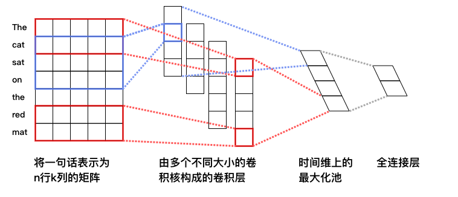

# 文本分类
文本分类是机器学习中的一项常见任务，主要目的是根据一条文本的内容，判断该文本所属的类别。在本例子中，我们利用有标注的语料库训练二分类DNN和CNN模型，完成对输入文本的分类任务。

DNN与CNN模型之间最大的区别在于：

- DNN不属于序列模型，大多使用基本的全连接结构，只能接受固定维度的特征向量作为输入。

- CNN属于序列模型，能够提取一个局部区域之内的特征，能够处理变长的序列输入。

举例来说，情感分类是一项常见的文本分类任务，在情感分类中，我们希望训练一个模型来判断句子中表现出的情感是正向还是负向。例如，"The apple is not bad"，其中的"not bad"是决定这个句子情感的关键。

- 对于DNN模型来说，只能知道句子中有一个"not"和一个"bad"，但两者之间的顺序关系在输入时已经丢失，网络不再有机会学习序列之间的顺序信息。

- CNN模型接受文本序列作为输入，保留了"not bad"之间的顺序信息。因此，在大多数文本分类任务上，CNN模型的表现要好于DNN。

## 实验数据
本例子的实验在[IMDB数据集](http://ai.stanford.edu/%7Eamaas/data/sentiment/aclImdb_v1.tar.gz)上进行。IMDB数据集包含了来自IMDB（互联网电影数据库）网站的5万条电影影评，并被标注为正面/负面两种评价。数据集被划分为train和test两部分，各2.5万条数据，正负样本的比例基本为1:1。样本直接以英文原文的形式表示。

## DNN模型

**DNN的模型结构入下图所示：**

<p align="center">
<br/>
图1. DNN文本分类模型
</p>

**可以看到，模型主要分为如下几个部分：**

- **词向量层**：IMDB的样本由原始的英文单词组成，为了更好地表示不同词之间语义上的关系，首先将英文单词转化为固定维度的向量。训练完成后，词与词语义上的相似程度可以用它们的词向量之间的距离来表示，语义上越相似，距离越近。关于词向量的更多信息请参考PaddleBook中的[词向量](https://github.com/PaddlePaddle/book/tree/develop/04.word2vec)一节。

- **最大池化层**：最大池化在时间序列上进行，池化过程消除了不同语料样本在单词数量多少上的差异，并提炼出词向量中每一下标位置上的最大值。经过池化后，词向量层输出的向量序列被转化为一条固定维度的向量。例如，假设最大池化前向量的序列为`[[2,3,5],[7,3,6],[1,4,0]]`，则最大池化的结果为：`[7,4,6]`。

- **全连接隐层**：经过最大池化后的向量被送入两个连续的隐层，隐层之间为全连接结构。


- **输出层**：输出层的神经元数量和样本的类别数一致，例如在二分类问题中，输出层会有2个神经元。通过Softmax激活函数，输出结果是一个归一化的概率分布，和为1，因此第$i$个神经元的输出就可以认为是样本属于第$i$类的预测概率。

**通过PaddlePaddle实现该DNN结构的代码如下：**

```python
import paddle.v2 as paddle

def fc_net(dict_dim, class_dim=2, emb_dim=28):
    """
    dnn network definition

    :param dict_dim: size of word dictionary
    :type input_dim: int
    :params class_dim: number of instance class
    :type class_dim: int
    :params emb_dim: embedding vector dimension
    :type emb_dim: int
    """

    # input layers
    data = paddle.layer.data("word",
                             paddle.data_type.integer_value_sequence(dict_dim))
    lbl = paddle.layer.data("label", paddle.data_type.integer_value(class_dim))

    # embedding layer
    emb = paddle.layer.embedding(input=data, size=emb_dim)
    # max pooling
    seq_pool = paddle.layer.pooling(
        input=emb, pooling_type=paddle.pooling.Max())

    # two hidden layers
    hd_layer_size = [28, 8]
    hd_layer_init_std = [1.0 / math.sqrt(s) for s in hd_layer_size]
    hd1 = paddle.layer.fc(
        input=seq_pool,
        size=hd_layer_size[0],
        act=paddle.activation.Tanh(),
        param_attr=paddle.attr.Param(initial_std=hd_layer_init_std[0]))
    hd2 = paddle.layer.fc(
        input=hd1,
        size=hd_layer_size[1],
        act=paddle.activation.Tanh(),
        param_attr=paddle.attr.Param(initial_std=hd_layer_init_std[1]))

    # output layer
    output = paddle.layer.fc(
        input=hd2,
        size=class_dim,
        act=paddle.activation.Softmax(),
        param_attr=paddle.attr.Param(initial_std=1.0 / math.sqrt(class_dim)))

    cost = paddle.layer.classification_cost(input=output, label=lbl)

    return cost, output, lbl

```
该DNN模型默认对输入的语料进行二分类（`class_dim=2`），embedding的词向量维度默认为28（`emd_dim=28`），两个隐层均使用Tanh激活函数（`act=paddle.activation.Tanh()`）。

需要注意的是，该模型的输入数据为整数序列，而不是原始的英文单词序列。事实上，为了处理方便我们一般会事先将单词根据词频顺序进行id化，即将单词用整数替代， 也就是单词在字典中的序号。这一步一般在DNN模型之外完成。

## CNN模型

**CNN的模型结构如下图所示：**

<p align="center">
<br/>
图2. CNN文本分类模型
</p>

**可以看到，模型主要分为如下几个部分:**

- **词向量层**：与DNN中词向量层的作用一样，将英文单词转化为固定维度的向量，利用向量之间的距离来表示词之间的语义相关程度。如图2中所示，将得到的词向量定义为行向量，再将语料中所有的单词产生的行向量拼接在一起组成矩阵。假设词向量维度为5，语料“The cat sat on the read mat”包含7个单词，那么得到的矩阵维度为7*5。关于词向量的更多信息请参考PaddleBook中的[词向量](https://github.com/PaddlePaddle/book/tree/develop/04.word2vec)一节。

- **卷积层**： 文本分类中的卷积在时间序列上进行，即卷积核的宽度和词向量层产出的矩阵一致，卷积沿着矩阵的高度方向进行。卷积后得到的结果被称为“特征图”（feature map）。假设卷积核的高度为$h$，矩阵的高度为$N$，卷积的步长为1，则得到的特征图为一个高度为$N+1-h$的向量。可以同时使用多个不同高度的卷积核，得到多个特征图。

- **最大池化层**: 对卷积得到的各个特征图分别进行最大池化操作。由于特征图本身已经是向量，因此这里的最大池化实际上就是简单地选出各个向量中的最大元素。各个最大元素又被拼接在一起，组成新的向量，显然，该向量的维度等于特征图的数量，也就是卷积核的数量。举例来说，假设我们使用了四个不同的卷积核，卷积产生的特征图分别为：`[2,3,5]`、`[8,2,1]`、`[5,7,7,6]`和`[4,5,1,8]`，由于卷积核的高度不同，因此产生的特征图尺寸也有所差异。分别在这四个特征图上进行最大池化，结果为：`[5]`、`[8]`、`[7]`和`[8]`，最后将池化结果拼接在一起，得到`[5,8,7,8]`。

- **全连接与输出层**：将最大池化的结果通过全连接层输出，与DNN模型一样，最后输出层的神经元个数与样本的类别数量一致，且输出之和为1。

**通过PaddlePaddle实现该CNN结构的代码如下：**

```python
import paddle.v2 as paddle

def convolution_net(dict_dim, class_dim=2, emb_dim=28, hid_dim=128):
    """
    cnn network definition

    :param dict_dim: size of word dictionary
    :type input_dim: int
    :params class_dim: number of instance class
    :type class_dim: int
    :params emb_dim: embedding vector dimension
    :type emb_dim: int
    :params hid_dim: number of same size convolution kernels
    :type hid_dim: int
    """

    # input layers
    data = paddle.layer.data("word",
                             paddle.data_type.integer_value_sequence(dict_dim))
    lbl = paddle.layer.data("label", paddle.data_type.integer_value(2))

    #embedding layer
    emb = paddle.layer.embedding(input=data, size=emb_dim)

    # convolution layers with max pooling
    conv_3 = paddle.networks.sequence_conv_pool(
        input=emb, context_len=3, hidden_size=hid_dim)
    conv_4 = paddle.networks.sequence_conv_pool(
        input=emb, context_len=4, hidden_size=hid_dim)

    # fc and output layer
    output = paddle.layer.fc(
        input=[conv_3, conv_4], size=class_dim, act=paddle.activation.Softmax())

    cost = paddle.layer.classification_cost(input=output, label=lbl)

    return cost, output, lbl
```

该CNN网络的输入数据类型和前面介绍过的DNN一致。`paddle.networks.sequence_conv_pool`为PaddlePaddle中已经封装好的带有池化的文本序列卷积模块，该模块的`context_len`参数用于指定卷积核在同一时间覆盖的文本长度，即图2中的卷积核的高度；`hidden_size`用于指定该类型的卷积核的数量。可以看到，上述代码定义的结构中使用了128个大小为3的卷积核和128个大小为4的卷积核，这些卷积的结果经过最大池化和结果拼接后产生一个256维的向量，向量经过一个全连接层输出最终预测结果。

## 自定义数据
本样例中的代码通过`Paddle.dataset.imdb.train`接口使用了PaddlePaddle自带的样例数据，在第一次运行代码时，PaddlePaddle会自动下载并缓存所需的数据。如果希望使用自己的数据进行训练，需要自行编写数据读取接口。

编写数据读取接口的关键在于实现一个Python生成器，生成器负责从原始输入文本中解析出一条训练样本，并组合成适当的数据形式传送给网络中的data layer。例如在本样例中，data layer需要的数据类型为`paddle.data_type.integer_value_sequence`，本质上是一个Python list。因此我们的生成器需要完成：从文件中读取数据, 以及转换成适当形式的Python list，这两件事情。

假设原始数据的格式为：

```
PaddlePaddle is good    1  
What a terrible weather    0
```
每一行为一条样本，样本包括了原始语料和标签，语料内部单词以空格分隔，语料和标签之间用`\t`分隔。对以上格式的数据，可以使用如下自定义的数据读取接口为PaddlePaddle返回训练数据：

```python
def encode_word(word, word_dict):
    """
    map word to id

    :param word: the word to be mapped
    :type word: str
    :param word_dict: word dictionary
    :type word_dict: Python dict
    """

    if word_dict.has_key(word):
        return word_dict[word]
    else:
        return word_dict['<unk>']

def data_reader(file_name, word_dict):
    """
    Reader interface for training data

    :param file_name: data file name
    :type file_name: str
    :param word_dict: word dictionary
    :type word_dict: Python dict
    """

    def reader():
        with open(file_name, "r") as f:
            for line in f:
                ins, label = line.strip('\n').split('\t')
                ins_data = [int(encode_word(w, word_dict)) for w in ins.split(' ')]
                yield ins_data, int(label)
    return reader
```

`word_dict`是字典，用来将原始的单词字符串转化为在字典中的序号。可以用`data_reader`替换原先代码中的`Paddle.dataset.imdb.train`接口用以提供自定义的训练数据。

## 运行与输出

本部分以上文介绍的DNN网络为例，介绍如何利用样例中的`text_classification_dnn.py`脚本进行DNN网络的训练和对新样本的预测。

`text_classification_dnn.py`中的代码分为四部分：

- **fc_net函数**：定义dnn网络结构，上文已经有说明。

- **train\_dnn\_model函数**：模型训练函数。定义优化方式、训练输出等内容，并组织训练流程。每完成一个pass的训练，程序都会将当前的模型参数保存在硬盘上，文件名为：`dnn_params_pass***.tar.gz`，其中`***`表示pass的id，从0开始计数。本函数接受一个整数类型的参数，表示训练pass的总轮数。

- **dnn_infer函数**：载入已有模型并对新样本进行预测。函数开始运行后会从当前路径下寻找并读取指定名称的参数文件，加载其中的模型参数，并对test数据集中的样本进行预测。

- **main函数**：主函数

要运行本样例，直接在`text_classification_dnn.py`所在路径下执行`python text_classification_dnn.py`即可，样例会自动依次执行数据集下载、数据读取、模型训练和保存、模型读取、新样本预测等步骤。

预测的输出形式为：

```
[ 0.99892634  0.00107362] 0
[ 0.00107638  0.9989236 ] 1
[ 0.98185927  0.01814074] 0
[ 0.31667888  0.68332112] 1
[ 0.98853314  0.01146684] 0
```

每一行表示一条样本的预测结果。前两列表示该样本属于0、1这两个类别的预测概率，最后一列表示样本的实际label。

在运行CNN模型的`text_classification_cnn.py`脚本中，网络模型定义在`convolution_net`函数中，模型训练函数名为`train_cnn_model`，预测函数名为`cnn_infer`。其他用法和`text_classification_dnn.py`是一致的。
