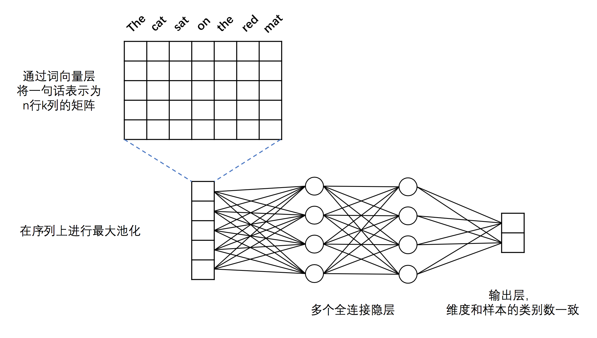

# 文本分类
文本分类是机器学习中的一项常见任务，主要目的是根据一条文本的内容，判断该文本所属的类别。在本例子中，我们利用有标注的IMDB语料库训练二分类DNN和CNN模型，完成对语料的简单文本分类。

## 实验数据
本例子的实验在IMDB数据集上进行。IMDB数据集包含了来自IMDb（互联网电影数据库）网站的5万条电影影评，并被标注为正面/负面两种评价。数据集被划分为train和test两部分，各2.5万条数据，正负样本的比例基本为1:1。样本直接以英文原文的形式表示。

## DNN模型结构
####DNN的模型结构入下图所示：
<p align="center">
<br/>
图1. DNN文本分类模型
</p>
####可以看到，模型主要分为如下几个部分：  
- **embedding层**：IMDB的样本由原始的英文单词组成，为了方便模型的训练，必须通过embedding将英文单词转化为固定维度的向量。  
- **max pooling**：max pooling在时间序列上进行，pooling过程消除了不同语料样本在单词数量多少上的差异，并提炼出词向量中每一下标位置上的最大值。经过pooling后，样本被转化为一条固定维度的向量。  
- **全连接隐层**：经过max pooling后的向量被送入一个具有两个隐层的DNN模型，隐层之间为全连接结构。  
- **输出层**：输出层的神经元数量和样本的类别数一致，例如在二分类问题中，输出层会有2个神经元。通过Softmax激活函数，我们保证输出层各神经元的输出之和为1，因此第i个神经元的输出就可以认为是样本属于第i类的预测概率。

####通过Paddle实现该DNN结构的代码如下：
```python
import paddle.v2 as paddle

def fc_net(input_dim, class_dim=2, emb_dim=256):
    # input layers
    data = paddle.layer.data("word",
                             paddle.data_type.integer_value_sequence(input_dim))
    lbl = paddle.layer.data("label", paddle.data_type.integer_value(class_dim))

    # emdedding layer
    emb = paddle.layer.embedding(input=data, size=emb_dim)
    # max pooling
    seq_pool = paddle.layer.pooling(
        input=emb, pooling_type=paddle.pooling.Max())

    # two hidden layers
    hd1 = paddle.layer.fc(
        input=seq_pool,
        size=128,
        act=paddle.activation.Tanh(),
        param_attr=paddle.attr.Param(initial_std=0.01))
    hd2 = paddle.layer.fc(
        input=hd1,
        size=32,
        act=paddle.activation.Tanh(),
        param_attr=paddle.attr.Param(initial_std=0.01))

    # output layer
    output = paddle.layer.fc(
        input=hd2,
        size=class_dim,
        act=paddle.activation.Softmax(),
        param_attr=paddle.attr.Param(initial_std=0.1))

    cost = paddle.layer.classification_cost(input=output, label=lbl)

    return cost, output

```
