运行本目录下的程序示例需要使用PaddlePaddle v0.10.0 版本。如果您的PaddlePaddle安装版本低于此要求，请按照安装文档中的说明更新PaddlePaddle安装版本。

---

PaddlePaddle 能够广泛地支持各类复杂的自然语言处理任务，具有以下良好的特性：

1. 灵活的序列输入
    - 原生地支持序列和嵌套序列输入
2. [算得快](https://github.com/PaddlePaddle/Paddle/tree/develop/benchmark#rnn)，无需 Padding 的RNN；
3. 可高度定制的 RNN 单元：
    - 可以按照自己所需的逻辑定义 RNN 单元一个时间步之内完成的运算，框架负责该运算在序列输入上的循环展开，以此实现非常复杂的自然语言处理任务；

这一篇以文本生成任务为例，由浅入深介绍如何使用PaddlePaddle中的各种RNN单元完成复杂的NLP任务。这一篇共包含三个例子：

- [使用循环神经网络语言模型生成文本](./generate_sequence_by_rnn_lm)
- [使用RNN 编码器解码器模型生成古诗](./generate_chinese_poetry)
- [基于神经图灵机的神经机器翻译](./nmt_with_external_memory)

---

# 文本生成

## 一、简介

我们期待有一天机器可以使用自然语言与人们进行交流，像人一样能够撰写高质量的自然语言文本，自动文本生成是实现这一目标的关键技术，可以应用于机器翻译系统、对话系统、问答系统等，为人们带来更加有趣地交互体验，也可以自动撰写新闻摘要，撰写歌词，简单的故事等等。或许未来的某一天，机器能够代替编辑，作家，歌词作者，颠覆这些内容创作领域的工作方式。

根据输入内容的不同，可以分为从文本生成文本，从图像/视频生成文本，甚至多种源生成文本。文本又可以是一个词，几个词，一句话，一段话，一篇文章，结构化的信息等等。自动文本生成是自然语言处理领域中一个重要的方向，有着多年的研究历史，因此积累了许多不同种类的方法，在有限的篇幅中，这篇文章希望用简单的语言来展示神经网络如何完成 “文本到文本的生成” 任务。实际上，对神经网络模型来说，从不同源生成文本，核心思想和主体网络往往都是相同的。神经网络就像搭积木，PaddlePaddle提供了丰富的积木来建模不同种类的输入信息，因此，大家完全可以在自己的数据和任务上尝试扩展这一课中的模型。

我们先来定义这一课要解决任务：给定一个自然语言输入序列，序列中的每个元素是一个词语，由神经网络负责生成另一个新的语言序列。

## 二、 基础知识

### 计算机如何表示词语 —— one-hot 表示与词向量

开始生成语言之前，不可避免地面对一个基础的问题：计算机如何表示语言。特征表示在机器学习问题中起着至关重要的作用，如果数据基于给定的特征表示不可分，那么，任何算法都不可能将其分开。如何最大限度地保留语言中的信息就变得至关重要。

为了能够让计算机处理语言，首先需要一种对语言的规范化编码方式，最经典的莫过于 one-hot 表示法。在 one-hot 表示方法中，一个编码单元表示一个个体，这里我们限定是一个词。于是，一个词被表示成一个长度为字典大小的实数向量，每个维度对应字典里的一个词，除了该词对应维度上的值是 1，其余维度都是 0。下面的图1表示了 “Queen” 这个单词的 one-hot 编码。

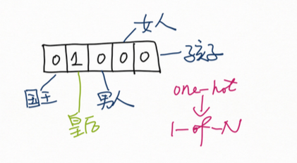 
图1. one-hot 表示法

与one-hot 表示相对的是 distributed representation ，后者用几个编码单元而不是一个编码单元来表示一个个体，是一类表示学方法。distributed representation ，具体来讲是我们常说词嵌入(word embedding)，或者叫词向量，用一个更低维度的实向量表示词语，向量的每个维度在实数域 $R$ 取值，如下面的图2所示。

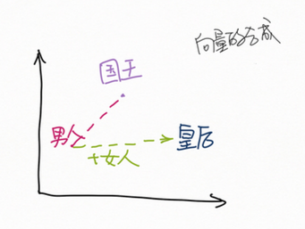 
图2. 词向量表示法

词向量表示法具有以下优点：

1. 将词嵌入实向量空间，对抗维数灾难。
   - 一个 $n$ 维向量，如果每个维度仅能取 0、1 两个值，这个 $n$ 维向量只能编码 $2^n$ 种信息。
   - 如果每个维度能够在整个实数域 $R$ 取值，那么 $n$ 位实向量可以编码无穷种信息。
   - 嵌入实向量空间使得我们能够使用更少的维度，编码更丰富的信息。
2. 词语，短语，句子，篇章等等自然语言信息都可以嵌入同一个实向量空间，得到统一的表达形式。
   - 比起 one-hot 向量空间，这个嵌入了语言信息（词，短句，句子，篇章等）的实向量空间紧致了很多，但依然存在很多未知的空洞，我们很难知道，空间中的每一个点到底表示了什么。
2. 更好地刻画语义信息
   - 相近意义的词语、短语、句子，在向量空间中有着相近的位置，这个空间就蕴含了语义信息，这一点是可以做到的。
   - 定义于实向量空间上的各种数学运算，为我们提供了描述语义的数学工具，图2中就蕴含了这样的过程。

既然， distributed representation 有着如此多的优点，应该如何得到这样一套好的对词的表示，进而得到短语，句子的表示呢？得到词向量的方法很多，在神经网络的世界中，语言模型是一种流行的方法，词向量通常是语言模型训练的一个副产物，会成为许多 NLP 任务的基础。关于如何训练一个 Neural Language Model 得到词向量，请大家参考 PaddleBook 中的[词向量](http://book.paddlepaddle.org/04.word2vec/)一课，这里不再详细展开。

### 计算机如何表示句子 —— 循环神经网络

词向量是对词的编码，接下来，我们该如何编码句子呢？这里，需要引入一种新的积木：循环神经网络。

循环神经网络（Recurrent Neural Network）是一种对序列数据建模的重要模型，模拟了离散时间（这里只考虑离散时间）动态系统的状态演化。“循环” 两字刻画了这个模型的核心：上一时刻的输出作为下一个时刻的输入，始终留在系统中，如图3所示。这种循环反馈能够形成复杂的历史。可以证明，RNN 是图灵完备的。

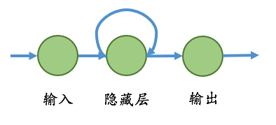 
图3. 最简单的 RNN 单元

自然语言是一个天生的序列输入，RNN 恰好有能力去刻画词汇与词汇之间的前后关联关系，因此，在自然语言处理任务中占有重要的地位。

每个时间步，循环神经网络接受输入 $\boldsymbol{x}_t$，计算隐状态 $\boldsymbol{h}_t$，输出 $\boldsymbol{y}_t$。这个过程用公式描述如下：

$$
\begin{equation}  \begin{split} &h_t = f_h(\boldsymbol{x}_t, \boldsymbol{h}_{t-1}) = \phi_h(W^T\boldsymbol{h}_{t-1} + U^T\boldsymbol{x}_t)  \\
&y_t = f_o(\boldsymbol{h}_t) = \phi_o(V^T\boldsymbol{h}_t) \end{split} \tag{1}\end{equation}
$$

公式$(1)$中，下标 $t$ 表示时间步，$f_h$ 是状态转移方程， $f_o$ 是输出方程。一个 RNN 单元可以由 $f_h$ 和 $f_o$ 完全地决定。RNN 跨时间步参数共享，在输入序列上反复调用 $f_h$ 和  $f_o$。给定含有 $N$ 个样本的集合，$D = \left\{ \left(  (\boldsymbol{x}_1^{(n)}, d_1^{(n)}) ,..., ( \boldsymbol{x}_{T_n}^{(n)}, d_{T_n}^{(n)}) \right)\right\}_{n=1}^N$， 对样本 $n$，若每个时间步都有真实类别标签 $d_t^{(n)}$，RNN 单元的参数可以通过最小化如下损失函数来求解。

$$J(\theta) = \frac{1}{N}\sum_{n=1}^N\sum_{t=1}^{T_n} L\left(y_t^{(n)}, d_{t}^{(n)}\right) \tag{2}$$

#### 从 simple RNN 到 GRU 、LSTM

由于梯度消失梯度爆炸问题的存在，循环神经网络往往难以训练。这一问题本质上是由反向传播算法的原理引起，所有深层网络都会遇到。不论是什么样的神经网络，简单或复杂，前馈、循环或者递归，支配神经网络优化算法的始终是[链式法则](https://zh.wikipedia.org/wiki/%E9%93%BE%E5%BC%8F%E6%B3%95%E5%88%99)，反向传播算法是链式求导法则的实现。我们考虑下面三种情况：

+ 函数合成 ：
$$ \begin{align} &h(\boldsymbol{x}) &&= f(g(\boldsymbol{x})) \tag{3.1}\\ &\frac{\partial h(\boldsymbol{x})}{\partial \boldsymbol{x}} &&=  f'(g(\boldsymbol x))g'(\boldsymbol x) \tag{3.2}\end{align}$$

+ 函数相加 ：

$$ \begin{align} &h(x) &&= f(x) + g(x) \tag{4.1}\\ &\frac{\partial h(\boldsymbol{x})}{\partial \boldsymbol{x}} &&=  f'(\boldsymbol x) + g'(\boldsymbol x) \tag{4.2} \end{align}$$

+ 加权运算：

$$\begin{align} &h(\boldsymbol{x}) &&= \omega \cdot \boldsymbol{x}  \tag{5.1}\\ &\frac{\partial h(\boldsymbol{x})}{\partial \boldsymbol{x}} &&=  \omega \tag{5.2} \end{align} $$

神经网络的一层是对输入数据的一次映射，堆叠多个层，会形成复杂的复合函数。公式$(3.1)$、 $(4.1)$ 和 $(5.1)$ 对应了神经网络的前向过程，$(3.2)$、$(4.2)$和$(5.2)$对应了神经网络的反向过程，这些公式告诉我们什么呢？

>+ 公式$(3.1)$ ~ $(3.2)$：复合函数的内层函数对输入$\boldsymbol{x}$ 求导，**会出现连乘**，复合 $n$ 层，这个求导链上梯度便会连乘 $n$ 次
+ 公式$(4.1)$ ~ $(4.2)$：**函数相加不会引起梯度的衰减**，加法会将收到的梯度等量地传递给每一个输入
+ 公式$(5.1)$ ~ $(5.2)$：**权值运算的前向和反向是相同的**，前向对输入加权，后向将收到的梯度加权向前层传递

RNN 形成“循环反馈” 的过程是一个函数不断复合的过程，可以等价为一个层数等于输入序列长度的前馈神经网络，如果输入序列有 100 个时间步，相当于一个 100 层的前馈网络，梯度消失和梯度爆炸的问题对 RNN 尤为严峻。直觉上，大于 1 的数连乘越乘越大，极端时会引起梯度爆炸；小于 1 的数连乘越乘越小，极端时会引起梯度消失。梯度消失也会令在循环神经网络中，后面时间步的信息总是会”压过”前面时间步。

如果 $t$ 时刻隐层状态依赖于 $t$ 之前所有时刻，梯度需要通过所有的中间隐层逐时间步回传，如图4所示，这会形成一个很深的求导链，

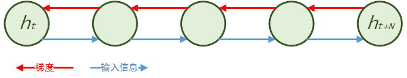 
图4. $t$ 时刻依赖 $t$ 时刻之前的所有时刻

在许多实际问题中，时间步之间相互依赖的链条并没有那么长，$t$ 时刻也许仅仅依赖于它之前有限的若干时刻。于是，我们自然会联想到：如果模型能够自适应地学习出一些如图5所示的捷径来缩短梯度的传播路径，是不是可以一定程度减梯度消失和梯度爆炸呢？

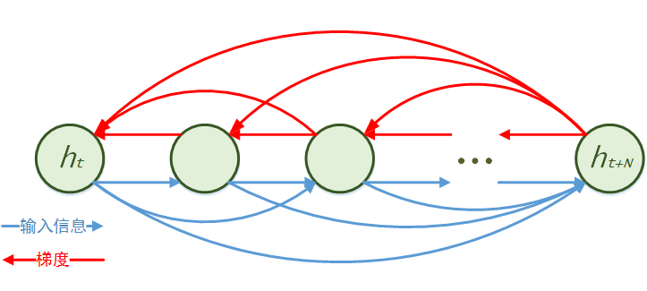 
图5. 自适应地形成一些信息传播的“捷径”

答案是肯定的，这也就是“门控”的思想，是构建深层网络非常重要的手段之一：我们需要**给深层网络引入一些捷径，来保证梯度在整个网络中顺畅地传播下去**，这些捷径或者由网络学习，或者强行引入。

门控的思想是长短时间记忆（Long Short Term Memory，LSTM ）和门控循环神经网络单元（Gated Recurrent Unit，GRU）这些复杂 RNN 单元的重要智慧之一。关于 LSTM 和 GRU 单元的具体数学公式和如何使用请大家分别参考 PaddleBook 中的[情感分析](https://github.com/PaddlePaddle/book/tree/develop/05.understand_sentiment)，[机器翻译](http://book.paddlepaddle.org/07.machine_translation/)以及\[[1](#参考文献)\]，这里不再详细展开，我们只非定量地讨论他们背后的思想。

图6 和 图7 分别是 GRU 和 LSTM 单元一个时间步之内的计算流程图，图中有两条非常重要的线：下部分绿色的箭头指示的那条线是每时刻输入信息的流动，上部分红色箭头指示的那条线是历史信息的流动。

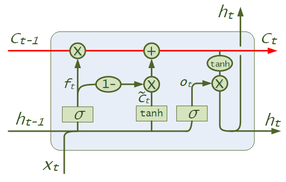 
图6. 长段时间记忆单元

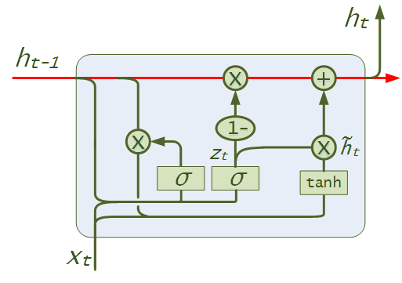 
图7. 门控循环神经网络单元

可以看到：对 LSTM 和 GRU，红色这条历史信息流动的线上**从$h_{t-1}$计算$h_t$只有点乘和加法**。还记得公式 $(4.2)$ 和 $(5.2)$ 的结论吗？**加法不引起梯度的衰减只是原样回传梯度，加权只改变梯度的scale**。门单元的开合会形成信息转播的捷径，因此，LSTM 和 GRU 能够更好地捕捉到跨长时间步的长程依赖关系。对 simple RNN，LSTM 和 GRU 单元的比较，可以参考\[[2](#参考文献)\]。

#### 为什么需要深层循环神经网络

在构建深层循环神经网络之前，我们先简单地思考一个问题：为什么需要深层网络？

在神经网络中，我们通常将“对输入的一次非线性映射”定义为网络的一层。以最简单的全连接层$y=f(Wx + b)$ 为例，全连接层通过“线性变换跟随着非线性变换”，将输入空间投向另一个空间。线性变换实现对原始输入空间的：升维/降维、scale 变换、旋转以及平移操作，而非线性变换完成对原始空间的扭曲。当网络层数逐渐增多时，网络上层在下层已经学习到的初级特征基础上，形成更复杂的高级特征，对原始空间的扭曲也会逐渐增大，直到能够寻找到一个全新的特征空间，在其中，只需要一个简单的线性模型，便可以很好的完成我们的学习任务。这里有一个很好的[网站](http://cs.stanford.edu/people/karpathy/convnetjs//demo/classify2d.html)来可视化神经网络对空间的变换，更详细地也可以学习文章\[[3](#参考文献)\]。很多复杂的机器学习任务需要高度非线性的分界面，通过不断地将原始输入空间映射到新的更为线性可分的空间，是深层神经网络动机**之一**。

循环神经网络等价于一个展开的前馈网络，序列有多长，这个等价的前馈网络就有多深，常有人说，循环神经网络是一个真正的深层网络。如果真是如此，我们为什么需要深层循环神经网络呢？循环神经网络真的足够深吗？

我们再来审视公式$(1)$会发现，RNN 各个时间步之间参数共享，不论 RNN 展开长度有多长，但**状态转移方程$f_h$，始终只经过了一次非线性映射，是 “浅” 的**。RNN 的“记忆”能力源自状态转移方程$f_h$对历史的编码，对复杂的自然语言处理任务，提高对历史状态的建模能力始终是至关重要的。

#### 构建深层循环神经网络

那么，我们该如何构建构建深层 RNN 网络呢？

观察公式$(1)$，公式$(1)$的计算从逻辑上可以拆分为如图8所示的三个部分：

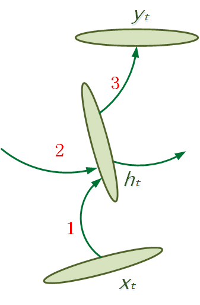 
图8. 循环神经网络的三个部分

1. input-to-hidden：对应公式$(1)$中的 $U^T\boldsymbol{x}_t$
2. hidden-to-hidden：对应公式$(1)$中的 $\phi_h(U^T\boldsymbol{x}_t + W^T\boldsymbol{h}_{t-1})$
3. hidden-to-output：对应公式$(1)$中的 $\phi_o(V^T\boldsymbol{h}_t)$，在一些简单的 RNN 单元中，通常只是对 $\boldsymbol{h}_t$ 做一个非线性激活，例如： $\text{tanh}$，作为输出

任选1 ~ 3 中的某几个或全部，通过增加**非线性**层的层数，可以实现加深循环神经网络的目的\[[4](#参考文献)\]。加深这三部分的作用也不尽相同：

1. input-to-hidden：对输入的变换及规整，提高对原始特征的表达
2. hidden-to-hidden：提高状态转移的非线性程度
3. hidden-to-output：对输出的变换及规整，提高预测精度

然而，以上三种方式都会引入更长地梯度传播链，暴力增加非线性映射的层数会再次遇到梯度消失和梯度爆炸会导致无法有效的学习，需谨慎为之。

除以上3种方法之外，一种更加简便且流行地加深 RNN 单元的方式还有：

>堆叠多个 RNN 单元，让前一个 RNN 的输出成为下一个 RNN 的输入。

这种方式能够让模型学习**蕴含于数据中跨越不同时间步（different timescale）的模式**。

然而，纵向堆叠多个LSTM单元依然可能遇到梯度在纵向深度上传播受阻的问题。文献\[[5](#参考文献)\]中给出的数据：直接堆叠 LSTM 到 4 层时，可以工作得很好，6 层时会遇到学习困难, 8 层及以上时，效果变差。我们可以再次借鉴LSTM解决 “梯度消失梯度爆炸” 问题的智慧：

> 1. 形成信息传播的捷径
> 2. 门控对信息流和梯度传播的调节

在纵向上添加保证梯度顺畅传播的路径。最流行且有效的方法包括（但不限于）：

1. residual connection\[[6](#参考文献)\]\[[5](#参考文献)\]（图9）：
$$y=H(\boldsymbol{x},W) + \boldsymbol{x}$$

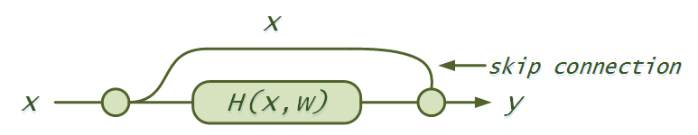 
图9. residual connectoin

2. highway connection\[[7](#参考文献)\]（图10）：

$$y=H(\boldsymbol{x},W)\cdot T(\boldsymbol{x},W_{T}) + x \cdot C(\boldsymbol{x}, W_{C})$$

$T(\boldsymbol{x},W_{T})$ 是 transform gate，$C(\boldsymbol{x}, W_{C})$ 是 carry gate。

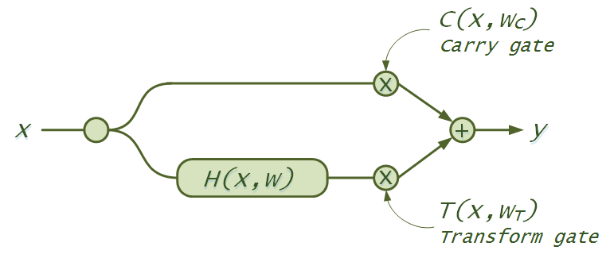 
图10. highway network

类似思想的工作还可以参考\[[8](#参考文献)\]\[[9](#参考文献)\]。

#### 小结

至此，我们所有的基础积木介绍完毕，让我们一起来总结以上的内容。

##### 如何有效地训练一个 RNN 模型

1. 控制初始化，一些技巧可参考\[[10](#参考文献)\]
2. 使用 LSTM / GRU 单元，而不是 simple RNN
3. 使用自适应学习率算法，例如 Adam、Adadelta、Rmsprop 等
4. 使用梯度 clipping
5. 构建深层 RNN 模型时，可以考虑加入 residual connection，highway conection，或是参考 PaddleBook 中 [语义角色标注](http://book.paddlepaddle.org/06.label_semantic_roles/)一节中的连接方法

##### 如何得到句子的表示

RNN 单元每时间步均有输出，对 RNN 层的输出进行 [Pooling](http://www.paddlepaddle.org/develop/doc/api/v2/config/pooling.html) 操作，或是取[最后一个时间步](http://www.paddlepaddle.org/develop/doc/api/v2/config/layer.html#last-seq)（在 PaddlePaddle 中，[逆序序列取第一个时间步](http://www.paddlepaddle.org/develop/doc/api/v2/config/layer.html#first-seq)），是得到整个句子的表示最简便的方式。在下面的章节中，会看到注意力机制是另一种得到句子表示的方法。

## 三、文本生成模型

有了上面的准备，下面让我们向着 “生成文本” 这个目标开始搭积木吧。

### 第一种方法： Language Model 与文本生成

语言模型是自然语言处理任务中一个经典的话题。简单来讲，语言模型是**计算一个序列的概率，判断一个序列是否属于一个语言的模型**，描述了这样一个条件概率 $P(x_1, ..., x_T)$ ，其中 $x_1 ~ x_T$ 是输入序列中的 $T$ 个词语，用 one-hot 表示法表示。

使用神经网络来训练语言模型的思想最早由百度深度学习研究院（IDL）的徐伟老师提出 \[[6](#参考文献)\]，实际问题中广为使用的有 Bengio 这篇 \[[7](#参考文献)\] 具有代表性的工作。语言模型顾名思义是建模一种语言的模型，除了得到词向量（语言模型训练的副产物），完全可以帮助我们生成文本，这一过程如图11所示：

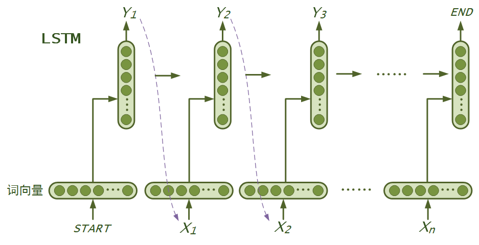 
图11. 利用语言模型生成文本序列

1. 给定一段 one-hot 表示的输入序列 $\{x_1, x_2, ... , x_T\}$，将它们嵌入到实向量空间，得到词向量表示 ：$\{\boldsymbol{\omega}_1, \boldsymbol{\omega}_2, ... , \boldsymbol{\omega}_t\}$。
2. 以词向量序列为输入，使用 RNN 模型（理论上可以编码无限长的、变长的历史，在文本生成任务上比起 $n$-gram 语言模型更有优势），计算输入序列到 $t$ 时刻的编码 $\boldsymbol{h}_t$。
3.  `softmax` (下面的公式$(6)$）层以 $h_t$ 为输入，预测下一个最可能的词 $x_{t+1}$ 的概率 $p_{t+1}$:
$$\begin{equation}\begin{split} &p(x_{t+1}|x_{\lt t}) = \frac{1}{Z} \text{exp} \left\{ \boldsymbol{w}_t\phi(x_t, \boldsymbol{h}_t) + b_t \right\} \\ &Z = \sum_{k: x_k \in V} \text{exp} \left\{ \boldsymbol{w}_k \phi(x_t, \boldsymbol{h}_t) + b_k\right\} \end{split} \tag{6}\end{equation}$$
4. $\tilde{x}_t = \text{maxid}\left(p(x_{t+1} | x_{\lt t})\right)$，根据 $\tilde{x}_{t+1}$ 和 $x_{t+1}$ 计算误差信号。
5. 重复这一过程，直到句子结束。

第2步，可以使用基础知识一节介绍的过的任意循环神经网络，lstm、GRU 或者是深层 RNN 模型以获得对序列更好的编码。解码过程通常需要一个解码算法，请参考 PaddleBook 中[机器翻译](https://github.com/PaddlePaddle/book/tree/develop/07.machine_translation) 一课中的柱搜索算法一节。同时，Github 上有一篇非常好的文章\[[3](#参考文献)\]，介绍用语言模型进行文本生成，也可以参考\[[9](#参考文献)\]。

这一小节，我们利用循环神经网络单元对序列建模的能力，拥有了第一个能够生成文本的模型：语言模型。非定量地，用语言模型生成文本完成了这样一个任务：

> **给定开始的一句话，每次预测下一个词语，重复这个过程直到生成句子的结束符。**
>
> 1. 训练是一个 MLE（Maximum Likelihood Estimation）过程，总是最大化下一个词的概率
> 2. 训练过程下一个词是**已知的**，解码过程总是取模型自己**生成出来的上一个词**

### 第二种方法：序列到序列学习 —— 编码器解码器

编码器-解码器（encoder-decoder）框架是一个**带条件的语言模型**(conditional language model)， 用于解决将一个任意长度的源序列$\{x_1, x_2, ... , x_m\}$映射到另一个任意长度的目标序列$\{y_1, y_2, ..., y_n\}$的问题。编码器学习对源序列的编码，将源序列映射成语义空间的一个实向量，解码阶段通过最大化下一个词的概率，逐步释放所编码的源序列信息，解码出整个目标序列。编码器可以用CNN、RNN等序列模型实现，解码器常用 RNN 实现。

编码器解码器框架如图12所示：

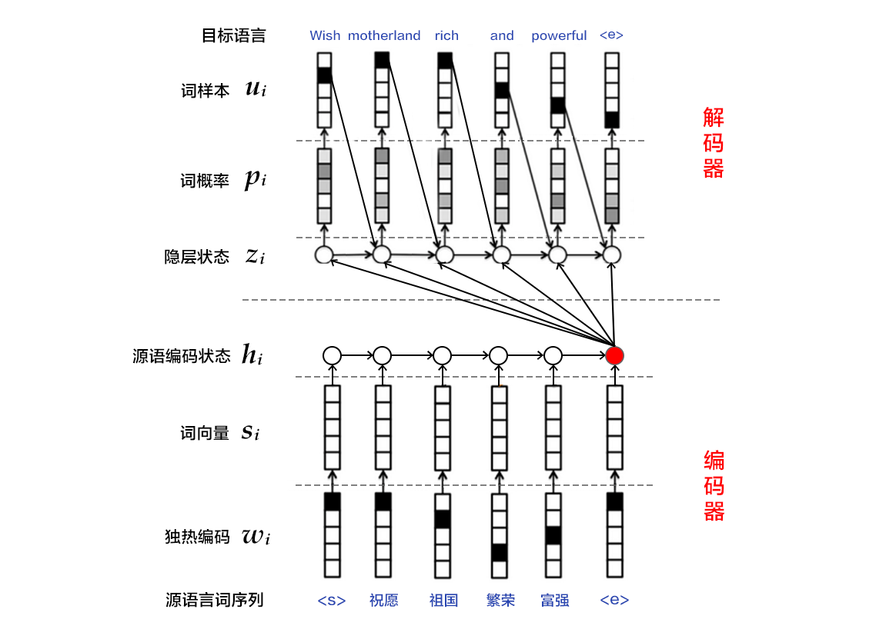 
图12. 编码器解码器结构

工作流程如下：

1. 将 one-hot vector 表示的源语言句子 $x=\left \{ x_1, x_2, ..., x_T \right \}$ 中的每个词 $x_i$ 映射到低维语义空间的词向量 $\boldsymbol{\omega}_i$。
2. RNN 依次读入源语言 $T$ 个词的词向量 $\{ \boldsymbol{\omega}_1, \boldsymbol{\omega}_2, ..., \boldsymbol{\omega}_T \}$，计算整句话的表示。可以采用 RNN 最后一个时间步输出，或时间维上的池化的结果，或者使用注意力机制。
3. 解码器也是一个RNN单元，每一时间步最大化下一个正确的目标语言词的概率，具体如下：
 - 输入：源语言编码 $\boldsymbol{c}$（在注意力机制中，解码的每一时间步都会重新计算$\boldsymbol{c}$），目标语言序列的第 $t$个词 $\boldsymbol{y}_t$,  解码器上一时刻隐层状态 $\boldsymbol{z}_{t}$
 - 以上输入通过 RNN 单元，计算并输出隐状态 $\boldsymbol{z}_{t+1}$
 - 以 $\boldsymbol{z}_{t+1}$ 为输入，通过 `softmax`，也就是公式$(6)$ ，得到目标语言序列的第 $t+1$ 个单词的概率 $p(y_{t+1}|y_{\lt t}, \boldsymbol{z}_{t}, \boldsymbol{c})$
 - 模型预测的下一个词：$\tilde{y}_{t+1} = \text{maxid}\left(p(y_{t+1}|y_{\lt t}, \boldsymbol{z}_{t}, \boldsymbol{c})\right)$
4. 根据 $\tilde{y}_{i+1}$ 和 $y_{i+1}$ 计算代价。
5. 重复步骤1~4，直到目标语言序列中的所有词处理完毕。

上述步骤中的2和3，编码器和解码器可以使用基础知识一节介绍的过的任意循环神经网络，lstm、GRU 或者是深层 RNN 模型以获得对序列更好的编码。复杂的seq2seq任务需要深层 RNN 模型。关于如何在[PaddlePaddle]((https://github.com/PaddlePaddle/Paddle)) 中训练一个sequence-to-sequence 模型的细节，请大家参考PaddleBook 中[机器翻译](http://book.paddlepaddle.org/07.machine_translation/)一节，里面有 step-by-step 的操作步骤，这里不再详细展开。

### 第三种方法：神经图灵机

#### 什么是神经图灵机

神经网络就像搭积木，每一块积木有自己的能力，但一类问题大的框架通常是相对固定的，只在细节千变万化。为了更好的解决一类问题，我们需要一个大的，泛化的框架，然后根据具体任务，选择最合适的积木，微调细节。

文本生成任务属于序列到序列学习，这一类任务是否有一个更大的“蓝图”，一个更泛化的框架，基于其上修修补补，替换小的积木呢？答案是肯定的。神经图灵机（Neural Turning Machine，NTM）\[[12](#参考文献)\] 就是这个更大的框架，能够帮助我们解决更加广泛的序列到序列学习任务，而我们熟知的注意力机制仅仅是 NTM 的一个特例。

NTM 早在14年提出，那时，[PaddlePaddle]((https://github.com/PaddlePaddle/Paddle)) 已经开发出了支持神经图灵机模型的框架。欢迎大家使用 [PaddlePaddle]((https://github.com/PaddlePaddle/Paddle)) 提供的框架和积木，来实现自己的各种奇思妙想，也是探索目前最先进的模型，在自然语言处理任务中可以做到什么程度。

图灵机的概念对计算机专业的每一位同学都不陌生，图灵机是一种可计算模型，如果一个问题能够被图灵机表示，对计算机而言这个问题就是可解的，我们来一起理一理图灵机的工作逻辑：

- 图灵机是一个抽象的机器，它有：
    - Memory：一条无限长的纸带，一些固定的程序存储在纸带上
    - Controller：一个控制器在纸带上移动，控制器有一组内部状态
    - Read Head：控制器通过ReadHead读取纸带
    - Write Head：控制器通过WriteHead写纸带

- 每个时刻图灵机会执行以下动作：
    - 读（寻址能力）：控制器都要从纸带上读入一个方格中的信息
    - 写：读取之后，控制器会结合自己的内部状态，查找程序表，将程序输出到纸带的方格上
    - 状态改变：控制器改变自己的内部状态，在纸带上移动

神经图灵机简单来讲就是：用神经网络模拟图灵机。图13 来自论文\[[12](#参考文献)\]，是NTM的整体结构。我们需要用神经网络描述图灵机的每一个组成部件（包括 Memory、Controller、Read Head、Write Head），以及图灵机的动作（读，写，状态改变）。支配神经网络优化的是反向传播算法，这要求所有的描述**必须都是可导的**。

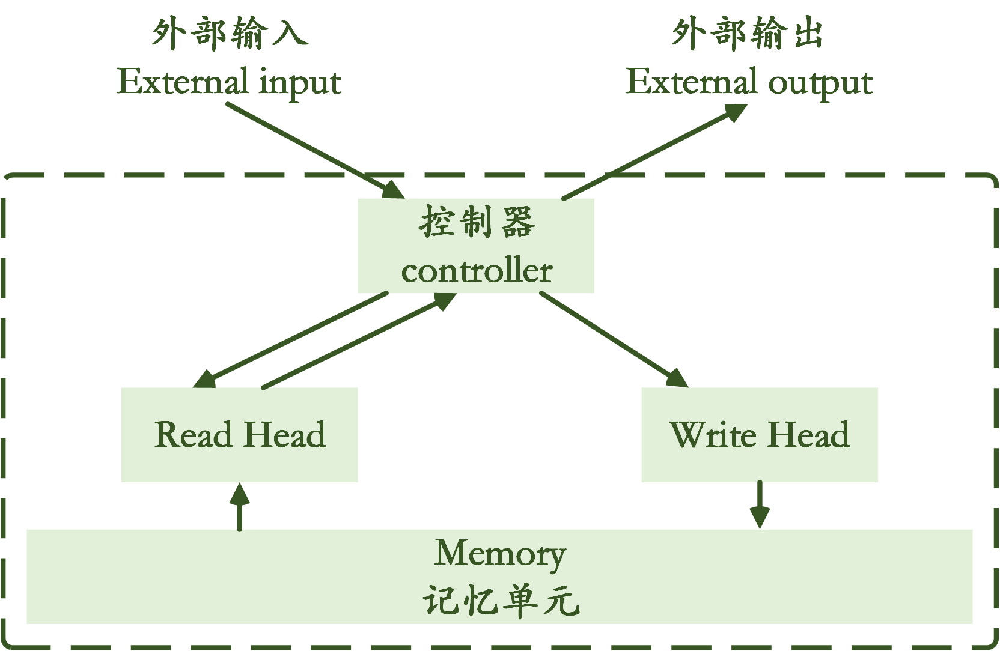 
图13. NTM 结构

#### 神经网络如何模拟图灵机的各个部分

+ Memory ：这里可以简单地理解为神经网络的一层，是对原始输入的重新编码
+ Controller：任意的 RNN 单元（RNN并非是必须，也可以用前馈网络）。选择 RNN 的优点有：
  1. Memory 的长度是不固定的，RNN 作为一种处理不定长输入的时序模型能够更好地模拟对纸带上序列的处理；
  2. 图灵机通过当前输入和 controller 状态决定新的状态和下一时刻动作，这和 RNN 的原理不谋而合；
+ Read / Write 的工作均依赖于 “寻址能力”：
  1. Read / Write Head 根据当前输入和历史状态产生一个 Meomory 所有可读写位置之上的分布；
  2. 读操作是根据计算出的分布对 Memory 内容的加权；
  3. 写操作遵循：先擦除（erase），再相加（add）的原则。这一点和 LSTM 的计算逻辑是一致的：先计算 forget gate，再计算 input 和 output gate；

我们熟知的注意力机制是如何对应到 NTM 框架下呢 ？

1. encoder 输出的对源语言编码序列是一种 “unbounded memory”（因为输入序列不定长）；
2. 解码器是一个 controller；
3. 注意力机制通过一个简单的前馈网络实现，是一个 Read Head，每一时刻会出计算源语言序列之上的一个分布，也就是 attention weight；
4. 对源语言编码序列进行加权求和计算出上下文向量（context vector）是读取 Memory 的过程；
5. 每一时刻解码器接受：目标语言当前词（外部输入，external input），根据自身上一时刻的隐状态，和 context vector （读取 Memory 得到的结果），改变自身隐状态，预测下一个正确的词（external output）；

#### 在 NTM 框架下，注意力机制还有哪些可以改善的地方

1. 使用基础知识一节介绍的过的深层循环神经网络，可以得到深层的编码器和解码器。
2. 注意力机制中只有对 Memory 的读，没有对 Memory 的写。
3. 寻址方式单一，只有一种基于上下文的寻址，NTM支持多种寻址方式，详细可参考论文\[[12](#参考文献)\]。这些寻址方式增加了梯度的传播路径，也是对历史信息更复杂的编码，以及更好的索引。
4. 对 Memory 寻址（attention 网络部分）由一个前馈网络完成，没有对历史的记忆。在机器翻译任务中，会遇到“过翻译”和“漏翻译”的问题。
5. 不论是编码器还是解码器，都可以进一步通过引入额外的外部记忆单元（external memory），来实现对历史信息更加复杂地组合。

### 小结

至此，我们结束了深度学习第三课的所有主要模型。我们会在课后开放相关的模型配置和训练细节，欢迎大家继续关注 PaddlePaddle 项目。机器翻译，写诗，对话等任务都涉及文本生成，总结这一课的内容，我们能够使用以下模型：

1. 语言模型：建模一个序列；
2. 序列到序列学习模型是一个带条件的语言模型（conditional language）：建模不等长的两个序列之间的映射；
3. 神经图灵机提供给我们一个更大的蓝图，遵循它的设计思想，我们可以从寻址能力，记忆单元，甚至是外部记忆单元等角度不断去改善我们的模型；

## 四、存在的问题

编码器，解码器，以及注意力机制的出现，让神经网络机器翻译在过去两年间取得了长足的进步，也促进了许多文本生成任务的发展。我们可以通过训练一个seq2seq模型完成：“**给定上一句话，生成下一句回答**” 这样一个的任务，来训练自己的对话机器人。

但是，机器真的理解语言，学会说话了吗？答案是否定的。

具体的，我们在这篇文章中提到的模型，都面临以下挑战：

1. 学习过程中优化目标是基于词的，而文本生成任务的最终目标都是考量整句话的质量；
2. 训练和生成之间有gap。训练时总是知道正确的当前词来预测下一个词，而生成时只能引用模型自己生成出来的词，一旦生成错误，会越来越错，也就是错误的累积；
3. MLE 准则让神经网络生成的语言正确但平庸，引用自己的输出，生成下一句话，只会越来越平庸，最终陷入转圈生成；
4. 生成的过程中，最好可以引入人的引导，否则，模型无法通过持续地引用自己生成的上一句，无限生成下去。如果有兴趣，大家可以试试用PaddlePaddle 训练一个 seq2seq 模型，实验模型能够持续生成多少句话，而不陷入转圈。
5. MLE 对许多真正要求语言理解的任务（比如，对话）不是一个很好的优化准则。在对话，追求语义逻辑连贯性的文本生成任务中，语言的混乱程度可能会很高，下一个正确的词有非常多的可能性，学习过程中往往不能有效地拟合训练数据；
6. 生成长文本时，对 context 的编码始终需要反复地进行设计；

更大地方面，语言是载体，蕴含于语言中的常识、推理、逻辑性，是我们所谓的理解语言，这些对神经网络始终是巨大的挑战，对计算机来说是一个比语音、图像更加困难的任务。

神经网络被人们广为推崇的原因之一是 “它可以作为特征抽取器”。但是，神经网络对输入信息往往会有一定的要求：我们通常希望输入信息足够的原始，但却要包含了足够多和最终任务有关的信息，这个要求对图像和语音来说相对容易实现。图像和语音是一类原始的感知输入信号，输入的微小改变并不影响本来意义，可以连续变化（这一点对优化算法帮助很大）。而**自然语言是人类创造出的、对所认知世界的二次编码**，是离散变化的，语言之上承载了人们对世界的认知，常识，推理等等。至今我们还没有寻找到很好的方式对这一类信息进行编码，我们希望能够找到的编码应该足够原始，对语言所描述信息的损失足够小。

## 五、总结

在过去一两年，作为序列到序列映射的一个非常好的代表：神经网络机器翻译，取得了巨大的成功，这一成功的背后是编码器解码器结构，以及注意力机制。这一套模型成功地推进了以下问题的解法，也会是我们在完成一些复杂自然语言处理任务时值得借鉴考虑的因素：

1. 数据驱动的端到端训练，充分利用大数据：用神经网络直接建模整套任务，所有参数通过令损失函数最小化同时求解得到。
2. distributed representation 一体化地学习词、句子的表示。
3. 更好的建模了句子的上下文，不仅仅包括：源序列和目标序列的上下文，也包括解码过程中对源序列的“索引”。

用神经网络生成一句话，已经有着相对成熟的技术方案，怎样能够更好的利用现有的技术产生更多有趣的应用，依然有待于从产品设计的角度进行探索。技术上，生成多句话，一段话，一篇文章，必然会涉及到更加复杂的语言理解，记忆，推理等等，这些都是目前远未解决的难题。

我们距离教会机器说话依然有着非常遥远的前路需要探索。

## 参考文献
1. colah's blog: [Understanding LSTM Networks](http://colah.github.io/posts/2015-08-Understanding-LSTMs/)
2. Chung J, Gulcehre C, Cho K H, et al. [Empirical evaluation of gated recurrent neural networks on sequence modeling](https://arxiv.org/abs/1412.3555). arXiv preprint arXiv:1412.3555, 2014.
3. colah's blog: [Neural Networks, Manifolds, and Topology](http://colah.github.io/posts/2014-03-NN-Manifolds-Topology/)
4. Pascanu R, Gulcehre C, Cho K, et al. [How to construct deep recurrent neural networks](https://arxiv.org/abs/1312.6026). arXiv preprint arXiv:1312.6026, 2013.
5. Wu Y, Schuster M, Chen Z, et al. [Google's Neural Machine Translation System: Bridging the Gap between Human and Machine Translation](https://arxiv.org/abs/1609.08144). arXiv preprint arXiv:1609.08144, 2016.
6. He K, Zhang X, Ren S, et al. [Deep residual learning for image recognition](http://www.cv-foundation.org/openaccess/content_cvpr_2016/papers/He_Deep_Residual_Learning_CVPR_2016_paper.pdf)//Proceedings of the IEEE Conference on Computer Vision and Pattern Recognition. 2016: 770-778.
7. Srivastava R K, Greff K, Schmidhuber J. [Training very deep networks](http://papers.nips.cc/paper/5850-training-very-deep-networks.pdf)//Advances in neural information processing systems. 2015: 2377-2385.
8. Kalchbrenner N, Danihelka I, Graves A. [Grid long short-term memory](https://arxiv.org/pdf/1507.01526.pdf). arXiv preprint arXiv:1507.01526, 2015.
9. Yao K, Cohn T, Vylomova K, et al. [Depth-gated LSTM](https://arxiv.org/pdf/1508.03790.pdf). arXiv preprint arXiv:1508.03790, 2015.
10. [Explaining and illustrating orthogonal initialization for recurrent neural networks](https://smerity.com/articles/2016/orthogonal_init.html)
10. Xu W, Rudnicky A I. [Can artificial neural networks learn language models?](http://repository.cmu.edu/cgi/viewcontent.cgi?article=2405&context=compsci). 2000.
11. Bengio Y, Ducharme R, Vincent P, et al. [A neural probabilistic language model](http://www.jmlr.org/papers/volume3/bengio03a/bengio03a.pdf). journal of machine learning research, 2003, 3(Feb): 1137-1155.
8. [The Unreasonable Effectiveness of Recurrent Neural Networks](http://karpathy.github.io/2015/05/21/rnn-effectiveness/)
9. Graves A. [Generating sequences with recurrent neural networks](https://arxiv.org/abs/1308.0850). arXiv preprint arXiv:1308.0850, 2013.
11. [Neural Machine Translation - Tutorial ACL 2016](https://sites.google.com/site/acl16nmt/)
12. Graves A, Wayne G, Danihelka I. [Neural turing machines](https://arxiv.org/abs/1410.5401). arXiv preprint arXiv:1410.5401, 2014.
